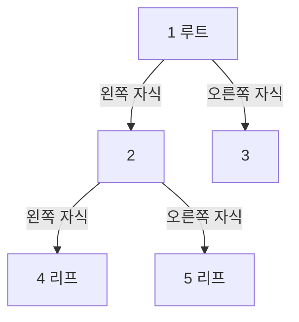

# 04. 트리

## 용어와 표현

트리는 사이클 없이 연결된 계층 구조다. 루트 트리에서 노드의 바로 위는 부모, 아래는 자식, 자식이 없는 노드는 리프다. 깊이는 루트에서 내려온 간선 수, 높이는 가장 먼 리프까지의 간선 수다.

위 트리의 순회 결과는 전위 `1,2,4,5,3`, 중위 `4,2,5,1,3`, 후위 `4,5,2,3,1`, 레벨 순서 `1,2,3,4,5`다.

## 깊이 우선 순회(DFS)

DFS(Depth-First Search, 깊이 우선 탐색)는 한 가지를 끝까지 내려간 뒤 돌아온다.

- 전위(preorder): 현재 → 왼쪽 → 오른쪽. 트리 복사, 구조 직렬화에 유용하다.
- 중위(inorder): 왼쪽 → 현재 → 오른쪽. BST에서는 정렬 순서가 된다.
- 후위(postorder): 왼쪽 → 오른쪽 → 현재. 자식 결과를 모아 부모를 계산하거나 삭제할 때 유용하다.

재귀 호출 직전/사이에/직후 중 언제 현재 노드를 처리하는지가 세 순회의 차이다. 시간은 모든 노드를 한 번 방문해 `O(n)`, 공간은 트리 높이 `h`만큼 `O(h)`다.

## 너비 우선 순회(BFS)

BFS(Breadth-First Search, 너비 우선 탐색)는 큐로 같은 깊이의 노드를 먼저 방문한다. 레벨별 처리와 무가중 최단거리에 쓴다. 시간 `O(n)`, 큐 공간은 최대 너비만큼 필요하다.

## 이진 탐색 트리, 균형 트리, 힙

- BST(Binary Search Tree, 이진 탐색 트리): 왼쪽 키 < 현재 키 < 오른쪽 키라는 순서 규칙이 있다. 균형이면 검색 `O(log n)`, 한쪽으로 기울면 `O(n)`이다.
- 균형 검색 트리: 회전 등으로 높이를 `O(log n)`으로 유지한다. C++ `map/set` 같은 정렬 컨테이너의 전형적 기반이다.
- 이진 힙: 부모-자식 우선순위만 보장한다. 최소/최대 원소 접근에 특화되며 일반 검색 트리가 아니다.

## 자주 쓰는 트리 문제

- 서브트리 크기/합: 후위 순회
- 루트에서 경로 전달: 전위 순회
- 레벨별 값: BFS
- 최소 공통 조상(LCA): 부모 추적, binary lifting 등
- 구간 합/최솟값 갱신: Fenwick tree, segment tree
- 문자열 접두사: Trie

트리가 무방향 인접 리스트로 주어지면 부모를 다시 방문하지 않도록 `parent` 또는 `visited`를 기록한다.
