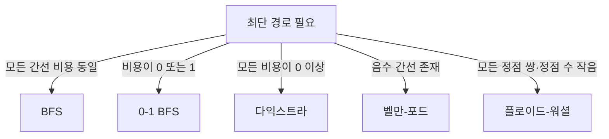

# 05. 그래프

## 표현

그래프는 정점(vertex)과 간선(edge)으로 관계를 표현한다.

- 인접 리스트: 공간 `O(V+E)`, 이웃 순회가 빠르다. 희소 그래프의 기본 선택이다.
- 인접 행렬: 공간 `O(V²)`, 두 정점의 직접 연결 확인이 `O(1)`이다. 정점 수가 작고 조밀할 때 쓴다.
- 간선 목록: 모든 간선을 정렬하는 Kruskal이나 벨만–포드에 편하다.

방향/무방향, 가중/무가중, 사이클 유무를 가장 먼저 구분한다.

## BFS와 DFS

| 항목 | BFS | DFS |
|---|---|---|
| 핵심 구조 | 큐 | 재귀 또는 스택 |
| 방문 순서 | 가까운 거리 층부터 | 한 경로를 끝까지 |
| 대표 용도 | 무가중 최단거리, 레벨 | 연결 요소, 사이클, 순서, 백트래킹 |
| 시간 | `O(V+E)` | `O(V+E)` |
| 공간 | `O(V)` | `O(V)` |

방문 표시는 큐/스택에 **넣을 때** 하는 편이 중복 삽입을 막기 쉽다. 그래프가 연결되어 있다는 보장이 없으면 모든 정점을 돌며 미방문 정점에서 탐색을 다시 시작해 연결 요소를 센다.

## 최단 경로 선택

- 다익스트라: 현재 거리 최소 정점을 우선순위 큐에서 꺼내 간선을 완화한다. 음수 간선에는 쓰지 않는다.
- 벨만–포드: 모든 간선을 `V-1`번 완화한다. 한 번 더 갱신되면 도달 가능한 음수 사이클이 있다.
- 플로이드–워셜: `dist[i][j] = min(dist[i][j], dist[i][k]+dist[k][j])`로 중간 정점을 늘린다.

**완화(relaxation)**는 새 경로가 더 짧으면 거리와 부모를 갱신하는 연산이다. 실제 경로가 필요하면 `parent[next] = current`를 함께 저장하고 목적지부터 역추적한다.

## 위상 정렬

DAG(Directed Acyclic Graph, 방향 비순환 그래프)의 모든 간선 `u→v`에서 `u`가 `v`보다 앞서도록 나열한다. Kahn 알고리즘은 진입 차수 0인 정점을 큐에 넣고 제거한다. 결과 정점 수가 `V`보다 작으면 사이클이 있다. 가능한 순서는 여러 개일 수 있다.

## 최소 신장 트리(MST)

MST(Minimum Spanning Tree, 최소 신장 트리)는 연결된 무방향 가중 그래프의 모든 정점을 총 `V-1`개 간선으로 최소 비용 연결한다. 두 점 사이 최단 경로 문제와 다르다.

- Kruskal: 간선을 비용순으로 보고 DSU로 사이클이 생기지 않는 간선을 선택한다. `O(E log E)`.
- Prim: 한 정점에서 시작해 현재 트리 밖으로 나가는 최소 간선을 힙으로 고른다. 인접 리스트에서 보통 `O(E log V)`.

## 이후에 배울 그래프 알고리즘

- SCC(Strongly Connected Components, 강한 연결 요소): 방향 그래프에서 서로 왕복 가능한 묶음
- 이분 그래프/매칭: 두 집합 사이 충돌 없는 짝짓기
- 최대 유량: 용량이 있는 네트워크에서 보낼 수 있는 최대량
- LCA와 binary lifting: 트리의 조상 질의 가속

저장소의 상세 노트: [BFS](../dailystudy/exercise/algorithm/breadth-first-search-unweighted-grid.md), [다익스트라](../dailystudy/exercise/algorithm/dijkstra.md), [위상 정렬](../dailystudy/exercise/algorithm/topological-sort.md), [Kruskal](../dailystudy/exercise/algorithm/kruskal-minimum-spanning-tree.md).
