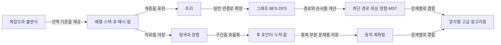

# 알고리즘 기초 학습 가이드

> 한 줄 요약: 자료구조를 고르고, 입력 크기에 맞는 복잡도를 정한 뒤, 탐색·정렬·트리·그래프·동적 계획법을 반복 구현하는 로드맵이다.

이 문서는 알고리즘을 처음 배우거나 자주 잊는 사람이 **무엇을 왜 쓰는지 설명하고 직접 실행**할 수 있도록 구성했다. C++17, C#/.NET 8, Python 3 예제는 같은 핵심 알고리즘을 구현하므로 문법 차이도 비교할 수 있다.

## 먼저 읽을 곳

- 완전 초보: [01. 복잡도와 문제 해결 기초](./01-foundations.md)부터 순서대로 읽는다.
- BFS/DFS가 급한 경우: [04. 트리](./04-trees.md)의 순회 개념을 읽고 [05. 그래프](./05-graphs.md)로 간다.
- 코딩 테스트 복습: 아래 선택표를 보고 필요한 장으로 바로 이동한 뒤 예제를 수정한다.

## 전체 학습 지도



텍스트로 읽으면 `복잡도 → 자료구조 → 탐색/정렬 → 트리 → 그래프 → 문제 해결 패턴 → 심화` 순서다.

## 문서 목차와 완료 기준

| 순서 | 문서 | 반드시 설명할 수 있어야 하는 것 |
|---:|---|---|
| 1 | [복잡도와 문제 해결 기초](./01-foundations.md) | Big-O, 불변식, 재귀 종료 조건 |
| 2 | [핵심 자료구조](./02-data-structures.md) | 배열·연결 리스트·스택·큐·해시·힙 선택 기준 |
| 3 | [탐색과 정렬](./03-search-sort.md) | 선형/이진 탐색, 정렬 안정성, 주요 정렬 복잡도 |
| 4 | [트리](./04-trees.md) | 전위/중위/후위/레벨 순회, BST와 힙 차이 |
| 5 | [그래프](./05-graphs.md) | 인접 리스트, BFS/DFS, 최단 경로, 위상 정렬, MST |
| 6 | [문제 해결 패턴](./06-problem-solving-patterns.md) | 투 포인터, 슬라이딩 윈도, 누적 합, 그리디, 백트래킹, DP |
| 7 | [문자열과 심화 지도](./07-strings-and-next.md) | 문자열 매칭의 선택 기준과 다음 학습 순서 |

## 무엇을 선택해야 할까?

| 문제 신호 | 첫 선택 | 핵심 조건 / 복잡도 |
|---|---|---|
| 정렬된 배열에서 값 찾기 | 이진 탐색 | `O(log n)`, 경계 불변식 주의 |
| 모든 원소/연결을 한 번 확인 | 선형 탐색, DFS, BFS | `O(n)` 또는 `O(V+E)` |
| 무가중 최단 경로 | BFS | 간선 비용이 모두 동일 |
| 비음수 가중치 최단 경로 | 다익스트라 | 보통 `O((V+E) log V)` |
| 음수 간선 포함 최단 경로 | 벨만–포드 | 음수 사이클 탐지 가능, `O(VE)` |
| 모든 정점 쌍 최단 경로 | 플로이드–워셜 | `O(V^3)`, 정점 수가 작을 때 |
| 선행 조건이 있는 작업 순서 | 위상 정렬 | 방향 비순환 그래프(DAG) |
| 전체를 최소 비용으로 연결 | Kruskal/Prim MST | 경로가 아니라 연결 비용 문제 |
| 연속 구간 | 슬라이딩 윈도/누적 합 | 조건에 따라 둘 중 선택 |
| 최적값, 경우의 수 + 중복 상태 | 동적 계획법(DP) | 상태와 전이 정의가 핵심 |
| 모든 조합을 탐색 | 백트래킹 | 가지치기로 탐색 공간 축소 |
| 접두사 검색 | Trie | 문자 수에 비례, 메모리 비용 큼 |

## 실행 예제

각 프로그램은 선형/이진 탐색, 정렬, 트리 순회, 그래프 BFS/DFS, 다익스트라, 위상 정렬, 합집합-찾기(DSU), 누적 합, 슬라이딩 윈도, 동적 계획법을 실행하고 자체 검증한다.

### C++17

```powershell
cmake -S algorithm -B algorithm/build
cmake --build algorithm/build --config Release
./algorithm/build/Release/algorithm_cpp.exe # Visual Studio 생성기
# 또는 단일 구성 생성기에서는 ./algorithm/build/algorithm_cpp
```

컴파일러를 직접 쓸 수도 있다.

```bash
g++ -std=c++17 -Wall -Wextra -Wpedantic algorithm/examples/cpp/main.cpp -o algorithm_cpp
./algorithm_cpp
```

### C# (.NET 8)

```powershell
dotnet run --project algorithm/examples/csharp/AlgorithmGuide.csproj
```

### Python 3

```powershell
python algorithm/examples/python/main.py
```

세 프로그램 모두 마지막에 `ALL CHECKS PASSED`를 출력하면 성공이다. 운영체제에 따라 실행 파일 경로만 달라질 수 있다.

## 4주 빠른 학습 계획

1. 1주차: 복잡도, 배열/스택/큐/해시, 선형·이진 탐색, 기본 정렬을 손으로 추적한다.
2. 2주차: 재귀, 트리 순회, 그래프 표현, BFS/DFS를 직접 구현한다.
3. 3주차: 투 포인터, 슬라이딩 윈도, 누적 합, 그리디, 백트래킹, DP를 하루 한 문제씩 푼다.
4. 4주차: 다익스트라, 위상 정렬, DSU/MST, 문자열 알고리즘을 익히고 틀린 문제를 다시 푼다.

각 알고리즘은 `정의 → 적용 조건 → 불변식 → 복잡도 → 직접 구현 → 반례` 순으로 복습한다. 라이브러리를 쓰는 것과 원리를 구현하는 것을 모두 해봐야 한다.

## 참고한 저장소 자료

기존 [`자주까먹는/algorithm`](../자주까먹는/algorithm/README.md)의 스택·큐, 우선순위 큐, 연결 리스트 문제를 검토했고, 더 체계적인 설명은 [`dailystudy/exercise/algorithm`](../dailystudy/exercise/algorithm/)의 BFS, 다익스트라, 위상 정렬, DSU, MST, KMP, Trie, 세그먼트 트리 등의 노트와 연결했다. 기존 파일은 변경하지 않았다.
