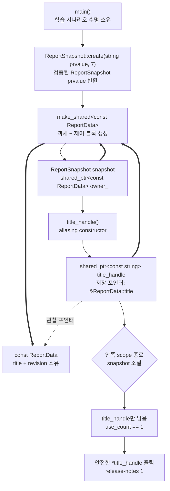

# 2026-09-03 Modern C++ 학습 자료

오늘은 `std::shared_ptr`의 **aliasing constructor(별칭 생성자)**로 큰 불변 스냅샷의 부분 객체만 공개하되, 그 부분 객체가 속한 바깥 객체의 수명까지 안전하게 유지한다. 실무 예제는 보고서 제목과 서비스 endpoint를 복사하지 않는 읽기 전용 projection을 만들고, 대회 문제는 [CSES 1684 - Giant Pizza](https://cses.fi/problemset/task/1684)를 implication graph와 SCC 기반 2-SAT으로 해결한다.

## 오늘의 목표

- `struct`의 기본 `public`과 `class`의 기본 `private`, 기본 타입, 중괄호 초기화, 생성자의 무반환형, `explicit`, 접근 지정자, 멤버 초기화 목록을 실제 코드에서 설명한다.
- `std::shared_ptr<const Outer>`와 `const Inner*`를 받는 별칭 생성자가 “저장 포인터는 부분 객체, 소유 제어 블록은 바깥 객체”로 분리하는 원리를 이해한다.
- 포인터·참조가 소유권을 자동으로 뜻하지 않으며, 별칭 핸들이 부분 객체와 바깥 객체의 수명을 함께 연장하는 정확한 조건을 말한다.
- lvalue·prvalue·xvalue, 참조 바인딩, 복사·이동, moved-from 상태, 객체 수명, 소유권, C++17 복사 생략을 오늘 식과 연결한다.
- 각 표준 호출의 수신자·선택 오버로드·모든 인자·반환·상태 변화·복잡도·할당/무효화/수명/오류/스레드 계약을 설명한다.
- 2-SAT 절을 두 implication으로 바꾸고, SCC 모순 조건과 위상 순서 기반 배정의 정확성을 증명한다.
- 재귀 깊이에 의존하지 않는 반복형 코사라주로 `O(N+M)` 시간과 공간을 달성한다.

## 생성 파일

- [`main.cpp`](main.cpp): 보고서 전체를 살려 두는 읽기 전용 제목 별칭 핸들
- [`problem.cpp`](problem.cpp): 불변 서비스 설정의 endpoint projection 직접 연습
- [`icpc_problem.cpp`](icpc_problem.cpp): CSES 1684 제출 가능한 반복형 2-SAT 완전 풀이
- [`CMakeLists.txt`](CMakeLists.txt): 세 실행 파일, 높은 경고 수준, CTest 6개
- [`CHECKPOINT.md`](CHECKPOINT.md): 문법·값 범주·호출 계약·2-SAT 검증 문제
- [`run_icpc_test.cmake`](run_icpc_test.cmake): 표준 입력과 정확한 출력을 비교하는 CTest 도우미
- [`../algorithm/two-sat-implication-graph.md`](../algorithm/two-sat-implication-graph.md): 2-SAT 대표 공용 문서
- [`../algorithm/strongly-connected-components-kosaraju.md`](../algorithm/strongly-connected-components-kosaraju.md): 기반 SCC 대표 문서

## `main.cpp` 코드 구조도

실선은 생성·호출, 점선은 저장 포인터가 가리키는 대상, 굵은 선은 제어 블록의 공유 소유 관계다. 핵심은 `title_handle`이 `title`을 가리키면서도 제어 블록은 `ReportData` 전체를 관리한다는 점이다.



`snapshot`과 `title_handle`이 함께 있을 때 제어 블록의 strong owner는 둘이라 `use_count()==2`다. 안쪽 scope가 끝나 `snapshot`이 파괴되어도 aliasing 핸들이 같은 제어 블록을 하나 소유하므로 `ReportData` 전체와 그 안의 `title`은 살아 있다. 마지막 핸들이 파괴될 때만 바깥 객체 전체가 파괴된다.

## 기초 문법부터 읽기

`int revision{}`은 생성자가 그 멤버를 초기화 목록에서 생략할 때 `int`를 0으로 만드는 기본 멤버 초기화자다. 현재 생성자는 `revision{received_revision}`을 명시하므로 `{}`는 무시되며, 0을 먼저 쓴 뒤 덮는 과정이 아니다. `std::string title`은 자기 문자 저장소를 소유하는 클래스 타입이다. `struct ReportData`는 별도 접근 지정자가 없으므로 필드가 `public`이고, `class ReportSnapshot`은 기본 `private`라 `owner_`를 감춘다.

`explicit ReportData(std::string, int)`에서 생성자는 객체를 만드는 특별한 함수라 반환형을 쓰지 않는다. 이 다중 인자 생성자의 `explicit`은 `ReportData value = {"title", 1};` 같은 copy-list-initialization을 막고 `ReportData value{"title", 1};` 직접 초기화는 허용한다. `: title{...}, revision{...}` 멤버 초기화 목록은 함수 본문에 들어가기 전에 각 멤버를 최초 구성한다.

`const`가 붙은 `ReportData`와 `std::string`은 핸들을 통해 변경할 수 없다. `const std::string*`은 문자열을 소유하지 않는 주소 값이고, `const std::string&`는 이미 존재하는 문자열에 붙인 읽기 전용 별명이다. 둘 다 원래 객체의 수명을 저절로 늘리지 않는다. 오늘은 shared ownership을 가진 aliasing 핸들이 그 수명을 별도로 보장한다.

`if`, `for`, `while`은 각각 조건 분기, 횟수 반복, 조건 반복을 표현한다. `icpc_problem.cpp`의 `DfsFrame`은 재귀 함수가 암묵적으로 기억할 `vertex`와 `next_edge`를 명시적으로 저장한다. `using Graph = std::vector<std::vector<int>>;`는 새 타입을 만드는 것이 아니라 긴 템플릿 타입에 읽기 좋은 별칭을 붙인다. `std::vector<std::vector<int>>`의 바깥 템플릿 인자는 원소 타입 `std::vector<int>`, 안쪽 템플릿 인자는 `int`다.

## Modern C++ 값 범주·수명·소유권

`std::string{"release-notes"}`는 string prvalue다. `ReportSnapshot::create`의 값 매개변수 `title`은 이름이 생긴 순간 lvalue다. 정확한 `std::move` 템플릿에서 lvalue string을 전달하면 `T=std::string&`로 추론되고 반환형은 `std::string&&`다. 이 xvalue 식이 이동을 직접 수행하지는 않고 뒤의 string 이동 생성자가 새 객체에 이동 전 값을 준다. 구현은 heap 저장소를 넘길 수 있지만 SSO(short string optimization)의 inline 문자를 다룰 수도 있으므로 물리적 버퍼 이전·할당 방식은 단정하지 않는다. 이동 뒤 원본 string은 유효하지만 값은 미지정이므로 비어 있다고 단정하지 않는다.

`std::make_shared<const ReportData>(...)`는 shared pointer prvalue를 만들고, private 생성자가 만든 `ReportSnapshot{...}`도 prvalue다. 동일 타입 prvalue를 반환 객체에 직접 구성하는 C++17 이후 규칙 덕분에 `ReportSnapshot::create` 결과에는 중간 wrapper 복사·이동이 필요 없다. 그래서 wrapper의 이동을 삭제해 moved-from empty 상태를 금지해도 이 반환은 컴파일된다. wrapper 복사는 유효한 shared owner를 하나 더 만들므로 허용한다. 흔히 RVO라는 큰 범주로 설명하지만, 이 식은 보장된 prvalue 직접 구성에 해당한다.

`title_handle = snapshot.title_handle()`에서 오른쪽 결과는 shared pointer prvalue다. 이동 대입은 그 임시 핸들의 제어 블록 몫을 `title_handle`로 옮긴다. 반면 별칭 생성자 자체는 `snapshot.owner_`의 제어 블록 몫을 **복사**하므로 strong count가 하나 증가한다. 저장 포인터와 소유 대상이 다를 수 있다는 점이 일반 shared pointer 생성과의 차이다.

별칭 포인터 `p`는 아무 주소나 받을 수 있지만, 그 주소가 공유 소유 객체의 수명 안에 포함되지 않으면 나중에 역참조가 위험하다. 오늘은 private 생성자와 `create()`만 owner를 만들고 wrapper 이동을 삭제해 `owner_`가 비어 있지 않은 불변 `ReportData`를 소유한다는 클래스 불변식을 유지한다. `p=&owner_->title`이므로 안전하다. aliasing은 부분 객체를 복사하지 않으며, 포인터 산술이나 lifetime extension 마법도 아니다.

실무에서는 큰 immutable configuration, 파싱된 문서 트리, 이미지와 그 plane, cache entry와 payload 일부를 좁은 API로 빌려주되 전체 owner를 살려 둘 때 이 패턴이 유용하다. 반대로 수명 관계가 불명확하거나 공유 소유 자체가 필요 없다면 값 복사, 참조, `span` 같은 더 단순한 표현을 우선 검토한다.

## 기계 실행 관점

shared pointer 복사·소멸은 제어 블록의 strong count를 증가·감소시키는 load/modify/store 성격의 작업과, 0이 되었는지 비교하는 조건 분기를 포함할 수 있다. aliasing 핸들은 별도의 부분 객체를 할당하거나 복사하지 않고 제어 블록 포인터와 저장 포인터 같은 작은 상태를 옮길 수 있다. 마지막 소유자라면 관리 객체 소멸과 메모리 해제가 이어진다.

`operator->`/`operator*`는 저장 포인터를 읽어 멤버 주소나 참조를 만들고, 조건문은 정수 비교와 분기로, 반복 DFS는 인접 배열 load·방문 표시 store·스택 push/pop으로 나타날 수 있다. shared pointer의 참조 횟수 연산이 원자적으로 구현되더라도 가리키는 객체의 임의 동시 접근까지 보호하는 것은 아니다. 구체 명령, 인라이닝, 원자 연산 종류, 메모리 배치는 CPU·ABI·컴파일러·표준 라이브러리·최적화 옵션에 따라 달라지므로 특정 어셈블리로 단정하지 않는다.

## 오늘의 ICPC 문제

- ID·제목·출처: [CSES 1684 - Giant Pizza](https://cses.fi/problemset/task/1684), CSES Problem Set / Graph Algorithms
- 핵심 알고리즘: [2-SAT implication graph + SCC](../algorithm/two-sat-implication-graph.md), 기반 [코사라주 SCC](../algorithm/strongly-connected-components-kosaraju.md)
- 모델링: `(a OR b)`를 `NOT a -> b`, `NOT b -> a` 두 간선으로 바꾼다.
- 모순 불변식: 어떤 토핑 `x`와 `NOT x`가 같은 SCC면 양쪽 선택이 서로의 부정을 강제하므로 불가능하다.
- 답 구성: 오늘 SCC 번호는 압축 DAG의 source에서 sink 방향으로 증가하므로 `component[x] > component[NOT x]`인 리터럴을 참으로 둔다.
- 구현 선택: 최대 리터럴 정점 200,000개가 일자 chain을 이뤄도 호출 스택이 넘치지 않도록 `DfsFrame`과 `vector<int>`로 두 DFS를 반복형으로 작성한다.
- 복잡도: 정점 `2M`, 간선 `2N`; 시간 `O(N+M)`, 그래프·역그래프·상태·명시적 스택 공간 `O(N+M)`
- 대회 필수 이유: implication modeling, SCC 압축 DAG, 위상 순서 배정은 스케줄 양립성, 선택 충돌, 임계값+2-SAT, 논리 퍼즐에서 반복되는 ICPC 핵심 도구다.

## 오늘 사용한 표준 라이브러리

| 핵심 심볼명 | 선언 헤더 | 항목 종류 | 실제 호출 멤버/함수 | 현재 코드에서의 역할과 호출 계약 요약 | 대표 문서 |
|---|---|---|---|---|---|
| `std::string` | `<string>` | 클래스 타입·생성자 | `std::string{"release-notes"}`, `std::string endpoint{"api-v2"}` | non-null C 문자열 포인터에서 문자를 복사 소유한다. 길이에 선형, 할당과 `length_error`/`bad_alloc` 가능, 성공 뒤 원본 리터럴은 유지된다. | [컨테이너·뷰](../standard-library/containers-and-views.md) |
| `std::move` | `<utility>` | 함수 템플릿 | `std::move(received_title)`, `std::move(owner)`, `std::move(title)` | 수신 객체 없이 lvalue 하나를 받고 같은 객체의 rvalue reference를 반환한다. O(1)·무할당·noexcept이며 후속 이동 생성자가 상태를 바꾼다. | [입출력·유틸리티](../standard-library/io-parsing-and-utilities.md) |
| `std::make_shared` | `<memory>` | 함수 템플릿 | `std::make_shared<const ReportData>(...)`, `std::make_shared<const ServiceConfig>(...)` | 생성자 인자를 전달해 const 객체와 제어 블록을 만들고 shared pointer prvalue를 반환한다. 보통 한 할당이며 구성/할당 실패 시 부분 자원을 정리한다. | [소유권·어휘 타입](../standard-library/ownership-and-vocabulary-types.md) |
| `std::shared_ptr` | `<memory>` | 클래스 템플릿·기본 생성자 | `std::shared_ptr<const std::string>{}` | 인자 없이 empty 핸들을 만든다. `use_count()==0`, 저장 포인터 null, O(1)·무할당·noexcept다. | [소유권·어휘 타입](../standard-library/ownership-and-vocabulary-types.md) |
| `std::shared_ptr` aliasing 생성자 | `<memory>` | 클래스 템플릿·생성자 | `std::shared_ptr<const std::string>{owner_, &owner_->title}` | owner lvalue의 제어 블록을 공유하고 부분 객체 포인터를 저장한다. strong count +1, O(1)·무할당·noexcept이며 포인터 대상은 owner 수명 안에 있어야 한다. | [소유권·어휘 타입](../standard-library/ownership-and-vocabulary-types.md) |
| `shared_ptr::operator=` | `<memory>` | 멤버 연산자 | `title_handle = snapshot.title_handle()` | 빈 수신 핸들에 prvalue의 소유 몫을 이동하고 `shared_ptr&`를 반환하지만 버린다. 원본 임시는 empty, 새 핸들은 outer 수명을 소유하며 O(1)·noexcept다. | [소유권·어휘 타입](../standard-library/ownership-and-vocabulary-types.md) |
| `shared_ptr::operator->`, `shared_ptr::operator*` | `<memory>` | 멤버 연산자 | `owner_->title`, `*title_handle` | non-null 저장 포인터에서 각각 포인터/참조를 O(1)·무할당·noexcept로 반환한다. 소유 수는 그대로이고 null 역참조는 UB다. | [소유권·어휘 타입](../standard-library/ownership-and-vocabulary-types.md) |
| `shared_ptr::use_count` | `<memory>` | 관찰 멤버 함수 | `title_handle.use_count()` | 인자 없이 strong owner 수 `long`을 O(1)·noexcept로 반환해 사용한다. 상태는 유지되며 동시 변경 시 값은 즉시 낡을 수 있다. | [소유권·어휘 타입](../standard-library/ownership-and-vocabulary-types.md) |
| `std::vector<T>()` | `<vector>` | 클래스 템플릿·기본 생성자 | `std::vector<int> finish_order;`, `std::vector<DfsFrame> frames;` | 인자·반환값 없이 size 0인 소유 컨테이너를 O(1)에 만든다. 원소 수명은 아직 없고 물리적 할당 여부는 단정하지 않는다. | [컨테이너·뷰](../standard-library/containers-and-views.md) |
| `std::vector<T>(count)` | `<vector>` | 클래스 템플릿·count 생성자 | `Graph graph(count)`, `Graph reversed(count)` | count개의 빈 안쪽 vector를 값 초기화한다. O(count), 저장소 할당과 `length_error`/`bad_alloc` 가능, 성공 뒤 graph가 모두 소유한다. | [컨테이너·뷰](../standard-library/containers-and-views.md) |
| `std::vector<T>(count, value)` | `<vector>` | 클래스 템플릿·fill 생성자 | `visited(count, 0)`, `component(count, -1)` | count와 value const reference를 받아 원소 복사본을 소유한다. O(count), 할당 가능, 새 객체라 기존 관찰자 무효화는 없다. | [컨테이너·뷰](../standard-library/containers-and-views.md) |
| `vector::operator[]` | `<vector>` | 멤버 연산자 | `graph[index]`, `visited[index]`, `order[index]` | 범위가 증명된 size_type 인덱스로 원소 참조를 O(1)에 반환한다. 상태는 유지되고 범위 검사가 없어 `index>=size()`면 UB다. | [컨테이너·뷰](../standard-library/containers-and-views.md) |
| `vector::reserve` | `<vector>` | 멤버 함수 | `finish_order.reserve(count)`, `frames.reserve(count)` | size는 유지하고 capacity를 최소 count로 만든다. void, 현재 원소 수에 선형, 할당 실패 가능, 재할당 시 모든 관찰자가 무효다. | [컨테이너·뷰](../standard-library/containers-and-views.md) |
| `vector::push_back` | `<vector>` | 멤버 함수 | `graph[index].push_back(value)`, `frames.push_back(Frame{...})` | lvalue int는 복사하고 Frame prvalue는 이동해 size를 1 늘린다. void, 분할 상환 O(1), 재할당 시 그 vector 관찰자가 모두 무효다. | [컨테이너·뷰](../standard-library/containers-and-views.md) |
| `vector::size` | `<vector>` | 관찰 멤버 함수 | `next_vertices.size()`, `finish_order.size()` | 인자 없이 size_type을 O(1)·noexcept로 반환해 인덱스 범위를 증명한다. 객체·관찰자·소유권은 유지된다. | [컨테이너·뷰](../standard-library/containers-and-views.md) |
| `vector::empty` | `<vector>` | 관찰 멤버 함수 | `frames.empty()`, `stack.empty()` | 인자 없이 비었는지 bool을 O(1)·noexcept로 반환해 `back/pop_back` 전제조건에 사용한다. 상태 변화가 없다. | [컨테이너·뷰](../standard-library/containers-and-views.md) |
| `vector::back` | `<vector>` | 멤버 함수 | `frames.back()`, `stack.back()` | 비어 있지 않은 vector의 마지막 원소 참조를 O(1)에 반환한다. 빈 호출은 UB이고 참조는 제거·재할당 전까지만 유효하다. | [컨테이너·뷰](../standard-library/containers-and-views.md) |
| `vector::pop_back` | `<vector>` | 멤버 함수 | `frames.pop_back()`, `stack.pop_back()` | 인자·반환값 없이 마지막 원소 수명을 끝내고 size를 1 줄인다. O(1), capacity 유지, 제거 원소와 past-the-end 관찰자가 무효다. | [컨테이너·뷰](../standard-library/containers-and-views.md) |
| `std::ios::sync_with_stdio` | `<ios>` | 정적 멤버 함수 | `std::ios::sync_with_stdio(false)` | bool false로 C stdio 동기화를 끄고 이전 bool을 반환하지만 버린다. 첫 I/O 전에 호출하며 이후 C/C++ I/O를 섞지 않는다. | [입출력·유틸리티](../standard-library/io-parsing-and-utilities.md) |
| `std::cin.tie` | `<iostream>`/`<ios>` | 멤버 함수 | `std::cin.tie(nullptr)` | istream 수신자와 null ostream pointer를 받아 자동 flush 연결을 해제한다. 이전 pointer를 반환하지만 버리고 스트림 소유권은 유지한다. | [입출력·유틸리티](../standard-library/io-parsing-and-utilities.md) |
| `std::cin >>` | `<iostream>`/`<istream>` | 멤버 연산자 | `std::cin >> int_lvalue`, `std::cin >> char_lvalue` | lvalue 출력 인자를 갱신하고 같은 istream reference를 연쇄 반환한다. 입력 위치·상태가 바뀌며 실패는 기본적으로 상태 비트다. | [입출력·유틸리티](../standard-library/io-parsing-and-utilities.md) |
| `std::cout <<` | `<iostream>`/`<ostream>`/`<string>` | 삽입 연산자 | `std::cout << string_or_number`, `std::cout << "IMPOSSIBLE\n"` | 값/문자열을 기록하고 같은 ostream reference를 연쇄 반환한다. 입력은 유지되고 출력 위치·상태만 바뀌며 실패는 상태 비트다. | [입출력·유틸리티](../standard-library/io-parsing-and-utilities.md) |
| `operator<<(std::ostream&, char)` | `<ostream>` | 비멤버 연산자 | `std::cout << ' '`, `std::cout << chosen`, `std::cout << '\n'` | ostream lvalue와 char 값을 받아 문자를 기록하고 같은 참조를 반환한다. 별도 복잡도 상한은 없고 할당/무효화 없이 출력 상태만 바뀐다. | [입출력·유틸리티](../standard-library/io-parsing-and-utilities.md) |

## 빌드와 검증

저장소 루트의 PowerShell에서 실행한다. `build/`는 생성 산출물이므로 커밋하지 않는다.

```powershell
$kit = (Resolve-Path tools/w64devkit/bin).Path
$env:Path = "$kit;$env:Path"
cmake -S dailystudy/exercise/2026-09-03 -B dailystudy/exercise/2026-09-03/build -G "MinGW Makefiles" "-DCMAKE_CXX_COMPILER=g++.exe"
cmake --build dailystudy/exercise/2026-09-03/build
ctest --test-dir dailystudy/exercise/2026-09-03/build --output-on-failure
powershell -ExecutionPolicy Bypass -File dailystudy/exercise/tools/audit-standard-library-docs.ps1 -Scope all
```

검증 과정은 다음을 포함한다.

1. 높은 경고 옵션으로 세 실행 파일을 컴파일한다.
2. `main.cpp`에서 scope 전후 owner 수가 `2 -> 1`이고 alias 역참조 값이 유지되는지 확인한다.
3. `problem.cpp`에서 설정 owner와 endpoint alias가 같은 제어 블록을 공유하는지 출력으로 확인한다.
4. CSES 공식 예제, 모순 식, 두 단위 절, implication chain을 CTest 정확 출력으로 검사한다.
5. 작은 무작위 2-SAT 식은 모든 배정을 순회하는 brute force와 비교한다.
6. 토핑 100,000개의 긴 implication chain으로 반복 DFS의 시간·호출 스택 안전성을 검사한다.
7. 공용 알고리즘 예제를 별도로 컴파일·실행하고 로컬 Markdown 링크와 표준 라이브러리 전체 감사를 확인한다.

실제 검증 결과(2026-09-03, Asia/Seoul)는 다음과 같다.

- 저장소의 w64devkit GCC 16.1.0과 C++20, `-Wall -Wextra -Wpedantic -Wconversion`으로 세 실행 파일이 경고 없이 빌드됐다.
- CTest는 학습 예제 2개와 ICPC 사례 4개를 모두 통과했다(`6/6`). 공식 예제에서는 문제에 허용된 다른 유효 답 `+ + + + +`를 결정적으로 출력한다.
- 고정 시드 `20260903`의 변수 1~8개·절 1~25개 무작위 식 2,000건을 완전탐색과 대조해 SAT/UNSAT 판정과 출력 배정 위반이 0건이었다.
- 토핑·절 각 100,000개인 implication chain은 출력 토큰 100,000개와 모든 절을 검증했고 약 0.065초에 통과했다.
- 공용 2-SAT 문서의 C++ 예제는 같은 경고 옵션으로 컴파일되어 `1 0`을 출력했다.
- Mermaid 구조도 파싱, 변경 문서의 로컬 링크, UTF-8 텍스트, `-Scope latest`와 `-Scope all` 표준 라이브러리 감사를 통과했다. 전체 감사 기준은 50개 날짜, 131개 C++ 파일, 127개 심볼, 51개 헤더, 55개 추적 멤버다.

## 직접 해보기

1. `title_handle`을 raw `const std::string*`로 바꾸고 안쪽 scope 뒤 왜 댕글링인지 수명선을 그린다.
2. aliasing 생성자의 두 번째 인자를 지역 string 주소로 바꿔도 제어 블록이 그 지역 수명을 연장하지 못함을 설명한다.
3. `std::move(owner)`를 복사로 바꾸고 scope마다 `use_count()`가 어떻게 달라지는지 예측한다.
4. `const ReportData`의 `const`를 제거했을 때 shared ownership과 데이터 경쟁 안전성이 여전히 별개인 이유를 말한다.
5. `(x OR y)`, implication, XOR, 강제 true를 각각 두 implication 간선으로 직접 바꾼다.
6. SCC 번호 비교 부등호를 뒤집어 단위 절 테스트가 실패하는지 확인한다.
7. CHECKPOINT를 자료 없이 풀고 각 실제 호출의 여섯 계약 항목을 소리 내어 설명한다.
