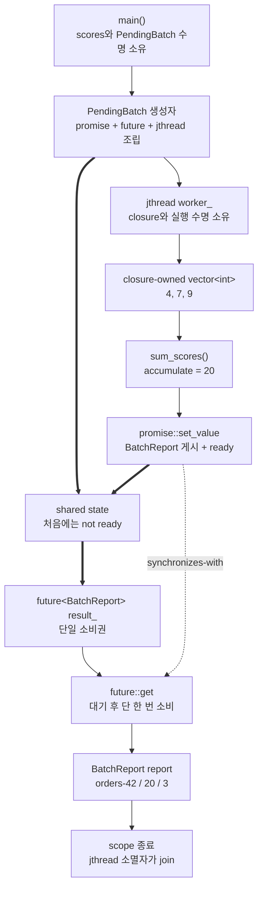

# 2026-09-04 Modern C++ 학습 자료

오늘은 `std::promise<T>`와 `std::future<T>`로 **결과를 만드는 실행 주체와 결과를 소비하는 주체를 분리**한다. 실무 예제는 `std::jthread`가 계산 작업의 수명을 RAII로 소유하고, promise/future 공유 상태가 `BatchReport` 값과 동기화만 전달하도록 역할을 나눈다. 대회 문제는 [CSES 1691 - Mail Delivery](https://cses.fi/problemset/task/1691)를 간선 ID와 반복형 Hierholzer 알고리즘으로 해결한다.

## 오늘의 목표

- 기본 타입, 변수의 중괄호 초기화, 함수 반환형·매개변수, `const`, 포인터·참조, `if`/`for`/`while`을 실제 식으로 설명한다.
- `struct`의 기본 `public`과 `class`의 기본 `private`, 접근 지정자, 생성자, 멤버 초기화 목록, `explicit`, `using`, 템플릿 인자를 구분한다.
- promise의 한 번 게시와 future의 한 번 소비, `valid`와 ready의 차이, shared state의 수명과 happens-before를 이해한다.
- lvalue·prvalue·xvalue, 참조 바인딩, 복사·이동, moved-from 상태, 객체 수명, 소유권, C++17 prvalue 직접 구성을 오늘 식과 연결한다.
- 각 표준 호출의 수신자·선택 overload·모든 인자·반환·상태 변화·복잡도·할당/무효화/수명/오류/스레드 계약을 설명한다.
- 무방향 오일러 회로의 짝수 차수·연결 조건과 Hierholzer의 stack/pop 불변식을 증명한다.
- 간선 ID와 정점별 단조 cursor를 사용해 재귀 없이 `O(N+M)` 시간과 공간을 달성한다.

## 생성 파일

- [`main.cpp`](main.cpp): `jthread` 실행 수명과 promise/future 결과 수명을 분리한 비동기 배치 보고서
- [`problem.cpp`](problem.cpp): 템플릿 `OneShotChannel<T>`의 한 번 게시·한 번 소비 직접 연습
- [`icpc_problem.cpp`](icpc_problem.cpp): CSES 1691 제출 가능한 반복형 Hierholzer 완전 풀이
- [`CMakeLists.txt`](CMakeLists.txt): 세 실행 파일, 높은 경고 수준, CTest 7개
- [`CHECKPOINT.md`](CHECKPOINT.md): 문법·값 범주·호출 계약·오일러 회로 검증 문제
- [`run_icpc_test.cmake`](run_icpc_test.cmake): 표준 입력과 결정적 출력을 비교하는 CTest 도우미
- [`../algorithm/eulerian-circuit-hierholzer.md`](../algorithm/eulerian-circuit-hierholzer.md): 오일러 회로·Hierholzer 대표 공용 문서
- [`../standard-library/concurrency-time-filesystem.md`](../standard-library/concurrency-time-filesystem.md): promise/future 호출·수명·동기화 대표 문서

## `main.cpp` 코드 구조도

실선은 생성·호출·값 이동, 굵은 선은 promise와 future가 연결된 shared state, 점선은 동기화 경계를 뜻한다. `jthread`는 **실행을**, shared state는 **결과를**, `BatchReport`는 **최종 값 소유권을** 맡는다.



`producer`는 worker closure로 이동되어 생산자 끝점이 정확히 한 곳에 남는다. `result_`는 같은 shared state의 소비자 끝점이다. `set_value`가 값을 저장하고 ready로 만든 뒤 `get`이 반환하므로, 생산 스레드가 게시 전에 한 쓰기는 소비 스레드가 `get` 뒤 관찰할 수 있다. `get` 뒤 future는 invalid이며 `valid()==false`다. `valid()==true`는 shared state가 연결됐다는 뜻이지 결과가 이미 ready라는 뜻이 아니다.

## 기초 문법부터 읽기

`long long total{}`은 기본 타입을 0으로 값 초기화한다. 공식 예제의 작은 합에는 `int`도 충분하지만, 누적 예제는 합의 범위를 넓히려고 `long long`과 초기값 `0LL`을 쓴다. `std::size_t item_count{}`는 컨테이너 크기를 표현하는 부호 없는 타입이다. 중괄호 초기화는 위험한 narrowing 변환을 거부한다.

`struct BatchReport`는 별도 지정이 없으면 필드가 `public`인 값 DTO다. `class PendingBatch`와 `class OneShotChannel<T>`는 기본 `private`라 promise/future handle을 숨기고, public 함수만 올바른 상태 전이를 허용한다. `public:`/`private:`는 객체 메모리 배치나 실행 속도가 아니라 이름 접근 가능성을 정한다.

생성자는 반환형을 쓰지 않는다. `explicit BatchReport(std::string, long long, std::size_t)`는 `BatchReport report = { ... };` 같은 copy-list-initialization을 막고 직접 초기화를 요구한다. `: name{...}, total{...}` 멤버 초기화 목록은 생성자 본문 전에 멤버를 처음 구성하며, 기본 생성 후 대입하는 두 단계가 아니다.

`sum_scores(const std::vector<int>& values)`의 반환형은 `long long`이다. 매개변수 `const ...&`는 호출자가 소유한 vector에 붙는 읽기 전용 비소유 별명이다. 참조와 raw pointer는 대상을 자동 소유하거나 수명을 늘리지 않는다. 오늘 worker lambda는 vector를 값으로 캡처해 실제 수명을 소유하고, 함수는 그 살아 있는 객체를 호출 동안만 빌린다.

`template <class T>`의 `T`는 컴파일 시간 타입 매개변수다. `OneShotChannel<StatusMessage>`에서 템플릿 인자는 `StatusMessage`이고, 내부 `promise<T>`/`future<T>`도 같은 타입의 값을 공유 상태로 전달한다. `using Graph = std::vector<std::vector<IncidentEdge>>;`는 새 클래스를 정의하지 않고 긴 타입에 별칭만 붙인다. 바깥 vector의 원소 타입은 안쪽 `vector<IncidentEdge>`다.

`if (!before_take)`는 bool 비교에 따른 조건 분기다. `icpc_problem.cpp`의 `for`는 입력 간선·정점을 정해진 횟수만큼 순회하고, `while`은 stack 또는 미처리 인접 항목이 남은 동안 반복한다. `continue`는 현재 반복의 나머지를 건너뛰며 `return`은 함수 실행과 지역 객체 수명을 끝낸다.

## Modern C++ 값 범주·복사·이동·수명

`scores`와 `producer`처럼 이름이 있는 변수 식은 lvalue다. `std::string{"orders-42"}`와 `BatchReport{...}`는 새 값을 만드는 prvalue다. `std::move(scores)`는 같은 vector 객체를 가리키는 `vector<int>&&` xvalue를 반환할 뿐 실제 이동을 수행하지 않는다. 뒤이어 선택된 vector 이동 생성자가 값 매개변수로 저장소 소유권을 받는다. 이동 뒤 `scores`는 유효하지만 값이 미지정이므로 반드시 비었다고 가정하지 않는다.

worker lambda의 init-capture `producer = std::move(producer)`는 바깥 promise의 shared-state 생산권을 closure 멤버로 이동한다. 같은 이름이라도 `=` 오른쪽은 바깥 변수, 생성 뒤 lambda 본문의 `producer`는 closure가 소유한 새 멤버다. string/vector도 값으로 이동 캡처하므로 생성자를 빠져나간 지역 매개변수에 대한 댕글링 참조가 없다.

`producer.set_value(BatchReport{...})`의 Report prvalue는 shared state 안 결과 객체를 초기화하는 입력이다. `future::get()`은 그 값을 소비자 쪽으로 이동 반환한다. `BatchReport report{pending.take()}`에서 함수가 반환하는 동일 타입 prvalue는 결과 객체에 직접 구성되어 불필요한 중간 복사·이동이 없다. 이름 있는 지역을 반환하는 선택적 NRVO와 달리, 이 설명은 C++17의 prvalue 직접 구성 규칙에 기대는 부분을 구분한다.

promise와 future는 각각 독점 handle이라 복사할 수 없고 이동할 수 있다. 오늘 `PendingBatch`는 이동까지 삭제해 `take` 전에는 `result_`가 valid이고 `take` 성공 뒤에는 invalid라는 상태 전이와 파괴 순서를 단순하게 유지한다. 멤버는 선언의 역순으로 파괴되므로 `worker_`의 RAII 소멸·join이 먼저, `result_` shared-state handle 정리가 나중이다.

실무에서는 RPC 결과, background 집계, 초기화 결과처럼 **정확히 한 결과**를 다른 실행 주체에 넘길 때 이 패턴이 유용하다. 여러 값 스트림에는 queue/channel, 여러 소비자에는 `shared_future`, 취소에는 `stop_token`, 구조화된 task 조합에는 더 높은 수준 실행 모델이 필요하다. promise/future만으로 그런 정책까지 자동 해결되지는 않는다.

## 기계 실행 관점

promise/future 구현은 shared state의 ready flag를 load/store하고 대기 여부를 비교해 조건 분기하며, 필요하면 원자 연산·잠금·운영체제 대기를 사용할 수 있다. `get`은 ready가 아니면 스레드를 대기시키고, `set_value`는 Report 저장 뒤 ready 상태를 게시하고 대기자를 깨울 수 있다. jthread 생성·합류는 운영체제 scheduler와 thread 자원을 사용할 수 있다.

`std::accumulate`는 반복자 구간에서 원소 load와 합계 store를 반복한다. Hierholzer는 `cursor`와 `used`를 load·비교하고 간선을 사용 처리하는 store, stack push/pop, 조건 분기를 수행한다. 오늘 코드는 사용자 가상 함수를 호출하지 않으므로 가상 간접 호출은 없지만 표준 라이브러리·I/O 내부 구현까지 단정하지 않는다. 구체 명령, 인라이닝, 할당 위치, 대기 primitive, 분기 제거 여부는 CPU·ABI·컴파일러·표준 라이브러리·최적화 옵션에 따라 달라 특정 어셈블리로 단정하지 않는다.

## 오늘의 ICPC 문제

- ID·제목·출처 URL: [CSES 1691 - Mail Delivery](https://cses.fi/problemset/task/1691), CSES Problem Set / Graph Algorithms
- 요구: 정점 1에서 출발해 모든 양방향 거리를 정확히 한 번 사용하고 정점 1로 돌아오는 경로를 출력한다. 없으면 `IMPOSSIBLE`이다.
- 공식 제약: `2 <= N <= 100,000`, `1 <= M <= 200,000`; 자기 루프와 같은 두 정점 사이 중복 간선은 없다.
- 핵심 알고리즘: [무방향 오일러 회로 + 반복형 Hierholzer](../algorithm/eulerian-circuit-hierholzer.md)
- 존재 조건: 모든 정점의 차수가 짝수이고, 차수가 양수인 모든 정점이 시작점 1과 같은 간선 컴포넌트에 있어야 한다.
- 구현 불변식: 양쪽 인접 항목이 같은 `edge_id`를 공유하고 `used[id]`는 최대 한 번만 0에서 1이 된다. `next_incident[v]` 앞 항목은 모두 처리됐다.
- 연결 검증: 별도 DFS 대신 `reversed_route.size() == M+1`인지 확인해 1과 분리되어 남은 간선을 잡는다.
- 답 구성: 더 쓸 간선이 없는 정점만 pop 순서로 `reversed_route`에 넣고 역인덱스로 출력한다.
- 복잡도: 각 인접 항목을 cursor가 최대 한 번 지나므로 시간 `O(N+M)`, 인접 목록·사용 배열·cursor·stack·답 공간 `O(N+M)`
- 대회 필수 이유: 오일러 순회는 도로/링크를 정확히 한 번 쓰는 문제, de Bruijn 수열, 방향 오일러 경로에 반복되며, 정점 방문이 아닌 **간선 ID 상태**를 택하는 모델링이 승부를 가른다.

## 오늘 사용한 표준 라이브러리

| 핵심 심볼명 | 선언 헤더 | 항목 종류 | 실제 호출 멤버/함수 | 현재 코드에서의 역할과 호출 계약 요약 | 대표 문서 |
|---|---|---|---|---|---|
| `std::promise<T>` | `<future>` | 클래스 템플릿·기본 생성자 | `std::promise<BatchReport> producer{}`, `producer_{}` | 인자·반환값 없는 생성자가 미충족 shared state의 생산자 끝점을 만든다. 복사 불가·이동 가능하며 상태 생성 할당/예외가 가능하다. | [동시성](../standard-library/concurrency-time-filesystem.md) |
| `promise::get_future` | `<future>` | 멤버 함수 | `producer.get_future()`, `producer_.get_future()` | 아직 발급하지 않은 valid promise 수신자에서 인자 없이 `future<T>` prvalue를 반환해 사용한다. 두 번째 호출/no-state는 오류이고 promise는 생산권을 유지한다. 표준은 복잡도·할당 여부를 따로 보장하지 않는다. | [동시성](../standard-library/concurrency-time-filesystem.md) |
| `promise::set_value` | `<future>` | 멤버 함수 | `producer.set_value(BatchReport{...})`, `producer_.set_value(std::move(value))` | 미충족 promise와 T xvalue를 받아 이동 저장하고 ready로 만든다. `void`, 값 이동+깨우기 비용, 중복/no-state/이동 실패 예외가 가능하며 성공은 get과 동기화한다. | [동시성](../standard-library/concurrency-time-filesystem.md) |
| `std::future<T>` | `<future>` | 클래스 템플릿·생성자·이동 대입 | `result_{}`, `result_ = producer.get_future()`, `consumer_{...}` | 기본 생성은 invalid, get_future prvalue의 이동은 shared-state 소비권을 전달한다. 독점 handle이라 복사 불가이고 이동된 원본은 no-state다. | [동시성](../standard-library/concurrency-time-filesystem.md) |
| `future::valid` | `<future>` | 관찰 멤버 함수 | `result_.valid()`, `consumer_.valid()` | const 수신자에서 인자 없이 연관 상태 여부 bool을 noexcept로 반환한다. 표준은 복잡도·할당 여부를 따로 보장하지 않으며, 상태를 바꾸지 않고 ready 여부는 말하지 않는다. | [동시성](../standard-library/concurrency-time-filesystem.md) |
| `future::get` | `<future>` | 소비 멤버 함수 | `result_.get()`, `consumer_.get()` | valid future에서 인자 없이 ready까지 기다리고 T를 이동 반환한다. 성공 뒤 invalid이며 두 번째 호출/no-state는 전제조건 위반인 표준상 UB다. 저장 예외는 재던지고 set_value와 동기화한다. | [동시성](../standard-library/concurrency-time-filesystem.md) |
| `std::jthread` | `<thread>` | 클래스·기본/함수 객체 생성자·이동 대입·소멸자 | `worker_{}`, `worker_ = std::jthread{lambda}` | 기본 생성은 non-joinable이다. 함수 객체를 이동 소유해 실행을 시작하고, handle 이동 대입 뒤 `worker_`가 thread를 소유한다. 생성 실패 예외가 가능하고 소멸 시 stop 요청·join한다. | [동시성](../standard-library/concurrency-time-filesystem.md) |
| `std::accumulate` | `<numeric>` | 함수 템플릿 | `std::accumulate(values.begin(), values.end(), 0LL)` | const_iterator 반열린 구간과 long long 초기값을 받아 합을 값으로 반환해 사용한다. 시간 O(n), 추가 공간 O(1), 무할당·비무효화이며 합은 표현 범위 안이어야 한다. | [알고리즘](../standard-library/algorithms-and-ranges.md) |
| `vector::begin` / `vector::end` | `<vector>` | 관찰 멤버 함수 | `values.begin()`, `values.end()` | const vector 수신자에서 인자 없이 양끝 const_iterator를 O(1)에 반환한다. 구조 변경 전까지만 유효하고 호출은 상태를 바꾸지 않는다. | [컨테이너](../standard-library/containers-and-views.md) |
| `std::move(...)` | `<utility>` | 함수 템플릿 | `std::move(scores)`, `std::move(producer)`, `std::move(name)`, `std::move(value)` | 이름 있는 lvalue 하나를 같은 객체의 `T&&` xvalue로 표현한다. 반환 참조를 즉시 이동 생성/저장에 쓰며 O(1)·무할당·noexcept이고 실제 상태 변경은 후속 연산이 한다. | [입출력·유틸리티](../standard-library/io-parsing-and-utilities.md) |
| `std::string` | `<string>` | 클래스·C 문자열/복사/이동 생성자 | `std::string{"orders-42"}`, `std::string{"deployment-ready"}` | non-null·null 종료 포인터에서 문자를 O(n)에 복사 소유한다. 할당과 `length_error`/`bad_alloc` 가능, 이동 후 원본은 유효하지만 값 미지정이다. | [컨테이너](../standard-library/containers-and-views.md) |
| `std::vector<T>` initializer-list 생성자 | `<vector>` | 클래스 템플릿·생성자 | `std::vector<int> scores{4, 7, 9}` | int 세 값을 복사해 size 3 저장소를 소유한다. O(3) 시간·공간, 할당 실패 가능, 새 객체라 기존 관찰자 무효화는 없다. | [컨테이너](../standard-library/containers-and-views.md) |
| `std::vector<T>` 기본 생성자 | `<vector>` | 클래스 템플릿·생성자 | `std::vector<int> vertex_stack;`, `reversed_route` | 인자·반환값 없이 size 0 컨테이너를 상수 시간에 만든다. 원소 수명은 아직 없고 다른 객체를 무효화하지 않는다. | [컨테이너](../standard-library/containers-and-views.md) |
| `std::vector<T>(count)` | `<vector>` | 클래스 템플릿·count 생성자 | `Graph adjacency(n + 1)` | count개의 빈 안쪽 vector를 값 초기화해 소유한다. O(count), 할당/`length_error`/`bad_alloc` 가능, 성공 뒤 size가 count다. | [컨테이너](../standard-library/containers-and-views.md) |
| `std::vector<T>(count, value)` | `<vector>` | 클래스 템플릿·fill 생성자 | `next_incident(n+1, 0)`, `used(m, char{0})` | count와 value const reference를 받아 복사본들을 소유한다. O(count), 할당 가능, 새 객체라 기존 관찰자 무효화는 없다. | [컨테이너](../standard-library/containers-and-views.md) |
| `vector::operator[]` | `<vector>` | 멤버 연산자 | `adjacency[index]`, `used[id]`, `reversed_route[index-1]` | 범위가 증명된 size_type 인덱스로 원소 참조를 O(1)에 반환한다. 상태는 유지되고 검사하지 않으므로 범위 밖이면 UB다. | [컨테이너](../standard-library/containers-and-views.md) |
| `vector::reserve` | `<vector>` | 멤버 함수 | `vertex_stack.reserve(M+1)`, `reversed_route.reserve(M+1)` | size 0 수신자와 새 capacity를 받아 `void` 반환한다. 성공 뒤 capacity는 최소 M+1; 할당 실패 가능, 재할당 시 기존 관찰자가 모두 무효다. | [컨테이너](../standard-library/containers-and-views.md) |
| `vector::push_back` | `<vector>` | 멤버 함수 | `adjacency[u].push_back(edge)`, `vertex_stack.push_back(city)` | lvalue는 복사, prvalue는 이동해 size를 1 늘린다. `void`, 분할 상환 O(1), capacity 부족 재할당 시 그 vector 관찰자가 모두 무효다. | [컨테이너](../standard-library/containers-and-views.md) |
| `vector::size` | `<vector>` | 관찰 멤버 함수 | `adjacency[v].size()`, `incidents.size()`, `reversed_route.size()` | 인자 없이 size_type을 O(1)·noexcept로 반환해 차수·범위·답 길이 검사에 사용한다. 상태·소유권·관찰자는 유지된다. | [컨테이너](../standard-library/containers-and-views.md) |
| `vector::empty` | `<vector>` | 관찰 멤버 함수 | `vertex_stack.empty()` | 인자 없이 비었는지 bool을 O(1)·noexcept로 반환해 `back/pop_back` 전제를 증명한다. 상태 변화가 없다. | [컨테이너](../standard-library/containers-and-views.md) |
| `vector::back` | `<vector>` | 멤버 함수 | `vertex_stack.back()` | 비어 있지 않은 vector의 마지막 int 참조를 O(1)에 반환해 값 복사한다. 빈 호출은 UB이며 반환 참조는 제거·재할당 전까지만 유효하다. | [컨테이너](../standard-library/containers-and-views.md) |
| `vector::pop_back` | `<vector>` | 멤버 함수 | `vertex_stack.pop_back()` | 인자·반환값 없이 마지막 원소 수명을 끝내고 size를 1 줄인다. O(1), capacity 유지, 제거 원소와 past-the-end 관찰자가 무효다. | [컨테이너](../standard-library/containers-and-views.md) |
| `std::ios::sync_with_stdio` | `<ios>` | 정적 멤버 함수 | `std::ios::sync_with_stdio(false)` | 수신 객체 없이 bool false를 받아 C stdio 동기화를 끄고 이전 bool은 버린다. 첫 I/O 전에 호출하며 이후 C/C++ I/O를 섞지 않는다. | [입출력·유틸리티](../standard-library/io-parsing-and-utilities.md) |
| `std::cin.tie` | `<iostream>`/`<ios>` | 멤버 함수 | `std::cin.tie(nullptr)` | istream 수신자와 null ostream pointer를 받아 자동 flush 연결을 해제한다. 이전 pointer 반환은 버리고 스트림 소유권·수명은 유지한다. | [입출력·유틸리티](../standard-library/io-parsing-and-utilities.md) |
| `std::cin >>` | `<iostream>`/`<istream>` | 추출 연산자 | `std::cin >> int_lvalue` | 수정 가능한 int lvalue 인자를 갱신하고 같은 istream reference를 연쇄 반환한다. 입력 위치·상태가 바뀌며 형식/EOF/범위 실패는 상태 비트다. | [입출력·유틸리티](../standard-library/io-parsing-and-utilities.md) |
| `std::cout <<` | `<iostream>`/`<ostream>`/`<string>` | 삽입 연산자 | `std::cout << string_or_number`, `std::cout << "IMPOSSIBLE\n"` | string/숫자/C 문자열 값을 기록하고 같은 ostream reference를 반환한다. 입력은 유지되고 출력 위치·상태만 바뀌며 실패는 기본 상태 비트다. | [입출력·유틸리티](../standard-library/io-parsing-and-utilities.md) |
| `operator<<(std::ostream&, char)` | `<ostream>` | 비멤버 연산자 | `std::cout << ' '`, `std::cout << '\n'` | ostream lvalue와 char prvalue를 받아 문자 하나를 기록하고 같은 참조를 반환한다. 별도 복잡도 상한 없이 버퍼/장치에 의존하고 출력 상태만 바뀐다. | [입출력·유틸리티](../standard-library/io-parsing-and-utilities.md) |

## 빌드와 검증

저장소 루트의 PowerShell에서 실행한다. `build/`와 실행 파일은 생성 산출물이므로 커밋하지 않는다.

```powershell
$kit = (Resolve-Path tools/w64devkit/bin).Path
$env:Path = "$kit;$env:Path"
cmake -S dailystudy/exercise/2026-09-04 -B dailystudy/exercise/2026-09-04/build -G "MinGW Makefiles" "-DCMAKE_CXX_COMPILER=$kit/g++.exe"
cmake --build dailystudy/exercise/2026-09-04/build
ctest --test-dir dailystudy/exercise/2026-09-04/build --output-on-failure
powershell -ExecutionPolicy Bypass -File dailystudy/exercise/tools/audit-standard-library-docs.ps1 -Scope all
```

검증 과정은 다음을 포함한다.

1. 높은 경고 옵션으로 세 실행 파일을 C++20 모드에서 컴파일한다.
2. `main.cpp`가 합계 20과 future 상태 전이 `valid: 1 -> 0`을 출력하는지 확인한다.
3. `problem.cpp`가 lvalue 복사 뒤 원본/수신 메시지를 모두 유지하고 한 번 소비 뒤 invalid가 되는지 확인한다.
4. CSES 공식 예제, 삼각형, 홀수 차수, 분리된 짝수 차수 컴포넌트, 두 회로 splice를 CTest로 검사한다.
5. 작은 무작위 단순 그래프를 존재 조건과 대조하고, 출력 경로가 각 입력 간선을 정확히 한 번 쓰는지 독립 검증한다.
6. `N=100,000`, `M=200,000`의 두 순환을 합친 최대 크기 그래프에서 시간·메모리·비재귀 안전성을 확인한다.
7. 공용 알고리즘 문서의 C++ 뼈대, 로컬 Markdown 링크, UTF-8, Mermaid, 전체 표준 라이브러리 감사를 확인한다.

실제 검증 결과(2026-09-04, Asia/Seoul)는 다음과 같다.

- 저장소 w64devkit GCC 16.1.0과 `-Wall -Wextra -Wpedantic -Wconversion`에서 세 실행 파일이 경고 없이 빌드됐다.
- CTest는 학습 예제 2개와 ICPC 사례 5개를 모두 통과했다(`7/7`).
- `N=2..5`의 비어 있지 않은 단순 무방향 그래프 1,094개를 전수 검사하고, seed `20260904`의 `N=2..8` 무작위 단순 그래프 1,000개를 추가 대조했다. 존재 판정과 출력 경로의 시작/끝·길이·간선 multiset 위반은 0건이었다.
- `N=100,000`, `M=200,000`의 두 edge-disjoint 순환 합성 입력은 정점 토큰 200,001개와 모든 간선 1회 사용을 통과했다. 같은 크기의 분리된 짝수 차수 컴포넌트 입력도 `IMPOSSIBLE`을 출력했다.
- 공용 Hierholzer 문서의 C++ 뼈대는 같은 경고 옵션으로 구문 검사를 통과했다.
- Mermaid 11.12.0 parser로 구조도를 검증했고, exercise 전체 로컬 Markdown 링크 818개와 변경 텍스트 14개의 UTF-8 검사를 통과했다.
- `-Scope latest`와 `-Scope all` 감사가 모두 통과했다. 전체 기준은 51개 날짜, 134개 C++ 파일, 129개 표준 심볼, 52개 헤더, 55개 추적 멤버다.

## 직접 해보기

1. `pending.take()`를 두 번 호출할 때 두 번째 호출이 왜 `valid` 전제조건 위반이며 표준상 undefined behavior인지 shared-state 상태도로 설명한다.
2. worker lambda가 `name`과 `values`를 `&`로 캡처하도록 바꾸면 생성자 종료 뒤 어떤 참조가 댕글링인지 찾는다.
3. `valid()`를 ready 검사로 사용한 잘못된 분기를 만들고, 왜 결과 준비 여부를 증명하지 못하는지 말한다.
4. `channel.publish(source)`를 `channel.publish(std::move(source))`로 바꾸고 복사/이동 횟수와 source의 사용 가능 범위를 비교한다.
5. 정점 1의 삼각형과 정점 4의 삼각형이 분리된 그래프에서 짝수 차수 검사는 통과하지만 답 길이 검사가 실패함을 손으로 추적한다.
6. 간선 ID 대신 정점 방문 배열을 쓰면 같은 정점을 재방문해야 하는 삼각형에서 왜 실패하는지 설명한다.
7. `next_incident`를 없애고 매번 인접 목록 처음부터 찾을 때 어떤 입력에서 반복 검사량이 커지는지 계산한다.
8. CHECKPOINT를 자료 없이 풀고 각 실제 호출의 여섯 계약 항목을 소리 내어 설명한다.
