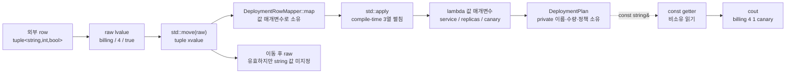

# 2026-09-07 Modern C++ 학습 자료

오늘은 `std::apply`로 **위치 기반 `std::tuple`을 이름 있는 도메인 객체로 변환하는 경계 어댑터**를 만든다. 데이터베이스·CSV·저수준 API가 반환한 tuple을 응용 계층 전체에 퍼뜨리지 않고 `DeploymentPlan`으로 즉시 바꾸면 열 순서 결합을 한곳에 가둘 수 있다. 대회 문제는 [CSES 2195 - Convex Hull](https://cses.fi/problemset/task/2195)을 경계 공선점을 보존하는 Andrew monotone chain으로 해결한다.

## 오늘의 목표

- 기본 타입, 변수의 중괄호 초기화, 함수 반환형·매개변수, `const`, 포인터·참조와 `if`/`for`/`while`을 실제 식으로 설명한다.
- `struct`/`class` 기본 접근, `public`/`private`, 생성자, 멤버 초기화 목록, `explicit`, `using`, 템플릿 인자를 구분한다.
- `std::apply`가 tuple-like 원소를 callable의 위치 인자로 펼치는 계약과 compile-time arity 결합을 이해한다.
- lvalue·prvalue·xvalue, 참조 바인딩, tuple/string 복사·이동, 객체 수명·소유권, C++17 prvalue 직접 구성을 실제 식에 연결한다.
- 모든 표준 호출의 수신자·overload·각 인자·반환·상태 변화·복잡도·할당/무효화/수명/오류/스레드 계약을 설명한다.
- 볼록 껍질의 외적 부호와 lower/upper chain 불변식, 공선 경계점 보존 조건을 증명한다.
- 정렬 `O(N log N)`과 선형 stack scan, `int64_t` 외적 범위를 설명한다.

## 생성 파일

- [`main.cpp`](main.cpp): 이동한 tuple row를 `std::apply`로 `DeploymentPlan`에 매핑하는 실무 경계
- [`problem.cpp`](problem.cpp): const lvalue tuple을 읽어 원본을 보존하는 `HealthSnapshot` 매핑 연습
- [`icpc_problem.cpp`](icpc_problem.cpp): CSES 2195 제출 가능한 Andrew monotone chain 완전 풀이
- [`CMakeLists.txt`](CMakeLists.txt): 세 실행 파일, 높은 경고 수준, CTest 6개
- [`CHECKPOINT.md`](CHECKPOINT.md): 문법·값 범주·호출 계약·볼록 껍질 검증 문제
- [`run_icpc_test.cmake`](run_icpc_test.cmake): 표준 입력과 결정적 출력을 비교하는 CTest 도우미
- [`../algorithm/convex-hull-monotone-chain.md`](../algorithm/convex-hull-monotone-chain.md): 볼록 껍질과 Andrew 알고리즘 대표 공용 문서
- [`../standard-library/ownership-and-vocabulary-types.md`](../standard-library/ownership-and-vocabulary-types.md): tuple과 `std::apply` 전달 계약 대표 문서

## `main.cpp` 코드 구조도

tuple은 외부 스키마를 잠깐 표현하고, mapper를 지난 뒤에는 이름과 불변식을 가진 `DeploymentPlan`만 남는다. 실선은 호출·값 이동, 점선은 비소유 관찰을 뜻한다.



`map(RawDeploymentRow row)`는 호출 경계에서 row를 소유한다. `main`이 `std::move(raw)`를 주므로 tuple의 string 저장소는 복사하지 않고 이동될 수 있다. `std::apply`는 세 원소를 같은 순서의 lambda 인자로 전달하고, lambda가 `DeploymentPlan`을 만든다. 이후 응용 코드는 `get<0>` 같은 위치 지식 대신 `service()` 같은 이름을 사용한다.

## 기초 문법부터 읽기

`int replicas_{}`와 `bool canary_{}`는 각각 `0`, `false`로 값 초기화된다. `RawDeploymentRow raw{...}`는 tuple의 forwarding/converting 생성자를 골라 세 원소를 구성한다. 바깥 tuple의 중괄호가 원소 변환까지 재귀적으로 narrowing 검사하는 것은 아니며, 스칼라 직접 목록 초기화 `int count{1.5};` 같은 식은 narrowing이라 컴파일되지 않는다. `const DeploymentPlan plan`은 구성 뒤 관찰만 허용한다.

`class DeploymentPlan`의 기본 접근은 `private`이고 public 생성자·getter만 외부에 보인다. `struct HealthSnapshot`의 기본 접근은 `public`이라 검증이 끝난 결과 DTO를 직접 읽는다. 접근 지정자는 이름 접근을 제어하며 객체 배치나 실행 속도를 자동으로 바꾸지 않는다.

생성자는 반환형이 없다. `explicit DeploymentPlan(std::string, int, bool)`은 의도치 않은 암시 변환을 막는다. `: service_{...}, replicas_{...}` 멤버 초기화 목록은 본문 전에 멤버를 직접 구성하며, 기본 생성 뒤 대입하는 두 단계가 아니다.

`using RawDeploymentRow = std::tuple<std::string, int, bool>;`은 새 타입이 아니라 별칭이다. 템플릿 인자 세 개가 tuple 원소 타입과 순서를 정한다. `map(const HealthRow& raw) const`의 `&`는 호출자 객체에 붙는 비소유 참조, 앞 `const`는 원소 수정 금지, 뒤 `const`는 mapper 상태 수정 금지를 뜻한다. 참조와 raw pointer는 대상을 소유하거나 수명을 자동 연장하지 않는다. `const char* rollout_lane`은 정적 수명 문자열 리터럴을 빌리므로 안전하다.

`if (plan.canary())`는 bool을 비교해 조건 분기한다. ICPC 코드의 `for`는 점을 정해진 횟수만큼 입력·순회하고, `while`은 마지막 두 점과 새 점이 시계 방향인 동안 stack에서 제거한다. `return`은 함수 실행을 끝내고 지역 소유 객체를 역순으로 파괴한다.

## `std::apply` 경계와 값 범주

`raw`, 값 매개변수 `row`, lambda 안의 `service`처럼 이름 있는 변수 식은 lvalue다. `std::string{"billing"}`, 캡처 없는 lambda 식, `DeploymentPlan{...}`은 prvalue다. `std::move(raw)`와 `std::move(row)`는 같은 객체를 나타내는 xvalue 참조를 만들 뿐 스스로 아무 자원도 옮기지 않는다. 뒤의 tuple 이동 생성과 apply의 전달이 실제 string 이동을 일으킨다.

`main.cpp`는 tuple xvalue를 apply하므로 원소가 lambda의 값 매개변수로 이동된다. 호출 뒤 원본 string은 **유효하지만 값이 미지정**이며 반드시 빈 문자열이라고 가정하면 안 된다. 반대로 `problem.cpp`는 `const HealthRow&`를 apply하고 lambda가 `const std::string&`로 원소를 빌린다. 결과 DTO의 string 값 매개변수를 만들 때 한 번 복사되므로 원본 row는 유지된다.

`std::apply`의 대표 서명은 `template<class F, class Tuple> constexpr decltype(auto) apply(F&& f, Tuple&& t)`다. `Tuple`의 compile-time 원소 수만큼 callable 인자가 생기므로 열 추가·삭제 후 lambda 서명을 고치지 않으면 컴파일 오류가 난다. 이는 런타임 인덱스 오류를 줄이지만 위치 의미 자체를 설명하지는 않으므로, mapper 밖에는 이름 있는 도메인 타입을 노출한다.

lambda와 `map`이 반환하는 `DeploymentPlan{...}`은 같은 타입 prvalue 결과 객체에 직접 구성될 수 있다. 이름 있는 지역을 반환할 때 선택적으로 적용되는 NRVO와 구분한다. string 소유권 이동은 별개로 실제 이동 생성자 호출 의미가 있으며, 복사 생략이 `std::move`나 모든 자원 이동을 없앤다는 뜻은 아니다.

## 기계 실행 관점

tuple adapter는 원소 주소/값을 load해 lambda 인자와 Plan 멤버에 store하고, bool 비교 뒤 조건 분기할 수 있다. `std::apply`는 compile-time 인덱스 확장으로 구현할 수 있어 가상 디스패치나 런타임 반복을 요구하지 않으며 lambda는 인라인될 수 있다. 그러나 실제 load/store 수, 이동 제거, SSO, 함수 인라인과 분기 제거는 CPU·ABI·컴파일러·표준 라이브러리·최적화 옵션에 따라 달라진다.

monotone chain은 정렬된 점을 연속 저장소에서 읽고, 외적을 위한 정수 곱셈·뺄셈과 부호 비교, 조건 분기, vector의 push/pop을 반복한다. 사용자 정의 가상 함수는 없지만 스트림 내부는 가상 `streambuf` 경계를 쓸 수 있다. 특정 어셈블리나 할당 횟수로 단정하지 않는다.

## 오늘의 ICPC 문제

- ID·제목·출처 URL: [CSES 2195 - Convex Hull](https://cses.fi/problemset/task/2195), CSES Problem Set / Geometry
- 요구: 서로 다른 평면 점의 볼록 껍질 위에 놓인 **모든 점**을 출력한다. 순서는 자유이고 껍질 넓이는 양수다.
- 공식 제약: `3 <= N <= 200,000`, `-10^9 <= x, y <= 10^9`, 제한 1초·512MB
- 핵심 알고리즘: [Andrew monotone chain](../algorithm/convex-hull-monotone-chain.md)
- 정렬: `(x,y)` 사전순으로 정렬해 왼쪽 끝에서 오른쪽 끝으로 lower, 역순으로 upper chain을 만든다.
- 불변식: 각 chain은 지금까지 본 점 중 해당 반쪽 경계를 순서대로 보관하고, 연속한 세 점의 외적은 음수가 아니다.
- 공선점 규칙: CSES는 경계 위 모든 점을 요구하므로 `cross < 0`인 **엄격한 시계 방향**에서만 pop한다. `cross == 0`은 보존한다.
- 중복 제거: 단일 vector 구현은 upper 역순에서 이미 있는 사전순 최대점을 건너뛰고, 마지막에 다시 들어온 사전순 최소점만 pop해 각 경계점을 한 번 남긴다.
- 정수 안전성: 좌표 차 절댓값은 최대 `2*10^9`, 두 곱의 차인 외적 절댓값은 최대 `8*10^18`이라 signed 64-bit 범위 안이다.
- 복잡도: 정렬 시간 `O(N log N)`, 각 점 push/pop 총합 `O(N)`, 점·두 chain·답 공간 `O(N)`
- 대회 필수 이유: 외적 부호, 공선점 포함 정책, 중복 끝점 제거는 convex hull뿐 아니라 회전하는 캘리퍼스·점 포함·지름·다각형 전처리의 기반이다.

## 오늘 사용한 표준 라이브러리

| 핵심 심볼명 | 선언 헤더 | 항목 종류 | 실제 호출 멤버/함수 | 현재 코드에서의 역할과 호출 계약 요약 | 대표 문서 |
|---|---|---|---|---|---|
| `std::tuple<Ts...>` | `<tuple>` | 클래스 템플릿·원소 생성자 | `RawDeploymentRow{string, 4, true}`, `HealthRow{string, 2, 3}` | 서로 다른 세 값을 위치로 소유한다. forwarding 원소 생성자는 각 값 범주대로 구성하며 원소 수명은 tuple 수명에 묶인다. 구성 비용·예외는 원소 생성에 따른다. | [소유권·어휘 타입](../standard-library/ownership-and-vocabulary-types.md) |
| `std::apply(...)` | `<tuple>` | 함수 템플릿 | `std::apply(lambda, std::move(row))`, `std::apply(lambda, raw)` | callable과 tuple-like 두 인자를 받아 원소를 값 범주 그대로 펼치고 callable 결과를 반환해 사용한다. 자체 동적 할당·컨테이너 무효화는 없고 호출 예외를 전달한다. | [소유권·어휘 타입](../standard-library/ownership-and-vocabulary-types.md) |
| `std::move(...)` | `<utility>` | 함수 템플릿 | `std::move(service)`, `std::move(row)`, `std::move(raw)` | 유일한 lvalue 인자를 같은 객체의 `T&&` xvalue로 표현한다. 반환 참조를 즉시 이동 구성에 쓰며 O(1)·무할당·noexcept이고 실제 상태 변경은 후속 생성자가 한다. | [입출력·유틸리티](../standard-library/io-parsing-and-utilities.md) |
| `std::string` | `<string>` | 클래스·C 문자열/복사/이동 생성자 | `std::string{"billing"}`, `std::string{"search"}` | non-null null-terminated 문자 포인터를 선형 시간에 복사 소유한다. 할당·`length_error`·`bad_alloc` 가능, 이동 뒤 원본은 유효하지만 값 미지정이다. | [컨테이너](../standard-library/containers-and-views.md) |
| `std::int64_t` | `<cstdint>` | 정확한 폭의 부호 있는 정수 타입 별칭 | `using Coordinate = std::int64_t` | 좌표와 외적 부호를 정확히 64비트로 계산한다. 호출·반환·할당은 없고, 공식 범위에서는 안전하지만 표현 범위를 넘는 signed 산술은 UB다. | [비트·바이트](../standard-library/bit-and-byte-utilities.md) |
| `std::vector<T>` | `<vector>` | 클래스 템플릿·기본 생성자·count 생성자 | `std::vector<Point> points(count)`, `std::vector<Point> hull` | count 생성자는 값 초기화한 Point를 소유하고 기본 생성자는 빈 vector를 만든다. 선형/상수 시간이며 할당·길이 오류 가능성이 있다. | [컨테이너](../standard-library/containers-and-views.md) |
| `std::sort(...)` | `<algorithm>` | 함수 템플릿 | `std::sort(points.begin(), points.end(), point_less)` | random-access 반열린 구간과 함수 포인터 비교자를 받아 Point를 제자리 정렬한다. `O(N log N)` 비교, 원소 재배치, 반복자 자체는 유효해도 가리키는 값은 바뀐다. | [알고리즘·ranges](../standard-library/algorithms-and-ranges.md) |
| `vector::begin` / `vector::end` | `<vector>` | 반복자 멤버 함수 | `points.begin()`, `points.end()` | 인자 없이 양끝 iterator를 O(1)에 반환해 sort가 사용한다. 호출은 상태를 바꾸지 않고 재할당 전까지만 관찰자가 유효하다. | [컨테이너](../standard-library/containers-and-views.md) |
| `vector::reserve` | `<vector>` | 용량 멤버 함수 | `hull.reserve(point_count * std::size_t{2})` | size_type 용량 하나를 받고 `void`를 반환한다. 성공 뒤 capacity가 요청 이상이며 재할당 시 기존 반복자·포인터·참조가 모두 무효다. | [컨테이너](../standard-library/containers-and-views.md) |
| `vector::size` | `<vector>` | 관찰 멤버 함수 | `hull.size()`, `sorted_points.size()` | 인자 없이 현재 원소 수를 `size_type`으로 O(1)·noexcept 반환해 사용한다. 상태·소유권·관찰자는 그대로다. | [컨테이너](../standard-library/containers-and-views.md) |
| `vector::back` | `<vector>` | 원소 접근 멤버 함수 | `hull.back()` | 비어 있지 않은 vector 마지막 원소의 참조를 O(1)에 반환한다. 빈 호출은 UB이고 반환 참조는 제거·재할당 전까지만 유효하다. | [컨테이너](../standard-library/containers-and-views.md) |
| `vector::push_back` | `<vector>` | 수정 멤버 함수 | `hull.push_back(sorted_points[index])` | Point const lvalue를 복사해 size를 1 늘리고 `void`를 반환한다. 분할 상환 O(1), capacity 부족 재할당 시 모든 관찰자가 무효다. | [컨테이너](../standard-library/containers-and-views.md) |
| `vector::pop_back` | `<vector>` | 수정 멤버 함수 | `hull.pop_back()` | 인자·반환값 없이 마지막 Point 수명을 끝내고 size를 1 줄인다. O(1), 빈 호출은 UB, 제거 원소와 past-the-end 관찰자가 무효다. | [컨테이너](../standard-library/containers-and-views.md) |
| `vector::operator[]` | `<vector>` | 원소 접근 연산자 | `hull[hull.size()-2]`, `sorted_points[index]`, `points[index]` | 범위가 증명된 size_type 인덱스를 받아 Point 참조를 O(1)에 반환한다. 검사하지 않아 범위 밖이면 UB다. | [컨테이너](../standard-library/containers-and-views.md) |
| `std::ios::sync_with_stdio` | `<ios>` | 정적 멤버 함수 | `std::ios::sync_with_stdio(false)` | 수신 객체 없이 bool false를 받아 C stdio 동기화를 끄고 이전 bool은 버린다. 첫 I/O 전에 호출하며 이후 C/C++ I/O를 섞지 않는다. | [입출력·유틸리티](../standard-library/io-parsing-and-utilities.md) |
| `std::cin.tie(...)` | `<ios>` | 멤버 함수 | `std::cin.tie(nullptr)` | cin 수신자와 null 포인터 인자를 받아 기존 tied ostream 포인터를 반환하지만 버린다. 입력 전 cout 자동 flush 연결만 해제하고 소유권은 바꾸지 않는다. | [입출력·유틸리티](../standard-library/io-parsing-and-utilities.md) |
| `std::cin >>` | `<iostream>` | 추출 연산자 | `std::cin >> point_count`, `std::cin >> points[index].x >> points[index].y` | 살아 있는 int/int64 lvalue를 수정 인자로 받고 같은 istream&를 반환해 연쇄한다. 두 `points[index]`는 범위가 증명된 `vector::operator[]` 호출이다. 실패 시 상태 비트를 세우며 변수 값 계약은 선택 overload에 따른다. | [입출력·유틸리티](../standard-library/io-parsing-and-utilities.md) |
| `std::cout <<` / `operator<<(std::ostream&, char)` | `<iostream>` | 삽입 연산자 | 학습 예제의 `std::cout << plan.service() << ' ' << plan.replicas() << ' ' << plan.canary() << ' ' << rollout_lane << '\n'`와 `std::cout << snapshot.service << ' ' << snapshot.ready << ' ' << snapshot.total << ' ' << all_ready << '\n'`; ICPC의 `std::cout << point.x;`, `std::cout << ' ';`, `std::cout << point.y;`, `std::cout << '\n';` | 숫자/string/C 문자열/bool/char 피연산자를 읽어 문자화한다. 학습 예제는 각 중간 ostream&를 다음 수신자로 쓰고 마지막 반환만 버리지만, ICPC의 독립 문장 네 개는 반환을 매번 버린다. 비용은 locale·버퍼·장치에 의존하고 실패는 상태 비트/설정된 예외로 나타난다. | [입출력·유틸리티](../standard-library/io-parsing-and-utilities.md) |

## 검증 과정

- 공식 예제의 네 경계점(꼭짓점 3개와 공선 경계점 1개)과 결정적 반시계 출력 순서를 CTest로 비교한다.
- 네 변에 공선점이 있는 직사각형에서 경계 8점이 모두 남고 내부점만 빠지는지 검사한다.
- 최소 삼각형과 음수 좌표 케이스로 끝점 결합·외적 부호를 검사한다.
- 작은 무작위 점 집합을 독립적인 지지선 판정과 대조하고 중복·내부점 출력을 탐지한다.
- 최대 `N=200,000`, 좌표 경계 근처 입력으로 시간·64비트 외적·출력 크기를 확인한다.
- w64devkit GCC 높은 경고 빌드, CTest, 공용 알고리즘 예제, UTF-8/로컬 링크, Mermaid와 표준 문서 감사를 실행한다.

최종 검증에서는 GCC 16.1.0 C++20 높은 경고 빌드와 CTest 6/6, 독립 지지선 oracle 무작위 50,000건을 모두 통과했다. `N=200,000` 전체 경계점·극값 꼭짓점 stress도 중복 없이 통과했고, 공용 알고리즘 예제의 경고 없는 컴파일·실행, Mermaid 구문 분석, 로컬 링크 851개와 관련 파일 21개의 strict UTF-8 검사도 성공했다. 표준 문서 감사 결과는 `latest`가 날짜 1개·C++ 파일 3개·심볼 13개, `all`이 날짜 52개·C++ 파일 137개·색인 심볼 131개로 모두 통과했다.

저장소 루트에서 실행한다. `build/`는 생성 산출물이므로 커밋하지 않는다.

```powershell
$kit = (Resolve-Path tools/w64devkit/bin).Path
$env:Path = "$kit;$env:Path"
cmake -S dailystudy/exercise/2026-09-07 -B dailystudy/exercise/2026-09-07/build -G "MinGW Makefiles" "-DCMAKE_CXX_COMPILER=g++.exe"
cmake --build dailystudy/exercise/2026-09-07/build
ctest --test-dir dailystudy/exercise/2026-09-07/build --output-on-failure
& dailystudy/exercise/tools/audit-standard-library-docs.ps1 -Scope latest
& dailystudy/exercise/tools/audit-standard-library-docs.ps1 -Scope all
```

## 직접 해보기

1. `main.cpp`의 `map(std::move(raw))`를 `map(raw)`로 바꾸고 어느 string 복사가 추가되는지 설명한다.
2. lambda의 첫 매개변수를 `const std::string&`로 바꾸되 tuple xvalue 수명이 왜 apply 호출까지 안전한지 그린다.
3. tuple 열 순서를 `(int, string, bool)`로 바꾸고 compile-time 오류가 스키마 불일치를 어떻게 드러내는지 읽는다.
4. ICPC 코드의 pop 조건을 `cross <= 0`으로 바꿔 직사각형 경계 CTest가 왜 실패하는지 확인한다.
5. `int`로 외적을 계산했을 때 좌표 `10^9` 부근에서 overflow가 정확성/UB에 어떤 문제를 만드는지 계산한다.
6. CHECKPOINT를 자료 없이 풀고 모든 실제 표준 호출의 여섯 계약 항목을 소리 내어 설명한다.
