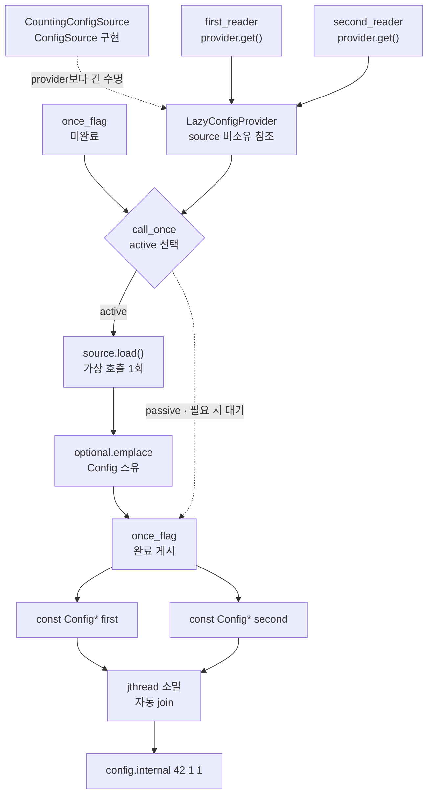

# 2026-09-08 Modern C++ 학습 자료

오늘은 `std::once_flag`와 `std::call_once`로 **여러 실행 흐름이 동시에 요청해도 처음 성공한 설정 초기화만 게시하는 지연 초기화 경계**를 만든다. 캐시 사용자는 잠금 구현이나 공급원 호출 횟수를 몰라도 같은 불변 `Config`를 읽는다. 대회 문제는 [CSES 1690 - Hamiltonian Flights](https://cses.fi/problemset/task/1690/)를 부분집합 비트마스크 DP로 해결한다.

## 오늘의 목표

- 기본 타입, `{}` 값 초기화, 함수 반환형·매개변수, `const`, 포인터·참조와 `if`/`for`를 실제 식으로 설명한다.
- `struct`/`class` 기본 접근, `public`/`private`, 생성자, 멤버 초기화 목록, `explicit`, `using`, 템플릿 인자를 구분한다.
- `once_flag`의 미완료/완료 상태와 `call_once`의 active·returning·passive·exceptional 실행을 구분한다.
- 성공 초기화의 쓰기가 모든 passive 반환자에게 보이는 동기화 근거와 객체 수명 전제를 설명한다.
- lvalue·prvalue·xvalue, 참조 바인딩, string 복사·이동, 객체 수명·소유권, 같은 타입 prvalue 복사 생략을 실제 식에 연결한다.
- 모든 실제 표준 호출의 수신자·overload·각 인자·반환·상태 변화·복잡도·할당/무효화/수명·오류·스레드 계약을 설명한다.
- `dp[mask][v]` 불변식과 마지막 간선 제거 점화식을 증명하고 `O(2^n(n+m))` 시간·`O(n2^n)` 공간을 계산한다.

## 생성 파일

- [`main.cpp`](main.cpp): 두 `std::jthread`가 같은 지연 설정 경계를 요청하는 실무 예제
- [`problem.cpp`](problem.cpp): 여러 순차 요청이 계산 한 번과 같은 참조로 귀결되는 초보자 연습
- [`icpc_problem.cpp`](icpc_problem.cpp): CSES 1690 제출 가능한 부분집합 DP 완전 풀이
- [`CMakeLists.txt`](CMakeLists.txt): 세 실행 파일, 스레드 이식 링크, 높은 경고, CTest 7개
- [`CHECKPOINT.md`](CHECKPOINT.md): 문법·값 범주·호출 계약·비트마스크 DP 검증 문제
- [`run_icpc_test.cmake`](run_icpc_test.cmake): 표준 입력과 결정적 출력을 비교하는 CTest 도우미
- [`../algorithm/bitmask-dp-hamiltonian-path.md`](../algorithm/bitmask-dp-hamiltonian-path.md): Hamiltonian 경로 부분집합 DP 대표 문서
- [`../standard-library/concurrency-time-filesystem.md`](../standard-library/concurrency-time-filesystem.md): `once_flag`/`call_once` 대표 계약 문서
- [`../standard-library/ownership-and-vocabulary-types.md`](../standard-library/ownership-and-vocabulary-types.md): `optional::emplace/value` 소유권·오류 계약

## `main.cpp` 코드 구조도

실선은 호출·값 게시, 점선은 비소유 참조나 필요할 수 있는 대기를 뜻한다. 두 reader 중 어느 쪽이 active가 되는지는 정하지 않지만, 성공한 callable은 정확히 한 번이고 둘은 같은 캐시 객체 주소를 받는다. 두 실행 흐름의 실제 시간 겹침 자체는 이 예제가 주장하지 않는다.



`call_once`의 returning 실행은 `Config`를 `optional` 안에 완성한 뒤 flag를 완료로 만든다. 그 실행의 반환은 같은 flag를 사용한 모든 passive 호출의 반환과 동기화되므로, 별도 잠금 없이도 성공한 `get()` 호출자는 완성된 캐시를 읽는다. callable이 예외를 던지면 그 실행은 완료로 고정되지 않고 다음 호출이 재시도하지만, 예외 전에 외부에 낸 부수 효과까지 자동 취소하지는 않는다.

## 기초 문법부터 읽기

`int attempts_{}`와 `const Config* first{}`는 각각 `0`, null pointer로 값 초기화된다. `{}`는 기본 타입의 미초기화 쓰레기 값을 피한다. `constexpr int kMod{1'000'000'007};`는 컴파일 시간 상수로 쓸 수 있는 읽기 전용 정수다.

함수 선언 `Config load()`에서 앞의 `Config`는 반환형이고 빈 괄호는 데이터 매개변수가 없다는 뜻이다. `flat_index(Mask mask, int city, int city_count)`는 세 기본 값을 복사해 받고 `std::size_t` 값을 반환한다. `const Config& get() const`의 첫 `const`는 반환 객체를 이 참조로 수정할 수 없음을, `&`는 복사 없이 빌림을, 뒤 `const`는 공개 논리 상태를 수정하지 않는 멤버 함수임을 뜻한다.

raw pointer와 reference는 기본적으로 대상을 소유하지 않는다. `ConfigSource& source_`는 생성 때 source lvalue에 바인딩되어 다시 다른 객체로 향할 수 없고 수명을 늘리지 않는다. `const Config* first`도 cache 주소만 관찰한다. `source`를 `provider`보다 먼저 선언하고 reader들을 안쪽 블록에서 join해 두 종류의 비소유 관찰자가 대상보다 먼저 사용을 끝내게 한다.

`if`는 bool 결과를 비교해 한 분기로 진행한다. ICPC 코드의 바깥 `for`는 부분집합 mask를, 안쪽 `for`는 마지막 도시와 predecessor를 순회한다. `continue`는 현재 반복의 나머지를 건너뛴다. 조건 분기 순서가 시작점 없는 mask와 도착점이 너무 일찍 든 mask를 계산에서 제외한다.

`struct Report`는 기본 접근이 `public`이라 검증된 DTO를 직접 읽는 데 맞다. `class Config`는 기본 접근이 `private`이며 public 생성자·getter만 불변식 경계로 노출한다. 접근 지정자는 이름 접근을 제어하지 메모리 배치나 성능을 자동으로 바꾸지 않는다.

생성자는 반환형이 없다. `explicit Config(std::string, int)`는 두 값으로 하는 copy-list-initialization에서 이 생성자를 암시적으로 쓰는 경로를 막고, `explicit LazyConfigProvider(ConfigSource&)`는 source 한 개가 Provider로 암시 변환되는 일을 막는다. 둘 다 직접 초기화라는 API 의도를 드러낸다. `: endpoint_{...}, generation_{...}` 멤버 초기화 목록은 본문 진입 전 선언 순서대로 멤버를 직접 구성하며, 기본 구성 뒤 대입하는 두 단계가 아니다.

`using Mask = unsigned long long;`는 새 정수 클래스를 만드는 것이 아니라 적어도 64 value bits인 기본 타입에 문제 의미를 붙이는 별칭이다. `std::optional<Config>`의 템플릿 인자 `Config`는 선택적으로 보관할 contained 타입이고, `std::vector<std::vector<int>>`의 바깥 원소 타입은 각각 predecessor 목록을 소유하는 `vector<int>`다. `call_once`의 callable/가변 인자 템플릿 인자는 호출식의 lambda와 빈 인자 팩에서 추론된다.

## 지연 초기화 경계와 예외 계약

`once_flag`는 내부 상태가 노출되지 않는 비복사·비대입 객체다. reset API도 없으므로 Provider는 final 위치에 직접 만들고 그 수명을 모든 `get()`보다 길게 둔다. flag 때문에 `LazyConfigProvider`도 기본적으로 복사·이동할 수 없다. 컨테이너에 값으로 재배치하거나 factory에서 이름 있는 Provider를 반환해야 한다면 안정 주소를 주는 별도 소유 계층을 설계한다.

같은 flag를 사용하는 `call_once` 실행은 다음처럼 나뉜다.

- **active**: callable을 실제로 실행한다. 여러 실패 시도가 있다면 active 실행은 여러 번일 수 있지만 서로 전체 순서를 이룬다.
- **exceptional**: callable이 예외를 던진 active 실행이다. 예외를 호출자에게 전파하고 flag는 다음 active 시도를 허용한다.
- **returning**: 예외 없이 반환한 유일한 성공 active 실행이다. 존재한다면 마지막 active다.
- **passive**: 성공이 이미 정해져 callable을 실행하지 않는 호출이다. returning 실행의 결과를 관찰한 뒤 반환한다.

`source_.load()` 결과를 먼저 완성하고 `cache_.emplace(...)`로 캐시에 commit한다. source가 던지면 함수 인자 평가에서 멈춰 빈 optional을 건드리지 않는다. contained `Config` 구성에서 예외가 나도 `emplace`는 optional을 빈 상태로 두며 call_once는 성공 완료로 표시되지 않는다. 다만 source가 외부 카운터·파일·네트워크에 이미 낸 부수 효과는 자동 rollback되지 않으므로 실제 포트는 멱등 호출, 임시 결과 뒤 commit, 또는 별도 보상 정책이 필요하다.

표준은 `call_once`의 점근 복잡도, 동적 할당 여부, lock-free 여부, 공정성이나 벽시계 대기 상한을 보장하지 않는다. 경쟁이 있으면 구현이 원자 상태, 잠금, 운영체제 대기를 조합할 수 있다. 교착을 피하려면 callable 안에서 같은 flag로 재귀 진입하지 않고, 긴 I/O를 이 경계에 둘 때 초기화 지연이 모든 대기자에게 전파됨을 고려한다.

## 값 범주·복사·이동·수명

`source`, `provider`, `snapshot`처럼 이름 있는 변수 식은 lvalue다. `std::string{"config.internal"}`, lambda 식, `Config{...}`, `Report{73}`은 prvalue다. `std::move(snapshot)`은 같은 객체를 나타내는 xvalue 참조를 만들 뿐 스스로 데이터를 옮기지 않는다. 뒤의 `Config`와 `std::string` 이동 생성자가 실제 endpoint 소유권을 `transferred`로 옮긴다.

`Config snapshot{*first}`는 cache의 const lvalue에서 string을 복사해 독립 저장소를 만든다. `Config transferred{std::move(snapshot)}` 뒤 snapshot은 수명은 남고 유효하지만 string의 구체 값은 미지정이다. 비어 있다고 단정하지 않고 파괴하거나 새 값을 대입할 수 있는 상태로만 다룬다. `first`와 `second`는 cache 안 원본을 계속 가리키므로 snapshot 이동과 무관하다.

`return Config{std::string{"config.internal"}, 42};`와 `return Report{73};`은 반환형과 같은 타입의 prvalue를 결과 객체에 직접 구성한다. C++17의 보장된 prvalue 복사 생략이며, 이름 있는 지역을 `return local;`할 때 선택적으로 적용되는 NRVO와 다르다. `optional::emplace(source_.load())`는 그 결과를 contained Config 구성 인자로 전달하므로 결과 타입의 이동 계약도 별도로 읽는다.

두 `jthread`의 lambda는 `[&]`로 provider와 각 결과 pointer를 빌린다. lambda 객체는 thread 소유자에게 이동될 수 있지만 참조 캡처 대상 수명을 연장하지 않는다. 안쪽 블록 끝에서 두 jthread 소멸자가 작업 종료를 기다리고, thread 완료가 성공한 join 반환과 동기화된 뒤에만 main이 pointer와 source 횟수를 읽는다. lambda는 `stop_token`을 받지 않아 소멸자의 stop 요청을 관찰하지 않으며 join은 자연 종료까지 기다린다. Provider가 파괴되면 optional 안 Config도 파괴되므로 그 뒤 `first`/`second`는 댕글링이다.

## 기계 실행 관점

`call_once` 구현은 flag 상태 load, 비교, 조건 분기, 원자 read-modify-write, 잠금이나 OS 대기를 조합할 수 있다. active 실행은 `optional` 상태와 `Config` 데이터를 store하고 passive 실행은 동기화 뒤 이를 load한다. `source_.load()`는 가상 간접 호출이 될 수 있고, 컴파일러가 구체 동적 타입을 증명하면 devirtualize할 수도 있다.

비트마스크 DP는 연속 `vector<int>`에서 index를 계산해 load/store하고, bit AND/shift와 정수 비교·조건 분기를 반복한다. 실제 원자 명령, load/store 수, cache miss, 문자열 SSO/할당, 함수 인라인·가상화 제거와 분기 배치는 CPU·ABI·표준 라이브러리·컴파일러·최적화 옵션에 따라 달라진다. 특정 어셈블리나 lock-free 동작으로 단정하지 않는다.

## 오늘의 ICPC 문제

- ID·제목·출처 URL: [CSES 1690 - Hamiltonian Flights](https://cses.fi/problemset/task/1690/), CSES Problem Set / Graph Algorithms
- 요구: 1번 도시에서 출발해 n번 도시에서 끝나며 모든 도시를 정확히 한 번 방문하는 방향 경로 수를 `1,000,000,007`로 나눈다.
- 공식 제약: `2 <= n <= 20`, `1 <= m <= n^2`, `1 <= a,b <= n`, 제한 1초·512MB
- 핵심 알고리즘: [Hamiltonian 경로 부분집합 비트마스크 DP](../algorithm/bitmask-dp-hamiltonian-path.md)
- 상태: `dp[mask][v]`는 1번에서 시작해 mask 도시를 정확히 한 번씩 방문하고 v에서 끝나는 경로 수다.
- 점화식: `v`를 제거한 `previous`에서 입력 간선 `u -> v`의 각 predecessor `u`에 대해 `dp[previous][u]`를 더한다.
- 정확성 핵심: 모든 경로의 마지막 입력 간선을 제거하는 동작과 이전 상태에 그 간선을 붙이는 동작이 일대일 대응한다.
- 가지치기: 시작점 없는 mask, 기저 외에 시작점에서 다시 끝나는 상태, full이 아닌데 도착점이 든 mask, full에서 도착점이 아닌 마지막 상태를 건너뛴다.
- 다중 간선 계약: 공식 설명은 중복 연결의 식별을 따로 명시하지 않는다. 이 구현과 회귀 테스트는 입력의 각 edge occurrence를 별도 항공편 선택으로 보아 같은 `u -> v`가 반복되면 각각 더한다.
- 수치 안전: 각 항을 더한 직후 modulus를 한 번 빼며 최대 `2*MOD-2`가 signed int 범위 안임을 사용한다.
- 복잡도: 시간 `O(2^n(n+m))`(조밀 그래프 `O(n^2 2^n)`), 공간 `O(n2^n+n+m)`; DP int 저장소는 n=20에서 약 80MiB다.
- 대회 필수 이유: `n<=20`을 봤을 때 부분집합 상태를 떠올리고, 불변식·마지막 선택의 유일성·실제 메모리 바이트를 즉시 계산하는 능력은 TSP·배정·순열 제약 DP의 공통 기반이다.

## 오늘 사용한 표준 라이브러리

| 핵심 심볼명 | 선언 헤더 | 항목 종류 | 실제 호출 멤버/함수 | 현재 코드에서의 역할과 호출 계약 요약 | 대표 문서 |
|---|---|---|---|---|---|
| `std::once_flag` | `<mutex>` | 비복사 동기화 상태 타입·기본 생성자 | `std::once_flag()` / `init_flag_{}`, `flag_{}` | 데이터 인자·반환 없이 “아직 성공 호출 없음” 상태로 구성한다. 생성은 `noexcept`지만 자체 동기화가 아니며, 모든 `call_once`보다 오래 살아야 하고 reset할 수 없다. | [동시성](../standard-library/concurrency-time-filesystem.md) |
| `std::call_once` | `<mutex>` | 함수 템플릿 | `std::call_once(init_flag_, lambda)`, `std::call_once(flag_, lambda)` | flag lvalue와 lambda prvalue 두 인자를 빌려 callable을 성공할 때까지 active로 실행한다. 반환은 `void`; 성공 쓰기를 passive 반환에 게시하고 callable/system 오류를 전파하며 복잡도·대기 상한은 미규정이다. | [동시성](../standard-library/concurrency-time-filesystem.md) |
| `std::optional<T>` | `<optional>` | 클래스 템플릿·생성자·수정자·관찰자 | `std::optional()` / `cache_{}`, `optional::emplace(...)` / `cache_.emplace(source_.load())`, `optional::value()` / `published_cache.value()` | 빈 inline 저장소를 만든 뒤 Config/Report prvalue를 contained 객체로 소유한다. `emplace`는 참조를 반환하지만 버리고, const optional view에서 `value()`의 const 참조를 사용한다. 구성 실패 시 비며, 빈 value는 예외다. | [소유권](../standard-library/ownership-and-vocabulary-types.md) |
| `std::jthread` | `<thread>` | RAII 스레드 클래스·생성자·소멸자 | `std::jthread first_reader{lambda}`, `second_reader{lambda}` | token 없는 lambda prvalue를 소유해 새 실행 흐름을 시작한다. 생성은 system 오류 가능; joinable 소멸자는 stop 요청 후 join하고 완료를 main에 동기화한다. callable 미처리 예외와 noexcept 소멸자 안 join 실패는 terminate, token을 관찰하지 않는 작업의 join 대기 상한은 없다. | [동시성](../standard-library/concurrency-time-filesystem.md) |
| `std::string` | `<string>` | 소유 문자열 클래스·C 문자열/복사/이동 생성자 | `std::string{"config.internal"}`, Config 복사·이동 내부 생성 | non-null C 문자열을 선형 시간에 복사 소유하고 할당 오류가 가능하다. 복사는 독립 저장소, 기본 allocator 이동은 상수 시간이며 원본은 유효하지만 값 미지정이다. | [컨테이너](../standard-library/containers-and-views.md) |
| `std::move(...)` | `<utility>` | 함수 템플릿 | `std::move(endpoint)`, `std::move(snapshot)` | 수신 객체 없이 유효한 lvalue 하나를 받고 같은 객체의 rvalue reference를 반환해 즉시 사용한다. O(1)·무할당·`noexcept`; 실제 상태 변경은 후속 이동 생성자가 한다. | [입출력·유틸리티](../standard-library/io-parsing-and-utilities.md) |
| `std::vector<T>` | `<vector>` | 클래스 템플릿·count/fill 생성자 | `incoming(n)` count 생성자, `dp(cell_count, 0)` fill 생성자 | 바깥 vector는 n개 빈 predecessor vector를 값 초기화하고, dp는 cell_count개의 0을 소유한다. 선형 구성·할당과 길이/할당 오류가 가능하며 새 객체라 기존 관찰자는 없다. | [컨테이너](../standard-library/containers-and-views.md) |
| `vector::operator[]` / `vector::push_back` / `vector::size` | `<vector>` | 접근·수정·관찰 멤버 | `incoming[to]`, `.push_back(from)`, `predecessors.size()`, `predecessors[index]`, `dp[index]` | `operator[]`는 범위 검사 없는 O(1) 참조, size는 O(1)·`noexcept` 값, push는 int를 복사해 size를 늘리는 분할 상환 O(1) `void`다. 재할당 시 해당 vector 관찰자가 무효다. | [컨테이너](../standard-library/containers-and-views.md) |
| `std::size_t` | `<cstddef>` | 부호 없는 크기 타입 별칭 | vector 크기·평탄화 index·cell count | 호출·반환이 없는 타입 별칭으로 컨테이너가 표현할 수 있는 크기와 인덱스를 나타낸다. Mask에서의 변환은 공식 최대 `20*2^20` 칸이 대상 플랫폼 범위에 든다는 전제를 사용한다. | [비트·바이트](../standard-library/bit-and-byte-utilities.md) |
| `std::ios::sync_with_stdio` | `<ios>` | 정적 멤버 함수 | `std::ios::sync_with_stdio(false)` | bool false를 받아 C/C++ 표준 스트림 동기화를 끄고 이전 bool은 버린다. 첫 I/O 전에 호출하며 이후 C/C++ I/O 혼용 순서에 기대지 않는다. | [입출력·유틸리티](../standard-library/io-parsing-and-utilities.md) |
| `std::cin.tie(...)` | `<ios>` | 스트림 멤버 함수 | `std::cin.tie(nullptr)` | `std::istream` 수신자와 null `std::ostream*`를 받아 이전 비소유 포인터는 버린다. 자동 flush 연결만 해제하고 수명·소유권은 바꾸지 않는다. | [입출력·유틸리티](../standard-library/io-parsing-and-utilities.md) |
| `std::cin >>` | `<iostream>` | 추출 연산자 | `std::cin >> city_count >> flight_count`, `std::cin >> from >> to` | 수정 가능한 int lvalue들을 받아 같은 `std::istream&`를 연쇄 반환한다. 성공 시 값/읽기 위치를 갱신하고 실패 시 상태 비트와 설정 예외로 알린다. | [입출력·유틸리티](../standard-library/io-parsing-and-utilities.md) |
| `std::cout <<` / `operator<<(std::ostream&, char)` | `<iostream>` | 삽입 연산자 | 두 학습 출력과 `std::cout << dp[...] << '\n'` | string/int/bool/char 값을 읽어 버퍼에 기록하고 같은 `std::ostream&`를 연쇄 반환하며 마지막은 버린다. 비용은 변환·locale·버퍼/장치에 의존하고 실패는 상태 비트/설정 예외다. | [입출력·유틸리티](../standard-library/io-parsing-and-utilities.md) |

## 검증 과정

- 두 `jthread`가 독립적으로 `get()`을 호출해 하나는 active, 다른 하나는 passive가 되고 둘 다 같은 Config 주소와 source 시도 횟수 1을 관찰하는지 확인한다. 스케줄러상 실제 실행 시간의 겹침은 검증 항목이 아니다.
- 순차 연습은 첫 호출만 active이고 둘째 호출이 passive라 Report 주소와 source 횟수가 유지되는지 확인한다.
- 공식 예제, 최소 두 도시, 도달 불가, 병렬 항공편, 완전 방향 그래프를 exact-output CTest로 비교한다.
- 작은 무작위 방향 multigraph를 순열 완전탐색 oracle과 대조해 경로 수·병렬 간선 처리를 검증한다.
- `n=20` 조밀 입력으로 시간과 약 80MiB DP 메모리, modulus 누적을 점검한다.
- w64devkit GCC 높은 경고 C++20 빌드, CTest, 공용 알고리즘 예제, UTF-8/로컬 링크, Mermaid와 표준 문서 감사를 수행한다.

최종 검증에서는 w64devkit GCC 16.1.0의 C++20 높은 경고 클린 빌드와 CTest 7/7을 통과했다. DP와 독립적인 내부 도시 순열×간선 multiplicity oracle은 seed `1690`, `n=2..9` 방향 multigraph 1,000건에서 일치했다. `n=20,m=400` 완전 방향 그래프는 `18! mod MOD = 660911389`를 0.365초·peak 84.60MiB에, 21중 병렬 chain과 self-loop 입력은 `21^19 mod MOD = 292439931`을 0.286초·peak 84.59MiB에 확인했다.

공용 알고리즘과 `once_flag` 문서의 C++ 예제도 같은 경고 설정으로 컴파일·실행했다. Mermaid CLI 11.17.0 구문 분석과 렌더링 육안 검사, 빌드 산출물을 제외한 Markdown 151개의 로컬 링크 882개, 변경 대상 텍스트 16개의 strict UTF-8 검사를 통과했다. 표준 문서 감사 결과는 `latest`가 날짜 1개·C++ 파일 3개·심볼 13개, `all`이 날짜 53개·C++ 파일 140개·색인 심볼 133개이며 헤더 52개·추적 멤버 55개와 날짜별 목록이 모두 일치한다.

저장소 루트에서 실행한다. `build/`는 생성 산출물이므로 커밋하지 않는다.

```powershell
$kit = (Resolve-Path tools/w64devkit/bin).Path
$env:Path = "$kit;$env:Path"
cmake -S dailystudy/exercise/2026-09-08 -B dailystudy/exercise/2026-09-08/build -G "MinGW Makefiles" "-DCMAKE_CXX_COMPILER=g++.exe"
cmake --build dailystudy/exercise/2026-09-08/build
ctest --test-dir dailystudy/exercise/2026-09-08/build --output-on-failure
powershell -ExecutionPolicy Bypass -File dailystudy/exercise/tools/audit-standard-library-docs.ps1 -Scope latest
powershell -ExecutionPolicy Bypass -File dailystudy/exercise/tools/audit-standard-library-docs.ps1 -Scope all
```

## 직접 해보기

1. `main.cpp`의 reader를 세 개로 늘리고 source 횟수가 여전히 1인지 확인한다.
2. `get()`이 Config 값을 반환하도록 바꿔 호출마다 어느 string 복사가 생기는지 설명한다.
3. `source_`를 pointer로 바꾸고 null 가능성을 허용할 때 생성자·오류 계약이 어떻게 달라지는지 적는다.
4. callable이 예외를 던지는 경우 active/exceptional/returning/passive 순서를 종이에 그리고, 예외 전 외부 부수 효과가 왜 rollback되지 않는지 설명한다.
5. ICPC 코드에서 도착점 조기 가지치기를 제거하고 답은 같지만 검사한 상태 수가 얼마나 늘어나는지 측정한다.
6. `int ways`에서 매번 modulus를 줄이지 않을 때 어떤 입력에서 signed overflow 위험이 생기는지 상한을 계산한다.
7. CHECKPOINT를 자료 없이 풀고 각 실제 표준 호출의 여섯 계약 항목을 소리 내어 설명한다.
