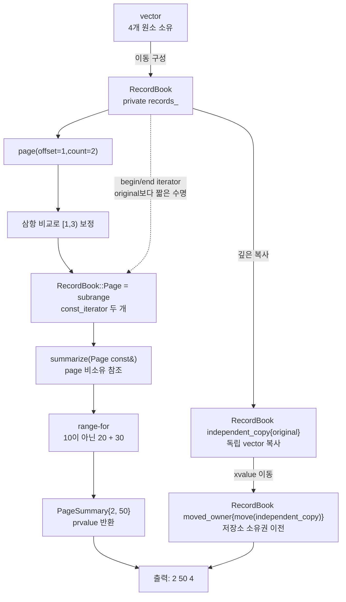

# 2026-09-09 Modern C++ 학습 자료

오늘은 C++20 `std::ranges::subrange`로 **소유 컨테이너의 일부를 복사하지 않고 빌려 주는 페이지 경계**를 만든다. `RecordBook`이 실제 `std::vector<Record>` 저장소를 소유하고, `summarize` 함수는 짧게 살아 있는 iterator 구간만 소비한다. 대회 문제는 [CSES 2080 - Fixed-Length Paths I](https://cses.fi/problemset/task/2080/)를 센트로이드 분할과 깊이 빈도로 해결한다.

## 오늘의 목표

- 기본 타입, `{}` 초기화, 반환형·매개변수, `const`, 포인터·참조, `if`/`for`를 실제 식으로 읽는다.
- `struct`와 `class`의 기본 접근, `public`/`private`, 생성자, 멤버 초기화 목록, `explicit`, `using` 별칭과 템플릿 인자를 구분한다.
- `subrange<Iterator, Sentinel, Kind>`가 원소가 아니라 iterator·sentinel을 값으로 보관하는 비소유 view임을 설명한다.
- 원본 `vector` 파괴·재할당·관련 erase 뒤 iterator와 subrange가 왜 무효가 되는지 설명한다.
- lvalue·prvalue·xvalue, 참조 바인딩, owner 복사·이동, 객체 수명, 같은 타입 prvalue의 복사 생략을 코드 식과 연결한다.
- 모든 실제 표준 호출의 수신자·선택 overload·각 인자·반환·호출 뒤 상태·복잡도·할당/무효화/수명·오류·스레드 계약을 설명한다.
- 센트로이드의 절반 불변식, 자식 성분별 조회-후-등록 규칙, 쌍의 유일 담당 단계를 증명한다.

## 생성 파일

- [`main.cpp`](main.cpp): `RecordBook`이 내준 읽기 전용 page를 함수가 즉시 집계하는 실무 예제
- [`problem.cpp`](problem.cpp): 정수 저장소 일부를 subrange로 빌려 합계를 구하는 초보자 연습
- [`icpc_problem.cpp`](icpc_problem.cpp): CSES 2080에 제출 가능한 반복형 센트로이드 분할 풀이
- [`CMakeLists.txt`](CMakeLists.txt): 세 실행 파일, 높은 경고, 학습 smoke와 ICPC exact-output CTest
- [`CHECKPOINT.md`](CHECKPOINT.md): 문법·값 범주·호출 계약·센트로이드 분할 검증 문제
- [`run_icpc_test.cmake`](run_icpc_test.cmake): 표준 입력과 출력을 정확히 비교하는 CTest 도우미
- [`../algorithm/centroid-decomposition-fixed-distance-pairs.md`](../algorithm/centroid-decomposition-fixed-distance-pairs.md): 고정 거리 정점 쌍 대표 알고리즘 문서
- [`../standard-library/algorithms-and-ranges.md`](../standard-library/algorithms-and-ranges.md): `subrange` 생성·관찰·수명 계약 대표 문서

## `main.cpp` 코드 구조도

실선은 소유·호출·값 반환이고, 점선은 원소를 소유하지 않는 iterator 구간이다. `RecordBook::Page`는 `RecordBook` 안의 원소를 가리키므로 `summarize()` 호출 안에서만 소비하고 저장하지 않는다.



구조도에서 `RecordBook::Page`를 소유 화살표로 그리지 않은 것이 핵심이다. view 객체 자체는 iterator 값을 소유하지만, iterator가 가리키는 `Record`와 메모리는 `RecordBook::records_`가 소유한다.

## 기초 문법부터 읽기

`int total{}`은 기본 타입 `int`를 0으로 값 초기화한다. `const std::size_t bounded_offset{offset < current_size ? offset : current_size};`의 중괄호는 삼항식 결과로 직접 목록 초기화하며 narrowing 변환을 허용하지 않는다. 지역 변수와 멤버를 `{}`로 초기화하면 초기화되지 않은 기본 타입을 읽는 실수를 줄인다.

`PageSummary summarize(const RecordBook::Page& page)`에서 `PageSummary`는 반환형이고 `page`는 기존 subrange lvalue를 복사하지 않고 빌린다. `RecordBook::page(std::size_t offset, std::size_t requested_count) const`의 뒤 `const`는 저장소를 바꾸지 않는 멤버 함수라는 뜻이다. 반환 page의 iterator는 원본 수명을 연장하지 않으므로 `original`이 page와 `summarize` 호출보다 오래 살아야 한다.

`struct Record`와 `struct PageSummary`는 기본 접근이 `public`이므로 검증을 마친 단순 데이터 전송 객체의 필드를 직접 읽는다. `class RecordBook`은 기본 접근이 `private`다. 원본 저장소와 수명 규칙을 public 함수 뒤에 감춰 잘못된 mutation 경로를 줄인다. 접근 지정자는 소스 수준 이름 접근을 제어할 뿐 메모리 배치나 실행 속도를 자동으로 바꾸지 않는다.

생성자는 반환형이 없다. `explicit RecordBook(Storage records)`는 `vector` 한 개가 `RecordBook`으로 암시 변환되는 것을 막는다. `: records_{std::move(records)}` 멤버 초기화 목록은 생성자 본문보다 먼저, 멤버 선언 순서대로 `records_` 수명을 시작한다. 값 매개변수는 lvalue 입력이면 한 번 복사하고 rvalue 입력이면 이동할 수 있는 “sink parameter” 경계다.

`using ConstIterator = Storage::const_iterator;`와 `using Page = std::ranges::subrange<ConstIterator>;`는 새 클래스를 만드는 것이 아니라 긴 타입에 이름을 붙인다. `subrange`의 생략된 두 번째 템플릿 인자는 같은 `ConstIterator` sentinel이고, 세 번째 `Kind`는 random-access iterator 쌍이 크기를 상수 시간에 계산할 수 있어 sized 형태가 된다.

`if`는 비교 결과가 참일 때만 분기를 실행한다. ICPC 코드의 `for`/`while`은 명시적 vector 스택을 순회하고, `continue`는 현재 반복의 나머지만 건너뛴다. 재귀 호출 대신 작업 vector를 사용하므로 길이 200,000 사슬에서도 C++ 호출 스택 깊이가 입력 크기로 늘어나지 않는다.

## `subrange`가 해결하는 경계와 해결하지 않는 것

`RecordBook::page(offset,count)`는 두 삼항 비교로 요청 구간을 `[0,size]` 안으로 보정하고 `const_iterator first`, `last`를 만든 뒤 `Page{first,last}`를 값으로 반환한다. 원소를 복사하지 않으므로 page 생성은 상수 시간이고 동적 할당도 요구하지 않는다. `summarize`는 range-for에서 `const Record&`로 각 원소를 빌려 읽는다.

하지만 비소유 view가 원본 수명을 자동 연장하지는 않는다. 다음 동작 뒤 기존 page를 사용하면 안 된다.

- `RecordBook` 또는 내부 `vector`가 파괴된다.
- `vector`가 재할당되는 삽입·reserve·resize를 수행한다.
- erase 때문에 해당 위치 이후 iterator가 무효화된다.
- 다른 스레드가 동기화 없이 같은 원소나 vector 구조를 수정한다.

`const_iterator`는 그 iterator를 통해 원소를 수정하지 못하게 할 뿐 원본의 다른 별칭을 통한 mutation까지 막지 않는다. 그래서 실무 API는 오늘처럼 page를 짧은 함수 범위 안에서 즉시 소비하거나, 더 오래 저장해야 할 때 owner와 view의 수명을 하나의 타입으로 묶어야 한다.

## 값 범주·복사·이동·수명

- 이름 있는 `original`, `independent_copy`, `page`, `record` 식은 lvalue다. 주소와 반복 사용 가능한 식별 가능한 저장 위치가 있다.
- `PageSummary{...}`, `Page{first,last}`, 함수가 값으로 반환하는 `RecordBook`은 prvalue다. 같은 타입 목적 객체를 직접 초기화하면 C++17 이후 불필요한 중간 복사·이동이 필요 없다.
- `std::move(independent_copy)`는 객체 자체를 옮기지 않고 같은 객체를 가리키는 xvalue를 만든다. 이어 선택되는 `RecordBook`/`vector` 이동 생성자가 실제 저장소 소유권을 이전한다.
- `RecordBook independent_copy{original}`은 vector 원소를 독립 저장소에 복사한다. 따라서 복사본의 이동은 original의 page를 무효화하지 않는다.
- 이동 뒤 `independent_copy`는 파괴·대입 가능한 유효 객체지만 원소 수는 가정하지 않는다. 출력은 소유권을 받은 `moved_owner.size()`만 관찰한다.
- `RecordBook::Page` 복사는 iterator 값만 복사할 뿐 `Record`를 복사하지 않는다. page나 그 iterator/reference는 원본 owner보다 오래 살면 dangling이다.

## 기계 실행 관점

일반적인 최적화 빌드에서 page 경계는 begin pointer에 가까운 iterator 값 두 개와 차이 계산으로 축약될 수 있다. 집계 loop는 원소 load, 정수 덧셈, iterator 증가·끝 비교·조건 분기를 수행할 수 있다. vector 복사는 원소 저장소 할당과 연속 load/store를, 이동은 allocator 조건이 맞으면 내부 pointer·size·capacity 같은 상태 이전을 포함할 수 있다.

이 설명은 특정 어셈블리를 보장하지 않는다. iterator 표현, 경계 검사 제거, vector화, copy elision, 할당과 명령 수는 CPU, ABI, 표준 라이브러리 구현, 컴파일러와 최적화 옵션에 따라 달라진다. 표준 계약과 측정 결과를 분리해서 말해야 한다.

## 오늘의 ICPC 문제

- 문제: [CSES 2080 - Fixed-Length Paths I](https://cses.fi/problemset/task/2080/)
- 요구: `n`개 정점 트리에서 서로 다른 두 정점을 잇는 경로의 간선 수가 정확히 `k`인 순서 없는 쌍의 개수
- 제약: `1 <= k <= n <= 200,000`
- 핵심 알고리즘: 센트로이드 분할 + 센트로이드로부터의 깊이 빈도
- 시간 복잡도: `O(n log n)`
- 추가 공간: `O(n)`

현재 활성 성분의 센트로이드 `c`를 잡는다. 한 자식 성분에서 깊이 `d`인 정점을 읽을 때 이미 처리한 방향의 `frequency[k-d]`를 더하면 경로가 `c`를 통과하고 길이가 정확히 `k`인 쌍을 얻는다. 같은 자식 성분의 깊이는 모두 조회한 뒤에만 빈도에 등록해야, 그 성분 내부 경로를 이번 단계에서 잘못 세지 않는다.

임의의 정점 쌍은 둘이 처음 서로 다른 센트로이드 자식 성분으로 갈라지거나 한쪽이 센트로이드가 되는 유일한 단계에서 한 번 센다. 센트로이드를 제거한 각 성분 크기는 절반 이하라 정점 하나가 최대 `O(log n)`단계에서 처리된다. 깊이 수집은 `k`를 넘는 순간 잘라 불필요한 작업을 줄인다.

## 오늘 사용한 표준 라이브러리

| 핵심 심볼명 | 선언 헤더 | 항목 종류 | 실제 호출 멤버/함수 | 현재 코드에서의 역할과 핵심 계약 | 대표 문서 |
|---|---|---|---|---|---|
| `std::ranges::subrange` | `<ranges>` | class template·생성자·view 관찰자 | `return Page{first, last}`, `return Slice{first, last}`, `page.size()`, `for (const Record& record : page)` | 생성 때부터 `[first,last)`가 유효해야 한다. iterator 두 값을 소유하지만 원소는 빌리며, 오늘 생성·`begin/end/size`는 O(1)·무할당이다. owner 파괴·재할당·관련 erase 뒤 관찰자는 무효다. | [알고리즘·ranges](../standard-library/algorithms-and-ranges.md) |
| `std::vector<T>` 생성·복사·이동 | `<vector>` | class template·생성자 | `RecordBook::Storage{{1, 10}, {2, 20}, {3, 30}, {4, 40}}`, `graph(node_count_size)` **count 생성자**, `parent(node_count_size, -1)` **fill 생성자**, `std::vector<int> component{}` **기본 생성자**, `RecordBook independent_copy{original}`, `RecordBook moved_owner{std::move(independent_copy)}` | 연속 저장소를 소유한다. 복사는 원소 수 선형·할당 가능하다. 오늘 no-allocator/default-allocator 이동 생성은 O(1)·무할당·`noexcept`이고 원본은 유효하지만 값 미지정이다. | [컨테이너](../standard-library/containers-and-views.md) |
| `vector::cbegin` / iterator `operator+` / `vector::size`, `subrange::begin` / `subrange::end` / `subrange::size` | `<vector>`, `<ranges>` | iterator 연산·관찰 멤버 | `records_.cbegin() + static_cast<Difference>(bounded_offset)`, `owned_.cbegin() + static_cast<Difference>(bounded_offset)`, `records_.size()`, `page.size()` | 같은 저장소 `[begin,end]` 안 이동만 허용한다. 오늘 경계와 size는 O(1)·무할당이고 수신 객체를 바꾸지 않지만 반환 iterator 수명은 vector 무효화 규칙에 묶인다. | [컨테이너](../standard-library/containers-and-views.md), [ranges](../standard-library/algorithms-and-ranges.md) |
| `vector::operator[]` | `<vector>` | 접근 연산자 | `graph[static_cast<std::size_t>(first)].push_back(second)`, `removed[static_cast<std::size_t>(centroid)] = static_cast<unsigned char>(1)`, `depth_frequency[static_cast<std::size_t>(depth)]` | 유효한 `size_type` 인덱스로 O(1) 참조를 반환하며 범위를 검사하지 않는다. 범위 밖 접근은 미정의 동작이고 구조·관찰자는 바꾸지 않는다. | [컨테이너](../standard-library/containers-and-views.md) |
| `vector::reserve` / `vector::push_back` | `<vector>` | 용량·수정 멤버 | `component.reserve(node_count_size)`, `graph[static_cast<std::size_t>(first)].push_back(second)`, `pending_components.push_back(initial_root)` | reserve는 최소 capacity를 요청하고 push_back은 원소를 복사/이동해 size를 늘린다. 반환은 `void`이고 할당 실패 가능; 재할당이면 기존 iterator·reference가 모두 무효다. | [컨테이너](../standard-library/containers-and-views.md) |
| `vector::clear` | `<vector>` | 수정 멤버 함수 | `component.clear()`, `traversal_stack.clear()`, `distance_stack.clear()` | 인자와 반환값 없이 모든 원소 수명을 끝내 size를 0으로 만들고 capacity는 유지한다. 원소 수 선형·무할당·`noexcept`이며 모든 기존 관찰자를 무효화한다. | [컨테이너](../standard-library/containers-and-views.md) |
| `vector::empty` / `vector::back` / `vector::pop_back` | `<vector>` | 관찰·접근·수정 멤버 | `pending_components.empty()`, `pending_components.back()`, `pending_components.pop_back()` | empty는 bool, back은 마지막 원소 참조, pop_back은 void를 반환한다. back/pop의 전제는 비어 있지 않음이고 pop은 마지막 원소와 end 관찰자를 무효화한다. | [컨테이너](../standard-library/containers-and-views.md) |
| `std::move(...)` | `<utility>` | function template | `std::move(records)`, `std::move(entries)`, `std::move(independent_copy)` | 수신 객체 없이 lvalue 하나를 받아 같은 객체의 rvalue reference를 O(1)·무할당·`noexcept`로 반환한다. 실제 상태 변화는 후속 이동 생성자가 한다. | [입출력·유틸리티](../standard-library/io-parsing-and-utilities.md) |
| `std::size_t` | `<cstddef>` | 부호 없는 크기 타입 별칭 | `const std::size_t node_count_size{static_cast<std::size_t>(node_count)}` | 호출이 아닌 타입이다. 컨테이너 크기·유효 인덱스를 표현하며 signed 입력을 바꾸기 전에 공식 범위임을 보장한다. iterator 이동량은 `Storage::difference_type`으로 변환한다. | [비트·바이트](../standard-library/bit-and-byte-utilities.md) |
| `std::ios::sync_with_stdio` / `std::cin.tie(...)` | `<ios>` | 정적 함수·stream 멤버 | `std::ios::sync_with_stdio(false)`, `std::cin.tie(nullptr)` | 첫 I/O 전에 C/C++ 표준 stream 동기화와 자동 flush 연결을 해제한다. 이전 상태/포인터 반환은 버리고 이후 C stdio 혼용 순서에 기대지 않는다. | [입출력·유틸리티](../standard-library/io-parsing-and-utilities.md) |
| `std::cin >>` | `<iostream>` | 추출 연산자 | `std::cin >> node_count >> target_distance`, `std::cin >> first >> second` | 수정 가능한 int lvalue에 값을 저장하고 같은 `std::istream&`를 연쇄 반환한다. 실패는 상태 비트/설정 예외로 나타나며 저지의 유효 입력을 전제로 한다. | [입출력·유틸리티](../standard-library/io-parsing-and-utilities.md) |
| `std::cout <<` / `operator<<(std::ostream&, char)` | `<iostream>` | 삽입 연산자 | `std::cout << summary.count << ' ' << summary.total << ' ' << moved_owner.size() << '\n'`, `std::cout << answer << '\n'` | 피연산자를 읽어 buffer에 기록하고 같은 `std::ostream&`를 연쇄 반환하며 마지막 반환은 버린다. 비용은 문자화·locale·buffer/장치에 의존하고 실패는 상태 비트/설정 예외다. | [입출력·유틸리티](../standard-library/io-parsing-and-utilities.md) |

## 검증 과정

- `daily_main`이 page `[1,3)`의 두 금액 `20+30=50`과 이동 대상 owner 크기 4를 `2 50 4`로 출력하는지 확인한다.
- `daily_problem`이 세 원소 page의 합 `20+30+40=90`을 `3 90`으로 출력하는지 확인한다.
- 공식 예제, 최소 거리, 사슬, 별, 정답 0인 경계 입력을 exact-output CTest로 비교한다.
- 작은 무작위 트리를 모든 정점 쌍 BFS 거리 oracle과 대조하고, 최대 `n=200,000` 사슬·별에서 시간·메모리와 호출 스택 안전성을 확인한다.
- w64devkit GCC 16.1.0 높은 경고 빌드, CTest, 공용 알고리즘 예제, UTF-8·로컬 링크·Mermaid, `latest`/`all` 표준 문서 감사를 수행한다.

최종 검증은 w64devkit GCC 16.1.0의 C++20 Release 높은 경고 빌드와 CTest **9/9**를 통과했다. seed `2080`의 작은 무작위 트리 1,000개를 모든 정점 쌍 BFS oracle과 대조해 모두 일치했다. 최대 `n=200,000` 사슬에서 `k=100,000` 답 `100,000`을 약 0.118초에, 별에서 `k=2` 답 `19,999,700,001`을 약 0.065초에 확인해 입력 크기만큼 재귀 호출 스택이 늘지 않음을 검증했다. 측정 시간은 이 로컬 환경의 참고값이며 다른 CPU·빌드에서는 달라진다.

공용 알고리즘 문서의 완전한 예제도 `-Werror`를 포함한 같은 경고로 컴파일해 공식 예제 출력 `4`를 확인했다. Mermaid CLI 11.17.0으로 구조도를 SVG/PNG 렌더링해 흐름과 잘림을 육안 확인했고, 빌드 산출물을 제외한 Markdown 154개에서 로컬 링크 908개, 변경 텍스트 14개의 strict UTF-8 검사를 통과했다. 표준 문서 감사 결과는 `latest`가 날짜 1개·C++ 파일 3개·심볼 9개·헤더 5개, `all`이 날짜 54개·C++ 파일 143개·색인 심볼 134개·헤더 52개였고 모두 일치했다.

빌드 산출물은 날짜 폴더의 `build/`에만 만들고 Git에는 포함하지 않는다.

저장소 루트에서 다음 명령을 실행한다.

```powershell
$kit = (Resolve-Path tools/w64devkit/bin).Path
$env:Path = "$kit;$env:Path"
cmake -S dailystudy/exercise/2026-09-09 -B dailystudy/exercise/2026-09-09/build -G "MinGW Makefiles" "-DCMAKE_CXX_COMPILER=g++.exe" "-DCMAKE_BUILD_TYPE=Release"
cmake --build dailystudy/exercise/2026-09-09/build
ctest --test-dir dailystudy/exercise/2026-09-09/build --output-on-failure
powershell -ExecutionPolicy Bypass -File dailystudy/exercise/tools/audit-standard-library-docs.ps1 -Scope latest
powershell -ExecutionPolicy Bypass -File dailystudy/exercise/tools/audit-standard-library-docs.ps1 -Scope all
```

## 직접 해보기

1. `original.page(3,99)`를 호출하고 count가 저장소 끝에서 잘려 1이 되는 이유를 식으로 설명한다.
2. `RecordBook::Page`를 오래 저장하고, 실험용 `append`를 추가해 내부 vector에 `push_back`하는 위험한 변형을 만든 뒤 무효화 조건을 찾는다.
3. `const_iterator`를 iterator로 바꾸었을 때 API가 허용하는 mutation과 불변식 손상 가능성을 적는다.
4. `RecordBook` 복사와 `RecordBook::Page` 복사의 원소 복사 횟수·할당·소유권 차이를 비교한다.
5. `std::move(independent_copy)`를 지우고 `moved_owner{independent_copy}`로 바꿨을 때 선택되는 생성자와 비용을 예측한다.
6. ICPC 풀이에서 자식 성분의 깊이를 빈도에 먼저 등록했을 때 같은 성분 쌍이 왜 잘못 세어지는지 반례를 그린다.
7. 매 센트로이드마다 `frequency` 전체를 0으로 채울 때 `k=n` 사슬의 시간 상한을 계산한다.
8. CHECKPOINT를 자료 없이 풀고 실제 호출 하나를 골라 여섯 계약 항목을 소리 내어 설명한다.
