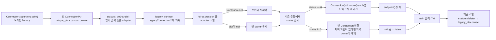

# 2026-09-10 — `std::out_ptr` C 소유권 경계와 Manacher 최장 팰린드롬

오늘은 C++23 `std::out_ptr`로 **`T**` 출력 매개변수를 쓰는 오래된 C API와 `std::unique_ptr`의 RAII 소유권을 안전하게 연결**한다. 실무 예제는 C 함수가 만든 연결/티켓 handle을 custom deleter가 있는 이동 전용 도메인 객체로 즉시 감싼다. 대회 문제는 [CSES 1111 - Longest Palindrome](https://cses.fi/problemset/task/1111/)을 홀수·짝수 반지름을 분리한 Manacher 알고리즘으로 `O(n)`에 해결한다.

## 오늘의 목표

- `T*`와 `T**`를 구별하고, 출력 슬롯에 쓰인 raw pointer가 언제 스마트 포인터 소유권으로 편입되는지 설명한다.
- `std::out_ptr` adapter의 생성, 포인터 변환, full-expression 끝 소멸과 재채택 순서를 추적한다.
- `struct`/`class`, 접근 지정자, `explicit`, 멤버 초기화 목록, `using`, 템플릿 인자를 초보자 관점에서 읽는다.
- lvalue/prvalue/xvalue, 참조 바인딩, 복사 금지, 이동, 객체 수명, 보장 복사 생략을 실제 식과 연결한다.
- Manacher의 mirror 초기화와 가장 오른쪽 팰린드롬 불변식으로 선형 시간임을 증명한다.
- 각 표준 라이브러리 호출을 수신 상태, overload, 인자, 반환, 사후 상태, 오류·수명·복잡도까지 설명한다.

## 생성 파일

- [`README.md`](README.md): 오늘의 개념, 구조도, 문제, 호출 계약과 검증 기록
- [`CMakeLists.txt`](CMakeLists.txt): C++23 경고 빌드와 9개 CTest 등록
- [`main.cpp`](main.cpp): `std::out_ptr`로 legacy connection을 `Connection` 소유 객체로 바꾸는 실무 예제
- [`problem.cpp`](problem.cpp): 같은 경계를 작은 ticket 예제로 다시 작성하는 연습 해답
- [`CHECKPOINT.md`](CHECKPOINT.md): 기초 문법·소유권·호출 계약·Manacher 자기 검증
- [`icpc_problem.cpp`](icpc_problem.cpp): CSES 1111 제출 가능한 완전한 풀이
- [`run_icpc_test.cmake`](run_icpc_test.cmake): ICPC 출력 전체를 비교하는 CTest helper
- [`../algorithm/manacher-longest-palindromic-substring.md`](../algorithm/manacher-longest-palindromic-substring.md): Manacher 대표 알고리즘 문서
- [`../standard-library/ownership-and-vocabulary-types.md`](../standard-library/ownership-and-vocabulary-types.md): `out_ptr`/`unique_ptr` 공용 계약
- [`../standard-library/containers-and-views.md`](../standard-library/containers-and-views.md): string/vector 생성·조회·무효화 계약
- [`../standard-library/algorithms-and-ranges.md`](../standard-library/algorithms-and-ranges.md): `std::min` 공용 계약
- [`../standard-library/io-parsing-and-utilities.md`](../standard-library/io-parsing-and-utilities.md): 이동과 스트림 공용 계약

## `main.cpp` 코드 구조도



핵심 경계는 `legacy_connect(endpoint, std::out_ptr(handle))` 한 문장이다. adapter는 생성될 때 기존 `handle`을 비우고 내부 raw pointer 슬롯을 null로 시작한다. C 함수가 그 슬롯에 성공 포인터를 쓴 뒤 **세미콜론으로 full-expression이 끝날 때** adapter 소멸자가 포인터를 `handle`에 채택시킨다. 따라서 상태 코드를 먼저 저장하고 다음 문장에서 owner를 관찰해야 한다.

## 초보자를 위한 기초 문법

### 헤더, 기본 타입과 중괄호 초기화

- `#include <memory>`는 `std::unique_ptr`, `std::out_ptr`, `std::out_ptr_t` 선언을 현재 번역 단위에 보이게 한다.
- `int`는 상태 코드와 작은 식별자를 표현한다. `{}`를 쓴 `int endpoint{}`는 값을 생략하면 0으로 초기화한다.
- `LegacyConnection connection;`처럼 기본 타입 멤버를 초기화하지 않는 습관보다 멤버 선언의 `{}`가 안전하다.
- `const int status{...}`의 `const`는 초기화 뒤 상태 코드를 다시 대입하지 않겠다는 뜻이다.

### 포인터, 참조와 출력 매개변수

- `LegacyConnection*`는 객체 주소 하나다. raw pointer 자체는 소유권을 말해 주지 않는다.
- `LegacyConnection** output`은 **포인터가 저장될 변수의 주소**다. C 함수는 `*output = new ...`로 호출자 쪽 슬롯 값을 바꾼다.
- `Smart&`의 `&`는 이미 존재하는 스마트 포인터 lvalue를 복사하지 않고 빌린다는 뜻이다. `out_ptr`는 이 참조를 adapter 안에 보관한다.
- pointer/reference는 대상 수명을 자동 연장하지 않는다. `out_ptr`가 C 함수에 건넨 `T**`는 adapter 임시보다 오래 저장할 수 없다.

### `struct`, `class`, 접근 지정자

- `struct LegacyConnection`과 `struct ConnectionCloser`는 기본 접근이 `public`이다. 단순 C 레코드와 상태 없는 정책 객체에 자연스럽다.
- `class Connection`은 기본 접근이 `private`다. `public:`에는 factory와 안전한 관찰만, `private:`에는 raw handle을 소유하는 `ConnectionPtr`만 둔다.
- 이 캡슐화 때문에 호출자는 `release()`로 소유권을 잃거나 빈 포인터를 직접 역참조할 수 없다.

### 생성자, 멤버 초기화 목록, `explicit`

```cpp
explicit Connection(ConnectionPtr handle) noexcept
    : handle_{std::move(handle)} {}
```

- 생성자는 반환형이 없고 객체 수명을 시작한다.
- `: handle_{...}`는 생성자 본문 전에 멤버를 기본 생성 후 대입하지 않고 곧바로 구성한다.
- `explicit`은 `ConnectionPtr` 하나가 `Connection`으로 암시 변환되는 것을 막아 소유권 경계를 호출부에 드러낸다.
- `noexcept`는 이 생성자가 예외를 밖으로 내보내지 않는다는 계약이다. stateless deleter의 `unique_ptr` 이동은 상수 시간이다.

### `using`과 템플릿 인자

```cpp
using ConnectionPtr = std::unique_ptr<LegacyConnection, ConnectionCloser>;
```

`using`은 새 클래스를 만드는 것이 아니라 긴 타입에 별칭을 붙인다. 첫 템플릿 인자 `LegacyConnection`은 관리 객체 타입, 둘째 `ConnectionCloser`는 해제 정책이다. 기본 `delete` 정책이 아니라 반드시 `legacy_disconnect`를 호출해야 하는 실제 C 자원에도 이 패턴을 그대로 적용할 수 있다.

### 함수, 반환형, 제어문

- `[[nodiscard]] static Connection open(int endpoint)`는 객체 없이 호출하는 factory이고, 반환값 무시가 의심스럽다는 진단을 요청한다.
- `if (status != 0)`은 비교 결과 `bool`로 조건 분기한다. 실패 경로는 빈 owner, 성공 경로는 이동된 owner를 명시한다.
- `for`와 `while`은 ICPC 풀이에서 중심을 순서대로 처리하고 양쪽 문자가 같은 동안만 확장한다.
- `&&`는 왼쪽부터 단락 평가한다. Manacher의 문자 인덱스는 경계 조건이 참일 때만 접근하므로 unchecked `operator[]`가 안전하다.

## 심화 Modern C++ — `std::out_ptr` 소유권 adapter

### 왜 `&smart_pointer`를 넘길 수 없는가

`unique_ptr` 객체의 주소는 `LegacyConnection**`가 아니다. 억지 cast를 하면 내부 표현을 침범하고 deleter/불변식을 깨뜨린다. 수동 코드는 보통 `LegacyConnection* raw{}; C_api(&raw); owner.reset(raw);` 세 단계를 쓰는데, 중간 반환·예외·상태 코드 처리에서 reset을 빠뜨리면 누수가 난다. `out_ptr`는 이 임시 슬롯과 재채택을 RAII 객체 하나로 묶는다.

### 호출의 정확한 시간 순서

1. `std::out_ptr(handle)`이 `handle`을 non-const lvalue 참조로 받는다.
2. 반환 `std::out_ptr_t<ConnectionPtr, LegacyConnection*>` prvalue가 내부 슬롯을 null로 값 초기화하고 `handle.reset()`에 해당하는 동작으로 기존 owner를 비운다.
3. adapter가 `LegacyConnection**`로 변환되고 C 함수는 호출 중 그 슬롯에 포인터를 기록한다.
4. C 함수의 `int` 상태 코드가 `status`에 저장된다.
5. 문장 끝에 adapter가 파괴되면서 슬롯이 non-null이면 `handle.reset(pointer)`에 해당하는 동작으로 custom deleter를 보존한 owner에 채택한다.
6. 다음 문장의 `if`가 상태 코드를 검사한다. 실패하면서도 잘못 포인터를 준 C API라면 지역 owner의 소멸이 그 자원을 정리하므로 누수는 막지만, API 의미 계약 위반은 별도로 진단해야 한다.

### `out_ptr`와 `inout_ptr` 선택

- 오늘 C 함수는 기존 포인터를 읽지 않고 **새 값만 출력**한다. 빈 owner에서 시작하는 `out_ptr`가 맞다.
- 기존 포인터를 입력으로 사용해 재할당하거나 직접 해제하는 API는 `inout_ptr` 계열 계약을 검토한다.
- C 함수가 `T**` 주소를 비동기 작업에 저장했다가 나중에 쓰는 API라면 수명이 한 문장뿐인 adapter를 넘기면 안 된다. 별도 장수명 state와 API 전용 wrapper가 필요하다.

### 오류와 예외 안전성

예제 C 경계는 잘못된 값에 1, 할당 실패에 2를 반환하고 포인터 슬롯을 쓰지 않는다. adapter 구성은 일반 smart pointer까지 지원하므로 표준상 무조건 `noexcept`가 아니다. 오늘의 빈 `unique_ptr` 특수화는 adapter 자체가 저장소를 할당하지 않지만, legacy 함수의 자원 생성은 실패할 수 있다. custom deleter는 `noexcept`여야 소멸 중 예외로 프로그램이 종료되는 설계를 피할 수 있다.

## 값 범주, 복사·이동, 수명, 복사 생략

- `handle`은 타입이 이동 전용이어도 **이름이 있는 식이므로 lvalue**다.
- `std::move(handle)`은 아무 자원도 직접 옮기지 않고 같은 객체를 가리키는 xvalue를 만든다. 뒤이어 선택된 `unique_ptr` 이동 생성자가 raw pointer와 deleter 소유권을 옮긴다.
- 이동 뒤 원본 `handle`은 빈 유효 상태다. 파괴하거나 새 값을 대입할 수 있지만 과거 자원을 여전히 소유한다고 가정하면 안 된다.
- `std::out_ptr(handle)`의 반환 adapter는 prvalue이며 C 함수 인자로 쓰인 full-expression 끝까지 산다. adapter가 빌린 `handle`은 그보다 오래 살아 있다.
- `Connection{std::move(handle)}`은 prvalue다. `return Connection{...};`의 같은 타입 prvalue는 C++17부터 호출자 결과 객체에 직접 구성되므로 중간 `Connection` 복사/이동이 없다. 이름 있는 지역을 반환할 때 선택적인 NRVO와 구별한다.
- `Connection`은 `unique_ptr` 멤버 때문에 복사가 금지되고 이동만 가능하다. 두 객체가 같은 raw handle을 독점 소유해 두 번 해제하는 상태를 타입이 막는다.
- `operator->`가 반환한 raw pointer는 비소유 관찰자다. owner가 reset·이동·파괴되면 더 이상 사용하면 안 된다.

## 기계 실행 관점

`out_ptr` adapter는 보통 raw pointer 크기의 내부 슬롯과 스마트 포인터 참조를 두고, C 함수가 그 슬롯에 주소를 store한 뒤 소멸자가 owner에 다시 store하는 형태로 최적화될 수 있다. 상태 코드/null 비교는 조건 분기, `operator->`는 포인터 load와 멤버 load, 스트림 출력은 버퍼 처리와 간접 호출로 이어질 수 있다. custom deleter 타입이 구체적이면 호출이 인라인될 수도 있다.

Manacher는 `odd`/`even` 연속 배열의 radius load/store, mirror 인덱스 계산, 문자 load·비교, 경계 분기를 반복한다. 하지만 소스 한 줄과 실제 명령은 일대일이 아니다. SSO 여부, adapter 표현, 할당, 인라인, 분기 제거, 벡터화, 스트림 호출과 정확한 명령은 CPU, ABI, 표준 라이브러리, 컴파일러, Debug/Release 및 최적화 옵션에 따라 달라 특정 어셈블리로 단정하지 않는다.

## 오늘의 ICPC 문제

- ID·제목·출처 URL: [CSES 1111 - Longest Palindrome](https://cses.fi/problemset/task/1111/), CSES Problem Set / String Algorithms
- 요구: 소문자 문자열의 가장 긴 팰린드롬 연속 부분 문자열 하나를 출력한다. 최장 답이 여러 개면 어느 하나도 허용된다.
- 공식 제약: `1 <= n <= 1,000,000`, 시간 1초, 메모리 512MB
- 핵심 알고리즘: 홀수/짝수 반지름을 분리한 Manacher
- 시간 복잡도: `O(n)`
- 추가 공간 복잡도: `O(n)` (`odd`, `even` 정수 배열)
- 대표 문서: [`../algorithm/manacher-longest-palindromic-substring.md`](../algorithm/manacher-longest-palindromic-substring.md)

### 반지름 정의

- `odd[i]=k`: `[i-k+1, i+k)`가 길이 `2k-1`인 홀수 팰린드롬이다. 중심 문자 하나 때문에 최소값은 1이다.
- `even[i]=k`: `[i-k, i+k)`가 길이 `2k`인 짝수 팰린드롬이다. 중심은 `i-1`과 `i` 사이이고 최소값은 0이다.

### 핵심 불변식과 정확성

각 pass의 루프 시작에서 `[left,right]`는 지금까지 처리한 중심 가운데 오른쪽 끝이 가장 큰 팰린드롬이다. 새 중심 `i`가 `right` 안이면 대칭 위치 `mirror`의 이미 계산된 팰린드롬을 이용할 수 있다. 다만 mirror 팰린드롬이 왼쪽 경계를 넘어갈 수 있으므로 `min(radius[mirror], right-i+1)`까지만 확정한다. 이후 직접 비교로 경계를 넓힌다.

초기 반지름 안쪽은 대칭성과 기존 구간 정의로 모두 같다. while은 양쪽 문자가 같은 동안만 1씩 늘리고 첫 불일치나 문자열 끝에서 멈추므로 저장 반지름은 과대도 과소도 아니다. 홀수 pass가 모든 홀수 길이 답을, 짝수 pass가 모든 짝수 길이 답을 검사하므로 가장 큰 길이를 기록한 구간은 전역 최장 답이다.

### 왜 전체가 선형인가

mirror에서 복사한 구간 안쪽 문자를 다시 비교하지 않는다. while이 `right` 밖에서 성공할 때마다 가장 오른쪽 경계가 최소 한 칸 전진하며 한 pass에서 최대 `n`번 전진한다. 각 중심의 상수 작업과 실패 비교를 합치면 홀수 pass `O(n)`, 짝수 pass `O(n)`, 전체 `O(n)`이다.

### 검증 사례

| 사례 | 입력 | 기대 출력 | 확인하는 경계 |
|---|---|---|---|
| 공식 | `aybabtu` | `bab` | 홀수 mirror와 일반 답 |
| 최소 | `a` | `a` | `n=1`, 반지름 1 |
| 짝수 | `cbbd` | `bb` | even 기본식 |
| 전체 짝수 | `abba` | `abba` | 양 끝 경계 |
| 반복 | `aaaaa` | `aaaaa` | right의 상각 전진 |
| 동률 | `babad` | `bab` | 첫 최장 답 유지 |
| 긴 짝수 | `forgeeksskeegfor` | `geeksskeeg` | even mirror의 `+1` |

## 오늘 사용한 표준 라이브러리

| 핵심 심볼명 | 선언 헤더 | 항목 종류 | 실제 호출 멤버/함수 | 현재 코드에서의 역할과 핵심 계약 | 대표 문서 |
|---|---|---|---|---|---|
| `std::unique_ptr<LegacyConnection, ConnectionCloser>` | `<memory>` | 클래스 템플릿·생성자·관찰자·소멸자 | `ConnectionPtr handle{}`, 이동 생성, `operator bool`, `operator->` | 빈 owner를 만들고 성공 handle을 단독 소유한다. 복사 금지·이동 가능하며 non-null 소멸 시 custom deleter를 호출한다. `operator->` 결과는 owner 수명 안에서만 유효하다. | [소유권](../standard-library/ownership-and-vocabulary-types.md) |
| `std::out_ptr`, `std::out_ptr_t` | `<memory>` | C++23 함수 템플릿·임시 adapter 클래스 | `std::out_ptr(handle)` | lvalue owner를 빌려 `LegacyConnection**` 슬롯을 제공한다. 생성 때 기존 owner를 비우고 full-expression 끝에 non-null 결과를 재채택한다. adapter 밖 슬롯 사용은 수명 위반이다. | [소유권](../standard-library/ownership-and-vocabulary-types.md) |
| `std::move` | `<utility>` | 함수 템플릿 | `std::move(handle)`, `std::move(owner)` | 이름 있는 owner lvalue를 xvalue로 바꾼다. 반환 rvalue reference는 이동 생성에 즉시 쓰며 실제 소유권 이전은 unique_ptr가 수행한다. O(1), 무할당, 수명 연장 없음. | [입출력·유틸리티](../standard-library/io-parsing-and-utilities.md) |
| `std::string` | `<string>` | 클래스·생성자·멤버·연산자 | 기본 생성, `length()`, `operator[]`, `substr(pos,count)` | 입력을 소유하고 길이/문자를 읽으며 최장 구간을 새 문자열로 복사 반환한다. `operator[]`는 unchecked, `substr`는 결과 길이 선형·할당 가능이다. | [컨테이너](../standard-library/containers-and-views.md) |
| `std::vector<int>` | `<vector>` | 클래스 템플릿·fill 생성자·인덱싱 | `std::vector<int>(n_size, 0)` fill 생성자, `vector::operator[]` | `odd`/`even` 반지름 n개를 0으로 만든다. 생성 시간·공간 O(n), 인덱싱 O(1)이며 범위 밖 `[]`는 미정의 동작이다. | [컨테이너](../standard-library/containers-and-views.md) |
| `std::min` | `<algorithm>` | 함수 템플릿 | `std::min(odd[mirror], right-i+1)` | 두 `const int&` 중 작은 값의 참조를 반환하고 즉시 radius에 복사한다. 둘째 임시를 선택해도 full-expression 안 복사라 안전하다. O(1), 무할당이다. | [알고리즘](../standard-library/algorithms-and-ranges.md) |
| `std::ios::sync_with_stdio` | `<iostream>` | static 함수 | `sync_with_stdio(false)` | 첫 I/O 전에 C/C++ 표준 스트림 동기화를 끄고 이전 bool은 버린다. 이후 C stdio와 혼용 순서를 자동 보장하지 않는다. | [입출력](../standard-library/io-parsing-and-utilities.md) |
| `std::cin`, `std::istream` | `<iostream>` | 전역 객체·멤버·연산자 | `std::cin.tie(nullptr)`, `std::cin >> text` | 자동 flush 연결을 해제하고 문자열 한 단어를 소유 버퍼에 읽는다. `tie`의 옛 pointer와 추출의 stream reference 반환은 의도적으로 버린다. | [입출력](../standard-library/io-parsing-and-utilities.md) |
| `std::cout`, `std::ostream` | `<iostream>` | 전역 객체·삽입 연산자 | `std::cout << ...`, `operator<<(std::ostream&, char)` | 정수/bool/string과 문자 개행을 버퍼에 쓴다. 각 호출은 같은 stream reference를 반환해 연쇄하고 마지막 반환은 버린다. 오류 비트·설정 예외가 가능하다. | [입출력](../standard-library/io-parsing-and-utilities.md) |

## 검증 과정과 재현

다음 순서로 높은 경고 Release 빌드, 학습 예제, exact-output CTest, 공용 알고리즘 예제, 표준 라이브러리 감사, 링크·UTF-8·Mermaid 검사를 수행한다. 빌드 산출물은 `build/` 아래에만 두고 커밋하지 않는다.

```powershell
$kit = (Resolve-Path tools/w64devkit/bin).Path
$env:Path = "$kit;$env:Path"
cmake -S dailystudy/exercise/2026-09-10 -B dailystudy/exercise/2026-09-10/build -G "MinGW Makefiles" -DCMAKE_BUILD_TYPE=Release "-DCMAKE_CXX_COMPILER=g++.exe"
cmake --build dailystudy/exercise/2026-09-10/build --parallel
ctest --test-dir dailystudy/exercise/2026-09-10/build --output-on-failure
powershell -ExecutionPolicy Bypass -File dailystudy/exercise/tools/audit-standard-library-docs.ps1 -Scope latest
powershell -ExecutionPolicy Bypass -File dailystudy/exercise/tools/audit-standard-library-docs.ps1 -Scope all
```

완료 기준은 경고 없는 빌드, `daily_main`의 `7 0`, `daily_problem`의 `42 0`, CTest 9/9, 독립 oracle과 최대 길이 stress, 문서 예제 컴파일, 모든 로컬 링크와 UTF-8, Mermaid 구문, 두 감사 범위 통과다.

### 2026-09-10 실행 결과

- GCC 16.1.0의 C++23 Release 모드와 `-Wall -Wextra -Wpedantic -Wconversion -Wshadow`에서 세 실행 파일을 경고 없이 빌드했다.
- `daily_main`은 정확히 `7 0`, `daily_problem`은 정확히 `42 0`을 출력했고, 공식 예제와 홀수·짝수·경계 사례를 포함한 CTest가 9/9 통과했다.
- 고정 seed 1111로 만든 길이 0..40의 문자열 50,000개를 독립적인 `O(n^2)` oracle과 대조했다. 반환 문자열의 부분 문자열 여부·팰린드롬 여부·최대 길이가 모두 일치했다.
- 길이 1,000,000 stress에서 동일 문자 입력은 길이 1,000,000의 답을 0.035초, 교대 문자 입력은 길이 999,999의 답을 0.021초에 냈다. 시간은 이 검증 머신의 단일 실행 실측값이다.
- 공용 알고리즘 문서의 독립 예제를 C++20으로 컴파일했고, strict UTF-8 파일 16개와 로컬 링크 347개를 검사했으며 Mermaid 블록 1개를 parser로 확인했다.
- 표준 라이브러리 감사의 `latest` 범위는 날짜 1개·C++ 파일 3개·기호 12개, `all` 범위는 날짜 55개·C++ 파일 146개·인덱스 기호 136개로 모두 통과했다.

## 직접 해보기

1. `ConnectionPtr handle{}` 대신 이미 자원을 소유한 handle로 `out_ptr`를 만들면 기존 자원이 언제 해제되는지 추적한다.
2. 상태 코드와 `handle`을 같은 `if` full-expression에서 함께 검사하지 말아야 하는 이유를 adapter 소멸 시점으로 설명한다.
3. `Connection` 생성자의 `explicit`을 지우고 어떤 암시 변환이 가능해지는지 컴파일러로 확인한다.
4. `Connection` 복사 생성자를 `= default`로 바꾸고 왜 컴파일되지 않는지 `unique_ptr`의 단독 소유권으로 설명한다.
5. `even` pass의 mirror 식에서 `+1`을 제거해 `abba`, `aaaa`, `forgeeksskeegfor` 중 어떤 검증이 실패하는지 관찰한다.
6. 길이 1,000,000의 동일 문자와 교대 문자열을 만들어 실행 시간·최대 RSS를 측정하고 `O(n)` 주장과 비교한다.
7. CHECKPOINT의 호출 계약 항목을 코드 없이 답한 뒤 `problem.cpp`를 빈 파일에서 다시 작성한다.
