# 2026-09-11 — `std::ranges::to` 소유 스냅숏과 경로 복사 영속 세그먼트 트리

오늘은 C++23 `std::ranges::to`로 **비소유·지연 ranges 파이프라인을 API 경계에서 독립 수명의 소유 컨테이너로 materialize**한다. 실무 예제는 repository가 `filter_view`를 내보내고 service가 `transform_view`를 거쳐 이름까지 깊게 소유하는 `std::vector` 스냅숏을 반환한다. 대회 문제는 [CSES 1737 - Range Queries and Copies](https://cses.fi/problemset/task/1737/)를 append-only 노드 arena와 경로 복사 영속 세그먼트 트리로 해결한다.

## 오늘의 목표

- view가 원본을 빌리는 지연 범위라는 점과 `ranges::to` 결과가 새 저장소를 소유한다는 점을 구별한다.
- `filter → transform → materialize` 경계를 repository/service 아키텍처와 객체 수명에 연결한다.
- 헤더, 기본 타입, 중괄호 초기화, 함수, `const`, 포인터·참조, 제어문, `struct`/`class`, 접근 지정자, 멤버 초기화 목록, `explicit`, `using`, 템플릿 인자를 실제 코드에서 읽는다.
- lvalue/prvalue/xvalue, forwarding reference 바인딩, 문자열 복사, vector 이동, 소유권, 보장 복사 생략을 실제 식으로 설명한다.
- 불변 노드 공유와 path copying으로 버전 복사를 `O(1)`, 점 갱신·구간 합을 `O(log n)`에 처리한다.
- 각 표준 라이브러리 호출을 수신 상태, 정확한 overload, 인자, 반환, 사후 상태, 복잡도·할당·무효화·수명·오류·스레드 계약까지 검증한다.

## 생성 파일

- [`README.md`](README.md): 오늘의 개념, 구조도, 문제·알고리즘, 표준 호출 계약과 검증 결과
- [`CMakeLists.txt`](CMakeLists.txt): 확장 없는 C++23 경고 빌드와 exact-output CTest 6개
- [`main.cpp`](main.cpp): 사용자 repository의 lazy query를 소유 `UserCards` 스냅숏으로 반환하는 실무 예제
- [`problem.cpp`](problem.cpp): 재고 repository와 catalog snapshot으로 같은 경계를 다시 작성한 연습 해답
- [`CHECKPOINT.md`](CHECKPOINT.md): 기초 문법, Modern C++, 호출 계약, 영속 트리 증명·실기 검증
- [`icpc_problem.cpp`](icpc_problem.cpp): CSES 1737에 제출 가능한 완전한 풀이
- [`run_icpc_test.cmake`](run_icpc_test.cmake): 종료 코드와 정규화한 전체 출력을 비교하는 CTest helper
- [`../algorithm/persistent-segment-tree-path-copying.md`](../algorithm/persistent-segment-tree-path-copying.md): 경로 복사 영속 세그먼트 트리 대표 문서
- [`../standard-library/algorithms-and-ranges.md`](../standard-library/algorithms-and-ranges.md): filter/transform와 `ranges::to` 공용 계약
- [`../standard-library/containers-and-views.md`](../standard-library/containers-and-views.md): string/vector 생성·조회·재할당 계약
- [`../standard-library/io-parsing-and-utilities.md`](../standard-library/io-parsing-and-utilities.md): 이동과 스트림 입출력 계약
- [`../standard-library/bit-and-byte-utilities.md`](../standard-library/bit-and-byte-utilities.md): `size_t`와 정수 폭을 읽는 기준

## `main.cpp` 코드 구조도

```mermaid
flowchart LR
    A["UserRows seed<br/>행·문자열 소유"] -->|"std::move(seed)"| B["UserRepository<br/>rows_ 최종 소유"]
    B --> C["UserService<br/>const reference로 repository 차용"]
    C --> D["active_with_minimum(80)"]
    D --> E["filter_view<br/>rows_를 비소유·지연 관찰"]
    E --> F["transform_view<br/>UserCard prvalue 투영"]
    F -->|"std::ranges::to<UserCards>"| G["first 소유 snapshot<br/>Ada, Linus 깊은 복사"]
    G --> H["repository.deactivate(1)"]
    H --> I["새 lazy pipeline 생성·평가"]
    I -->|"materialize"| J["second 소유 snapshot<br/>Linus만 소유"]
    G -. "원본 변경과 독립" .-> K["출력: 2 Ada Linus 1 Linus"]
    J --> K
```



`filter_view`와 `transform_view`를 만드는 단계에서는 행을 순회하거나 `UserCard`를 만들지 않는다. `std::ranges::to<UserCards>(projected)`가 호출될 때 비로소 predicate와 projector가 실행되고, 통과한 각 이름을 새 `std::string`에 복사한 소유 vector가 생긴다. 따라서 `first`를 만든 뒤 repository의 Ada 행을 비활성화해도 `first`는 `Ada, Linus`를 유지하고, 다시 만든 `second`만 `Linus` 하나를 가진다.

## 초보자를 위한 기초 문법

### 헤더, 기본 타입, 중괄호 초기화와 `const`

- `<ranges>`는 `std::views::filter`, `std::views::transform`, C++23 `std::ranges::to`를 선언한다. `<vector>`와 `<string>`은 결과가 원소·문자를 직접 소유하게 한다.
- `int`는 ID·점수·재고·트리 인덱스, `bool`은 활성/게시 상태, `long long`은 최대 `2 * 10^14`인 구간 합에 사용한다.
- `int n{0};`, `Node{sum,left,right}`의 `{}`는 narrowing을 막으며 명시한 값으로 초기화한다. 기본 타입을 초기화하지 않은 채 읽으면 안 된다.
- `const int minimum_score`는 함수 안에서 임계값을 바꾸지 않겠다는 뜻이다. `const` 객체·참조를 통한 호출은 `const` 멤버 함수만 허용한다.

### `struct`, `class`, 접근 지정자

- `struct UserRow`, `UserCard`, `Node`는 기본 접근이 `public`이라 단순 레코드와 DTO에 맞는다.
- `class UserRepository`, `UserService`, `PersistentSegmentTree`는 기본 접근이 `private`다. 외부에는 안전한 query/command만 공개하고 `rows_`, `repository_`, `nodes_` 소유 상태는 감춘다.
- `private` node pool 때문에 호출자는 이미 공개된 영속 노드를 직접 수정할 수 없다. 새 root는 `assign`을 통해서만 만들어진다.

### 함수, 반환형, 매개변수와 제어문

- `[[nodiscard]] UserCards load_cards(const int minimum_score) const`는 소유 스냅숏을 값으로 반환하고, 정수 임계값을 복사해 받으며, service 상태를 바꾸지 않는다. `[[nodiscard]]`는 결과를 버린 호출을 진단하도록 요청한다.
- `for (UserRow& row : rows_)`는 vector 원소를 복사하지 않고 하나씩 수정 가능한 참조로 빌린다. `if`는 비교 결과 `bool`에 따라 분기하고, 찾은 뒤 `return`해 반복을 끝낸다.
- 영속 트리의 재귀 함수는 담당 닫힌 구간 `[segment_left,segment_right]`를 매개변수로 받는다. 중간점은 `left + (right-left)/2`로 계산한다.
- 입력은 1-based지만 재귀 구현은 0-based다. 공개 경계에서 `position-1`, `left-1`, `right-1`로 한 번만 바꾼다.

### 포인터와 참조, 소유권

- `const UserRepository& repository_`와 `const UserRow& row`의 `&`는 기존 객체를 복사하지 않고 빌리는 참조다. 참조는 null 상태를 표현하지 않으며 대상 수명을 늘리지 않는다.
- `UserRow& row`는 수정 가능한 별칭이고 `const UserRow& row`는 그 별칭을 통한 수정을 막는다. 어느 쪽도 `delete` 책임이나 소유권을 받지 않는다.
- 영속 트리는 `Node*` 대신 `int` arena 인덱스를 보관한다. vector 재할당은 원소 주소·참조·반복자를 무효화하지만 정수 인덱스 값은 유지되므로 재귀를 가로질러 안전하게 저장할 수 있다.
- 그렇더라도 `nodes_[index]`가 돌려준 `Node&`를 append를 넘겨 보관하면 댕글링될 수 있다. 코드는 먼저 `Node` 값으로 복사하고 인덱스만 유지한다.

### 멤버 초기화 목록과 `explicit`

```cpp
explicit UserRepository(UserRows rows) : rows_{std::move(rows)} {}
```

- 생성자는 반환형이 없고 새 객체 수명을 시작한다. `: rows_{...}`는 생성자 본문 전에 멤버를 곧바로 구성한다.
- `explicit`은 `UserRows` 하나가 필요한 위치에서 `UserRepository`가 뜻하지 않게 암시 생성되는 것을 막는다.
- `UserService(const UserRepository&) : repository_{repository}`는 비소유 reference member를 즉시 바인딩한다. repository가 service보다 오래 살아야 한다.

### `using`, 템플릿 인자와 lambda

- `using UserCards = std::vector<UserCard>;`는 새 클래스를 만들지 않고 같은 타입에 별칭을 붙인다. 템플릿 인자 `UserCard`가 vector 원소의 생성·이동·파괴 규칙을 결정한다.
- `[minimum_score](const UserRow& row)`의 대괄호는 값 캡처다. 함수가 끝난 뒤 filter가 predicate를 보관해도 복사된 임계값은 살아 있다.
- projector lambda는 `UserCard{row.id,row.name}` prvalue를 반환한다. `row.name`은 `const std::string` lvalue라 새 card의 문자열로 복사된다.

## 심화 Modern C++ — lazy view에서 소유 snapshot으로

`UserRepository::active_with_minimum`은 `rows_`를 빌리는 `filter_view`를 반환한다. 생성 비용은 `O(1)`이고 predicate 실행은 순회 시점까지 미뤄진다. service는 여기에 `transform_view`를 붙여 도메인 행을 외부 DTO로 투영하지만 여전히 저장소를 소유하지 않는다.

vector 같은 forward range 위의 `filter_view`는 첫 통과 반복자를 cache할 수 있다. 그래서 순회를 이미 시작한 같은 view를 predicate 관련 변경이나 vector 재할당 뒤 재사용하지 않고, 오늘 코드처럼 서비스 호출마다 새 view를 만든다. repository 파괴는 언제나 비소유 view를 dangling으로 만들며, 재할당은 이미 얻었거나 cache한 반복자를 무효화한다.

`std::ranges::to<UserCards>(projected)`는 이 수명 경계를 끝낸다. 이 `filter`/`transform` 파이프는 `sized_range`는 아니지만 vector 기반의 `forward_range`다. 따라서 선택된 vector의 from-range 생성 경로는 먼저 거리를 구한 뒤 결과 원소를 구성할 수 있고, vector 원소 저장소 재할당은 일어나지 않는다. 그 대신 filter 술어는 거리 계산과 구성 순회에서 반복 평가될 수 있으며 projector와 문자열 복사는 구성 순회에서 수행된다. 성공한 결과에는 기반 iterator가 아니라 값과 독립 문자열이 들어 있어 지역 view가 파괴되어도 안전하다.

이 패턴은 repository가 쿼리 조합 가능성을 유지하면서도 controller/RPC/cache 같은 장수명 경계에는 댕글링 view를 노출하지 않게 한다. 반대로 거대한 결과를 한 번만 즉시 소비한다면 materialization 비용을 피하고 view를 owner 수명 안에서 순회하는 선택도 가능하다.

## 값 범주, 참조 바인딩, 복사·이동, 수명과 복사 생략

- 이름 있는 `seed`와 생성자 매개변수 `rows`는 이동 전용 여부와 무관하게 식으로는 **lvalue**다.
- `std::move(seed)`와 `std::move(rows)`는 같은 객체를 가리키는 **xvalue**를 만든다. 실제 버퍼 소유권 이전은 선택된 vector 이동 생성자가 수행한다.
- 이동 뒤 원본 vector는 유효하지만 내용이 명시되지 않은 상태다. 파괴·대입을 포함해 전제조건을 만족하는 연산은 가능하지만 원래 크기나 원소가 남았다고 가정하면 안 된다.
- `std::views::filter(...)`, `std::views::transform(...)` 결과는 view **prvalue**다. `eligible`, `projected`라는 이름으로 초기화한 뒤 그 이름을 쓰는 식은 lvalue다.
- `UserCard{row.id,row.name}`은 prvalue이고 `row.name` lvalue에서 문자열을 복사한다. 이 깊은 복사가 snapshot을 repository 수명에서 분리한다.
- `std::ranges::to<UserCards>(projected)`는 `UserCards` prvalue를 반환한다. `return`과 `UserCards first{service.load_cards(80)}`의 같은 타입 prvalue는 C++17 보장 복사 생략으로 최종 결과 객체에 직접 구성될 수 있으며, 이름 있는 지역을 반환할 때 선택적인 NRVO와 구별한다.
- view가 빌리는 `rows_`는 materialization 순회가 끝날 때까지 살아야 한다. `first`/`second`는 자체 vector와 string을 소유하므로 repository와 지역 view보다 오래 살 수 있다.

## 기계 실행 관점

실무 파이프라인은 행의 `active`/`score` load, 비교와 조건 분기, 통과한 ID load, 문자열 문자 복사, 결과 vector의 store·할당으로 이어질 수 있다. view adaptor 자체는 최적화 뒤 사라지고 루프 하나로 융합될 수도 있지만 반드시 그런 것은 아니다.

영속 트리는 정수 node index로 연속 arena의 합·자식 index를 load하고, 구간 비교로 분기하며, 갱신 경로마다 새 `Node`를 store한다. type 3 복사는 root 정수 하나의 load/store다. 실제 cache miss, vector 성장, inlining, 분기 예측, SIMD와 명령 수는 CPU, ABI, 표준 라이브러리, 컴파일러, Debug/Release 및 최적화 옵션에 따라 달라 특정 어셈블리나 cycle 수로 단정하지 않는다.

## 오늘의 ICPC 문제

- ID·제목·공식 URL: [CSES 1737 - Range Queries and Copies](https://cses.fi/problemset/task/1737/)
- 시간·메모리 제한: 1초, 512MB
- 공식 제약: `1 <= n,q <= 200,000`, 초기값과 갱신값은 `1..10^9`, 위치·버전은 query 시점에 유효하다.
- 입력: 초기 배열 하나 뒤에 `1 k a x`(version k의 a를 x로 대입), `2 k a b`(version k의 닫힌 구간 합), `3 k`(version k 복사)가 q개 온다.
- 출력: type 2마다 구간 합을 한 줄에 출력한다.
- 핵심 알고리즘: append-only arena와 정수 root index를 쓰는 path-copying persistent segment tree
- 대표 문서: [`../algorithm/persistent-segment-tree-path-copying.md`](../algorithm/persistent-segment-tree-path-copying.md)

### 자료구조와 핵심 불변식

`nodes_`는 모든 버전이 공유하는 `Node{sum,left_child,right_child}`를 연속 저장한다. 각 root 정수는 하나의 배열 버전을 나타내며 다음 불변식을 유지한다.

1. node index와 담당 구간이 정해지면 `node.sum`은 그 버전의 해당 구간 합이다.
2. 다른 root가 볼 수 있게 공개된 node는 다시 수정하지 않는다.
3. 점 갱신은 이전 node를 값 복사하고, 목표 leaf로 가는 자식만 새 index로 바꾸며, 반대 자식은 기존 index를 공유한다.
4. type 1은 새 버전을 append하지 않고 `roots[k-1]` 슬롯을 새 root로 교체한다. type 3만 기존 root index를 목록 끝에 복사한다.
5. 구간 질의는 완전 포함 node의 저장 합을 사용하고, 부분 포함이면 필요한 자식 결과만 더한다.

### 연산 절차와 정확성 근거

- `build(values,n)`은 leaf에서 입력값을 저장하고 부모에 두 자식 합을 저장한다. 구간 길이에 대한 귀납법으로 초기 root의 모든 node 합이 정확하다.
- `assign(old_root,n,position,value)`은 root부터 leaf까지 이전 node를 복사한다. leaf 값을 바꾸고 돌아오며 새 자식 합으로 부모 합을 다시 계산하므로 새 root는 정확하다. 경로 밖 node index는 그대로 공유하고 기존 node를 쓰지 않으므로 다른 버전도 변하지 않는다.
- `range_sum(root,n,left,right)`은 query 구간이 담당 구간을 완전히 포함하면 저장 합을 반환하고, 중간점을 기준으로 겹치는 자식만 재귀 호출한다. 반환한 서로 겹치지 않는 조각들이 query 구간을 정확히 분할하므로 합도 정확하다.
- `roots.push_back(existing_root)`는 불변 node DAG의 진입점 정수만 복사한다. 이후 어느 버전을 갱신해도 path copying이 새 경로를 만들기 때문에 복사 당시 다른 버전은 보존된다.

### 시간·공간 복잡도와 대회 구현 선택

`u`를 실제 갱신 수, `c`를 복사 수라 하자.

| 연산 | 시간 | 새 공간 | 근거 |
|---|---:|---:|---|
| 초기 build | `O(n)` | `O(n)` | 약 `2n-1`개 node |
| type 1 점 대입 | `O(log n)` | `O(log n)` | root-to-leaf 경로만 복사 |
| type 2 구간 합 | `O(log n)` | 재귀 stack `O(log n)` | 높이별 경계 node만 방문 |
| type 3 버전 복사 | `O(1)` | `O(1)` | root index 하나 복사 |

전체 시간은 `O(n + q log n)`, 저장 공간은 `O(n + u log n + c)`다. 합 최댓값은 `2 * 10^14`이므로 `long long`을 쓴다. 구현은 `2*n + 24*q + 1` node를 reserve한다. 최대 약 5,200,001개이며 `Node`가 흔히 16바이트인 ABI라면 약 83.2MB지만 정확한 `sizeof(Node)`, 정렬과 vector capacity는 구현별로 측정해야 한다. 재귀 깊이는 배열 길이가 아니라 `O(log n)`이다.

## 오늘 사용한 표준 라이브러리

| 핵심 심볼명 | 선언 헤더 | 항목 종류 | 실제 호출 멤버/함수 | 현재 코드에서의 역할과 핵심 계약 | 대표 문서 |
|---|---|---|---|---|---|
| `std::string` | `<string>` | 클래스·생성자 | `std::string{"Ada"}`, `std::string` 복사 생성 | literal 또는 행의 이름 문자를 새 버퍼에 복사 소유한다. 문자 수에 선형이고 할당·길이 예외가 가능하며 성공한 복사본은 원본 수명과 독립이다. | [컨테이너](../standard-library/containers-and-views.md) |
| `std::vector<T>` | `<vector>` | 클래스 템플릿·생성자 | `기본 생성자`, `count 생성자`, initializer-list 생성자, vector 이동 생성 | 행·DTO·값·node·root를 연속 소유한다. count 생성자는 n개 값을 0으로 초기화하고, 기본 allocator 이동은 보통 O(1)이며 moved-from 원본은 유효하지만 내용이 명시되지 않는다. | [컨테이너](../standard-library/containers-and-views.md) |
| `std::move` | `<utility>` | 함수 템플릿 | `std::move(seed)`, `std::move(rows)` | 이름 있는 vector lvalue를 xvalue로 변환해 이동 생성을 허용한다. 반환 rvalue reference를 즉시 쓰며 move 자체는 O(1)·무할당이고 객체를 실제로 옮기지 않는다. | [입출력·유틸리티](../standard-library/io-parsing-and-utilities.md) |
| `std::views::filter` | `<ranges>` | range adaptor object | `std::views::filter(rows_, predicate)` | const vector를 비소유 ref view로 빌리고 predicate를 보관한다. 생성 O(1)이고 첫 순회 전에는 검사하지 않는다. owner 파괴는 dangling이며, 시작한 view의 cached iterator는 재할당으로 무효화될 수 있어 변경 뒤 새 view를 만든다. | [알고리즘·ranges](../standard-library/algorithms-and-ranges.md) |
| `std::views::transform` | `<ranges>` | range adaptor object | `std::views::transform(eligible, projector)` | filter view와 projector를 보관하고 순회 때 독립 문자열을 가진 DTO prvalue를 만든다. 생성 O(1), 결과 수명은 기반 범위에 묶이며 사용자 함수 예외를 전파한다. | [알고리즘·ranges](../standard-library/algorithms-and-ranges.md) |
| `std::ranges::to` | `<ranges>` | C++23 함수 템플릿 | `std::ranges::to<UserCards>(projected)`, `std::ranges::to<CatalogCards>(projected)` | forward range lvalue를 빌려 vector의 from-range 생성 경로로 소유 prvalue를 반환한다. 거리·구성 순회에서 술어가 반복 평가될 수 있지만 vector 저장소 재할당은 없고, 결과는 독립 수명이며 예외 시 부분 결과가 정리된다. | [알고리즘·ranges](../standard-library/algorithms-and-ranges.md) |
| `vector::reserve` | `<vector>` | 멤버 함수 | `nodes_.reserve(expected_nodes)`, `roots.reserve(...)` | `void reserve(size_type)`로 size는 유지하고 capacity를 하한까지 확보한다. 재할당 시 기존 관찰자는 모두 무효화되며 `length_error`/할당 실패가 가능하다. | [컨테이너](../standard-library/containers-and-views.md) |
| `vector::push_back` | `<vector>` | 멤버 함수 | `nodes_.push_back(node)`, `roots.push_back(root)` | `const T&` 값을 끝에 복사하고 `void`를 반환한다. 여유 capacity에서는 상각 O(1)이고 기존 원소 관찰자는 유지되지만 옛 `end()`는 무효화된다. 재할당 시 선형이며 모든 기존 참조·포인터·반복자가 무효화된다. | [컨테이너](../standard-library/containers-and-views.md) |
| `vector::size` | `<vector>` | `const` 멤버 함수 | `nodes_.size()`, `first.size()`, `second.size()` | `size_type size() const noexcept`가 원소 수 값을 O(1)에 반환하며 호출부가 저장하거나 새 node index 계산에 쓴다. 수신 vector는 변하지 않고 무효화·할당이 없다. | [컨테이너](../standard-library/containers-and-views.md) |
| `vector::operator[]` | `<vector>` | 인덱싱 연산자 | `nodes_[index]`, `roots[root_slot]`, `first[0]` | 유효한 `size_type` 위치의 `T&`/`const T&`를 O(1)에 반환한다. 범위 검사와 예외가 없고 범위 밖은 미정의 동작이며 반환 참조는 재할당·파괴 시 무효화된다. | [컨테이너](../standard-library/containers-and-views.md) |
| `vector::begin/end`와 iterator 연산 | `<vector>` | 멤버 함수·반복자 연산자 | `for (UserRow& row : rows_)`, `for (long long& value : values)`의 숨은 begin/end·비교·역참조·증가 | begin/end는 시작/과거-끝 iterator를 O(1)에 반환한다. range-for는 같은 저장소 iterator를 비교·역참조·증가하며 원소 참조를 빌린다. 구조 변경은 없고, 과거-끝 역참조·무효 iterator·동시 무동기 변경은 UB 위험이다. | [컨테이너](../standard-library/containers-and-views.md) |
| `std::size_t` | `<cstddef>` | 부호 없는 타입 별칭 | `static_cast<std::size_t>(n)`, capacity·root slot 계산 | 컨테이너 크기와 인덱스를 표현한다. 음수를 변환하지 않는 전제가 필요하며 곱셈 전에 변환해 `int` 중간 overflow를 피한다. | [비트·바이트](../standard-library/bit-and-byte-utilities.md) |
| `std::ios::sync_with_stdio` | `<iostream>` | static 함수 | `sync_with_stdio(false)` | 첫 I/O 전에 C/C++ 표준 스트림 동기화를 끄고 이전 bool은 버린다. 이후 C stdio와 혼용 순서를 자동 보장하지 않을 수 있다. | [입출력](../standard-library/io-parsing-and-utilities.md) |
| `std::cin`, `std::istream` | `<iostream>` | 전역 객체·멤버·추출 연산자 | `std::cin.tie(nullptr)`, `std::cin >> n >> query_count` | 자동 flush 연결을 해제하고 정수 lvalue에 공백 구분 입력을 쓴다. `tie`의 옛 pointer와 마지막 stream reference는 버린다. 실패는 상태 비트/설정 예외로 나타난다. | [입출력](../standard-library/io-parsing-and-utilities.md) |
| `std::cout`, `std::ostream` | `<iostream>` | 전역 객체·삽입 연산자 | `std::cout << answer`, `operator<<(std::ostream&, char)` | 숫자·문자열·구분 문자를 버퍼에 쓰고 같은 `ostream&`를 반환해 연쇄한다. 마지막 반환은 버리며 비용은 출력 문자 수에 선형이고 오류 상태/설정 예외가 가능하다. | [입출력](../standard-library/io-parsing-and-utilities.md) |
| `std::bad_alloc` | `<new>` | 예외 타입 | string/vector/ranges materialization의 할당 실패 계약에서 사용 | 코드는 직접 던지지 않지만 소유 저장소 확보 실패가 이 예외로 전파될 수 있음을 호출 주석에서 명시한다. 부분 구성 객체는 정리되지만 사용자 부수 효과는 자동 rollback되지 않는다. | [입출력·유틸리티](../standard-library/io-parsing-and-utilities.md) |

## 검증 결과와 재현

CMake에는 학습 예제 2개와 ICPC exact-output 4개, 합계 6개 테스트가 등록돼 있다.

| 테스트 | 핵심 기대값 | 검증 경계 |
|---|---|---|
| `daily_main_runs` | `2 Ada Linus 1 Linus` | 깊은 소유 snapshot과 원본 변경 독립성 |
| `daily_problem_runs` | `2 101 103 1 103` | 같은 패턴을 재고 DTO로 재현 |
| `persistent_official` | `13, 13, 13, 15` | 공식 복사·질의·선택 버전 갱신 |
| `persistent_single_element` | `7, 7, 100, 100, 1000000000` | leaf path copy와 복사의 복사 |
| `persistent_branching_versions` | `19, 46, 37, 10, 1` | 한 root에서 갈라진 버전 격리 |
| `persistent_large_sum` | `5000000000, 4000000001, 2000000000, 3000000003` | 64비트 전체·부분 합 |

```powershell
$kit = (Resolve-Path tools/w64devkit/bin).Path
$env:Path = "$kit;$env:Path"
cmake -S dailystudy/exercise/2026-09-11 -B dailystudy/exercise/2026-09-11/build -G "MinGW Makefiles" -DCMAKE_BUILD_TYPE=Release "-DCMAKE_CXX_COMPILER=g++.exe"
cmake --build dailystudy/exercise/2026-09-11/build --parallel
ctest --test-dir dailystudy/exercise/2026-09-11/build --output-on-failure
powershell -ExecutionPolicy Bypass -File dailystudy/exercise/tools/audit-standard-library-docs.ps1 -Scope latest
powershell -ExecutionPolicy Bypass -File dailystudy/exercise/tools/audit-standard-library-docs.ps1 -Scope all
```

최종 Release 클린 빌드와 세 translation unit의 `-Werror` 엄격 컴파일이 성공했고 CTest는 6/6 통과했다. seed 1737의 12,000개 무작위 명령은 2,404개 version과 4,218개 합 답을 깊은 복사 oracle과 모두 일치시켰다. 공식 최대 크기에서는 `n=q=200,000` 갱신 집중 입력과 `n=1,q=200,000` 복사 사슬(200,001개 version)이 모두 완료됐다. 이 최대 입력 검증은 통과 여부를 확인한 것이며 node 수·`sizeof(Node)`·최대 RSS 실측은 CHECKPOINT의 별도 확장 과제로 남긴다.

알고리즘 대표 문서의 독립 C++20 예제도 엄격 경고로 컴파일해 `13, 13, 13, 15`를 확인했다. 표준 라이브러리 감사는 latest `1 date / 3 cpp / 13 symbols / 6 headers`, 전체 `56 dates / 149 cpp / 137 symbols / 52 headers`로 통과했고 Mermaid 구문, 의도 파일의 strict UTF-8, 로컬 Markdown 링크도 검증했다. 빌드 산출물은 무시되는 `build/` 아래에만 두고 커밋하지 않는다.

## 직접 해보기

1. `load_cards`가 `projected` view 자체를 반환하도록 바꾸고 repository 수명 뒤 순회할 때 왜 위험한지 설명한다.
2. filter view를 만든 뒤 첫 순회 전에 `repository.deactivate(1)`을 호출해 lazy 관찰을 확인한다. 한 번 순회한 view는 cache 때문에 변경 뒤 재사용하지 말고 새 view와 결과를 비교한다.
3. projector에서 `row.name` 대신 비소유 `string_view`를 저장하면 materialization만으로 문자 수명이 독립되지 않는 이유를 찾는다.
4. `std::move(seed)`를 제거해 어느 vector/string 복사가 추가되는지 생성자 로그나 profiler로 관찰한다.
5. 영속 트리에서 `Node next{nodes_[old_index]};` 값 복사를 참조로 바꾸고 재귀 append가 재할당할 때의 위험을 설명한다.
6. type 3을 배열 전체 깊은 복사로 구현해 `q=200,000`에서 시간·공간 차이를 추산한다.
7. 작은 무작위 명령을 만들어 깊은 복사 oracle과 대조하고, type 1이 새 version을 만들지 않는 반례를 반드시 포함한다.
8. CHECKPOINT를 자료 없이 풀고 `problem.cpp`를 빈 파일에서 다시 작성한다.
