# 2026-09-14 — `std::ospanstream` 고정 버퍼 직렬화와 최소 비용 유량

오늘은 C++23 `std::ospanstream`으로 **호출자가 소유한 고정 용량 문자 버퍼에 결과를 직렬화**한다. `std::span<char>`은 쓰기 가능한 메모리를 빌리고, 성공 뒤 얻는 `std::string_view`는 기록된 문자만 다시 빌린다. 이 경계에서는 할당보다 **소유자 수명, 다음 쓰기에 의한 내용 변경, 용량 초과 실패**가 핵심이다. 대회 문제는 [CSES 2121 - Parcel Delivery](https://cses.fi/problemset/task/2121/)를 잔여 그래프, Johnson potential, Dijkstra를 결합한 최소 비용 유량으로 해결한다.

## 오늘의 목표

- `array`가 문자를 소유하고 `span`, `ospanstream`, `string_view`는 같은 메모리를 소유하지 않는다는 사실을 구별한다.
- 고정 버퍼의 성공 결과와 용량 부족을 `std::optional<std::string_view>`로 명시한다.
- 헤더, 기본 타입, 중괄호 초기화, 함수, `const`, 포인터·참조, 제어문, `struct`/`class`, 접근 지정자, 멤버 초기화 목록, `explicit`, `using`, 템플릿 인자를 실제 코드에서 읽는다.
- lvalue/prvalue/xvalue, 참조 바인딩, 복사·이동, 객체 수명, 소유권과 보장 복사 생략을 실제 식에 연결한다.
- 역잔여 간선으로 앞선 선택을 취소할 수 있게 하고, potential로 음수 역간선이 있는 잔여 그래프에서도 Dijkstra를 사용한다.
- 모든 표준 라이브러리 호출을 수신 상태, overload, 인자, 반환, 사후 상태, 복잡도·할당·무효화·수명·오류·스레드 계약까지 검증한다.

## 생성 파일

- [`README.md`](README.md): 오늘의 문법·수명·구조도, 문제·알고리즘, 호출 계약과 검증 계획
- [`CMakeLists.txt`](CMakeLists.txt): 확장 없는 C++23 경고 빌드와 exact-output CTest 6개
- [`main.cpp`](main.cpp): 접근 감사 레코드를 호출자 버퍼에 쓰는 실무형 encoder
- [`problem.cpp`](problem.cpp): `name=value` 메트릭 직렬화를 직접 재현하는 연습 해답
- [`CHECKPOINT.md`](CHECKPOINT.md): 기초 문법, 값 범주·수명, 호출 계약, 최소 비용 유량 검증 문제
- [`icpc_problem.cpp`](icpc_problem.cpp): CSES 2121에 제출 가능한 완전한 풀이
- [`run_icpc_test.cmake`](run_icpc_test.cmake): 종료 코드와 정규화한 전체 출력을 비교하는 CTest helper
- [`../algorithm/min-cost-flow-potentials.md`](../algorithm/min-cost-flow-potentials.md): potential 기반 최소 비용 유량 대표 문서
- [`../standard-library/io-parsing-and-utilities.md`](../standard-library/io-parsing-and-utilities.md): span stream·수치 한계·입출력 공용 계약
- [`../standard-library/containers-and-views.md`](../standard-library/containers-and-views.md): `array`, `vector`, `priority_queue`, `span`, `string_view` 공용 계약
- [`../standard-library/ownership-and-vocabulary-types.md`](../standard-library/ownership-and-vocabulary-types.md): `optional`, 이동과 값 범주 공용 계약
- [`../standard-library/bit-and-byte-utilities.md`](../standard-library/bit-and-byte-utilities.md): `size_t`와 정수 폭 공용 계약

## `main.cpp` 코드 구조도

```mermaid
flowchart LR
    A["문자열 리터럴 gateway<br/>정적 수명"] --> B["AuditLineEncoder&lt;48&gt;<br/>channel_은 비소유 view"]
    B --> C["buffer_: array&lt;char,48&gt;<br/>문자 저장소 소유"]
    D["AuditEvent<br/>17, kim, true"] --> E["encode(event)"]
    C -->|"span array 변환"| F["span&lt;char&gt; storage<br/>48자를 빌림"]
    F --> G["ospanstream output<br/>버퍼 크기 고정"]
    E --> G
    G -->|"&lt;&lt; channel&#124;sequence&#124;actor&#124;decision"| H{"스트림 성공?"}
    H -->|"아니요: 용량 초과 등"| I["nullopt"]
    H -->|"예"| J["output.span()<br/>기록된 앞부분"]
    J --> K["string_view<br/>주소+길이만 차용"]
    K --> L["optional 성공 prvalue"]
    L -->|"std::move(encoded).value()<br/>view 포인터·길이 복사"| M["published view"]
    M --> N["cout: gateway|17|kim|ALLOW"]
    C -. "다음 encode가 덮어씀" .-> M
    B -. "encoder 파괴 뒤 dangling" .-> M
```



`output.span()`은 전체 48바이트가 아니라 현재 출력 시퀀스에 해당하는 구간을 돌려준다. 그 구간으로 만든 `published`는 null terminator에 기대지 않고 주소와 길이로 출력된다. `published`가 있어도 문자의 주인은 여전히 `encoder.buffer_`다. 같은 encoder에 다시 `encode`하면 주소가 아직 같아도 내용은 바뀔 수 있고, encoder가 파괴되면 뷰는 매달린다.

## 초보자를 위한 기초 문법

### 헤더, 기본 타입과 중괄호 초기화

- `<array>`는 컴파일 시간 크기의 연속 저장소, `<span>`은 그 저장소를 빌리는 범위, `<spanstream>`은 C++23 span 기반 스트림을 선언한다.
- `<string_view>`는 비소유 문자 뷰, `<optional>`은 성공 값 또는 값 없음을 표현한다. `<utility>`는 `std::move`, `<iostream>`은 표준 입출력을 제공한다.
- 알고리즘 풀이는 `<vector>`, `<queue>`, `<limits>`, `<cstdint>`, `<cstddef>`, `<iostream>`을 이용해 잔여 그래프와 최소 힙을 만든다.
- `int`는 정점·역간선 인덱스와 잔여 용량을, `std::int64_t`는 누적 비용·거리·potential 계산을 담는다. `std::size_t`는 배열 크기와 컨테이너 인덱스에 맞는 부호 없는 타입이다.
- `int sequence{};`, `std::array<char, Capacity> buffer_{};`의 `{}`는 각각 0과 모든 문자가 0인 상태로 초기화한다. 초기화하지 않은 지역 기본 타입을 읽으면 안 된다.

### 함수, `const`, 포인터·참조와 제어문

- `[[nodiscard]] Result encode(const AuditEvent& event)`는 성공 뷰 또는 빈 값을 반환한다. `event`는 복사하지 않는 const lvalue reference이므로 함수가 고칠 수 없고 호출 동안 원본이 살아 있어야 한다.
- `const std::span<char> storage`에서 `const`는 span의 포인터·길이를 다시 지정하지 못하게 할 뿐, 원소 타입은 `char`이므로 가리키는 문자는 stream이 쓸 수 있다.
- `const char* first`는 첫 문자의 주소를 빌린다. `delete` 책임을 받지 않으며 `[first, first + count)`가 유효한 동안만 읽어야 한다.
- `if (!output)`은 스트림 실패 상태에서 `nullopt`를 즉시 반환한다. `if (!encoded)`와 `if (!line)`은 값 없는 optional을 `value()`나 `operator*`로 읽기 전에 막는다.
- 최소 비용 유량의 `while (sent < k)`는 한 번 이상 운송할 수 있는 최단 증대 경로를 반복한다. Dijkstra의 `if (distance != dist[vertex]) continue;` 같은 분기는 힙에 남은 오래된 항목을 건너뛴다.

### `struct`, `class`, 접근 지정자, 멤버 초기화 목록과 `explicit`

- `struct AuditEvent`, `MetricSample`은 기본 접근이 `public`인 단순 입력 레코드다. `class AuditLineEncoder`, `MetricLineFormatter`는 기본 접근이 `private`라 내부 버퍼를 감추고 유효한 직렬화 연산만 공개한다.
- `public`의 `encode`/`format`은 안전한 사용 경계이고, `private`의 `buffer_`/`storage_`는 호출자가 stream 기록 중 임의로 바꾸지 못하게 한다.
- `explicit AuditLineEncoder(std::string_view channel) noexcept : channel_{channel} {}`에서 생성자는 반환형이 없다. 멤버 초기화 목록은 본문 전에 `channel_`을 직접 구성하며, `explicit`은 문자열 하나가 encoder로 뜻밖에 암시 변환되는 것을 막는다.
- `channel_`은 문자를 복사하지 않는다. 오늘의 `"gateway"`는 정적 수명이어서 안전하지만 지역 `std::string`에서 만든 view를 더 오래 보관하면 dangling이 된다.

### `using`과 템플릿 인자

- `using Result = std::optional<std::string_view>;`는 새 타입이 아니라 해당 template specialization의 별칭이다.
- `AuditLineEncoder<48>`의 `48`은 비타입 템플릿 인자이며 객체 안 `std::array<char, 48>`의 용량을 컴파일 시간에 정한다. `AuditLineEncoder<48>`과 `<64>`는 서로 다른 타입이다.
- `std::priority_queue<QueueEntry, std::vector<QueueEntry>, QueueEntryGreater>`의 세 템플릿 인자는 원소, 내부 컨테이너, 우선순위 정책을 정한다. 사용자 정의 비교자가 거리가 큰 항목을 낮은 우선순위로 보내 최소 거리가 `top()`에 오게 한다.

## 심화 Modern C++ — 소유 버퍼와 비소유 결과 경계

`std::array<char, Capacity>`가 실제 문자 수명을 소유한다. `std::span<char>`는 포인터와 길이를 값으로 들고 같은 메모리를 빌리며, `std::ospanstream`은 그 span을 내부 `basic_spanbuf`에 연결한다. 버퍼는 고정되어 자동 확장되지 않는다. 모든 문자를 담지 못하면 스트림 상태가 실패가 되며 코드는 부분 출력을 공개하지 않고 `nullopt`를 반환한다.

성공 뒤 `output.span()`의 prvalue `std::span<char>`로 지역 `written`을 만든다. `written.data()`와 `written.size()`는 새 문자열을 복사하지 않고 `std::string_view{first, count}`를 구성한다. 따라서 반환 비용은 작지만 반환 view의 유효성은 encoder 수명과 다음 쓰기에 묶인다. 장기 보관, 비동기 큐 전달, 다른 스레드 전달이 필요하면 API 경계에서 `std::string` 같은 소유 타입으로 복사해야 한다.

### 값 범주, 참조 바인딩, 복사·이동과 복사 생략

- 이름 있는 `event`, `encoded`, `buffer_`, `storage`, `output`, `written` 식은 모두 lvalue다.
- `encoder.encode(event)`와 `output.span()`의 반환 값은 prvalue다. 같은 타입의 결과 객체를 초기화하므로 불필요한 중간 optional/span 객체는 C++17 보장 복사 생략의 대상이 될 수 있다.
- `std::move(encoded)`는 이름 있는 optional lvalue를 xvalue로 바꿀 뿐 스스로 문자를 옮기지 않는다. 이어지는 `value() &&`는 내부 `string_view&&`를 반환한다.
- `string_view`에는 별도 이동 생성자가 없으므로 `published` 구성에는 defaulted 복사 생성자가 선택되어 주소와 길이를 복사한다. buffer 문자나 소유권은 이동하지 않고, `encoded`는 engaged이며 내부 view도 그대로다. 이 예시는 **xvalue라고 언제나 실제 이동이 일어나는 것은 아님**을 보여 준다.
- `const AuditEvent&`는 lvalue에 바인딩하고 수명을 연장하지 않는다. `span`, `ospanstream`, `string_view`도 원본 array 수명을 늘리지 않는다.
- `return Result{std::string_view{first, count}};`의 Result prvalue는 호출자의 결과 객체를 직접 구성할 수 있다. 이름 있는 지역을 반환할 때 선택적으로 적용되는 NRVO와 구별한다.

이 구조는 고정 크기 로그 프레임, 네트워크 패킷 header, 임베디드 장치 포맷처럼 호출자가 저장소와 최대 크기를 통제하는 곳에 유용하다. 반대로 결과가 encoder보다 오래 살아야 하거나 길이를 예측하기 어렵다면 소유 `std::string` 또는 크기 질의를 제공하는 두 단계 API가 더 알맞다.

## 기계 실행 관점

직렬화는 record 멤버 load, 정수의 문자 변환, 용량 비교, 성공/실패 조건 분기, caller buffer의 연속 store로 실행될 수 있다. span과 string_view는 최적화 뒤 흔히 포인터·길이 쌍으로 다뤄지지만 ABI가 이를 보장하는 것은 아니다. `basic_spanbuf`는 문자 저장소를 늘리지 않지만 locale·iostream 내부 구현 전체가 언제나 무할당이라고 단정해서는 안 된다.

최소 비용 유량은 인접 edge의 용량·비용 load, reduced cost 계산, 거리 비교와 분기, heap push/pop, 경로를 따라 capacity와 reverse capacity를 갱신하는 store를 반복한다. pair 비교, heap 배치, inlining, cache miss, branch prediction과 실제 명령은 CPU, ABI, 표준 라이브러리, 컴파일러 및 Debug/Release 최적화에 따라 달라 특정 어셈블리나 cycle 수로 단정하지 않는다.

## 오늘의 ICPC 문제

- ID·제목·공식 URL: [CSES 2121 - Parcel Delivery](https://cses.fi/problemset/task/2121/)
- 시간·메모리 제한: 1초, 512MB
- 제약: `2 <= n <= 500`, `1 <= m <= 1000`, `1 <= k <= 100`, `1 <= a,b <= n`, `1 <= r,c <= 1000`
- 입력: 첫 줄은 도시 수 `n`, 방향 경로 수 `m`, 보내야 할 소포 수 `k`다. 이어지는 각 `a b r c`는 `a -> b` 경로로 최대 `r`개를 보낼 수 있고 소포 하나당 비용이 `c`임을 뜻한다.
- 출력: 도시 1에서 도시 `n`까지 정확히 `k`개를 보내는 최소 총비용, 불가능하면 `-1`
- 공식 예제: `n=4, m=5, k=3`; 한 개를 `1->2->4`로 보내 비용 450, 두 개를 `1->3->4`로 보내 비용 300이므로 답은 `750`
- 핵심 알고리즘: successive shortest augmenting path 최소 비용 유량 + Johnson potentials + Dijkstra
- 복잡도: `O(k(V + E log(E+1)))` 시간, `O(V+E)` 공간
- 대표 문서: [`../algorithm/min-cost-flow-potentials.md`](../algorithm/min-cost-flow-potentials.md)

### 잔여 그래프와 핵심 불변식

원래 간선 `u -> v`에 잔여 용량 `r`, 단위 비용 `c`를 두고, 동시에 `v -> u`에 초기 용량 0, 비용 `-c`인 역간선을 만든다. 정방향으로 `f`를 보내면 정방향 잔여 용량을 `f`만큼 줄이고 역방향 용량을 같은 만큼 늘린다. 역간선을 쓰는 것은 과거 유량 일부를 취소해 더 좋은 경로로 재배치한다는 뜻이다.

각 반복 시작에 다음 불변식을 유지한다.

1. 모든 edge와 reverse edge의 인덱스가 서로를 정확히 가리키고, 두 잔여 용량 갱신은 유량 보존을 유지한다.
2. 현재 유량은 source와 sink를 제외한 모든 정점에서 유입량과 유출량이 같다.
3. 도달 가능한 양의 잔여 용량 간선의 reduced cost `c'(u,v) = c(u,v) + potential[u] - potential[v]`는 음수가 아니다.
4. `dist[v]`는 reduced cost 기준 source 최단 거리이며, 부모 edge 배열은 sink에서 source로 유효한 증대 경로를 복원한다.
5. `sent`는 이미 운송한 양이고 `total_cost`는 원래 비용 기준 그 유량의 정확한 비용이다.

처음에는 모든 원래 비용이 양수이므로 potential을 0으로 두어도 Dijkstra 전제가 맞다. Dijkstra 뒤 도달 가능한 정점에만 `potential[v] += dist[v]`를 적용하면 triangle inequality 때문에 새 reduced cost도 음수가 아니다. source에서 sink까지 한 경로의 potential 항은 망원경처럼 상쇄되므로 reduced cost로 가장 짧은 경로는 원래 비용으로도 같은 증대 경로 순서를 보존한다.

### 단계별 절차

1. 입력 간선마다 정방향 edge와 비용 부호가 반대인 역방향 edge를 인접 리스트에 넣는다.
2. `potential=0`, `sent=0`, `total_cost=0`으로 시작한다.
3. 잔여 용량이 양수인 간선만 보고 `cost + potential[u] - potential[v]`를 가중치로 Dijkstra를 수행한다.
4. sink가 도달 불가능하면 더 보낼 경로가 없으므로 반복을 멈춘다.
5. 도달 가능한 정점 potential을 최단 거리만큼 갱신한다.
6. 부모 간선을 역추적해 `k-sent`와 경로의 최소 잔여 용량 중 작은 값을 `augment`로 정한다.
7. 경로의 정방향 잔여 용량을 줄이고 역방향을 늘리며, 원래 edge 비용 `cost * augment`를 총비용에 더한다.
8. `sent==k`면 총비용을, 아니면 `-1`을 출력한다.

### 정확성 근거와 대회 구현 선택

reduced cost가 음수가 아니므로 매 반복 Dijkstra는 올바른 최단 잔여 경로를 찾는다. potential 항은 고정된 source/sink 경로 비교에서 상쇄되므로 이 경로는 원래 비용 관점의 최소 증대 비용도 준다. 최소 비용인 현재 유량에 최소 비용 잔여 경로를 더하면 한 단계 큰 유량도 최소 비용이라는 successive-shortest-path 정리를 적용할 수 있다. 역잔여 간선이 과거 선택을 취소하므로 단순히 원래 그래프의 싼 경로를 고정하는 탐욕과 다르다. 정수 용량에서는 각 증대가 적어도 한 개를 보내므로 최대 `k`회 후 끝난다.

인접 리스트의 정·역 edge를 합쳐 `O(E)`개, 거리·potential·부모 배열은 `O(V)`, stale 항목을 허용하는 heap은 `O(E)`까지 사용한다. 한 번의 Dijkstra는 초기화 `O(V)`와 heap 연산 `O(E log(E+1))`, 최대 `k`번이므로 전체 `O(k(V + E log(E+1)))`다. `std::int64_t`를 써서 거리 무한대와 비용 곱셈을 안전하게 분리하고, 무한대에 값을 더하지 않도록 도달 가능 여부를 먼저 검사한다.

역잔여 CTest는 처음 비용 3인 `1->2->4->6`을 고른 뒤, 두 번째 경로가 `1->3->4`, 역간선 `4->2`, `2->5->6`을 사용해 첫 배정을 바꾸어 최종 비용 8을 만드는지 확인한다. 역간선을 빼면 비용 105 같은 잘못된 답에 갇힌다.

## 오늘 사용한 표준 라이브러리

아래 표의 각 행은 첫 등장 코드 가까운 주석과 함께 읽는다. “상태/호출/인자/반환/사후/안전” 순서로 여섯 계약을 압축했다.

| 핵심 심볼명 | 선언 헤더 | 항목 종류 | 실제 호출 멤버/함수 | 현재 코드에서의 역할과 엄격한 호출 계약 | 대표 문서 |
|---|---|---|---|---|---|
| `std::size_t` | `<cstddef>` | 부호 없는 정수 타입 | `template <std::size_t Capacity>`, `written.size()` 결과 저장 | `Capacity`와 길이를 표현한다. 음수를 담을 수 없으며 signed 값 변환 전 범위를 확인한다. 산술 overflow는 modulo 규칙이므로 논리 오류를 별도로 막아야 한다. | [비트·바이트](../standard-library/bit-and-byte-utilities.md) |
| `std::array<char, N>` | `<array>` | 클래스 템플릿·값 초기화 | `buffer_{}`, `storage_{}` | encoder/formatter가 정확히 N자를 직접 소유한다. `{}`는 모든 char를 0으로 초기화하고 반환값·동적 할당이 없다. 주소는 객체 수명 동안 안정적이나 객체 파괴 시 모든 view가 dangling이며 같은 원소 동시 쓰기는 데이터 경쟁이다. | [컨테이너·뷰](../standard-library/containers-and-views.md) |
| `std::span<char>`, `span::data`, `span::size` | `<span>` | 클래스 템플릿·생성자·관찰자 | `storage{buffer_}`, `buffer{storage_}`, `written.data()`, `written.size()` | 살아 있는 array lvalue에서 동적 extent span을 O(1), 무소유로 만든다. `data()->char*`, `size()->size_t`를 결과 view 구성에 사용하며 수신·원본은 바뀌지 않는다. span은 원소 수명을 늘리지 않고 재지정/소유자 파괴 뒤 사용은 UB이며 같은 문자의 동시 읽기·쓰기는 동기화가 필요하다. | [컨테이너·뷰](../standard-library/containers-and-views.md) |
| `std::ospanstream` | `<spanstream>` | C++23 클래스·명시적 생성자 | `std::ospanstream output{storage}`, `stream{buffer}` | 유효한 writable `span<char>` 값을 받아 put position 0인 출력 스트림을 만들고 문자를 소유하거나 버퍼를 확장하지 않는다. 생성자는 반환값이 없고 span 원본은 그대로다. backing memory가 stream보다 오래 살아야 하며 iostream/locale 구성 오류가 전파될 수 있고 같은 버퍼 동시 사용은 안전하지 않다. | [입출력·유틸리티](../standard-library/io-parsing-and-utilities.md) |
| `ospanstream::operator<<` / `ostream::operator<<` | `<spanstream>`·`<ostream>`·`<string_view>` | 상속 멤버/비멤버 연산자 | `output << channel_ << '|' << event.sequence ...`, `stream << sample.name << '=' << sample.value` | 정상 `ospanstream` lvalue에 `string_view`, `char`, `int`, `const char*`를 차용해 기록한다. 각 호출은 같은 `ostream&`를 반환해 다음 호출이 사용하고 마지막 반환은 버린다. 성공 시 put position과 buffer 문자가 바뀌며 비용은 출력 문자 수에 비례한다. 용량 초과는 실패 상태, 설정된 예외 mask에서는 `ios_base::failure`; 부분 기록은 반환하지 않는다. | [입출력·유틸리티](../standard-library/io-parsing-and-utilities.md) |
| `basic_ios::operator bool` | `<ios>` | 명시적 변환 함수 | `if (!output)`, `if (!stream)` | 기록 뒤 stream lvalue의 `fail()==false` 여부를 bool로 얻어 부정 결과를 분기에 사용한다. 인자·소유권 이동·상태 변경·무효화가 없고 상수 시간 관찰이다. 동일 stream을 다른 스레드가 변경하지 않아야 한다. | [입출력·유틸리티](../standard-library/io-parsing-and-utilities.md) |
| `ospanstream::span()` | `<spanstream>` | `const` 멤버 함수 | `output.span()`, `stream.span()` | 성공한 stream의 `std::span<char> span() const noexcept`를 선택한다. 인자 없이 기록된 출력 시퀀스를 가리키는 span 값을 반환해 사용하며 stream/buffer를 바꾸지 않는다. O(1)·무할당·`noexcept`; 다음 쓰기나 owner 파괴 뒤 내용/수명에 의존하면 안 된다. | [입출력·유틸리티](../standard-library/io-parsing-and-utilities.md) |
| `std::string_view`, `std::char_traits` | `<string_view>` | 클래스·문자 정책·생성자·비교 | `channel_{channel}`, `std::string_view{first,count}`, 리터럴의 암시 변환, `published == "..."`, `*line == "..."` | 포인터와 길이 또는 literal을 빌리며 문자를 복사하지 않는다. 포인터-길이 생성은 유효 범위만 요구해 O(1)이고, `const char*` 리터럴 경로는 NUL까지 `char_traits::length`를 읽어 O(n)이다. 비교는 bool을 반환하고 최악 O(n), 무할당이며 두 범위를 바꾸지 않는다. 원본 파괴·덮어쓰기 뒤 관찰은 dangling/변경된 내용 문제가 된다. | [컨테이너·뷰](../standard-library/containers-and-views.md) |
| `std::optional<T>`, `std::nullopt_t`, `std::nullopt` | `<optional>` | 클래스 템플릿·태그 타입/객체·관찰자 | `Result{view}`, `return std::nullopt`, `if (!encoded)`, `if (!line)`, `*line` | optional은 view 값만 내부 소유하고 문자는 소유하지 않는다. `nullopt_t` 태그 생성은 disengaged 결과, view 값 생성은 engaged 결과를 만든다. bool은 상태를 읽고, `operator*() const&`는 engaged 전제에서 `const string_view&`를 반환한다. 빈 optional 역참조는 UB이며 검사/접근은 O(1), 자체 동적 할당이 없다. | [소유권·어휘 타입](../standard-library/ownership-and-vocabulary-types.md) |
| `std::move`, `optional::value() &&` | `<utility>`·`<optional>` | 함수 템플릿·ref-qualified 멤버 | `std::move(encoded).value()` | engaged `optional<string_view>` lvalue를 `optional&&` xvalue로 cast한 뒤 `value() && -> string_view&&`를 선택한다. `published`는 string_view의 defaulted 복사 생성자로 포인터·길이를 복사하므로 optional과 내부 view는 그대로이고 문자는 이동하지 않는다. O(1), 무할당이며 빈 상태라면 `value`는 `bad_optional_access`를 던진다. | [소유권·어휘 타입](../standard-library/ownership-and-vocabulary-types.md) |
| `std::vector<T>` | `<vector>` | 클래스 템플릿·생성자 | 잔여 인접 리스트의 count 생성자, 거리·potential·부모 배열의 `fill 생성자` | vertex/edge 상태를 연속 소유한다. fill 생성자는 지정 개수의 복사된 값으로 새 vector를 만들고 생성자 반환값은 없다. 원소 수에 선형이고 할당·`length_error`/`bad_alloc` 가능; vector 이동/재할당 전까지 원소 수명이 유지된다. | [컨테이너·뷰](../standard-library/containers-and-views.md) |
| `vector::push_back`, `vector::pop_back`, `vector::size`, `vector::operator[]` | `<vector>` | 멤버 함수 | 정·역 edge 삽입과 실패 롤백, 인접 edge/배열 조회, `graph_.size()` 계열 | 유효 vector lvalue 끝에 edge를 복사/이동해 `void`를 반환하고 size를 1 늘린다. 두 번째 삽입이 실패하면 첫 vector의 `pop_back()`이 방금 원소를 O(1)에 제거해 짝 불변식을 복원한다. `push_back`은 상각 O(1)이고 재할당 시 기존 관찰자가 무효화되며 예외가 가능하다. `size()`는 O(1) 길이, `operator[]`는 O(1) 참조를 반환하지만 범위 밖은 UB다. | [컨테이너·뷰](../standard-library/containers-and-views.md) |
| `std::priority_queue<T,C,Compare>` | `<queue>` | 컨테이너 어댑터 | 최소 힙 생성, `push`, `std::priority_queue::empty`, `std::priority_queue::top`, `std::priority_queue::pop` | `QueueEntry`와 `QueueEntryGreater`로 최소 거리가 top인 빈 queue를 만든다. `push`의 heap 정리는 O(log n)이지만 내부 vector 재할당이 겹친 단일 호출은 O(n), 상각 관점은 O(log n)이다. `top`은 비어 있지 않을 때 `const_reference`를 O(1)로 반환하고, `pop`은 O(log n), `empty`는 bool O(1)이다. push는 top 참조를 무효화할 수 있고 빈 top/pop은 UB다. 공유 변경은 동기화가 필요하다. | [컨테이너·뷰](../standard-library/containers-and-views.md) |
| `std::numeric_limits<T>::max` | `<limits>` | 클래스 템플릿 정적 함수 | 거리의 유한 `infinity` 기준값 | 템플릿 인자 정수 타입의 최댓값을 인자 없이 값으로 반환해 사용하며 어떤 객체도 바꾸지 않는다. 상수 시간·무할당·`constexpr noexcept`; 최댓값에 비용을 바로 더하면 signed overflow UB이므로 도달 불가 검사를 먼저 하고 여유를 둔 sentinel을 쓴다. | [입출력·유틸리티](../standard-library/io-parsing-and-utilities.md) |
| `std::ios::sync_with_stdio`, `cin.tie` | `<iostream>` | 정적 함수·멤버 함수 | `sync_with_stdio(false)`, `std::cin.tie(nullptr)` | 첫 I/O 전에 C/C++ stream 동기화를 끄고 이전 bool 상태 반환은 버린다. `cin`의 기존 tie 포인터를 `nullptr`로 바꾸며 반환한 이전 ostream 포인터도 버린다. 이후 C stdio 혼용 순서와 자동 flush에 의존하지 않아야 하며 전역 설정을 다른 스레드와 동시에 바꾸지 않는다. | [입출력·유틸리티](../standard-library/io-parsing-and-utilities.md) |
| `operator>>`, `operator<<`, `operator<<(std::ostream&, char)`와 `std::cin`/`std::cout` | `<iostream>` | 전역 객체·스트림 연산자 | `std::cin >> city_count ...`, `std::cout << answer << '\n'` | 살아 있는 정수 lvalue를 추출 대상으로 넘기고 같은 `istream&` 반환을 다음 추출이 사용한다. 성공 시 값/입력 위치, 실패 시 상태 비트가 바뀌며 범위 오류도 failbit로 보고될 수 있다. 출력은 같은 `ostream&`를 연쇄하고 마지막 반환을 버린다. 비용은 문자/장치에 의존하고 설정된 예외 mask에서는 `ios_base::failure`; 동시 레코드 원자성은 없다. | [입출력·유틸리티](../standard-library/io-parsing-and-utilities.md) |

## 검증 계획과 재현

CMake에는 학습 예제 2개와 ICPC exact-output 4개, 합계 6개 테스트가 등록돼 있다.

| 테스트 | 기대 출력 | 검증 경계 |
|---|---:|---|
| `daily_main_runs` | `gateway|17|kim|ALLOW` | caller-owned 고정 버퍼, optional 성공, xvalue `value()` |
| `daily_problem_runs` | `latency_ms=37` | 메트릭 직렬화와 작은 버퍼 정상 실패 |
| `parcel_official` | `750` | CSES 공식 예제와 여러 단위 유량 경로 |
| `parcel_direct_capacity` | `21` | 평행 간선의 서로 다른 용량·단가와 bottleneck 증대 |
| `parcel_impossible` | `-1` | source-sink 총 용량이 k보다 작은 경우 |
| `parcel_reverse_residual_reroute` | `8` | 음수 비용 역잔여 간선으로 이전 경로 재배치 |

```powershell
$kitPath = (Resolve-Path tools/w64devkit/bin).Path
$savedProcessPath = $env:Path
$env:Path = "$kitPath;$savedProcessPath"
cmake -S dailystudy/exercise/2026-09-14 -B build/daily-2026-09-14 -G "MinGW Makefiles" -DCMAKE_BUILD_TYPE=Release "-DCMAKE_CXX_COMPILER=g++.exe"
cmake --build build/daily-2026-09-14 --parallel
ctest --test-dir build/daily-2026-09-14 --output-on-failure
powershell -ExecutionPolicy Bypass -File dailystudy/exercise/tools/audit-standard-library-docs.ps1 -Scope latest
powershell -ExecutionPolicy Bypass -File dailystudy/exercise/tools/audit-standard-library-docs.ps1 -Scope all
$env:Path = $savedProcessPath
```

최종 검증은 저장소의 w64devkit GCC 16.1.0으로 세 translation unit의 높은 경고 빌드와 CTest 6/6을 통과했다. 수정 후 작은 무작위 네트워크 500개를 독립 Bellman-Ford 최소 비용 유량 oracle과 전부 대조했고, `n=500, m=1000, k=100` stress도 기대값 49900으로 통과했다. 알고리즘 문서의 C++20 예제는 `-Werror`까지 컴파일됐고, 17개 변경 파일의 strict UTF-8·마지막 LF, 로컬 링크 373개, Mermaid 실제 파싱, 표준 문서 `latest/all` 감사도 모두 통과했다. 빌드 산출물은 무시되는 `build/` 아래에만 두고 커밋하지 않는다.

## 직접 해보기

1. `AuditLineEncoder<12>`로 용량을 줄이고 `nullopt`가 되는 경계와 buffer에 남은 부분 기록을 관찰한다. 부분 기록을 외부에 공개하면 안 되는 이유를 설명한다.
2. 한 encoder에서 얻은 첫 view를 보관하고 두 번째 `encode`를 호출해 주소와 내용이 각각 어떻게 되는지 확인한다.
3. 지역 `std::string channel`로 encoder를 만든 뒤 channel을 파괴하면 왜 `channel_`이 dangling인지 수명 그림을 그린다.
4. 반환형을 `std::string`으로 바꿔 수명 안전성, 복사 비용, 할당 가능성과 API 사용성을 비교한다.
5. `std::move(encoded)`를 제거하고 선택되는 `optional::value()` ref-qualified overload와 값 범주가 어떻게 달라지는지 적는다.
6. 역잔여 CTest를 종이에 추적해 첫 경로 비용 3, 두 번째 reduced/original 증대 비용, 최종 재배치 두 경로와 총비용 8을 검산한다.
7. potential 갱신을 제거해 음수 역간선이 생긴 두 번째 반복에서 Dijkstra 전제가 왜 깨지는지 설명한다.
8. 작은 `n,m,k`를 무작위 생성해 독립 oracle과 비교하고, parallel edge·cycle·불가능·bottleneck이 1보다 큰 경우를 포함한다.
9. `CHECKPOINT.md`를 자료 없이 풀고 `problem.cpp`를 빈 파일에서 다시 작성한다.
