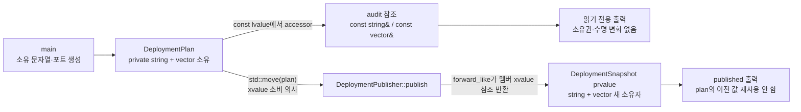

# 2026-09-15 — `std::forward_like` 소유권 경계와 트리 재루팅 DP

오늘은 C++23 **명시적 객체 매개변수(explicit object parameter, 흔히 deducing this)** 와 `std::forward_like`를 결합해, 한 접근자가 호출 객체의 `const`와 lvalue/rvalue 성질을 정확히 보존하는 방법을 배운다. 실무 예제의 `DeploymentPlan`은 서비스 이름과 포트 목록을 소유한다. 감사 경계에서는 그 값을 `const` 참조로 빌리고, 게시 경계에서는 명시적으로 plan을 소비해 새 snapshot으로 소유권을 옮긴다.

대회 문제는 [CSES 1133 - Tree Distances II](https://cses.fi/problemset/task/1133/)다. 한 루트에서 구한 거리 합과 각 서브트리 크기를 이용해 루트를 간선 하나 건너 옮길 때의 답을 `answer[child] = answer[parent] + n - 2 * subtree_size[child]`로 갱신한다. 재귀 대신 반복 DFS 순서와 역순을 사용해 `n=200,000` 사슬에서도 호출 스택을 보호한다.

## 오늘의 목표

1. `struct`와 `class`, 기본 타입, 중괄호 초기화, 접근 지정자, `using` 별칭, `explicit` 생성자, 멤버 초기화 목록을 실제 코드에서 읽는다.
2. `service(this Self&& self)`와 `ports(this Self&& self)`에서 `Self`가 어떻게 추론되고 `std::forward_like<Self>`가 하위 객체에 const성과 lvalue/rvalue 성질을 적용하는지 설명한다.
3. lvalue 관찰은 소유권을 옮기지 않는 참조, xvalue 소비는 뒤 이은 이동 생성의 입력이라는 점을 구분한다.
4. prvalue 반환과 C++17 보장 복사 생략, 이름 있는 지역 반환의 선택적 NRVO를 구별한다.
5. 트리 재루팅 점화식의 `+n-2s`를 정점 집합 두 부분으로 나누어 증명하고, 선형 시간·공간 구현을 완성한다.
6. 모든 표준 라이브러리 호출을 수신 상태, 오버로드, 인자, 반환, 사후 상태, 안전 조건의 여섯 항목으로 읽는다.

## 생성 파일

- [`main.cpp`](main.cpp): 값 범주를 보존하는 `DeploymentPlan` 접근자와 소유 snapshot 게시 경계
- [`problem.cpp`](problem.cpp): 같은 원리를 작은 generic box에 직접 적용하는 연습 예제
- [`icpc_problem.cpp`](icpc_problem.cpp): CSES 1133 제출 가능한 반복형 재루팅 DP 풀이
- [`CMakeLists.txt`](CMakeLists.txt): C++23 경고 빌드와 exact-output CTest 6개
- [`run_icpc_test.cmake`](run_icpc_test.cmake): 종료 코드와 전체 출력을 비교하는 공통 테스트 드라이버
- [`CHECKPOINT.md`](CHECKPOINT.md): 기초 문법, 값 범주, 표준 호출 계약, 재루팅 불변식 검증
- [`../algorithm/tree-rerooting-distance-sums.md`](../algorithm/tree-rerooting-distance-sums.md): 트리 거리 합 재루팅 DP 대표 문서

## `main.cpp` 구조도



핵심은 `std::forward_like` 호출 자체가 이동하지 않는다는 점이다. 왼쪽 경로에서는 같은 하위 객체를 가리키는 읽기 전용 참조만 얻는다. 오른쪽 경로에서도 먼저 xvalue 참조만 얻으며, 실제 값과 소유 상태 변화는 그 참조로 snapshot 멤버를 초기화할 때 선택된 이동 생성자가 수행한다. allocator 없는 vector 이동 전의 원소 관찰자는 과거 end를 제외하면 destination의 같은 원소를 계속 가리키지만, string의 문자 관찰자는 무효화될 수 있다. 문자열 버퍼 주소와 작은 문자열 표현은 단정하지 않는다.

## 초보자를 위한 코드 읽기

### 기본 타입·초기화·`struct`와 `class`

- `int`는 포트 번호 같은 정수 값을 저장하는 기본 타입이다. 오늘 값은 문제 도메인이 허용하는 양수로 준비하지만, C++의 `int` 크기와 범위는 구현에 따라 정해지므로 임의의 큰 합계에 쓰지 않는다.
- `object{...}` 중괄호 초기화는 초기화 대상을 눈에 보이게 하고 일부 narrowing 변환을 컴파일 오류로 막는다. `member_{}`는 기본값 초기화를 명시한다.
- `struct DeploymentSnapshot`의 멤버는 기본적으로 `public`이다. 단순한 결과 레코드처럼 모든 필드가 함께 유효하고 별도 불변식 보호가 필요 없을 때 적합하다.
- `class DeploymentPlan`의 멤버는 기본적으로 `private`이다. 생성자와 접근자를 통과해야만 상태를 다루게 해 소유권 전환 규칙을 한곳에 모은다.
- `using PortList = std::vector<int>`는 새 타입을 만드는 것이 아니라 긴 템플릿 형식에 읽기 쉬운 별칭을 붙인다. `std::vector<int>`의 템플릿 인자 `int`는 각 원소 타입이다.

### 함수·`const`·참조·포인터

함수 선언 앞의 타입은 반환형이고 괄호 안은 매개변수다. `publish(DeploymentPlan&& plan) const`의 rvalue reference는 호출자의 살아 있는 plan에 바인딩하며 별도 소유자를 만들지 않는다. 이 API는 그 plan의 멤버를 소비한다는 뜻을 시그니처에 드러낸다. 뒤 `const`는 함수가 `DeploymentPublisher` 자체 상태를 바꾸지 않음을 뜻한다.

`const DeploymentPlan&`는 기존 plan을 복사하지 않고 읽기 전용으로 빌린다. 참조는 별도 소유자가 아니며 원본 수명을 늘리지 않는다. 코드에 포인터가 등장한다면 `const T*` 역시 주소만 관찰하며 null 가능성까지 표현한다. 오늘 핵심 API는 null이 될 수 없는 참조를 사용하므로 원본이 먼저 파괴되거나 이동·재할당으로 하위 객체가 무효화되면 참조를 사용해서는 안 된다.

### `explicit`과 멤버 초기화 목록

생성자에 `explicit`를 붙이면 `DeploymentPlan plan = {"search-api", PortList{8080, 8443}};` 같은 copy-list-initialization을 허용하지 않고 직접 초기화를 요구한다. 생성자 본문에 들어오기 전에 `service_`와 `ports_`는 멤버 초기화 목록에서 직접 구성된다. 본문에서 기본 구성 후 대입하는 것과 다르며, 참조·`const` 멤버나 기본 생성 불가능한 멤버는 특히 초기화 목록이 필수다.

## 명시적 객체 매개변수와 `std::forward_like`

전통적인 접근자는 보통 다음 네 오버로드가 필요하다.

```cpp
T& value() &;
const T& value() const&;
T&& value() &&;
const T&& value() const&&;
```

C++23에서는 객체를 숨은 `this`가 아니라 `this Self&& self`라는 명시적 매개변수로 받을 수 있다. `Self`는 호출 식에 따라 추론되고, `std::forward_like<Self>(self.member_)`가 그 성질을 멤버에 투영한다.

정확히는 모델 `Self`에서 **const성과 lvalue/rvalue 범주만** 가져온다. `Self`의 `volatile`을 대상에 새로 붙이지는 않으며, 실제 멤버 식의 타입이 이미 가진 `const`/`volatile`은 보존한다. 따라서 여기서 “성질 투영”은 모든 cv 한정자를 복사한다는 뜻이 아니다.

| 호출 식 | 추론되는 `Self`의 핵심 성질 | 접근자 결과 | 의미 |
|---|---|---|---|
| `plan.service()` | mutable lvalue 참조 | `std::string&` | 수정 가능한 차용 |
| `read_only.service()` | const lvalue 참조 | `const std::string&` | 읽기 전용 차용 |
| `std::move(plan).service()` | mutable rvalue | `std::string&&` | 뒤 이동 생성에 쓸 수 있는 xvalue |
| `std::move(read_only).service()` | const rvalue | `const std::string&&` | const 때문에 일반 이동 생성자에는 맞지 않아 보통 복사 |

이름 있는 `self`는 선언 타입이 `Self&&`여도 식으로 쓰면 lvalue다. `self.service_` 역시 lvalue 식이므로 단순 반환은 rvalue 호출의 성질을 잃는다. `forward_like`가 필요한 이유가 여기에 있다.

반환형 `decltype(auto)`는 반환 식의 참조를 보존한다. 단순 `auto`라면 참조가 제거돼 매번 값 복사가 일어날 수 있다. 이 패턴은 접근 대상의 수명을 늘리지 않으므로 임시 plan에서 얻은 참조를 변수에 오래 저장하면 dangling이 된다. 소비 식 안에서 즉시 소유 객체를 구성해야 한다.

## 실제 식으로 보는 값 범주·복사·이동·수명

- 이름 있는 `plan`, `audit_view`, `publisher`, `published`는 모두 lvalue다.
- `DeploymentPlan{...}`와 `DeploymentSnapshot{...}` 같은 임시 객체 식, 값 반환 함수 호출은 prvalue다.
- `std::move(plan)`은 plan을 가리키는 xvalue를 만들 뿐 plan을 변경하지 않는다.
- `audit.service()` 결과는 `const std::string&` lvalue 참조다. 이를 다시 참조로 받으면 문자 버퍼를 복사하지 않는다.
- `std::move(plan).service()` 결과는 `std::string&&` xvalue 참조다. 이 결과로 새 `std::string`을 초기화할 때 비로소 이동 생성자가 선택될 수 있다.
- 이동된 `std::string`과 `std::vector`는 파괴하거나 새 값을 대입할 수 있는 유효하지만 값이 미지정된 상태다. 이전 내용이나 `size()==0`을 가정하지 않는다.
- `publish`가 `DeploymentSnapshot{...}` prvalue를 반환하면 C++17 이후 호출자 결과 객체를 직접 초기화하는 보장 복사 생략 대상이다. 이름 있는 `local`을 `return local;` 하는 NRVO는 허용되지만 필수로 단정할 수 없는 별도 규칙이다.
- 참조는 원본 수명을 소유하지 않는다. `const auto& bad = make_plan().service();`처럼 하위 객체 참조만 꺼내 full-expression 뒤에 저장하는 코드는 owner 수명과 참조 수명 규칙을 별도로 검토해야 한다.

## 실무에서 언제 쓰는가

값 범주 보존 접근자는 다음과 같이 “읽을 때는 복사하지 않고, 버릴 객체에서는 안전하게 자원을 회수”하는 API에 적합하다.

- 요청 builder를 검사한 뒤 최종 command 객체로 소비하는 경계
- 응답 envelope을 로깅하고 payload 소유권을 다음 계층으로 넘기는 경계
- immutable snapshot을 관찰하거나 일회성 publish 객체로 전환하는 경계
- 여러 cv/ref 접근자 구현이 반드시 같은 불변식을 유지해야 하는 generic wrapper

반대로 접근자가 내부 캐시를 갱신하거나, rvalue owner에서도 멤버를 외부에 오래 빌려주거나, 호출자가 참조 수명을 이해하기 어려운 공개 API라면 명시적인 `view()`와 `take()` 두 함수가 더 안전할 수 있다. 중복 제거보다 의미가 선명한 API가 우선이다.

## 기계 실행 관점

const lvalue 접근 경로는 최적화 후 owner 주소에서 하위 객체 주소를 계산하고, 문자열 길이와 vector 길이를 load한 뒤 출력 분기로 이어질 수 있다. rvalue 경로에서는 문자열·vector 제어 블록의 포인터·길이·용량 같은 상태를 새 객체에 load/store하고 원본을 유효한 이동 후 상태로 바꾸는 코드가 생성될 수 있다. `forward_like` 자체는 참조 cast라 런타임 명령이 사라질 가능성이 크지만 표준은 특정 레지스터 배치나 명령 수를 보장하지 않는다.

재루팅 풀이는 인접 목록과 parent/subtree/answer 배열의 load·store, 부모 간선 제외 비교, DFS stack의 push/pop, 역순 반복 분기를 수행한다. 실제 인라이닝, 분기 예측, 캐시 적중, vector 배치와 명령은 CPU, ABI, 표준 라이브러리 구현, 컴파일러 및 Debug/Release 최적화 옵션에 따라 달라 특정 어셈블리나 cycle 수로 단정하지 않는다.

## 오늘의 ICPC 문제

- ID·제목·공식 URL: [CSES 1133 - Tree Distances II](https://cses.fi/problemset/task/1133/)
- 출처: CSES Problem Set, Tree Algorithms
- 시간·메모리 제한: 1초, 512MB
- 입력: `n`과 `n-1`개의 무방향 간선. 정점 번호는 `1..n`이다.
- 출력: 각 정점 `1..n`에서 다른 모든 정점까지 거리의 합을 한 줄에 출력한다.
- 제약: `1 <= n <= 200,000`, `1 <= a,b <= n`; 입력은 트리다.
- 공식 예제: `1-2`, `1-3`, `3-4`, `3-5`일 때 답은 `6 9 5 8 8`이다.
- 핵심 알고리즘: 두 번의 트리 DP + rerooting, 반복 DFS 순서/역순
- 시간 복잡도: `O(n)`
- 공간 복잡도: `O(n)`
- 대표 문서: [`../algorithm/tree-rerooting-distance-sums.md`](../algorithm/tree-rerooting-distance-sums.md)

### 상태와 불변식

임의로 1번을 최초 루트로 정하고 `parent`와 부모가 자식보다 먼저 나오는 `order`를 만든다. `order`를 뒤에서 앞으로 보면 모든 자식 계산이 끝난 뒤 부모를 처리할 수 있다.

1. `subtree_size[u]`는 최초 루트 트리에서 `u`를 루트로 하는 서브트리 정점 수다.
2. 역순 계산이 끝난 뒤 `root_sum`은 1번에서 모든 정점까지 거리의 합이다.
3. 정순 재루팅 직전에 `answer[parent]`는 이미 정확하다.
4. 부모 `u`에서 자식 `v`로 기준을 옮기면 `v` 서브트리의 `s`개 정점은 각각 1 가까워지고 나머지 `n-s`개는 각각 1 멀어진다.
5. 따라서 `answer[v] = answer[u] - s + (n-s) = answer[u] + n - 2s`다.

각 간선은 DFS 순서 생성, 역순 집계, 정순 전파에서 상수 번만 본다. 합의 최댓값은 사슬에서 약 `n(n-1)/2`이므로 32비트 `int`를 넘는다. 거리 합과 점화식은 적어도 64비트 부호 있는 타입으로 계산한다.

### 정확성 요약

역순 귀납으로 자식들의 크기를 더한 `subtree_size[u]`가 정확하고, 각 정점 깊이를 한 번 더한 최초 `answer[1]`도 정확하다. 정순에서 부모 답이 정확하다고 가정하면 정점 집합은 자식 서브트리와 그 밖으로 정확히 분할된다. 간선을 건널 때 첫 집합 거리 총합은 `s` 줄고 둘째는 `n-s` 늘어나므로 점화식이 자식 답을 정확히 만든다. 1번부터 모든 정점은 유일한 부모 경로로 도달하므로 귀납이 전체 정점에 적용된다.

## 오늘 사용한 표준 라이브러리

각 행은 코드 첫 호출 바로 위의 더 구체적인 여섯 항목 계약 주석과 함께 읽는다.

| 핵심 심볼명 | 선언 헤더 | 항목 종류 | 실제 호출 멤버/함수 | 현재 코드에서의 역할과 대표 호출 계약 | 대표 문서 |
|---|---|---|---|---|---|
| `std::forward_like<T>(x)` | `<utility>` | C++23 함수 템플릿 | 접근자의 `std::forward_like<Self>(self.member_)` | referenceable 모델 `Self`의 const와 lvalue/rvalue 성질을 살아 있는 멤버 lvalue에 투영해 같은 객체를 alias하는 참조를 반환한다. 표준의 별도 Complexity 항목은 없고 지정 결과는 새 소유 저장소를 요구하지 않는 참조 cast이며 `noexcept`다. owner 파괴/무효화 뒤 참조 사용은 잘못이고 동기화를 제공하지 않는다. | [입출력·유틸리티](../standard-library/io-parsing-and-utilities.md) |
| `std::move(x)` | `<utility>` | 함수 템플릿 | plan과 소유 멤버의 소비 의사 표현 | 이름 있는 mutable lvalue를 같은 객체의 xvalue 참조로 cast해 반환한다. 별도 표준 Complexity 항목과 새 소유 저장소 요구가 없고 `noexcept`이며 상태를 바꾸지 않는다. 뒤 생성자가 실제 이동을 수행하고 이동 후 표준 객체의 값은 미지정이다. | [입출력·유틸리티](../standard-library/io-parsing-and-utilities.md) |
| `std::string` | `<string>` | 소유 문자 컨테이너·생성자·비교 | 서비스 이름과 연습 문자열 생성, 이동 구성 | 리터럴의 문자를 소유 저장소로 복사해 생성하며 길이에 선형, 할당/`bad_alloc` 가능이다. 오늘 선택한 allocator 인자 없는 이동 생성자는 상수 시간·`noexcept`지만 작은 문자열의 실제 복사 명령이나 저장 표현은 구현마다 다르며, 이동 전 문자 포인터·참조·반복자는 무효화될 수 있다. | [컨테이너·뷰](../standard-library/containers-and-views.md) |
| `std::vector<int>`, `vector::size` | `<vector>` | 클래스 템플릿·생성자·관찰자 | 포트 목록 중괄호 생성, `ports().size()` | int 원소를 연속 저장소에 소유한다. allocator 없는 이동 뒤 과거 end 이외의 원소 관찰자는 destination의 같은 원소를 계속 가리킨다. initializer-list 생성은 원소 수에 선형이고 할당/예외가 가능하며, `size() const noexcept`은 O(1) 길이를 반환하고 상태·관찰자를 바꾸지 않는다. | [컨테이너·뷰](../standard-library/containers-and-views.md) |
| `std::cin`, `std::cout` | `<iostream>` | 표준 stream 객체 | 입력 source와 출력 sink | 프로그램 시작 전에 준비된 전역 `istream`/`ostream` 객체를 lvalue로 사용한다. 코드는 소유권을 얻지 않고 각 연산이 같은 객체의 위치·상태를 이어서 바꾼다. | [입출력·유틸리티](../standard-library/io-parsing-and-utilities.md) |
| `std::ios_base::sync_with_stdio`, `std::basic_ios::tie` | `<ios>` (`<iostream>`이 포함) | 정적 함수·stream 멤버 | `std::ios::sync_with_stdio(false)`, `std::cin.tie(nullptr)` | 첫 I/O 전에 C/C++ 동기화를 끄고 cin의 tie를 제거한다. 이전 bool/포인터 반환값은 버리며 전역/stream 상태가 바뀐다. 이후 C stdio 혼용 순서와 자동 flush에 기대지 않고 동시 설정 변경을 하지 않는다. | [입출력·유틸리티](../standard-library/io-parsing-and-utilities.md) |
| `std::basic_istream::operator>>(int&)` | `<istream>` (`<iostream>`이 포함) | 입력 stream 멤버 | `std::cin >> n`, 간선 끝점 정수 추출 | 정상 `istream` lvalue와 살아 있는 `int` lvalue를 받아 문자를 소비하고 같은 stream 참조를 반환한다. 연쇄가 반환을 사용하며 성공 시 값/위치, 실패 시 상태 비트가 바뀐다. 표준의 공통 점근 상한은 없고 설정된 mask에서는 `ios_base::failure`가 가능하다. | [입출력·유틸리티](../standard-library/io-parsing-and-utilities.md) |
| 정수용 `std::basic_ostream::operator<<`, `operator<<(std::ostream&, char)`, C-string·`std::string`용 비멤버 `operator<<` | `<ostream>`, `<string>` (`<iostream>`이 `<ostream>` 포함) | 출력 stream 멤버·비멤버 | `std::cout <<` 정수·문자·C 문자열·`std::string` 출력 | 살아 있는 `ostream` lvalue와 빌린 값을 받아 문자를 기록하고 같은 `ostream&`를 반환한다. 연쇄의 다음 삽입이 반환을 사용하고 마지막 결과는 버린다. stream 상태/위치가 바뀌며 공통 점근 상한은 없고 실패 비트 또는 설정된 예외가 가능하다. synchronized 표준 stream은 동시 형식 출력에 data race가 없지만 문자가 섞일 수 있고, ICPC 코드처럼 동기화를 끈 뒤에는 그 예외 보장을 쓸 수 없다. | [입출력·유틸리티](../standard-library/io-parsing-and-utilities.md) |
| `std::vector<T>`의 기본 생성자·count 생성자·fill 생성자와 관찰·변경 연산 | `<vector>` | 컨테이너·생성자·멤버 함수 | `vector::operator[]`, `vector::reserve`, `vector::push_back`, `vector::size`, `vector::empty`, `vector::back`, `vector::pop_back` | 각 vector는 원소와 저장소를 소유한다. 기본 생성자는 빈 상태를 만들고 count 생성자는 지정 개수, fill 생성자는 지정 개수의 복사값을 만든다. `push_back`은 끝에 원소를 추가해 `void`, `back`은 비지 않은 마지막 원소 참조, `pop_back`은 그 원소를 제거해 `void`, `size`/`empty`는 길이 정보를 반환한다. `reserve`/삽입 재할당은 기존 참조·포인터·반복자를 무효화하며 빈 back/pop과 범위 밖 첨자는 UB다. | [컨테이너·뷰](../standard-library/containers-and-views.md) |
| `std::int64_t`, `std::size_t` | `<cstdint>`, `<cstddef>` | 정수 타입 별칭 | 거리 합/점화식, 컨테이너 길이와 인덱스 | 고정 폭 64비트 정수는 구현이 제공할 때 정확히 64비트이고 오늘 최대 거리 합을 담는다. `size_t`는 크기를 나타내는 부호 없는 타입이라 음수 sentinel과 섞지 않는다. signed overflow는 UB이므로 제약으로 범위를 먼저 증명한다. | [비트·바이트](../standard-library/bit-and-byte-utilities.md) |

최종 소스에서 실제 추출되는 전체 심볼·헤더 집합은 [`../standard-library/by-date.md`](../standard-library/by-date.md)의 2026-09-15 행에서 확인한다. 비슷한 새 문서를 만들지 않고 기존 대표 문서에 `forward_like`와 string/vector 이동 관찰자 계약을 멱등적으로 보강했다.

## 검증 계획과 재현

CMake는 학습 예제 두 개와 ICPC 네 경계를 exact-output으로 검사한다.

| 테스트 | 기대 출력 | 검증 경계 |
|---|---|---|
| `daily_main_runs` | `audit=search-api:2` / `published=search-api:2` | const lvalue borrow와 rvalue consume이 같은 논리 값을 전달 |
| `daily_problem_runs` | `copied=trace` / `moved=trace` | lvalue 복사와 xvalue 이동 결과 소유 |
| `tree_distances_official` | `6 9 5 8 8` | CSES 공식 예제와 일반 분기 트리 |
| `tree_distances_single_vertex` | `0` | 간선·자식이 없는 최소 입력 |
| `tree_distances_chain` | `6 4 4 6` | 깊은 사슬, 양 끝·가운데 대칭 |
| `tree_distances_star` | `4 7 7 7 7` | 큰 서브트리/작은 서브트리 재루팅 |

저장소 루트의 PowerShell에서 다음을 실행한다.

```powershell
$kit = (Resolve-Path tools/w64devkit/bin).Path
$env:Path = "$kit;$env:Path"
cmake -S dailystudy/exercise/2026-09-15 -B build/daily-2026-09-15 -G "MinGW Makefiles" -DCMAKE_BUILD_TYPE=Release "-DCMAKE_CXX_COMPILER=g++.exe"
cmake --build build/daily-2026-09-15 --parallel
ctest --test-dir build/daily-2026-09-15 --output-on-failure
powershell -ExecutionPolicy Bypass -File dailystudy/exercise/tools/audit-standard-library-docs.ps1 -Scope all
```

`build/`는 생성물이며 커밋하지 않는다. 추가로 작은 무작위 트리를 생성해 각 출발점 BFS 거리 합과 재루팅 결과를 비교하고, 최대 사슬·별 입력으로 시간·호출 스택·64비트 범위를 확인한다.

## 직접 해보기

1. `service()` 또는 `content()` 반환형을 `auto`로 바꾸고 const lvalue 호출이 왜 값을 복사하는지 타입과 출력으로 확인한다.
2. `std::forward_like<Self>`를 제거하고 `self.service_`를 그대로 반환했을 때 rvalue 호출의 반환형이 무엇인지 설명한다.
3. rvalue 접근 결과를 참조 변수에 저장한 뒤 owner를 파괴하는 예를 만들고, 참조를 사용하지 않은 상태에서 왜 위험한지만 설명한다.
4. `publish`의 `DeploymentPlan&&` 매개변수를 `const DeploymentPlan&`로 바꾸어 이동이 복사로 바뀌는 지점을 찾는다.
5. 재루팅 점화식의 `-2 * subtree_size[v]`를 `-subtree_size[v]`로 바꾸고 chain/star 테스트 중 무엇이 어떻게 실패하는지 계산한다.
6. 반복 DFS를 재귀 DFS로 바꿀 때 `n=200,000` 사슬에서 표준이 호출 스택 크기를 보장하지 않는 이유를 말한다.

`CHECKPOINT.md`를 자료 없이 풀고, 수정 실기 뒤에도 6개 CTest와 전체 표준 라이브러리 감사를 통과하면 오늘 학습을 완료한다.
