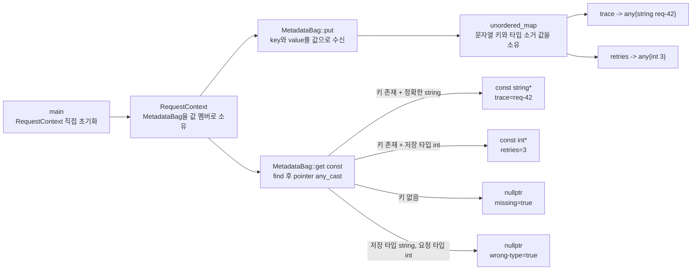

# 2026-09-16 — `std::any` 소유 타입 소거와 min-plus 행렬 지수승

오늘은 서로 타입이 다른 요청 메타데이터를 하나의 저장소에 넣는 실무 경계를 `std::any`로 만든다. `RequestContext`는 문자열 키를 소유하고, 각 `std::any`는 `std::string` 또는 `int` 값을 값으로 소유한다. 조회는 던지는 값 반환 대신 포인터 `std::any_cast`를 사용해 **키 누락**과 **저장 타입 불일치**를 모두 `nullptr`로 처리한다.

대회 문제는 [CSES 1724 - Graph Paths II](https://cses.fi/problemset/task/1724/)다. 방향 가중 그래프의 인접 행렬을 min-plus 대수의 행렬로 보고 이진 지수승하여, 1번 정점에서 n번 정점까지 **정확히 k개 간선**을 쓰는 walk의 최소 비용을 구한다.

## 오늘의 목표

1. 기본 타입, 중괄호 초기화, 함수의 반환형·매개변수, `const`, 포인터·참조, `class`의 접근 지정자, `explicit`, 멤버 초기화 목록, `using` 별칭과 템플릿 인자를 실제 코드에서 읽는다.
2. `std::any`가 구체 타입을 숨기면서도 값을 소유하는 방식과, `typeid` 일치 조회가 암시 변환을 하지 않는 이유를 설명한다.
3. 포인터 `std::any_cast<T>(&value)`의 성공/실패, 반환 포인터의 비소유 수명, `unordered_map` 갱신과 무효화 경계를 구분한다.
4. lvalue 복사는 원본과 독립된 contained object를 만들고, xvalue 이동은 contained 값을 이전하거나 같은 타입 값을 rvalue에서 구성하지만 원본 `any`가 자동으로 비는 것은 보장하지 않음을 증명한다.
5. lvalue/prvalue/xvalue, 참조 바인딩, 객체 수명, 복사/이동, C++17 보장 복사 생략과 선택적 NRVO를 오늘의 식에 연결한다.
6. min-plus 곱셈의 정확한 간선 수 불변식과 이진 지수승 불변식으로 `O(n^3 log k)` 시간, `O(n^2)` 공간 풀이를 증명한다.

## 생성 파일

- [`main.cpp`](main.cpp): `RequestContext`와 `MetadataBag`을 이용한 소유형 요청 메타데이터 저장·조회
- [`problem.cpp`](problem.cpp): `std::any`의 깊은 복사, 이동, 포인터 캐스팅, 명시적 `reset()` 연습
- [`icpc_problem.cpp`](icpc_problem.cpp): CSES 1724 제출 가능한 min-plus 행렬 이진 지수승 풀이
- [`CMakeLists.txt`](CMakeLists.txt): C++23 경고 빌드와 exact-output CTest 등록
- [`run_icpc_test.cmake`](run_icpc_test.cmake): 종료 코드와 stdout 전체를 비교하는 테스트 드라이버
- [`CHECKPOINT.md`](CHECKPOINT.md): 기초 문법, `std::any` 계약, 값 범주, min-plus 정확성 자가 검증
- [`../algorithm/min-plus-matrix-exponentiation.md`](../algorithm/min-plus-matrix-exponentiation.md): min-plus 행렬 거듭제곱 대표 문서

## `main.cpp` 구조도



`MetadataBag`은 키와 값을 복사해 밖에 빌리는 저장소가 아니라 둘을 직접 소유한다. 반대로 `get<T>`가 돌려주는 `const T*`는 contained object를 가리키는 비소유 포인터다. 그 포인터를 사용하는 동안 같은 키를 덮어쓰거나 해당 `any`를 `reset`·삭제하거나 bag을 파괴하면 안 된다.

## 초보자를 위한 코드 읽기

### 헤더·기본 타입·중괄호 초기화

- `<any>`는 `std::any`와 `std::any_cast`, `<unordered_map>`은 해시 맵, `<string>`은 소유 문자열, `<utility>`는 `std::move`, `<iostream>`은 `std::cout`과 출력 연산을 선언한다.
- `int`는 오늘 재시도 횟수와 정점 수처럼 제약 안의 정수를 저장한다. `bool`은 누락·타입 불일치·reset 완료 여부를 표현한다. `std::int64_t` 별칭인 `Cost`는 최대 `10^18`까지 가능한 누적 비용과 지수를 담는다.
- `object{...}` 직접 목록 초기화는 생성할 타입과 인자를 드러내고 일부 narrowing 변환을 컴파일 오류로 막는다. `int retries{3}`처럼 기본 타입에도 같은 규칙을 적용할 수 있다.
- `std::string{"trace"}`는 문자열 리터럴을 읽어 자기 문자 저장소를 가진 문자열 prvalue를 만든다. 리터럴 자체는 정적 저장 기간의 `const char[N]` 배열이고, 문자열 객체와 같은 소유자가 아니다.

### `class`, 접근 지정자, `using`, 템플릿 인자

`class MetadataBag`은 기본 접근이 `private`이므로 `values_`를 외부에서 직접 깨뜨릴 수 없다. `public`의 `put`과 `get`만 저장 정책을 통과시킨다. `struct`는 기본 접근이 `public`이라는 차이가 있지만, 단순히 “class는 기능, struct는 데이터”라는 언어 규칙이 있는 것은 아니다.

`using Storage = std::unordered_map<std::string, std::any>;`는 새 타입을 만드는 것이 아니라 긴 기존 타입에 별칭을 붙인다. 첫 템플릿 인자 `std::string`은 key type, 둘째 `std::any`는 mapped type이다. `put<std::string>`과 `get<int>`의 명시적 템플릿 인자는 각각 저장하거나 조회할 구체 타입 `T`를 정한다.

### 함수·`const`·포인터와 참조

- `void put(std::string key, T value)`의 `void`는 별도 결과값이 없다는 반환형이고, 두 값 매개변수는 호출자 인자에서 함수의 지역 소유 객체를 초기화한다.
- `const T* get(const std::string& key) const`의 매개변수는 문자열을 복사하지 않고 읽기 전용으로 빌린다. 함수 뒤의 `const`는 조회 중 `MetadataBag`의 논리 상태를 바꾸지 않는다는 뜻이다.
- 반환형 `const T*`는 `T`를 수정할 수 없는 주소이며 `nullptr`도 표현한다. 포인터는 소유권이나 원본 수명을 늘리지 않는다. `if (trace != nullptr)`처럼 검사한 경로에서만 역참조한다.
- 참조는 기존 객체의 별칭이고 정상적인 바인딩 뒤 null 상태를 모델링하지 않는다. `const std::string& key`의 대상은 호출 동안 살아 있어야 한다.

### `explicit`과 멤버 초기화 목록

`explicit MetadataBag(size_type expected_entries)`와 `explicit RequestContext(...)`는 인자 하나가 해당 사용자 타입으로 뜻밖에 암시 변환되는 일을 막는다. 직접 초기화 `MetadataBag bag{4};`는 허용되지만, `MetadataBag bag = 4;` 같은 copy-initialization은 허용되지 않는다.

멤버 초기화 목록은 생성자 본문보다 먼저 멤버를 직접 구성한다. 실제 초기화 순서는 목록에 적은 순서가 아니라 클래스 안의 멤버 선언 순서다. 생성자 본문에서 `reserve`를 호출하는 시점에는 `values_`의 수명이 이미 시작되어 빈 유효 map이다.

### 제어문과 실제 분기

`if (found == values_.end())`는 키가 없을 때 즉시 `nullptr`를 반환해 존재하지 않는 iterator를 역참조하지 않는다. `condition ? "true" : "false"` 조건 연산자는 `bool`에 따라 두 문자열 리터럴 중 하나만 선택한다. 오늘 코드는 `std::boolalpha`로 stream의 지속 형식 상태를 바꾸지 않고 exact output을 만든다.

## `std::any`: 값을 소유하는 타입 소거

`std::any`는 CopyConstructible인 구체 값 하나 또는 빈 상태를 표현하는 어휘 타입이다. 타입 소거는 호출자가 `std::any` 자체의 크기와 공통 API만 알게 하고, 실제 contained type과 그 저장 전략은 객체 내부에 감춘다. 그렇다고 저장된 타입이 사라지는 것은 아니다. 런타임 타입 식별 정보가 남아 있어 `any_cast<T>`는 요청한 `T`와 저장 타입을 검사한다.

오늘의 `std::any{std::move(value)}`는 `put<std::string>`에서는 `std::string`, `put<int>`에서는 `int`를 각각 **값으로 소유**한다. 원래 지역 변수나 문자열 리터럴의 주소를 빌리는 것이 아니다. `MetadataBag`이 파괴되면 map 원소가 파괴되고, 각 `any`가 contained object의 소멸자를 실행한다.

### 저장 타입 일치 규칙

- `any_cast<std::string>`은 저장 타입이 `std::string`일 때 성공한다.
- 같은 값이 숫자로 변환 가능하더라도 `any_cast<long>`은 저장 타입 `int`에 성공하지 않는다. `any_cast`는 산술 변환이나 사용자 정의 변환을 시도하지 않는다.
- pointer overload는 `operand->type() == typeid(T)`를 기준으로 삼고 `typeid`는 최상위 cv를 구별하지 않는다. 따라서 `int`가 든 mutable `any`에 `any_cast<const int>(&value)`를 호출하면 `const int*`를 얻을 수 있지만, 이는 `int`에서 다른 값 타입으로 변환한 것이 아니다.
- 문자열 내용이 같아도 저장 타입이 `const char*`라면 `std::string` 조회와 다르다. 오늘은 저장 경계에서 명시적으로 `std::string`을 만든다.
- `using Trace = std::string`처럼 단순 별칭은 별도 타입이 아니므로 원래 타입과 동일하다. 반면 강한 사용자 정의 wrapper는 다른 타입이다.

값 반환 `std::any_cast<T>(value)`는 불일치 시 `std::bad_any_cast`를 던질 수 있다. 오늘이 사용하는 포인터 overload `std::any_cast<T>(&value)`는 저장 타입과 `typeid(T)`가 일치하면 contained object의 포인터, 아니면 `nullptr`를 반환하며 타입 불일치를 예외로 만들지 않는다. 키 누락과 타입 불일치는 둘 다 null이지만, 코드는 `find` 단계와 `any_cast` 단계를 나눠 원인을 구분할 수 있다.

### 실무 선택과 한계

`std::any`는 플러그인 메타데이터, 요청 context, 테스트 fixture처럼 값 종류가 열린 경계에 유용하다. 하지만 가능한 타입이 작고 닫힌 집합이면 `std::variant`가 대안별 처리를 컴파일 시간에 드러낸다. 필수 필드가 정해진 도메인이라면 이름 있는 `struct`가 누락과 오타를 더 일찍 잡는다.

타입 소거는 구체 타입별 연산까지 공통화하지 않는다. 값을 사용하려면 약속한 타입으로 다시 꺼내야 하며, 문자열 키 오타와 타입 불일치는 런타임에 발견된다. contained object의 저장에 heap 할당이 필요한지는 타입 크기·정렬, 구현의 내부 최적화와 allocator 동작에 따라 달라지므로 “`std::any`는 항상 할당한다” 또는 “항상 무할당이다”라고 단정하지 않는다.

## 실제 식으로 보는 값 범주·복사·이동·수명

- 이름 있는 `context`, `key`, `value`, `source`, `copied`, `moved`, `found`는 선언 타입과 관계없이 식으로 쓰면 lvalue다.
- `std::string{"trace"}`, `std::string{"req-42"}`, `std::any{std::move(value)}`, 정수 리터럴 `3`은 prvalue다.
- `std::move(key)`, `std::move(value)`, `std::move(source)`는 같은 객체를 가리키는 xvalue다. `std::move` 호출 자체는 상태를 바꾸지 않고, 뒤 생성자나 대입이 실제 이동을 수행한다.
- `const auto found{values_.find(key)}`는 iterator 값을 지역 객체로 복사해 보관한다. `found->second`는 map 원소의 mapped `std::any` lvalue이고, 그 주소는 `const std::any*`로 포인터 `any_cast`에 전달된다.
- `std::any copied{source}`는 non-const lvalue `source`에서 copy constructor를 선택한다. contained `std::string`도 복사 구성되므로 `copied`는 원본과 독립된 문자열 값을 소유한다.
- `std::any moved{std::move(source)}`는 xvalue에서 move constructor를 선택한다. `moved`가 이전 논리 값을 갖지만 표준은 이동 뒤 `source`가 자동으로 비었다고 보장하지 않는다. 따라서 예제는 `source.reset()`을 별도로 호출한 뒤 `!source.has_value()`를 검사해 `source-reset=true`를 출력한다.
- `std::any_cast<T>(&found->second)`가 반환한 포인터는 새 `T`를 만들지 않는다. contained object를 가리키는 별칭이므로 같은 mapped `any`의 덮어쓰기·`reset`·삭제 또는 owner 파괴 뒤에는 사용할 수 없다.

`put` 호출에 넘긴 같은 타입의 prvalue는 최종 값 매개변수를 직접 초기화할 수 있다. 그 뒤 이름 있는 매개변수는 lvalue이므로 `std::move`로 xvalue 의사를 복원한다. C++17의 prvalue 직접 초기화는 필수 복사 생략 규칙의 적용 대상이 될 수 있지만, `return local;`처럼 이름 있는 지역 객체를 반환하는 NRVO는 별도의 허용 최적화다. 오늘 `get`은 포인터를 반환하고, ICPC 곱셈은 output reference를 채우므로 이 두 경로의 정확성은 RVO에 의존하지 않는다.

## 기계 실행 관점

해시 조회는 개념적으로 문자열 해시 계산, bucket 선택, 후보 key 비교와 조건 분기를 수행한다. 성공 뒤 `any_cast`는 저장된 런타임 타입 정보를 요청 타입과 비교해 contained object 주소 또는 null을 선택할 수 있다. 실제 해시 구현, small-object 저장, load/store 수, 분기 배치와 인라이닝은 표준이 고정하지 않는다.

`std::any` 복사는 contained type의 복사 동작을 수행하고, 이동은 내부 저장 표현을 이전하거나 같은 타입 값을 rvalue에서 구성할 수 있다. 구현은 함수 포인터나 관리 테이블 같은 간접 호출을 사용할 수 있지만 특정 가상 함수, 객체 레이아웃 또는 call 명령 수를 보장하지 않는다. 문자열이 내부 버퍼를 넘기는지 문자를 옮기는지도 구현과 실제 표현에 따라 달라질 수 있다.

min-plus 곱은 평탄 vector에서 비용을 load하고 INF와 compare해 도달 불가능 조합을 건너뛴다. 유효한 조합은 overflow guard, 64비트 add, 현재 최솟값 비교와 조건부 store를 수행할 수 있다. 실제 캐시 적중, 벡터화, 분기 예측과 명령 선택은 CPU·ABI·컴파일러·표준 라이브러리 구현·Debug/Release 최적화 옵션에 따라 달라진다.

## 오늘의 ICPC 문제

- ID·제목·공식 URL: [CSES 1724 - Graph Paths II](https://cses.fi/problemset/task/1724/)
- 출처: CSES Problem Set, Mathematics
- 시간·메모리 제한: 1초, 512MB
- 입력: 정점 수 `n`, 방향 간선 수 `m`, 정확한 간선 수 `k`; 이어 `a -> b` 간선과 양의 비용 `c`
- 출력: 1번에서 n번까지 정확히 k개 간선을 쓰는 최소 비용, 불가능하면 `-1`
- 제약: `1 <= n <= 100`, `1 <= m <= n(n-1)`, `1 <= k <= 10^9`, `1 <= a,b <= n`, `1 <= c <= 10^9`
- 핵심 알고리즘: min-plus 행렬 곱셈 + 이진 지수승
- 시간 복잡도: `O(n^3 log k)`
- 공간 복잡도: `O(n^2)`
- 대표 문서: [`../algorithm/min-plus-matrix-exponentiation.md`](../algorithm/min-plus-matrix-exponentiation.md)

### 상태 정의와 min-plus 불변식

인접 행렬 `A`에서 `A[i][j]`는 `i -> j` 평행 간선 중 최소 비용이고, 없으면 `INF`다. 따라서 `A`는 정확히 한 간선을 쓰는 최소 비용 표다. 대각선을 임의로 0으로 두지 않는다. 입력에 실제 self-loop가 없다면 정확히 한 간선의 `i -> i` walk도 없기 때문이다.

min-plus 곱은 다음과 같다.

```text
(X ⊗ Y)[i][j] = min over p of (X[i][p] + Y[p][j])
```

`X[i][p]`가 정확히 `x`개 간선, `Y[p][j]`가 정확히 `y`개 간선의 최소 비용이라면, 경계 정점 `p`에서 둘을 이어 정확히 `x+y`개 간선을 만든다. 모든 `p` 중 최소를 택하므로 `X ⊗ Y`는 그 간선 수의 최소 비용이다. 이 사실을 귀납하면 `A^k`의 `[0][n-1]`이 문제의 답이다.

min-plus 항등행렬 `I`는 대각선 0, 나머지 `INF`다. 이는 같은 정점으로 가는 길이 0 walk만 존재한다는 뜻이므로 `I ⊗ X = X ⊗ I = X`가 된다.

### 이진 지수승 불변식과 정확성

반복 시작과 끝에서 다음 불변식을 유지한다.

```text
result ⊗ power^exponent = 처음의 A^k
```

처음 `result=I`, `power=A`, `exponent=k`이므로 성립한다. 지수의 최하위 비트가 1이면 `result`에 현재 `power`를 곱해 그 비트의 간선 블록을 선택한다. 그 뒤 지수를 2로 나누고 `power`를 제곱하면 남은 비트가 뜻하는 거듭제곱 관계가 유지된다. 종료 시 `exponent=0`이므로 `result=A^k`다.

코드는 같은 방향 평행 간선 중 최소 비용만 남긴다. 정점이나 간선을 다시 방문하는 walk를 허용하므로 단순 경로 알고리즘으로 바꾸면 안 된다. `Cost`는 64비트 부호 있는 정수이고 가능한 비용 상한은 `k*c <= 10^18`이다. `INF=4*10^18`을 사용하고 덧셈 전에 `left > INF-right`를 검사해 signed overflow라는 미정의 동작을 피한다.

한 번의 곱은 세 중첩 반복으로 `O(n^3)`, 지수는 매번 절반이 되어 곱 횟수는 `O(log k)`다. `power/result/scratch`처럼 상수 개의 `n*n` 평탄 행렬만 유지하므로 총 공간은 `O(n^2)`다. `vector::swap`으로 계산 완료 저장소를 교환해 매 반복의 원소별 결과 복사를 피한다.

## 오늘 사용한 표준 라이브러리

각 행의 요약은 코드 첫 호출 바로 위에 있는 여섯 항목 계약 주석과 함께 읽는다.

| 핵심 심볼명 | 선언 헤더 | 항목 종류 | 실제 호출 멤버/함수 | 현재 코드에서의 역할과 대표 호출 계약 | 대표 문서 |
|---|---|---|---|---|---|
| `std::any` | `<any>` | 소유 어휘 타입·생성자·관찰/변경 멤버 | converting/copy/move constructor, `reset()`, `has_value()` | 구체 `string`/`int`를 값으로 소유한다. 복사는 contained object의 독립 복사를 만들고, 이동은 contained 값을 이전하거나 같은 타입 값을 rvalue에서 구성하며 source가 빈다는 보장은 없다. converting/copy 경로는 contained type과 저장 전략에 따라 할당·예외가 가능하고 move constructor는 `noexcept`다. `reset()`은 contained object를 파괴해 빈 상태로 만들며 `has_value()`는 상태를 바꾸지 않고 bool을 반환한다. | [소유권·어휘 타입](../standard-library/ownership-and-vocabulary-types.md) |
| `std::any_cast<T>(pointer)` | `<any>` | 함수 템플릿, pointer overload | `std::any_cast<T>(&found->second)`, copied/moved 조회 | 수신 객체가 없는 자유 함수다. 살아 있는 `any*`/`const any*`를 빌리고 저장 타입과 `typeid(T)`가 일치하면 contained object 포인터, 아니면 null을 반환한다. 이 비교는 최상위 cv를 구별하지 않는다. 값을 복사·이동하거나 상태를 바꾸지 않고 pointer overload는 타입 불일치로 던지지 않는다. 반환 포인터는 contained object 교체·reset·파괴 전까지만 유효하다. | [소유권·어휘 타입](../standard-library/ownership-and-vocabulary-types.md) |
| `std::unordered_map<std::string, std::any>` | `<unordered_map>` | 해시 연관 컨테이너·클래스 템플릿 | 기본 생성, `reserve`, `insert_or_assign`, `find`, `end`, iterator `operator->`/비교 | key와 any를 원소로 소유한다. `reserve`는 예상 원소 수에 맞춰 rehash할 수 있다. 삽입/조회는 평균 O(1), 최악 O(size)이고 rehash는 iterator를 무효화하지만 원소 reference/pointer는 유지한다. 기존 key에 assign하면 그 mapped any의 과거 contained 포인터는 무효다. 할당·hash/equality·contained construction 예외가 가능하며 같은 map의 동시 변경은 동기화해야 한다. | [컨테이너·뷰](../standard-library/containers-and-views.md) |
| `std::string` | `<string>` | 소유 문자 컨테이너·생성자 | key/trace/value 문자열 생성, 값 매개변수와 map key 이동 | 리터럴의 NUL 전 문자들을 읽어 독립 저장소를 소유한다. 생성·복사는 문자 수에 선형이고 할당 실패가 가능하다. allocator 인자 없는 이동은 상수 시간이고 source는 유효하지만 값은 미지정이며, 문자 관찰자의 이동 후 유효성을 임의로 가정하지 않는다. | [컨테이너·뷰](../standard-library/containers-and-views.md) |
| `std::move(x)` | `<utility>` | 함수 템플릿 | key/value/source를 이동 입력으로 표시 | 이름 있는 lvalue를 같은 객체를 가리키는 xvalue 참조로 cast한다. 반환 참조는 즉시 뒤 생성·대입에 사용하고, 호출 자체는 상태 변경·할당·예외가 없다. 실제 이동 후 상태는 선택된 string/any 연산 계약을 따른다. | [입출력·유틸리티](../standard-library/io-parsing-and-utilities.md) |
| `std::vector<Cost>` | `<vector>` | 연속 컨테이너·클래스 템플릿 | fill constructor, 감사 분류상의 기본 생성자, const/non-const `operator[]`, `swap` | 평탄 `n*n` 행렬을 소유한다. fill 생성은 O(n²) 시간·공간과 할당 가능성이 있고, `operator[]`는 O(1)·무검사라 범위 밖이면 UB다. 기본 allocator가 같은 vector의 `swap`은 O(1)로 저장소를 교환하며 원소 관찰자는 원소를 계속 가리키지만 소속 컨테이너가 바뀌고 과거 end는 보장되지 않는다. 실제 `cells_`는 생성자 초기화 목록에서 fill 생성되며 기본 생성되지는 않는다. | [컨테이너·뷰](../standard-library/containers-and-views.md) |
| `std::cin`, `std::cout`와 stream `operator>>`/`operator<<` | `<iostream>` (`<istream>`, `<ostream>`) | 표준 stream 객체·입출력 연산 | `std::cin >> n >> m >> k`, `std::cout << value`, `operator<<(std::ostream&, char)` | 각 `operator>>`/`operator<<`는 같은 stream reference를 반환해 연쇄하고 마지막 반환은 버린다. 입력은 대상 lvalue와 stream 위치/상태를, 출력은 buffer 위치/상태를 바꾼다. 공통 점근 상한은 없고 실패 비트 또는 exception mask에 따른 `ios_base::failure`가 가능하다. 값 소유권은 이동하지 않는다. | [입출력·유틸리티](../standard-library/io-parsing-and-utilities.md) |
| `std::ios_base::sync_with_stdio`, `std::basic_ios::tie` | `<ios>` (`<iostream>`이 포함) | 정적 함수·stream 멤버 | `std::ios::sync_with_stdio(false)`, `std::cin.tie(nullptr)` | 첫 I/O 전에 C/C++ 동기화를 끄고 cin의 비소유 tie를 해제한다. 이전 bool/ostream pointer 반환은 버린다. 이후 C stdio 혼용 순서와 입력 전 자동 flush에 기대지 않으며 같은 stream을 여러 스레드가 동시에 조작하지 않는다. | [입출력·유틸리티](../standard-library/io-parsing-and-utilities.md) |
| `std::int64_t`, `std::size_t` | `<cstdint>`, `<cstddef>` | 정수 타입 별칭 | `Cost`, 행렬 지수·비용, map/vector 크기·평탄 인덱스 | `int64_t`는 구현이 제공할 때 정확히 64비트인 부호 있는 타입이고 오늘의 `10^18` 상한을 담는다. `size_t`는 객체 크기와 컨테이너 인덱스용 부호 없는 타입이다. signed overflow는 UB이므로 sentinel 덧셈 전에 범위를 검사한다. | [비트·바이트](../standard-library/bit-and-byte-utilities.md) |

최종 소스에서 추출된 전체 심볼·헤더 집합은 감사 스크립트가 갱신한 [`../standard-library/by-date.md`](../standard-library/by-date.md)의 2026-09-16 행에서 확인할 수 있다. 같은 주제의 새 문서를 중복 생성하지 않고 기존 대표 문서에 필요한 계약을 보강했다.

## 검증 결과와 재현

아래 테스트를 GCC 16.1.0과 C++23으로 실제 실행했으며 모두 통과했다.

| 테스트 | 기대 출력 | 확인할 경계 |
|---|---|---|
| `daily_main_runs` | `trace=req-42` / `retries=3` / `missing=true` / `wrong-type=true` | 두 저장 타입 일치, 키 누락, 기존 key의 타입 불일치 |
| `daily_problem_runs` | `copied=trace` / `moved=trace` / `source-reset=true` | lvalue 깊은 복사, xvalue 이동 결과, 명시적 `reset()` 뒤 빈 상태 |
| `graph_paths_official` | `27` | CSES 공식 예제와 k=8 지수승 |
| `graph_paths_parallel_exact_length` | `7` | 평행 간선 최소화와 “정확히 2개” 제약 |
| `graph_paths_unreachable_length` | `-1` | 목적지는 연결돼도 정확한 길이 walk가 없는 경우 |
| `graph_paths_large_k_cycle` | `5499999996` | 큰 홀수 k의 모든 비트와 64비트 누적 비용 |

저장소 루트의 PowerShell에서 다음 순서로 재현할 수 있다.

```powershell
$kit = (Resolve-Path tools/w64devkit/bin).Path
$env:Path = "$kit;$env:Path"
cmake -S dailystudy/exercise/2026-09-16 -B build/daily-2026-09-16 -G "MinGW Makefiles" -DCMAKE_BUILD_TYPE=Release "-DCMAKE_CXX_COMPILER=g++.exe"
cmake --build build/daily-2026-09-16 --parallel
ctest --test-dir build/daily-2026-09-16 --output-on-failure
powershell -ExecutionPolicy Bypass -File dailystudy/exercise/tools/audit-standard-library-docs.ps1 -Scope all
git diff --check
```

CTest의 6개 exact-output 테스트가 모두 통과했고, 세 실행 파일은 높은 경고 설정과 `-Werror`에서도 컴파일됐다. 작은 무작위 그래프 1,000개를 `k`단계 DP oracle과 대조했으며, 최대 제약 `n=100`, `m=9,900`, `k=10^9` 스트레스도 기대값과 일치했다. 알고리즘 문서의 독립 코드 블록, 로컬 Markdown 링크, 엄격한 UTF-8·마지막 줄바꿈, Mermaid 구문, 표준 라이브러리 호출 계약 전체 감사를 별도로 확인했다. `build/` 산출물은 커밋하지 않는다.

## 직접 해보기

1. `get<int>("trace")`와 `get<std::string>("trace")`를 나란히 호출하고, 값의 문자 내용이 아니라 stored type이 결과를 정하는 이유를 적는다.
2. `std::any_cast<T>(&value)`를 값 overload로 바꾸었을 때 실패 표현이 null에서 예외로 어떻게 바뀌는지 설명한 뒤 원상 복구한다.
3. `get`이 반환한 포인터를 저장한 뒤 같은 key를 `put`으로 덮어쓰는 실험을 설계하되, 무효 포인터는 역참조하지 않는다.
4. `std::any copied{source}` 뒤 원본 문자열을 교체해 copied가 독립 소유임을 확인한다.
5. `std::any moved{std::move(source)}` 직후 `source.has_value()` 값을 정답으로 고정하지 않고, `source.reset()` 뒤에만 빈 상태를 검증한다.
6. 3정점 그래프의 `A`, `A²`, min-plus 항등행렬을 손으로 쓰고 각 칸이 사용하는 정확한 간선 수를 표시한다.
7. 인접 행렬 대각선을 무조건 0으로 초기화했을 때 “정확히 k개” 조건이 어떻게 깨지는지 반례를 만든다.
8. `n <= 6`, `k <= 8` 무작위 그래프를 생성해 `dp[step][v]` oracle과 풀이를 대조한다.

[`CHECKPOINT.md`](CHECKPOINT.md)를 자료 없이 풀고, 위 빌드·CTest·전체 감사를 실제로 통과한 뒤에만 오늘 학습 완료로 표시한다.
