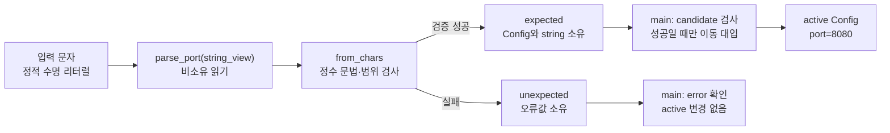

# 2026-09-17 — `std::expected` 검증 경계와 함수형 그래프 사이클

오늘의 실무 주제는 C++23 `std::expected<T,E>`로 오류를 예외나 특별한 정수 대신 **타입이 있는 값**으로 돌려주고, 검증에 성공한 설정만 현재 상태에 반영하는 것이다. 대회 문제는 [CSES 1751 — Planets Cycles](https://cses.fi/problemset/task/1751/)다. 각 행성이 다음 행성 하나만 가리키는 함수형 그래프에서, 출발 행성별로 처음 같은 행성을 다시 만나기 전 방문하는 서로 다른 행성 수를 구한다.

## 오늘의 목표와 생성 파일

- [`main.cpp`](main.cpp): 문자열에서 포트를 읽어 `expected<Config,ParseError>`로 반환하고, 성공 후에만 `Config`를 교체한다.
- [`problem.cpp`](problem.cpp): `and_then`으로 검증하고 `transform`으로 결과 객체를 만드는 실습. 오류 경로에서는 변환 람다가 실행되지 않는다.
- [`icpc_problem.cpp`](icpc_problem.cpp): CSES 1751 제출 가능한 `O(n)` 풀이.
- [`CMakeLists.txt`](CMakeLists.txt): C++23 독립 실행 파일 세 개와 exact-output CTest 여섯 개.
- [`run_icpc_test.cmake`](run_icpc_test.cmake): 종료 코드와 출력 전체를 비교하는 테스트 드라이버.
- [`CHECKPOINT.md`](CHECKPOINT.md): 기초 문법·값 범주·호출 계약·알고리즘 자가 검증.
- [`../algorithm/functional-graph-cycle-peeling.md`](../algorithm/functional-graph-cycle-peeling.md): 사이클 분리·역순 DP의 공용 알고리즘 대표 문서.

## `main.cpp` 구조도

## 초보자를 위한 C++ 코드 읽기

`#include <expected>`는 성공·오류를 선택적으로 소유하는 타입을, `<charconv>`는 할당 없이 문자 범위를 정수로 읽는 함수를 선언한다. `<string_view>`는 문자를 **빌려** 보는 뷰이고 `<string>`은 문자를 **소유**한다. `<system_error>`의 `std::errc`는 변환 실패 종류를 구별하며, `<utility>`의 `std::move`와 `std::in_place`는 각각 이동을 허용하는 식과 내부 객체 직접 생성을 표현한다. `<iostream>`은 표준 출력 선언을 제공한다. 온라인 저지 풀이는 입력·출력과 그래프 저장에 필요한 별도 헤더를 포함한다.

`unsigned`는 음수를 표현하지 않는 기본 정수 타입이지만 모든 값이 포트로 유효한 것은 아니다. `int requested`는 음수를 받아 오류로 분류하기 위해 남겨 둔다. `Config::Port parsed{}`의 중괄호는 기본 타입을 0으로 초기화한다. `std::string{"service"}`는 문자열 리터럴을 자기 저장소로 복사한다. 리터럴은 정적 수명 `const char[N]` 배열이며, 뷰는 그 배열을 빌릴 뿐 수명을 늘리지 않는다.

`class Config`의 멤버는 기본적으로 `private`, `struct`의 멤버는 기본적으로 `public`이다. 접근 지정자 `public`을 통해 생성자와 읽기 전용 접근자만 노출하지만, 공개 생성자가 임의의 포트를 받으므로 **타입 자체**가 범위 불변식을 강제하지는 않는다. 오늘의 유효성은 `parse_port` 호출 경계가 보장한다. `using Port = unsigned`는 별칭이지 새로운 강한 타입이 아니다. `std::expected<Config, ParseError>`의 첫 번째 템플릿 인자는 성공값 타입, 두 번째는 오류 타입이다. `explicit Config(Port, std::string)`은 복사 목록 초기화를 막는다. 멤버 초기화 목록 `: port_{port}, name_{std::move(name)}`은 생성자 본문 전에, **멤버 선언 순서**대로 객체를 만든다.

`parse_port(std::string_view text)`의 매개변수는 호출 동안만 입력 문자를 빌린다. 함수의 반환형은 두 경우 중 하나를 소유하는 값이다. `const char* first`는 문자를 수정할 수 없는 포인터, `const char* const first`는 포인터 변수 자체도 다시 가리킬 수 없다는 뜻이다. `if`는 입력이 비었는지, 변환 오류인지, 마지막 문자까지 읽었는지 분기한다. 범위를 벗어난 포트와 0도 분리해서 거부한다. `Config::port() const`에서 뒤의 `const`는 이 멤버 함수가 관찰 대상 객체를 바꾸지 않음을 뜻한다. `name()`의 `const std::string&`는 복사 없는 참조지만 소유권과 수명을 가져오지 않는다.

직접 해보기: `parse_port("42x")`, `parse_port("0")`, `parse_port("65536")`의 오류를 예측한 뒤, `main.cpp`의 입력 리터럴을 한 번씩 바꿔 실행해 보자. `parse_port("+42")`와 `parse_port(" 42")`도 `from_chars`의 문법을 생각하며 예측한다. 연습 파일에서는 `make_quota(51)`을 넣어 오류가 `TooLarge`인지, `transform`의 `Quota` 생성이 생략되는지 확인한다.

## Modern C++ 설계와 실행 관점

`candidate`는 이름이 있는 `expected` 객체이므로 **lvalue**이고, `*candidate`도 내부 `Config`를 가리키는 lvalue다. `std::move(*candidate)`는 그 객체를 즉시 이동시키는 함수가 아니라 **xvalue** 참조로 캐스팅하여 이동 대입을 선택 가능하게 한다. `std::string{"service"}`와 `std::expected<Config,ParseError>{...}`는 **prvalue**다. 값 매개변수 `std::string name`은 원본 lvalue에서 오면 복사될 수 있고, 임시 문자열에서 오면 직접 구성/이동될 수 있다. 이름이 붙은 `name`은 선언 타입과 관계없이 lvalue라서 `std::move(name)`를 사용한다. `const std::string&`는 읽기 전용 별칭이고, 반환 참조는 `Config`가 파괴되면 댕글링한다.

`parse_port`가 반환하는 동일 타입 `expected` prvalue는 C++17 보장 복사 생략으로 호출자의 결과 객체에 직접 만들어진다. 반면 이름 있는 지역을 반환한다면 NRVO는 허용되지만 일반적으로 보장되지 않는다. `expected`는 성공 `Config` 또는 오류 열거형을 소유하므로 입력 `string_view`가 소멸해도 반환 객체 안에 빌린 문자는 없다. 실패한 파싱은 `active`에 대입하지 않으므로 기존 설정이 유지된다. 이는 **검증 실패에 대한** 트랜잭션 성질이지, 임의의 새 멤버 타입이 던지는 대입까지 무조건 원자적으로 보장한다는 주장은 아니다.

기계 실행으로 보면 `from_chars`는 문자 로드·숫자 비교/누적을, `if`는 비교와 조건 분기를, `active` 대입은 멤버 값과 문자열 소유 상태의 갱신을 유도할 수 있다. `expected`의 상태 태그 검사도 조건 분기가 될 수 있다. `and_then`/`transform`의 람다는 정적 타입이 알려져 인라인될 수도 있지만, 특정 명령어·복사 횟수·가상 간접 호출 여부는 컴파일러, CPU, 최적화 옵션에 따라 다르다. `std::expected` 자체가 가상 디스패치를 요구하지는 않는다. 프로파일 없이 어셈블리 하나로 비용을 단정하지 않는다.

## ICPC 문제와 풀이

- 문제: **CSES 1751 — Planets Cycles**, [공식 원문](https://cses.fi/problemset/task/1751/). 원문 전체를 복제하지 않고 아래에 풀이에 필요한 조건을 요약한다.
- 입력: `n`과 각 행성 `i`의 다음 행성 `next[i]`가 주어진다. 각 정점의 나가는 간선은 정확히 하나다.
- 출력: 각 출발점에서 다음 간선을 반복할 때 방문하는 서로 다른 정점의 수, 즉 사이클에 도달하기까지 거리와 그 사이클 길이의 합.
- 핵심 알고리즘: 진입 차수 0부터 Kahn식 제거로 비사이클 정점을 기록한다. 남은 정점들은 사이클이므로 각 사이클 길이를 붙인다. 제거 역순에서 `answer[v] = answer[next[v]] + 1`을 계산한다.
- 불변식: 제거 순서의 역순에서 `next[v]`의 정답은 이미 확정되어 있다. 사이클 정점은 모두 같은 사이클 길이를 갖는다.
- 복잡도: 정점·간선을 상수 번씩만 처리하므로 시간 `O(n)`, 저장 배열과 제거 순서에 공간 `O(n)`.

## 오늘 사용한 표준 라이브러리

대표 문서는 개별 심볼마다 새 파일을 만들지 않고 기존 주제별 문서를 보강한다. 표의 호출은 오늘 코드의 실제 오버로드와 인접한 여섯 항목 계약 주석에서 더 자세히 읽는다.

| 핵심 심볼 | 선언 헤더 | 항목 종류 | 실제 호출 멤버/함수 | 현재 역할 | 대표 문서 |
| --- | --- | --- | --- | --- | --- |
| `std::expected`, `std::unexpected`, `std::in_place` | `<expected>`, `<utility>` | 타입·태그 객체 | 생성자, `operator bool`, `operator*`, `operator->`, `error`, `and_then`, `transform` | 성공값/오류값 소유, 검증 합성 | [`ownership-and-vocabulary-types.md`](../standard-library/ownership-and-vocabulary-types.md) |
| `std::from_chars`, `std::errc` | `<charconv>`, `<system_error>` | 함수 템플릿·열거형 | 정수 변환, `result.ec/ptr` | 예외 없는 포트 파싱과 완전 소비 검증 | [`io-parsing-and-utilities.md`](../standard-library/io-parsing-and-utilities.md) |
| `std::string_view` | `<string_view>` | 비소유 뷰 타입 | 생성자, `empty`, `data`, `size` | 호출 중 입력 문자 대여 | [`containers-and-views.md`](../standard-library/containers-and-views.md) |
| `std::string`, `std::move` | `<string>`, `<utility>` | 소유 타입·함수 템플릿 | 문자열 생성/이동 대입, `std::move(` 변환 | 결과 이름 소유와 명시적 자원 이전 | [`containers-and-views.md`](../standard-library/containers-and-views.md), [`io-parsing-and-utilities.md`](../standard-library/io-parsing-and-utilities.md) |
| `std::vector` | `<vector>` | 컨테이너 타입 | 빈 배열의 기본 생성자, 0으로 채우는 fill 생성자, `vector::operator[]`, `vector::reserve`, `vector::push_back`, `vector::size` | 함수형 그래프와 역순 처리 저장 | [`containers-and-views.md`](../standard-library/containers-and-views.md) |
| `std::cin`, `std::cout`, `std::ios::sync_with_stdio` | `<iostream>` (객체), `<ios>` (동기화·tie), `<istream>` (추출), `<ostream>` (삽입) | 스트림 객체·정적 함수·연산자 | `sync_with_stdio(`, `std::cin.tie(`, `std::cin >>`, `std::cout <<`, `operator<<(std::ostream&, char)` | 저지 입력·출력과 실행 결과 | [`io-parsing-and-utilities.md`](../standard-library/io-parsing-and-utilities.md) |

## 검증

`tools/w64devkit/bin/g++.exe`의 C++23 엄격 경고(`-Werror`) 확인 및 CMake Release 빌드, CTest 공식 예제·자가 예제 6/6을 통과했다. 실무 예제의 0, 접미 문자, 최대 유효값, 범위 초과, 정수 오버플로, 선행 `+`와 공백을 exact-output으로 검사한다. 문제 풀이에서는 공식 예제 외 자기 루프, 사이클로 들어가는 꼬리, 여러 사이클을 검사했다. 고정 seed 무작위 그래프 300건을 직접 순회 기준 풀이와 대조하고 200,000개 정점의 긴 꼬리·자기 루프 스트레스를 통과했다. `-Scope all` 공용 표준 라이브러리 감사도 60개 날짜·161개 C++ 파일과 160개 심볼을 검사해 통과했다.
