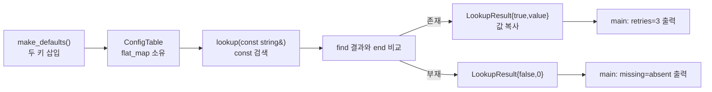

# 2026-09-18 — `std::flat_map` 읽기 중심 설정표와 뫼비우스 반전

오늘의 실무 패턴은 C++23 `std::flat_map`에 작은 설정표를 **소유**하고 읽기 중심으로 조회하는 것이다. 키와 값은 각각 연속 컨테이너에 저장되며 키 순서를 유지한다. 삽입·삭제 중에는 원소 이동과 관찰자 무효화를 고려한다. 대회 문제는 [CSES 2417 — Counting Coprime Pairs](https://cses.fi/problemset/task/2417/)다. 숫자 목록에서 최대공약수가 1인 서로 다른 인덱스의 쌍을 센다.

## 오늘의 목표와 생성 파일

- [`main.cpp`](main.cpp): 키 `retries`·`timeout_ms`를 소유하는 설정표와 값 반환 조회 경계.
- [`problem.cpp`](problem.cpp): 기능 플래그 표의 복사 스냅샷·갱신·이동 배포 연습.
- [`icpc_problem.cpp`](icpc_problem.cpp): 공식 저지에 제출할 수 있는 수론 풀이.
- [`CMakeLists.txt`](CMakeLists.txt), [`run_icpc_test.cmake`](run_icpc_test.cmake): C++23 세 프로그램의 exact-output CTest.
- [`CHECKPOINT.md`](CHECKPOINT.md): 문법·값 범주·무효화·실제 식 해석·알고리즘 자가 검증.
- [`../algorithm/mobius-inversion-coprime-pairs.md`](../algorithm/mobius-inversion-coprime-pairs.md): 뫼비우스 반전 대표 문서.

## `main.cpp` 구조도

## 초보자를 위한 코드 읽기

`#include`는 번역 단위에서 해당 선언을 사용할 수 있게 한다. `<flat_map>`은 C++23의 정렬된 평면 연관 컨테이너를, `<string>`은 자기 문자를 소유하는 타입을, `<iostream>`은 표준 출력 객체를 선언한다. `int`는 기본 정수, `bool`은 참/거짓이다. `{}` 초기화는 빠뜨린 기본 타입 값을 0으로 만들고 좁혀지는 변환도 검사한다. `using`은 기존 타입의 별칭이지 별개의 새 타입이 아니다. `struct`의 기본 접근은 public, `class`의 기본 접근은 private이고, `public` 접근 지정자로 외부 API를 한정한다. `explicit` 생성자는 뜻밖의 암시적 변환을 막고 멤버 초기화 목록은 본문보다 먼저 **멤버 선언 순서**대로 실행된다.

함수의 반환형과 매개변수에서 값 전달은 복사/이동으로 소유권을 분리할 수 있다. `const T&`는 수정하지 않는 비소유 별칭이며 반환 참조는 원본이 살아 있는 동안에만 유효하다. `T*`는 주소를 담고 null 여부와 수명을 별도로 확인해야 한다. `if`는 조건에 따라 한 경로만 실행한다. 컨테이너의 템플릿 인자 `Key`, `T`는 각각 검색 키와 대응 값의 타입이다.

직접 해보기: `retries`와 `unknown` 조회 결과를 먼저 예측한다. `problem.cpp`는 `before` 독립 복사본을 남긴 뒤 `live`의 `cache`를 끄고 이동 배포하므로 `before=on`, `deployed=off`, `missing=unknown`이 된다. 새 원소를 삽입하기 전후의 크기와 저장된 참조가 여전히 유효한지를 설명한다. `std::flat_map`은 정렬된 작은 **읽기 중심** 테이블에 알맞지만 잦은 삽입에는 원소 이동 비용이 생긴다. 기본 `vector<bool>` 저장소는 일반 시퀀스 계약에 맞지 않아 플래그 값도 `int` 0/1로 표현한다.

## Modern C++ 설계와 기계 실행

이름 붙은 컨테이너·문자열 식은 lvalue다. `T{...}`와 값을 반환하는 생성 함수 호출은 prvalue이며 C++17 이후 같은 타입 prvalue 반환은 결과 객체에 직접 생성될 수 있다. `std::move(x)`는 xvalue로 캐스팅할 뿐 실제 이동은 선택된 생성자나 대입이 한다. `const` 참조에 임시를 바인딩할 때의 수명 연장과 함수가 반환한 참조의 수명은 다른 규칙이다. `flat_map`은 키·값을 내부에 소유하지만 검색으로 얻은 반복자·참조·포인터가 독립적으로 원소 수명을 소유하지는 않는다. 삽입으로 재할당·원소 이동이 가능하므로 오래 보관하지 않는다.

검색은 키 비교와 메모리 로드를, 삽입은 원소 이동·저장·할당 가능성을, 조건식은 분기를 만들 수 있다. 연속 저장이 캐시 친화적일 수 있으나 작업량과 성능은 표 크기·비교자·할당자에 좌우된다. 가상 호출은 이 설계의 필수 비용이 아니며 특정 어셈블리나 명령 개수는 CPU·ABI·컴파일러·최적화 옵션에 따라 달라진다.

## ICPC 문제와 풀이

- 공식 문제: **CSES 2417 — Counting Coprime Pairs**, [문제 페이지](https://cses.fi/problemset/task/2417/).
- 입력: 첫 줄 `n` (`1 ≤ n ≤ 100,000`), 다음 줄에 양의 정수 `x_i` (`1 ≤ x_i ≤ 1,000,000`) `n`개.
- 출력: `i < j`이고 `gcd(x_i,x_j)=1`인 쌍의 개수 한 개.
- 핵심: `cnt[d]`를 `d`의 배수인 입력 원소 수라 놓으면 `Σ μ(d)·C(cnt[d],2)`가 답이다. 각 `d`의 배수를 훑어 개수를 모으고 체로 뫼비우스 함수 `μ`를 계산한다.
- 불변식: 각 쌍의 기여는 두 수의 공약수 `d`에 대한 `Σ_{d|gcd} μ(d)`이며, 이는 최대공약수가 1일 때만 1이다. 같은 값도 서로 다른 입력 위치이면 별도 원소다.
- 복잡도: 실제 최댓값 `M`에 대해 시간 `O(n + M log M)`, 빈도·체·배수 집계 공간 `O(M)`. 모든 원소가 1이면 `C(100000,2)=4,999,950,000`이므로 결과는 64비트 정수여야 한다.
- 공식 예제: `8`과 `5 4 20 1 16 17 5 15`를 입력하면 `19`.

## 오늘 사용한 표준 라이브러리

첫 호출의 구체적 수신 상태, 오버로드, 각 인자의 타입·값 범주·소유권, 반환값 사용 여부, 호출 뒤 상태, 전제조건·복잡도·수명·오류·스레드 계약은 각 코드 옆 주석에서 확인한다. 이미 있는 주제별 대표 문서를 보강하고 주제 중복 파일은 만들지 않는다.

| 핵심 심볼 | 선언 헤더 | 항목 종류 | 실제 호출 멤버/함수 | 현재 코드에서의 역할 | 대표 문서 |
| --- | --- | --- | --- | --- | --- |
| `std::flat_map` | `<flat_map>` | 소유 연관 컨테이너 타입 | 기본·복사·이동 생성자, `insert_or_assign`, `find`, `end`, 반복자 `operator->` | 작은 읽기 중심 설정표의 키 순서·조회·스냅샷 | [`containers-and-views.md`](../standard-library/containers-and-views.md) |
| `std::string` | `<string>` | 소유 문자 타입 | 리터럴 생성·이동·복사 | 키 문자의 자체 수명 관리 | [`containers-and-views.md`](../standard-library/containers-and-views.md) |
| `std::move` | `<utility>` | 함수 템플릿 | `std::move(` 값 범주 캐스트 | 명시적 이동 허용 | [`io-parsing-and-utilities.md`](../standard-library/io-parsing-and-utilities.md) |
| `std::cin`, `std::cout`, `std::ios::sync_with_stdio` | `<iostream>` (객체), `<ios>` (동기화·tie), `<istream>`, `<ostream>` (추출·삽입 선언) | 스트림 객체·정적 함수·연산자 | `sync_with_stdio(`, `std::cin.tie(`, `std::cin >>`, `std::cout <<`, `operator<<(std::ostream&, char)` | 저지 입력·출력과 학습 결과 | [`io-parsing-and-utilities.md`](../standard-library/io-parsing-and-utilities.md) |

## 검증

`tools/w64devkit/bin/g++.exe` GCC 16.1.0으로 C++23 엄격 경고(`-Werror`)를 확인하고 세 실행 파일의 CMake Release 빌드를 통과했다. CTest 8/8에서 실무 예제 두 개, 공식 예제, 한 원소·중복·서로소 쌍 부재·혼합 숫자 등의 exact-output을 검사했다. 별도 완전탐색 대조는 작은 무작위 사례 359건과 3,000개 원소 사례(2,676,264쌍), 큰 입력 10만 개 사례 다섯 건을 통과했다. 모두 1일 때 `4,999,950,000`, 모두 100만일 때 0을 확인했다. 공용 `-Scope all` 감사는 61개 날짜·164개 C++ 파일·163개 심볼·55개 헤더를 검사해 통과했다. 빌드 산출물은 Git이 무시하는 `build/daily-2026-09-18`에만 두고 커밋하지 않는다.
