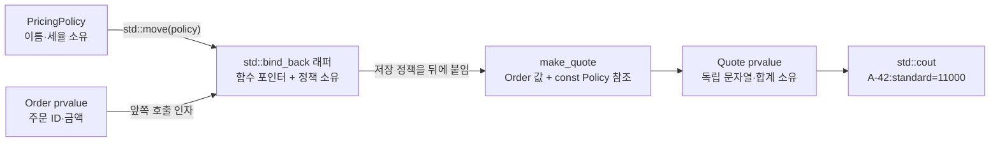

# 2026-09-21 — `std::bind_back` 소유 호출 어댑터와 인접 자릿수 Digit DP

오늘의 실무 주제는 C++23 `std::bind_back`으로 **뒤쪽 정책 인자를 값으로 소유하는 구체 호출 래퍼**를 만드는 것이다. `main.cpp`에서는 가격 정책을 래퍼 안으로 이동해 주문만 받는 함수로 바꾸고, `problem.cpp`에서는 래퍼가 예약 원장을 소유해 호출 사이의 순번 상태를 유지한다. 대회 문제는 [CSES 2220 — Counting Numbers](https://cses.fi/problemset/task/2220/)이며, 선행 0·직전 자릿수·상한 접두사를 상태로 둔 Digit DP로 해결한다.

## 오늘의 목표와 생성 파일

- [`main.cpp`](main.cpp): `std::bind_back`, 함수 포인터, decay 소유, `std::move`, lvalue 래퍼 호출, 복사 생략을 연결한다.
- [`problem.cpp`](problem.cpp): bind-back 래퍼가 변경 가능한 원장을 소유하고 연속 호출 사이 상태를 보존함을 검증한다.
- [`icpc_problem.cpp`](icpc_problem.cpp): CSES 2220의 제출 가능한 `O(D * 10^2)` Digit DP 풀이와 증명 불변식을 담는다.
- [`CMakeLists.txt`](CMakeLists.txt), [`run_icpc_test.cmake`](run_icpc_test.cmake): C++23 세 실행 파일과 전체 출력 CTest를 구성한다.
- [`CHECKPOINT.md`](CHECKPOINT.md): 기초 문법, 값 범주, bind-back 호출 계약, Digit DP를 스스로 설명하는 문제다.
- [`../algorithm/digit-dp-no-equal-adjacent.md`](../algorithm/digit-dp-no-equal-adjacent.md): 정의·상태 불변식·절차·뼈대·증명·복잡도·변형을 모은 공용 알고리즘 문서다.

## `main.cpp` 구조도



핵심은 래퍼가 타입 소거 컨테이너가 아니라 컴파일러가 아는 구체 타입이라는 점이다. `policy`를 xvalue로 넘기면 래퍼의 decay된 `PricingPolicy` 저장소가 소유권을 받는다. 이름 있는 `quote_with_policy`는 lvalue이므로 호출할 때 저장 정책을 `PricingPolicy&`로 전달하고, `make_quote`의 `const PricingPolicy&`가 호출 동안 빌린다.

## 초보자를 위한 코드 읽기

- `struct`는 기본 `public`, `class`는 기본 `private`다. `Order`·`Quote`는 값 묶음이고 `PricingPolicy`·`ReservationLedger`는 변경 규칙을 멤버 함수 안에 감춘다.
- `int subtotal{}`처럼 빈 중괄호는 정수를 0으로 값 초기화한다. `int next_sequence_{1}`은 멤버의 기본 시작값을 1로 정한다.
- `explicit PricingPolicy(...)`는 `PricingPolicy p = {name, 1000}` 또는 `consume({name, 1000})` 같은 copy-list 암시 변환을 막고 직접 구성을 요구한다. 멤버 초기화 목록은 생성자 본문보다 먼저 멤버를 직접 만든다.
- `const PricingPolicy&`는 정책을 소유하지 않고 읽기만 하는 참조다. 함수 포인터는 코드의 주소를 가리키지만 함수 수명은 프로그램 전체이므로 별도 삭제가 없다.
- `using QuoteFunction = ...`은 새 타입을 만드는 것이 아니라 긴 함수 포인터 타입에 별칭을 붙인다.
- `if`, `for`, `continue`는 각각 조건 분기, 반복, 현재 반복 건너뛰기다. Digit DP의 `tight`와 `started`도 `bool` 기본 타입이다.

직접 해보기: `problem.cpp`의 두 번째 `reserve_in_order(...)`를 먼저 첫 번째 호출 앞으로 옮겨 출력 순서와 누적값을 예측한다. 이어 래퍼를 `const auto`로 바꾸면 저장 원장을 `ReservationLedger&`로 전달해야 하는 대상 함수와 왜 맞지 않는지 컴파일 오류로 확인한다.

## Modern C++ 설계, 값 범주와 객체 수명

`policy`와 `quote_with_policy`처럼 이름 있는 식은 lvalue다. `PricingPolicy{...}`, `Order{...}`, `Quote{...}`는 prvalue다. `std::move(policy)`는 policy를 즉시 옮기지 않고 `PricingPolicy&&`인 xvalue 식으로 바꾸며, 실제 이동은 `bind_back`의 저장 상태 생성이 수행한다. 이동 뒤 원본 policy는 살아 있지만 값이 미지정이므로 다시 이름을 읽지 않는다.

`std::bind_back`은 함수 대상과 bound 인자를 `decay_t` 값으로 보관한다. `ReservationLedger{}` 원본 임시는 전체 표현식 끝에 파괴되고, 그 값에서 별도로 직접 구성된 래퍼의 `ReservationLedger` subobject가 래퍼 수명까지 산다. 이는 임시의 참조 수명 연장이 아니다. 반대로 포인터·`reference_wrapper`처럼 비소유 값을 bind하면 원본 수명을 연장하지 않으므로 호출 때까지 원본이 살아 있어야 한다.

`make_quote`의 `return Quote{...}`와 래퍼 호출이 반환하는 Quote prvalue는 C++17 이후 결과 객체에 직접 구성된다. 주문 ID는 xvalue로 이동하고 정책 이름은 const lvalue에서 복사하므로, 결과 Quote는 입력 Order와 래퍼 정책이 나중에 파괴되어도 독립적으로 유효하다. 이름 있는 지역을 `return local;` 하는 NRVO는 허용되지만 보장된 prvalue 직접 구성과는 구분한다.

기계 관점에서 정수 정책 계산은 load·곱셈·나눗셈·store, Digit DP는 배열 주소 계산·cache load/store·비교·조건 분기와 재귀 호출이 될 수 있다. 함수 포인터 호출이 간접 호출로 남거나 구체 bind-back 래퍼가 인라인될 수 있다. 가상 함수는 사용하지 않는다. 실제 명령, 복사 생략, 분기 제거, 메모리 배치는 CPU·ABI·표준 라이브러리·컴파일러·최적화 옵션에 따라 달라진다.

## ICPC 문제와 풀이

- 문제 ID/제목: **CSES 2220 — Counting Numbers**
- 공식 출처: <https://cses.fi/problemset/task/2220/>
- 조건: `0 <= a <= b <= 10^18`; 십진 표기의 인접한 두 자릿값이 같은 수를 제외한다.
- 핵심 알고리즘: `F(x)=[0,x]`의 답을 구하는 Digit DP, 상태 `(position, previous, started, tight)`.
- 답: `F(b) - F(a-1)`. `F(-1)=0`으로 정의해 `a=0`을 안전하게 처리한다.
- 시간 복잡도: 최대 19자리 × 이전 상태 11개 × 시작/상한 상태 × 자릿값 10개인 `O(D * 10^2)`.
- 공간 복잡도: memo와 재귀 스택을 포함해 `O(D * 10)`.

검증의 핵심은 완전탐색 가능한 작은 구간에서 직접 문자열 판정 oracle과 대조하고, `0`, `11`, `100`, `101`, 자릿수 경계 `98..102`, 최대 상한을 따로 확인하는 것이다. 공식 예제는 `123 321 -> 171`이다. 모든 선행 자리를 0으로 고른 경로를 1로 세야 정수 0이 포함된다.

## 오늘 사용한 표준 라이브러리

| 핵심 심볼 | 선언 헤더 | 항목 종류 | 실제 호출 멤버/함수 | 현재 코드에서의 역할 | 대표 문서 |
| --- | --- | --- | --- | --- | --- |
| `std::bind_back` | `<functional>` | C++23 함수 템플릿 | `std::bind_back(quote_function, std::move(policy))`, `std::bind_back(reserve_function, ReservationLedger{})` | 함수 대상과 뒤쪽 정책/원장을 decay 값으로 소유하는 구체 래퍼 생성 | [`ownership-and-vocabulary-types.md`](../standard-library/ownership-and-vocabulary-types.md) |
| bind-back 반환 래퍼 | `<functional>` | 구현 지정 perfect-forwarding 호출 래퍼 | `bind_back-result::operator()`, `quote_with_policy(Order{...})`, `reserve_in_order(ReservationRequest{...})` | 호출 인자를 앞에 두고 저장 인자를 뒤에 붙이며 래퍼 cv/ref에 맞춰 전달 | [`ownership-and-vocabulary-types.md`](../standard-library/ownership-and-vocabulary-types.md) |
| `std::string` | `<string>` | 소유 문자 타입 | 리터럴 생성자, 이동 생성자, 복사 생성자, `string::size()`, `string::operator[]` | 주문·정책 이름과 Digit DP 상한 자릿수의 독립 수명 | [`containers-and-views.md`](../standard-library/containers-and-views.md) |
| `std::move` | `<utility>` | 값 범주 변환 함수 템플릿 | `std::move(name)`, `std::move(order.id)`, `std::move(policy)` | lvalue를 xvalue로 표시해 문자열·정책 소유권 이전을 허용 | [`io-parsing-and-utilities.md`](../standard-library/io-parsing-and-utilities.md) |
| `std::to_string` | `<string>` | 오버로드 함수 | `std::to_string(limit)` | `0..10^18` 상한을 소유 십진 문자열로 변환 | [`io-parsing-and-utilities.md`](../standard-library/io-parsing-and-utilities.md) |
| `std::size_t` | `<cstddef>` | 부호 없는 크기 타입 별칭 | `static_cast<std::size_t>(position)` | 검증된 Digit DP 위치를 string 첨자 타입으로 변환 | [`bit-and-byte-utilities.md`](../standard-library/bit-and-byte-utilities.md) |
| `std::cin`, `std::cout`, `std::ios::sync_with_stdio` | `<iostream>` (`<istream>`, `<ostream>`, `<ios>` 선언 포함) | 스트림 객체·정적 함수·연산자 | `sync_with_stdio(`, `std::cin.tie(`, `std::cin >>`, `std::cout <<`, `operator<<(std::ostream&, char)` | 저지 입력과 결과·학습 출력, 배치 I/O 설정 | [`io-parsing-and-utilities.md`](../standard-library/io-parsing-and-utilities.md) |

## 검증

저장소의 `tools/w64devkit/bin/g++.exe` GCC 16.1.0으로 세 소스를 C++23, `-Wall -Wextra -Wpedantic -Wconversion -Wshadow -Werror`, `_GLIBCXX_ASSERTIONS` 조건에서 다시 검사했다. CMake Release 빌드 뒤 CTest 9/9가 통과해 실무 예제 둘, 공식 예제, 0·인접 중복·선행 0 경계·비인접 반복·최대 범위 `F(10^18)=168856464709124011`의 전체 출력을 확인했다.

컴파일된 ICPC 실행 파일은 독립 조합식/rank oracle과 1,608개 구간을 직접 대조했다. 별도 전이 검증에서는 `0..25,000` 전수, `200,000`까지의 표본, 작은 무작위 구간 25,000개, 자릿수 경계 창 98개, 큰 상한 25,125개와 큰 무작위 구간 25,000개가 모두 일치했다. Mermaid parser가 구조도를 읽었고, 변경 문서 11개의 로컬 링크 393개도 모두 해석됐다. 표준 라이브러리 공용 문서는 아래 감사로 최신 1일과 전체 62일을 검사해 각각 3개/167개 C++ 파일, 전체 164개 심볼·55개 헤더·56개 멤버·5개 연산군을 통과했다.

```powershell
& dailystudy/exercise/tools/audit-standard-library-docs.ps1 -Scope all
```

빌드 산출물은 Git이 무시하는 `build/daily-2026-09-21`에만 만들고 커밋하지 않는다.
