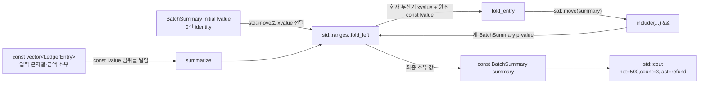

# 2026-09-22 — `std::ranges::fold_left` 소유 스냅숏과 DAG 최장 경로

오늘의 실무 주제는 C++23 `std::ranges::fold_left`로 **읽기 전용 입력 범위를 독립 수명의 소유 결과 값 하나로 축약**하는 것이다. `main.cpp`는 회계 항목을 `BatchSummary`로, `problem.cpp`는 상태 점검을 `AuditReport`로 접는다. 누산기는 호출 사이에서 값으로 이동하고 입력 원소는 `const` 참조로만 빌리므로, 공유 가변 상태 없이 결과 소유권이 어디에 있는지 코드에 드러난다.

대회 문제는 [CSES 1680 — Longest Flight Route](https://cses.fi/problemset/task/1680/)다. 방향 비순환 그래프(DAG)의 위상 순서에서 출발점으로부터의 최장 경로 길이를 동적 계획법으로 갱신하고, 개선이 일어난 간선의 이전 정점을 기록해 실제 경로까지 복원한다.

## 오늘의 목표와 생성 파일

- [`main.cpp`](main.cpp): `fold_left`, 값 누산기, `&&` 참조 한정 멤버, 문자열 복사/이동, prvalue 직접 구성을 실무 원장 축약에 연결한다.
- [`problem.cpp`](problem.cpp): 통과/실패 점검 목록을 외부 부수 효과 없이 보고서 값으로 만드는 직접 연습이다.
- [`icpc_problem.cpp`](icpc_problem.cpp): CSES 1680에 제출 가능한 위상 정렬 + 최장 경로 DP + predecessor 복원 풀이이다.
- [`CMakeLists.txt`](CMakeLists.txt), [`run_icpc_test.cmake`](run_icpc_test.cmake): 세 C++23 프로그램과 전체 출력 CTest를 구성한다.
- [`CHECKPOINT.md`](CHECKPOINT.md): 기초 문법, 값 범주, 호출 계약, 위상 순서 DP 불변식을 코드 식으로 검증한다.
- [`../algorithm/topological-sort.md`](../algorithm/topological-sort.md): 중복 문서 대신 기존 위상 정렬 대표 문서를 DAG 최장 경로와 복원까지 멱등 보강했다.

## `main.cpp` 구조도



`entries`는 원소와 문자열을 소유한다. `fold_left`가 범위를 순회하는 동안 `entry`는 `const LedgerEntry&` lvalue로만 빌리고, 누산기는 다음 reducer가 소비할 수 있는 값으로 전달한다. 결과의 `last_source_`는 입력 문자열을 깊게 복사하므로 `entries`와 독립적으로 살 수 있다.

## 초보자를 위한 코드 읽기

- `long long`, `bool`은 기본 타입이다. `long long delta_cents{}`와 `bool passed{}`의 빈 중괄호는 각각 `0`, `false`로 값 초기화한다. `std::size_t`는 음수가 아닌 크기를 나타내는 구현별 부호 없는 정수 타입의 별칭이며, 중괄호 초기화는 잘못된 축소 변환도 막아 준다.
- `struct`는 기본 접근이 `public`, `class`는 기본 접근이 `private`다. 그래서 `LedgerEntry`/`HealthCheck`는 입력 값 묶음으로 공개하고, `BatchSummary`/`AuditReport`는 불변식과 갱신 규칙을 접근 지정자 뒤에 감춘다.
- 생성자의 `: member_{argument}`는 **멤버 초기화 목록**이다. 생성자 본문에서 나중에 대입하는 것이 아니라 객체 생성 단계에서 멤버를 바로 만든다.
- `explicit BatchSummary(...)`는 정수나 문자열 일부가 뜻하지 않게 보고서 타입으로 암시 변환되는 일을 막고 직접 생성만 허용한다.
- 함수의 반환형은 이름 앞의 `BatchSummary`, 매개변수는 괄호 안의 `const std::vector<LedgerEntry>& entries`다. `const&`는 vector를 소유하지 않고 호출 동안 읽기만 빌린다.
- `BatchSummary::include(...) &&`의 마지막 `&&`는 이 멤버 함수를 xvalue/임시 수신 객체에서만 부르게 하는 **참조 한정자**다. 곧 소비할 누산기라는 의도를 타입 검사에 넣는다.
- `if (check.passed)`는 비교 결과에 따라 조건 분기한다. `for`와 `while`은 반복하며, ICPC 풀이의 `continue`는 현재 반복의 남은 문장만 건너뛴다.
- `using`은 새 타입을 만드는 것이 아니라 긴 타입에 별칭을 준다. 표준 템플릿의 `std::vector<LedgerEntry>`에서 `LedgerEntry`는 원소 타입 템플릿 인자다.

직접 해보기: `main.cpp`의 세 번째 금액을 `-900`으로 바꾸기 전에 출력을 예측한다. 이어 `include`의 `&&`를 `&`로 바꾸면 `std::move(summary).include(entry)`가 왜 더 이상 맞지 않는지 컴파일러 진단을 읽는다. `problem.cpp`에서는 첫 실패를 마지막 실패로 바꾸되 입력 `checks`는 수정하지 않는 구현을 작성한다.

## Modern C++ 설계, 값 범주와 객체 수명

`entries`, `summary`, 이름 있는 함수 매개변수 `report`는 lvalue다. `BatchSummary{...}`, `AuditReport{}`, 함수가 값으로 돌려주는 결과는 prvalue다. `std::move(summary)`는 데이터를 즉시 옮기는 함수가 아니라 lvalue를 `BatchSummary&&`인 xvalue 식으로 바꾼다. 실제 복사/이동은 그 뒤 선택된 생성자나 멤버 함수가 결정한다.

`fold_left`는 표준 의미상 초기값과 현재 누산기를 다음 reducer의 첫 인자에 xvalue로 전달한다. `fold_entry`는 누산기 값을 소유하고, `std::move(summary).include(entry)`로 `&&` 한정 함수를 호출한 뒤 새 결과 prvalue를 반환한다. `include`가 만드는 같은 타입 prvalue는 C++17부터 결과 목적 객체에 직접 구성될 수 있다. 이름 있는 지역을 `return local;` 할 때의 선택적 NRVO와, prvalue 직접 구성이라는 보장된 복사 생략을 구분한다. 함수 매개변수 `return report;`에는 NRVO가 적용되지 않으며, C++23 move-eligible 규칙이 식을 xvalue로 취급해 접근 가능한 이동 생성자를 선택한다.

`std::vector`의 initializer-list 생성자는 목록 원소가 `const`이므로 원소를 보통 복사한다. “중괄호 안에 임시를 썼으니 반드시 이동”이라고 단정하면 안 된다. 반면 `BatchSummary` 생성자의 값 매개변수는 `std::move(last_source)`를 통해 멤버로 이동한다. 이동 뒤 원본은 파괴 가능한 유효 상태지만 값은 미지정일 수 있어 다시 내용에 의존하지 않는다.

입력 vector, reducer 함수 포인터, 반환 보고서의 소유권은 서로 다르다. 함수 포인터는 프로그램 수명의 코드를 비소유로 가리키고, `const&`는 호출 동안 원소를 빌리며, 최종 보고서는 문자열까지 소유한다. 결과 안에 pointer·iterator·`string_view`를 넣었다면 반환값 자체가 소유 값이어도 가리킨 대상 수명이 연장되지 않는다는 점이 중요하다.

기계 실행 관점에서 fold는 반복자의 끝 비교, 원소 load, reducer 호출, 누산기 load/store로 나타날 수 있다. 문자열 복사는 길이 확인과 저장소 할당·문자 복사를 포함할 수 있고, ICPC 코드는 진입 차수 비교와 조건 분기, 인접 리스트의 비연속 load를 수행할 수 있다. 함수 포인터 호출이 간접 호출로 남거나 컴파일러가 대상을 알아 인라인할 수 있다. 실제 명령, 복사 생략, 분기 제거, 캐시 행동은 CPU·ABI·표준 라이브러리·컴파일러·최적화 옵션에 따라 달라 특정 어셈블리로 단정하지 않는다.

## ICPC 문제와 풀이

- 문제 ID/제목: **CSES 1680 — Longest Flight Route**
- 공식 출처 URL: <https://cses.fi/problemset/task/1680/>
- 입력: 도시 `n`, 단방향 항공편 `m`, 이어서 `m`개의 간선 `a -> b`. 도시는 `1..n`이고 그래프에는 방향 순환이 없다.
- 출력: 1번에서 n번까지 방문 도시 수가 최대인 경로의 길이와 경로 하나. 경로가 없으면 `IMPOSSIBLE`.
- 제약: `2 <= n <= 100,000`, `1 <= m <= 200,000`.
- 핵심 알고리즘: Kahn 위상 정렬, 도달 불가 sentinel을 둔 DAG 최장 경로 DP, `parent` 이전 정점 복원.
- 시간 복잡도: 각 정점·간선을 상수 번 처리하는 `O(n + m)`.
- 공간 복잡도: 인접 리스트, 진입 차수, DP, 부모, 큐, 경로를 합친 `O(n + m)`.

위상 순서에서 간선 `u -> v`를 볼 때 `u`가 1번에서 도달 가능하고 `distance[u] + 1 > distance[v]`일 때만 `distance[v]`와 `parent[v]`를 함께 갱신한다. 불변식은 `u`를 처리할 때 `u`로 들어오는 모든 경로 후보가 이미 검사됐다는 것이다. 따라서 선택한 값은 `u`까지의 최장 경로 길이이며, 마지막에 n번의 parent를 거슬러 가면 실제 최장 경로 하나를 얻는다.

대회에서 자주 틀리는 지점은 다음과 같다.

- 단순 DFS 방문 여부만으로 최장 경로를 구하거나, 위상 순서가 아닌 입력 순서로 DP를 갱신한다.
- 도달 불가 정점의 sentinel에 `+1`을 해 가짜 경로가 생기게 한다.
- 더 긴 경로로 DP를 바꿀 때 `parent`를 함께 갱신하지 않는다.
- 전역 DAG의 다른 컴포넌트가 n번으로 들어온다는 이유만으로 1번에서 도달 가능하다고 착각한다.
- 재귀 DFS로 `n=100,000` 사슬을 처리하다 호출 스택 한계를 만난다. Kahn 큐는 이 위험을 피한다.

## 오늘 사용한 표준 라이브러리

| 핵심 심볼 | 선언 헤더 | 항목 종류 | 실제 호출 멤버/함수 | 현재 코드에서의 역할 | 대표 문서 |
| --- | --- | --- | --- | --- | --- |
| `std::ranges::fold_left` | `<algorithm>` | C++23 ranges 알고리즘 함수 객체(niebloid) | `std::ranges::fold_left(entries, std::move(initial), &fold_entry)`, `std::ranges::fold_left(checks, std::move(initial), &fold_check)` | const 입력 범위를 왼쪽부터 독립 소유 보고서 값으로 축약 | [`algorithms-and-ranges.md`](../standard-library/algorithms-and-ranges.md) |
| `std::move` | `<utility>` | 값 범주 변환 함수 템플릿 | `std::move(last_source)`, `std::move(summary)` | lvalue를 xvalue로 표시해 문자열/누산기 소비 의도를 전달 (`std::move(`) | [`io-parsing-and-utilities.md`](../standard-library/io-parsing-and-utilities.md) |
| `std::string` | `<string>` | 소유 문자 컨테이너 | 리터럴/기본/복사/이동 생성자, 복사 대입 | 입력 이름과 결과의 마지막/첫 실패 이름을 독립 소유 | [`containers-and-views.md`](../standard-library/containers-and-views.md) |
| `std::vector` | `<vector>` | 연속 시퀀스 컨테이너 | initializer-list/`기본 생성자`/`count 생성자`/`fill 생성자`, `vector::operator[]`, `vector::push_back`, `vector::size` | 학습 입력, 그래프, DP/부모/복원 경로 저장 | [`containers-and-views.md`](../standard-library/containers-and-views.md) |
| `std::queue` | `<queue>` | FIFO 컨테이너 어댑터 | `queue::empty`, `queue::push`, `queue::front`, `queue::pop` | 진입 차수 0인 정점을 위상 순서로 처리 | [`containers-and-views.md`](../standard-library/containers-and-views.md) |
| `std::size_t` | `<cstddef>` | 부호 없는 크기 타입 별칭 | `static_cast<std::size_t>(vertex)` | 검증된 도시 번호를 vector 첨자 타입으로 변환 | [`bit-and-byte-utilities.md`](../standard-library/bit-and-byte-utilities.md) |
| `std::cin`, `std::cout`, `std::ios::sync_with_stdio` | `<iostream>` | 스트림 객체·정적 함수·연산자 | `sync_with_stdio(`, `std::cin.tie(`, `std::cin >>`, `std::cout <<`, `operator<<(std::ostream&, char)` | 저지 입력, 답/학습 출력, 배치 I/O 설정 | [`io-parsing-and-utilities.md`](../standard-library/io-parsing-and-utilities.md) |

## 검증

저장소의 w64devkit GCC 16.1.0에서 다음 검증을 실제로 통과했다.

- 세 소스를 C++23, `-Wall -Wextra -Wpedantic -Wconversion -Wshadow -Werror`, `_GLIBCXX_ASSERTIONS` 조건으로 엄격 검사했다.
- CMake Release 빌드와 CTest **8/8**이 통과했다. 두 학습 예제와 공식 예제뿐 아니라 경로 없음, 직접 간선, 도달 불가 컴포넌트, 더 긴 우회 경로, 동일 길이 최적 경로 동률을 전체 stdout으로 비교했다.
- 정점 2~9의 무작위 DAG 500개에서 모든 1→n 단순 경로를 열거하는 독립 oracle과 **500/500** 일치했다.
- `n=100,000`, `m=200,000`인 사슬+지름길 DAG에서 길이 100,000 경로를 복원했고 로컬 실행은 약 0.128초였다. 시간 수치는 환경에 따라 달라지며, 이 검증은 재귀 호출 스택을 쓰지 않는 최대 크기 실행을 확인하는 목적이다.
- 표준 라이브러리 감사는 최신 날짜 3개 C++ 파일·15개 심볼과 전체 63개 날짜·170개 C++ 파일·165개 심볼 범위에서 모두 통과했다.

```powershell
& dailystudy/exercise/tools/audit-standard-library-docs.ps1 -Scope all
```

빌드 산출물은 Git이 무시하는 `build/` 아래에만 만들며 커밋하지 않는다.
