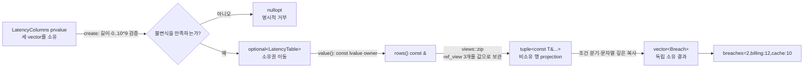

# 2026-09-23 — `std::views::zip` 행 투영과 가중 구간 스케줄링

오늘의 실무 주제는 C++23 `std::views::zip`으로 서로 다른 열(column)을 같은 인덱스의 행(row)처럼 **복사 없이 함께 순회**하는 것이다. `LatencyTable`과 `StockTable`은 실제 `vector` 저장소를 소유하고 생성 경계에서 열 길이와 허용 수치 범위를 검증한다. `rows() const &`는 살아 있는 lvalue 소유자에서만 비소유 zip view를 만들며, `rows() &&`와 `rows() const &&`를 삭제해 곧 파괴될 임시 객체에서 댕글링 view가 나오는 실수를 막는다.

대회 문제는 [CSES 1140 — Projects](https://cses.fi/problemset/task/1140/)다. 끝나는 날이 빠른 순서로 프로젝트를 정렬하고, 각 프로젝트와 함께 선택할 수 있는 이전 접두사의 크기를 이분 탐색한 뒤 “현재를 버린 최적값”과 “현재를 고른 최적값” 중 큰 값을 저장한다.

## 오늘의 목표와 생성 파일

- [`main.cpp`](main.cpp): 검증된 지연 시간 열 저장소를 zip 행으로 빌리고, 독립 수명의 `Breach` 목록을 만든다.
- [`problem.cpp`](problem.cpp): 재고 열을 zip으로 읽어 재주문 보고서를 만들고, 길이 오류와 음수 수량을 명시적으로 거부하는 연습이다.
- [`icpc_problem.cpp`](icpc_problem.cpp): CSES 1140에 제출 가능한 종료일 정렬 + 이분 탐색 + 동적 계획법 풀이이다.
- [`CMakeLists.txt`](CMakeLists.txt), [`run_icpc_test.cmake`](run_icpc_test.cmake): 세 C++23 프로그램과 stdout 전체 비교 테스트를 구성한다.
- [`CHECKPOINT.md`](CHECKPOINT.md): 기초 문법, 값 범주·수명, 표준 호출 계약, DP 불변식을 실제 식으로 검증한다.
- [`../algorithm/weighted-interval-scheduling.md`](../algorithm/weighted-interval-scheduling.md): 가중 구간 스케줄링의 적용 조건, 점화식, 증명, 구현 뼈대를 정리한 공용 대표 문서다.

## `main.cpp` 구조도



`LatencyTable`이 파괴되거나 내부 vector가 재할당되면 zip의 반복자와 행 참조를 더 이상 사용할 수 없다. 오늘 코드는 view를 함수 안에서 즉시 소비하고 `Breach::service`에 문자열을 깊게 복사하므로 반환 목록은 table보다 오래 살 수 있다.

## 초보자를 위한 코드 읽기

- `int`는 검증된 `0..10^9` 관측값과 그 안전한 차이를 담는 기본 정수 타입이고, `std::size_t`는 컨테이너 크기를 표현하는 부호 없는 정수 타입이다. `int over_budget_ms{}` 같은 빈 중괄호 초기화는 값을 `0`으로 만들며, 중괄호는 잘못된 축소 변환도 막는다. 재고 총합은 최대 `10^15`까지 안전하게 담도록 `long long`을 쓴다.
- `struct LatencyColumns`와 `struct Breach`의 멤버는 기본적으로 `public`이다. 반면 `class LatencyTable`은 기본 접근이 `private`이고, `public:` 팩터리와 관찰자 뒤에 `private:` 소유 저장소와 생성자를 둬 “길이가 같은 열만 존재한다”는 불변식을 지킨다.
- `explicit LatencyTable(LatencyColumns&& columns)`는 복사 목록 초기화에 의한 의도하지 않은 변환을 막고 검증된 팩터리만 직접 생성하게 한다. `: service_names_{std::move(columns.service_names)}, ...`는 생성자 본문 대입이 아니라 세 멤버가 태어날 때 바로 초기화하는 **멤버 초기화 목록**이다.
- `collect_breaches(const LatencyTable& table)`에서 앞의 `BreachList`는 반환형, 괄호 안은 매개변수다. `const&`는 table을 소유하지 않고 호출 동안 읽기만 빌린다. 포인터도 주소를 보관하는 비소유 표현이 될 수 있지만 오늘 공개 API는 null이 될 수 없는 참조를 쓴다.
- `rows() const &` 끝의 `&`는 매개변수가 아니라 멤버 함수의 **참조 한정자**다. 이름 있는 lvalue table에서만 안전한 view를 만들도록 하고, 삭제된 `rows() &&`/`rows() const &&`는 non-const와 const 임시 owner 호출을 모두 컴파일 단계에서 거부한다.
- `using ServiceNames = std::vector<std::string>`은 새 타입을 만드는 것이 아니라 긴 타입에 별칭을 붙인다. `std::vector<std::string>`에서 `std::string`은 원소 타입 템플릿 인자다.
- `if`는 열 길이와 임계값 비교에 따라 조건 분기하고, range-`for`는 zip 반복자를 전진시키며 세 열을 lockstep으로 읽는다. ICPC 코드의 `while`은 이분 탐색 구간을 절반씩 줄인다.

직접 해보기: `main.cpp`의 관측값 `132`를 예산과 같은 `120`으로 바꾸기 전에 출력과 결과 vector 크기를 예측한다. 이어 세 번째 열에서 원소 하나를 지우거나 관측값을 `-1`로 바꿔 팩터리가 빈 optional을 반환하는지 확인한다. 두 rvalue `rows()` 삭제 선언을 잠시 제거하고 임시 table에서 view를 보관했을 때 어떤 객체가 먼저 죽는지 수명 그림을 그린다.

## Modern C++ 설계, 값 범주와 객체 수명

`columns`, `table`, 이름 있는 `std::optional` 변수는 lvalue다. `LatencyColumns{...}`, `Breach{...}`, 팩터리가 값으로 돌려주는 결과는 prvalue다. `std::move(columns)`는 데이터를 곧바로 옮기지 않고 lvalue 식을 xvalue로 바꾼다. 실제 이동은 그 뒤 선택된 vector/string/도메인 타입 이동 생성자가 수행한다. 이동 뒤 원본은 파괴하거나 새 값을 대입할 수 있는 유효 상태지만 내용은 미지정일 수 있어 다시 의존하지 않는다.

`std::views::zip(service_names_, observed_ms_, budget_ms_)`의 세 인자는 `rows() const &` 안의 이름 있는 const lvalue다. 따라서 반환 view는 각 vector 자체를 소유권 이전하지 않고 `ref_view`에 준하는 비소유 연결을 보관한다. 역참조 결과는 대응 원소를 가리키는 참조 tuple이며 `auto&& [service, observed, budget]` 구조적 바인딩도 원소를 복사하지 않는다. zip은 가장 짧은 범위에서 끝나므로 팩터리의 길이 동일 검증이 없으면 뒤쪽 데이터가 조용히 사라질 수 있다.

`collect_breaches`는 참조 행에서 `std::string`을 `Breach` 안으로 깊게 복사한다. 따라서 반환 `vector<Breach>`는 원본 table과 view 수명에서 분리된다. 함수의 같은 타입 지역 결과는 구현이 NRVO로 목적 객체에 직접 만들 수 있고, 명시적인 같은 타입 prvalue 반환은 C++17부터 보장된 복사 생략 대상이다. 복사 생략이 허용되지 않는 경로에서도 접근 가능한 이동 생성자가 선택될 수 있다.

기계 실행 관점에서 zip 순회는 여러 반복자 load, 각 끝과의 비교, 동시 증가, 원소 참조 계산과 조건 분기로 나타날 수 있다. 문자열 깊은 복사는 길이 확인·할당·문자 저장을 포함할 수 있고, ICPC 이분 탐색은 중앙 위치 load·날짜 비교·조건 분기를 반복한다. 템플릿이 구체 타입을 알면 호출이 인라인될 수도 있다. 실제 명령, 분기 제거, 벡터화, 복사 생략과 메모리 배치는 CPU·ABI·표준 라이브러리·컴파일러·최적화 옵션에 따라 달라 특정 어셈블리로 단정하지 않는다.

## ICPC 문제와 풀이

- 문제 ID/제목: **CSES 1140 — Projects**
- 공식 출처 URL: <https://cses.fi/problemset/task/1140/>
- 입력: 프로젝트 수 `n`, 이어서 각 프로젝트의 시작일 `a`, 종료일 `b`, 보상 `p`가 주어진다. 시작일과 종료일을 포함한 모든 날에 참여한다.
- 출력: 같은 날 두 프로젝트에 참여하지 않도록 골랐을 때 얻을 수 있는 최대 보상 하나.
- 제약: `1 <= n <= 200,000`, `1 <= a <= b <= 10^9`, `1 <= p <= 10^9`.
- 예제: 네 프로젝트 `(2,4,4)`, `(3,6,6)`, `(6,8,2)`, `(5,7,3)`의 답은 `7`이다.
- 핵심 알고리즘: 종료일 정렬, 호환 가능한 이전 접두사 이분 탐색, 1차원 DP.
- 시간 복잡도: 정렬 `O(n log n)` + 프로젝트별 이분 탐색 `O(n log n)`, 합계 `O(n log n)`.
- 공간 복잡도: 정렬 배열, 종료일 배열, DP를 합쳐 `O(n)`.

정렬 뒤 `best[i]`를 “앞의 `i`개 프로젝트만 허용했을 때 최대 보상”으로 정의한다. 현재 프로젝트의 시작일보다 **엄격히 작은** 종료일만 호환된다. 호환 접두사 크기를 `k`라고 하면 `best[i+1] = max(best[i], reward[i] + best[k])`다. 첫 항은 현재를 버리는 모든 해, 둘째 항은 현재를 고르고 겹치지 않는 이전 최적해를 붙이는 모든 해를 대표하므로 빠지는 경우가 없다.

대회에서 자주 틀리는 지점은 다음과 같다.

- 닫힌 날짜 구간인데 `finish <= start`를 호환으로 보아 같은 날 두 프로젝트를 겹쳐 선택한다. 조건은 `finish < start`다.
- 이분 탐색 범위에 현재 프로젝트나 뒤 프로젝트를 포함한다.
- `dp[i]`의 인덱스가 프로젝트 번호인지 접두사 크기인지 섞어 off-by-one 오류를 낸다.
- 최대 합 `200,000 * 10^9 = 2 * 10^14`를 32비트 `int`에 저장한다.
- 보상만 큰 프로젝트를 먼저 고르는 탐욕이나, 시작일만 정렬한 국소 선택이 전역 최적을 보장한다고 착각한다.

## 오늘 사용한 표준 라이브러리

| 핵심 심볼 | 선언 헤더 | 항목 종류 | 실제 호출 멤버/함수 | 현재 코드에서의 역할 | 대표 문서 |
| --- | --- | --- | --- | --- | --- |
| `std::views::zip` | `<ranges>` | C++23 range adaptor customization point object | `std::views::zip(`, 숨은 `zip_view::begin/end/iterator operator*/++/==` | 검증된 세 lvalue vector를 가장 짧은 길이까지 비소유 행 참조로 결합 | [`algorithms-and-ranges.md`](../standard-library/algorithms-and-ranges.md) |
| `std::get` | `<tuple>` | 함수 템플릿 오버로드 집합 | 구조적 바인딩이 ADL로 찾는 `get<0/1/2>(zip-iterator-reference)` | zip 행 tuple의 세 참조를 복사 없이 각 바인딩 이름에 연결 | [`ownership-and-vocabulary-types.md`](../standard-library/ownership-and-vocabulary-types.md) |
| `std::optional`, `std::nullopt` | `<optional>` | 선택적 소유 값 타입·빈 상태 객체 | converting 생성자, `optional::has_value`, `optional::value` | 길이·수치 범위를 만족한 열만 table 값으로 게시하고 위반은 빈 상태로 거부 | [`ownership-and-vocabulary-types.md`](../standard-library/ownership-and-vocabulary-types.md) |
| `std::vector` | `<vector>` | 연속 동적 시퀀스 컨테이너 | initializer-list/`기본 생성자`/`count 생성자`/`fill 생성자`, `vector::reserve`, `vector::push_back`, `vector::size`, `vector::operator[]` | 세 열, 소유 결과, 프로젝트·종료일·DP 저장 | [`containers-and-views.md`](../standard-library/containers-and-views.md) |
| `std::string` | `<string>` | 소유 문자 컨테이너 | 리터럴 변환 생성자, 복사/이동 생성 | service 이름과 결과 이름의 독립 수명 확보 | [`containers-and-views.md`](../standard-library/containers-and-views.md) |
| `std::ranges::sort` | `<algorithm>` | ranges 비교 정렬 customization point object | `std::ranges::sort(projects, comparator)` | 프로젝트를 종료일·시작일 순으로 제자리 정렬 | [`algorithms-and-ranges.md`](../standard-library/algorithms-and-ranges.md) |
| `std::move` | `<utility>` | 값 범주 변환 함수 템플릿 | `std::move(` | 열 소유권을 팩터리 매개변수에서 table 멤버로 전달할 의도를 표시 | [`io-parsing-and-utilities.md`](../standard-library/io-parsing-and-utilities.md) |
| `std::size_t` | `<cstddef>` | 크기 타입 별칭 | vector 크기, 첨자, 이분 탐색 경계 | 유효한 비음수 크기와 반열린 접두사 표현 | [`bit-and-byte-utilities.md`](../standard-library/bit-and-byte-utilities.md) |
| `std::cin`, `std::cout`, `std::ios::sync_with_stdio` | `<iostream>` | 스트림 객체·정적 함수·연산자 | `sync_with_stdio(`, `std::cin.tie(`, `std::cin >>`, `std::cout <<`, `operator<<(std::ostream&, char)` | 저지 입력, 학습/정답 출력, 배치 I/O 설정 | [`io-parsing-and-utilities.md`](../standard-library/io-parsing-and-utilities.md) |

## 검증

저장소의 w64devkit GCC 16.1.0에서 다음 검증을 실제로 통과했다.

- 세 C++ 소스를 C++23, `-Wall -Wextra -Wpedantic -Wconversion -Wshadow -Werror`, `_GLIBCXX_ASSERTIONS` 조건으로 엄격 검사했다.
- CMake Release 빌드와 CTest **8/8**이 통과했다. 두 학습 예제, CSES 공식 예제, 단일 프로젝트, 같은 날 경계 충돌, 완전 분리, 같은 종료일, 32비트를 넘는 보상 합을 stdout 전체로 비교했다.
- 고정 seed `20260923`으로 만든 프로젝트 수 1~12의 무작위 입력 **1,000개**를 모든 부분집합을 검사하는 독립 oracle과 대조해 1,000/1,000 일치했다.
- `n=200,000`, 보상 `10^9`인 서로 겹치지 않는 최대 크기 입력에서 정답 `200,000,000,000,000`을 확인했다. 로컬 실행은 약 0.144초였지만 시간 수치는 환경에 따라 달라진다.
- 공용 알고리즘 문서의 C++20 뼈대와 `views::zip` 문서의 C++23 예제를 각각 엄격 경고로 컴파일하고 예상 출력 `7`, `2/cache:8/api:12`를 확인했다.
- 이번 실행에서 변경한 Markdown 9개의 로컬 링크가 모두 유효했고, 새 파일 8개의 UTF-8 무 BOM·LF·최종 개행·후행 공백 검사가 통과했다.
- 표준 라이브러리 감사는 최신 3개 C++ 파일·18개 심볼과 전체 64개 날짜·173개 C++ 파일·167개 심볼·55개 헤더 범위에서 모두 통과했다.

빌드 산출물은 Git이 무시하는 `build/` 아래에만 만들며 커밋하지 않는다.

```powershell
$kit = (Resolve-Path tools/w64devkit/bin).Path
$env:Path = "$kit;$env:Path"
cmake -S dailystudy/exercise/2026-09-23 -B build/daily-2026-09-23 -G "MinGW Makefiles" "-DCMAKE_CXX_COMPILER=g++.exe" -DCMAKE_BUILD_TYPE=Release
cmake --build build/daily-2026-09-23
ctest --test-dir build/daily-2026-09-23 --output-on-failure
& dailystudy/exercise/tools/audit-standard-library-docs.ps1 -Scope all
```
