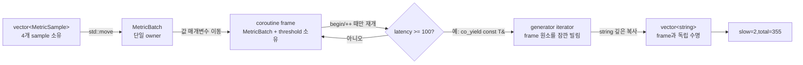

# 2026-09-25 — `std::generator` 소유 지연 스트림과 Meet-in-the-middle

오늘의 실무 주제는 C++23 `std::generator`로 큰 입력 배치를 중간 결과 vector로 복제하지 않고 **필요한 항목만 한 건씩 지연 생산**하는 것이다. `MetricBatch`와 `InventorySnapshot`을 코루틴의 값 매개변수로 옮겨 coroutine frame이 원본을 소유하게 하고, `generator<const T&>`가 내놓는 참조를 순회 안에서만 사용한 뒤 필요한 문자열은 깊게 복사한다.

대회 문제는 [CSES 1628 — Meet in the Middle](https://cses.fi/problemset/task/1628/)이다. 최대 40개의 선택을 그대로 `2^40`번 보지 않고, 두 절반의 부분집합 합을 각각 최대 `2^20`개 열거한 뒤 정렬·이진 탐색으로 합이 목표인 쌍의 중복 개수까지 센다.

## 오늘의 목표와 생성 파일

- [`main.cpp`](main.cpp): frame-owned 성능 측정 배치에서 느린 항목을 참조로 지연 생산하고 독립 문자열 결과를 만든다.
- [`problem.cpp`](problem.cpp): 재고 snapshot에서 재주문 대상만 지연 생산하는 직접 연습이다.
- [`icpc_problem.cpp`](icpc_problem.cpp): CSES 1628에 제출 가능한 iterative subset-sum 열거 + `equal_range` 풀이이다.
- [`CMakeLists.txt`](CMakeLists.txt), [`run_icpc_test.cmake`](run_icpc_test.cmake): 세 C++23 프로그램과 stdout 전체 비교 9개 테스트를 구성한다.
- [`CHECKPOINT.md`](CHECKPOINT.md): 기초 문법, 값 범주·수명, STL 호출 계약, MITM 증명을 실제 식으로 검증한다.
- [`../algorithm/meet-in-the-middle-subset-sum.md`](../algorithm/meet-in-the-middle-subset-sum.md): 정의부터 변형·정확성 증명까지 정리한 공용 대표 문서다.

## `main.cpp` 구조도



`std::generator`는 coroutine frame을 소유하지만 아무 외부 객체의 수명을 자동으로 늘려 주지는 않는다. 오늘은 입력 owner 자체를 값 매개변수로 frame에 옮겼기 때문에 산출 참조가 순회 중 유효하다. 그래도 iterator를 증가시키거나 generator를 파괴한 뒤 산출 참조를 저장해 사용하는 API로 확장하지 않는다.

## 초보자를 위한 코드 읽기

- `int latency_ms{}`의 `int`는 기본 정수 타입이고 빈 중괄호는 0으로 값 초기화한다. 부분집합 합과 답은 32비트를 넘으므로 `long long`을 쓴다. `std::size_t`는 vector 크기와 인덱스에 맞는 부호 없는 타입이다.
- `struct MetricSample` 멤버는 기본 `public`이라 값 묶음에 알맞다. `class MetricBatch` 멤버는 기본 `private`이고 `public:` 관찰자와 이동 API만 열어 저장소 소유권을 감춘다.
- `explicit MetricBatch(std::vector<MetricSample> samples)`는 vector가 batch로 몰래 변환되는 복사 초기화를 막는다. 함수 이름과 같은 생성자에는 반환형을 쓰지 않는다.
- `: samples_{std::move(samples)}`는 생성자 본문 대입이 아니라 멤버가 태어날 때 초기화하는 **멤버 초기화 목록**이다. 선언 순서가 실제 초기화 순서다.
- `using SlowSampleStream = std::generator<const MetricSample&>`은 새 강한 타입이 아니라 긴 타입의 별칭이다. `const MetricSample&`가 첫 템플릿 인자이며 산출 원소가 읽기 전용 참조임을 표현한다.
- `select_slow_samples(MetricBatch batch, const int threshold_ms)`에서 앞은 반환형, 괄호 안은 매개변수다. batch는 값으로 frame에 소유되고 정수는 복사된다.
- `samples() const &`의 첫 `const`는 원소를 이 경로로 바꾸지 않는다는 뜻이고 끝의 `&`는 lvalue owner에만 호출하도록 하는 참조 한정자다. `const &&` overload를 삭제해 임시 owner에서 참조를 꺼내지 못하게 한다.
- 포인터는 null일 수 있는 주소 값이고 참조는 기존 객체의 별명이다. `const MetricSample& sample`은 소유하지 않으므로 owner/frame보다 오래 저장하면 안 된다.
- `if`는 비교 결과에 따라 조건 분기하고 range-`for`는 숨은 `begin/end`, 역참조, 증가, 끝 비교를 수행한다. ICPC 코드의 이중 `for`는 기존 부분합 접두사를 읽어 새 합을 뒤에 붙인다.

직접 해보기: `gateway` 지연 시간을 `100`으로 바꾸기 전에 경계가 포함되는지 출력부터 예측한다. 이어 `select_slow_samples`의 매개변수를 `MetricBatch&`로 바꾸고 호출자 batch가 먼저 파괴될 수 있는 API를 그려 본다. ICPC 예제에서 `previous_size` 대신 루프 조건마다 `sums.size()`를 읽으면 왜 현재 값을 반복 선택하는지 작은 목록으로 추적한다.

## Modern C++ 객체 모델, 값 범주와 수명

이름 있는 `samples`, `batch`, `stream`은 lvalue다. `MetricSample{...}`과 coroutine 함수가 반환하는 generator 결과는 prvalue다. `std::move(samples)`는 데이터를 이동하는 명령이 아니라 lvalue 식을 xvalue로 바꾸는 cast이며, 이어 선택된 vector 이동 생성자가 실제 저장소 소유권을 이전한다. 이동 뒤 원본은 파괴하거나 새 값을 대입할 수 있는 유효 상태지만 내용은 미지정이라 읽기에 의존하지 않는다.

coroutine 호출 시 값 매개변수 `MetricBatch batch`가 frame 안에 보관되고 initial suspend에서 멈춘다. `SlowSampleStream stream{select_slow_samples(...)}`는 반환 prvalue로 목적 객체를 직접 초기화하며 generator는 복사 불가능하고 이동 가능하다. 이름 있는 지역 결과를 반환하는 일반 함수에는 NRVO가 허용되고, 같은 타입 prvalue 직접 초기화는 C++17 이후 보장된 복사 생략 대상이다.

`co_yield sample`의 sample은 frame-owned vector 원소 lvalue다. `std::generator<const MetricSample&>` iterator 역참조도 같은 원소의 const lvalue 참조를 내놓는다. `copied_services.push_back(sample.service)`는 문자열 문자를 새 string으로 깊게 복사하므로 결과 vector는 generator보다 오래 살아도 안전하다. 반대로 sample 주소나 `string_view`만 보관하면 frame 파괴 뒤 댕글링한다.

generator는 `input_range`인 단일 통과 view다. 첫 `begin()`이 최초 산출까지 frame을 재개하고 같은 generator에 `begin()`을 두 번 호출하는 것은 미정의 동작이다. iterator `++`는 다음 `co_yield` 또는 종료까지 다시 실행한다. 멀티패스가 필요한 API라면 결과를 소유 컨테이너로 materialize하거나 다른 범위 타입을 선택한다.

## 기계 실행 관점

generator 생성은 coroutine frame 저장 공간 확보와 상태 초기화를 포함할 수 있다. 최초 `begin`과 각 iterator 증가는 저장된 재개 위치를 읽고 다음 상태로 간접 분기하며, `co_yield`는 현재 원소 주소와 중단 상태를 저장할 수 있다. filter 조건은 정수 load·비교·조건 분기, 깊은 문자열 복사는 길이 load·할당·문자 store를 유발할 수 있다. 이 예제는 가상 함수를 쓰지 않아 언어상 가상 간접 호출을 요구하지 않지만 coroutine 재개 자체는 구현이 관리하는 간접 제어 이동일 수 있다.

MITM 코드는 연속 부분합 배열 load/store, 정렬 비교·교환, 이진 탐색의 중앙 원소 load·비교·조건 분기를 수행할 수 있다. 템플릿과 구체 타입이 보이면 많은 호출이 인라인될 수 있고 frame 할당도 허용 조건에서 최적화될 수 있다. 실제 명령, 복사 생략, 분기 제거, 벡터화, 메모리 배치는 CPU·ABI·표준 라이브러리·컴파일러·최적화 옵션에 따라 달라 특정 어셈블리로 단정하지 않는다.

## ICPC 문제와 풀이

- 문제 ID/제목: **CSES 1628 — Meet in the Middle**
- 공식 출처 URL: <https://cses.fi/problemset/task/1628/>
- 입력: `n`, 목표 합 `x`, 이어서 양의 정수 `n`개.
- 출력: 위치 기준 부분집합 중 합이 정확히 `x`인 경우의 수.
- 제약: `1 <= n <= 40`, `1 <= x,t_i <= 10^9`.
- 공식 예제: `1 2 3 2`에서 목표 5를 만드는 위치 선택은 3개다.
- 핵심 알고리즘: 절반 분할, iterative subset-sum 열거, 한쪽 정렬, 보수 합 `equal_range`.
- 시간 복잡도: 균등 분할에서 `O(n * 2^(n/2))`.
- 공간 복잡도: 두 절반 합 목록 `O(2^(n/2))`.

절반 열거의 불변식은 `k`개 값을 처리한 목록이 그 `k`개로 만드는 모든 부분집합 합을 선택 하나당 정확히 한 번 담는다는 것이다. 다음 값은 “고르지 않은 기존 목록”과 “고른 기존 합+값 목록”으로 완전 분할된다. 모든 전체 부분집합은 왼쪽·오른쪽 부분집합 쌍으로 유일하게 분해되므로, 왼쪽 합마다 필요한 오른쪽 합의 전체 중복 구간 크기를 더하면 모든 답을 정확히 한 번 센다.

대회에서 자주 틀리는 지점은 다음과 같다.

- 같은 합을 `unique`로 제거해 서로 다른 위치 선택을 잃는다.
- `previous_size`를 고정하지 않아 방금 붙인 합을 다시 읽고 같은 값을 여러 번 고른다.
- 정렬하지 않은 목록에 `equal_range`를 호출해 partition 전제조건을 깬다.
- 합·보수·답을 32비트에 저장한다. 40개의 1에서 목표 20의 답은 `137846528820`이다.
- 빈 부분집합 합 0을 빼서 한쪽 절반만 사용하는 해를 잃는다.
- `1 << width`를 int로 계산하거나 큰 shift의 전제조건을 확인하지 않는다.

자세한 증명과 투 포인터·가장 가까운 합·4-SUM 변형은 [`../algorithm/meet-in-the-middle-subset-sum.md`](../algorithm/meet-in-the-middle-subset-sum.md)에 있다.

## 오늘 사용한 표준 라이브러리

| 핵심 심볼 | 선언 헤더 | 항목 종류 | 실제 호출 멤버/함수 | 현재 코드에서의 역할 | 대표 문서 |
| --- | --- | --- | --- | --- | --- |
| `std::generator<const T&>` | `<generator>` | C++23 이동 전용 class template·view/input range | coroutine 반환 구성, `promise_type::yield_value`, 숨은 `begin/end/iterator::operator*/++/==` | frame-owned 배치에서 읽기 전용 원소를 단일 통과로 지연 노출 | [`algorithms-and-ranges.md`](../standard-library/algorithms-and-ranges.md) |
| `std::move` | `<utility>` | 함수 템플릿 | `std::move(samples)`, `std::move(batch)`, `std::move(items)`, `std::move(snapshot)` | lvalue를 xvalue로 바꾸고 선택된 이동 생성자에 소유권 이전을 허용 | [`io-parsing-and-utilities.md`](../standard-library/io-parsing-and-utilities.md) |
| `std::vector<T>` | `<vector>` | 소유 시퀀스 class template | `기본 생성자`, `count 생성자`, 이동 생성자, `vector::reserve`, `vector::push_back`, `vector::size`, `vector::operator[]`, 숨은 `begin/end` | 배치·복사 결과·절반 부분합을 연속 저장 | [`containers-and-views.md`](../standard-library/containers-and-views.md) |
| `std::string` | `<string>` | 소유 문자 시퀀스·생성자 | `string(const char*)`, 복사/이동 생성 | 도메인 이름과 generator 밖 독립 결과를 깊게 소유 | [`containers-and-views.md`](../standard-library/containers-and-views.md) |
| `std::ranges::sort` | `<algorithm>` | ranges 알고리즘 함수 객체 | `std::ranges::sort(right_sums)` | 오른쪽 부분합을 제자리 오름차순 정렬 | [`algorithms-and-ranges.md`](../standard-library/algorithms-and-ranges.md) |
| `std::ranges::equal_range` | `<algorithm>` | ranges 이진 탐색 알고리즘 함수 객체 | `std::ranges::equal_range(right_sums, needed)`, 반환 `subrange::size()` | 정렬된 합 목록에서 같은 보수 합의 전체 multiplicity 계산 | [`algorithms-and-ranges.md`](../standard-library/algorithms-and-ranges.md) |
| `std::size_t` | `<cstddef>` | 부호 없는 크기 타입 | 인덱스, 절반 폭, `size_t{1} << width` | 최대 `2^20` 원소의 크기·shift를 표현 | [`bit-and-byte-utilities.md`](../standard-library/bit-and-byte-utilities.md) |
| `std::ios::sync_with_stdio`, `std::cin`, `std::cout` | `<iostream>` | 정적 함수·전역 stream 객체·연산자 | `std::ios::sync_with_stdio(false)`, `std::cin.tie(nullptr)`, `std::cin >> value`, `std::cout << answer`, `operator<<(std::ostream&, char)` | 빠른 입력 설정, 정수 추출, 결과 출력 | [`io-parsing-and-utilities.md`](../standard-library/io-parsing-and-utilities.md) |

## 검증 과정

- 기존 45개 ICPC/OJ 문제, 자동화 메모리, 공용 알고리즘 문서 42개를 검색해 CSES 1628과 MITM 주제가 중복되지 않음을 확인했다.
- 공식 CSES 예제와 단일 원소 일치/불일치, 같은 합 중복, 큰 값, 40개의 1에서 64비트 답을 stdout 전체 비교 테스트로 구성했다.
- repository w64devkit GCC 16.1.0 C++23 Release 빌드와 CTest **9/9**이 통과했다. 32비트 부분합 wraparound와 64비트 정답을 서로 다른 경계 테스트로 검증했다.
- `-Wall -Wextra -Wpedantic -Wconversion -Wshadow -Werror -D_GLIBCXX_ASSERTIONS` strict 빌드로 세 실행 파일을 다시 만들고 실제 출력까지 비교했다.
- seed `20260925`로 작은 입력 2,000건을 완전 탐색 oracle과, 큰 입력 20건을 독립 0/1 합계 DP oracle과 대조했다. 40개의 1과 40개의 `10^9` 최대 크기 stress도 통과했다.
- 최신/전체 표준 라이브러리 감사가 65개 날짜·176개 C++ 파일·169개 심볼·56개 헤더에서 통과했다. 새 Markdown C++ 예제 3개 컴파일, Mermaid parse, 변경 문서의 로컬 링크 408개, UTF-8·마지막 LF·trailing-whitespace 검사도 통과했다. PowerShell 5.1이 한글 스크립트를 올바르게 읽도록 감사 스크립트의 기존 UTF-8 BOM은 유지했다.

## 빌드와 실행

저장소 루트의 PowerShell에서 다음처럼 실행한다. 산출물은 저장소 공용 `build/` 아래에 생기며 커밋하지 않는다.

```powershell
$kit = (Resolve-Path tools/w64devkit/bin).Path
$env:Path = "$kit;$env:Path"
cmake -S dailystudy/exercise/2026-09-25 -B build/daily-2026-09-25 -G "MinGW Makefiles" "-DCMAKE_CXX_COMPILER=$kit/g++.exe" -DCMAKE_BUILD_TYPE=Release
cmake --build build/daily-2026-09-25 --parallel
ctest --test-dir build/daily-2026-09-25 --output-on-failure
powershell -ExecutionPolicy Bypass -File dailystudy/exercise/tools/audit-standard-library-docs.ps1 -Scope all
```
