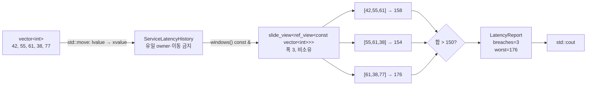

# 2026-09-28 — `std::views::slide`의 안전한 비소유 창과 Sliding Window Cost

오늘의 Modern C++ 주제는 C++23 `std::views::slide`로 연속 저장소를 복사하지 않고 **서로 겹치는 고정 폭 창**으로 보는 방법이다. `ServiceLatencyHistory`가 `std::vector<int>`를 소유하고, `windows() const &`만 비소유 `slide_view`를 내주며 `const &&` 호출은 삭제한다. view의 편리함만 보여 주는 데서 멈추지 않고 owner 수명, 재할당에 따른 무효화, 양수 폭 전제조건을 API에 드러내는 실무 패턴이다.

오늘의 대회 문제는 [CSES 1077 — Sliding Window Cost](https://cses.fi/problemset/task/1077/)다. 각 창을 두 `std::multiset`으로 나누고 각 부분의 합을 함께 유지하여 중앙값 기준 절댓값 합을 즉시 계산한다. 전체 시간은 `O(n log k)`, 창 자료구조의 추가 공간은 `O(k)`다.

## 오늘의 목표와 생성 파일

- [`main.cpp`](main.cpp): 5개 지연 시간의 폭 3 겹치는 창을 빌려 예산 초과 수와 최대 합을 계산한다.
- [`problem.cpp`](problem.cpp): 진동 측정값의 폭 3 창마다 최솟값·최댓값 차이를 검사하는 직접 연습이다.
- [`icpc_problem.cpp`](icpc_problem.cpp): CSES 1077에 제출 가능한 두 multiset + 부분합 풀이이다.
- [`CMakeLists.txt`](CMakeLists.txt), [`run_icpc_test.cmake`](run_icpc_test.cmake): 세 C++23 실행 파일과 stdout 전체 비교 테스트를 구성한다.
- [`CHECKPOINT.md`](CHECKPOINT.md): 기초 문법, 값 범주·수명, 6항목 호출 계약, 창 중앙값 불변식을 실제 식으로 검증한다.
- [`../algorithm/sliding-window-median-cost.md`](../algorithm/sliding-window-median-cost.md): 정의, 불변식, 정확성 증명, 복잡도, 변형을 담은 알고리즘 대표 문서다.

## `main.cpp` 구조도



`slide_view`는 원소 snapshot이 아니다. 위 세 창은 모두 `history` 안의 같은 vector 원소를 빌린다. 따라서 view·창·반복자는 owner보다 오래 살 수 없다. 이 구체 `ref_view` 기반의 바깥 view 값은 vector 객체를 가리키므로 재할당 뒤 새 `begin/end`를 얻어 다시 순회할 수 있지만, 재할당 전에 얻은 slide iterator·창·원소 참조는 무효화된다. 오늘 class는 저장소를 `private`으로 감추고 복사·이동을 삭제해 외부 구조 변경 경로 자체를 닫는다.

## 초보자를 위한 코드 읽기

- `#include <ranges>`는 `std::views::slide`, `slide_view`, `ref_view`와 범위 타입 특성을, `<vector>`는 연속 저장소 owner를, `<utility>`는 `std::move`를, `<iostream>`은 표준 스트림을 선언한다. ICPC 소스의 `<set>`은 정렬 노드 컨테이너 `std::multiset`을 선언한다.
- `int budget_breaches{};`에서 `int`는 기본 정수 타입이고 빈 중괄호는 0으로 값 초기화한다. ICPC 값·부분합·비용은 32비트를 넘을 수 있어 `long long`을 쓴다.
- `struct LatencyReport`의 멤버는 기본 `public`이라 단순 결과 묶음에 알맞다. `class ServiceLatencyHistory`의 멤버는 기본 `private`이며 `public:` API만 외부에 연다. `final`은 이 수명 정책을 상속으로 바꾸지 못하게 한다.
- `explicit ServiceLatencyHistory(std::vector<int>&& latency_samples)`의 생성자에는 반환형이 없다. `explicit`은 vector가 history로 뜻하지 않게 암시 변환되는 것을 막고, `&&`는 이동을 허용한 인수에 바인딩된다.
- `: latency_ms_{std::move(latency_samples)}`는 생성자 본문 대입이 아니라 멤버가 태어날 때 실행되는 **멤버 초기화 목록**이다. 실제 초기화 순서는 목록 순서가 아니라 멤버 선언 순서다.
- `using Windows = std::ranges::slide_view<BaseView>;`는 새 강한 타입이 아니라 긴 타입의 별칭이다. `BaseView`가 템플릿 인자이며 `const std::vector<int>`를 비소유로 빌린다는 사실을 타입에 기록한다.
- `Windows windows() const &`에서 앞의 `Windows`는 반환형, 빈 괄호는 매개변수가 없음을 뜻한다. 뒤의 `const`는 owner를 바꾸지 않는다는 약속이고 `&`는 lvalue 객체에만 호출할 수 있다는 참조 한정자다.
- 참조는 이미 존재하는 객체의 별명이고 이 코드의 `const ServiceLatencyHistory&`는 null이 될 수 없다. 포인터는 주소 값이어서 null을 표현하고 재지정할 수 있다. 어느 쪽도 별도 소유권 계약 없이는 대상 수명을 늘리지 않는다.
- 바깥 range-`for`는 개념적으로 view의 `begin`, `end`, 끝 비교, 역참조, 증가를 반복한다. 안쪽 range-`for`도 현재 창의 세 원소에 같은 연산을 한다. `if`는 합과 예산을 비교해 조건 분기하고 결과 멤버를 갱신한다.

직접 해보기: `budget_ms`를 154로 바꾸기 전에 어느 창이 초과인지 먼저 계산한다. 이어 입력 vector를 원소 2개로 줄였을 때 폭 3 view가 빈 범위가 되어 결과가 `{0,0}`인지 예측한다. `windows() const && = delete`를 잠시 없앴다고 가정하고 `ServiceLatencyHistory{std::vector<int>{1,2,3}}.windows()`가 왜 전체 식 뒤 댕글링하는지도 수명 선으로 그린다.

## `slide_view`의 역할, 폭, 수명과 무효화

`std::views::slide(range, width)`는 상태 없는 range adaptor 객체의 함수 호출이다. 기반 범위는 최소 `forward_range`여야 하고 `width > 0`이 전제조건이다. 길이 `N`에서 `N >= width`이면 `N-width+1`개 창, 더 짧으면 0개 창을 만든다. view 구성 자체는 `O(1)`이고 원소를 복사하거나 별도 버퍼를 할당하지 않는다.

오늘의 `Windows`는 `slide_view<ref_view<const vector<int>>>`다. `ref_view`가 owner를 소유하지 않으므로 다음 계약을 지켜야 한다.

1. `ServiceLatencyHistory`가 view와 모든 창·반복자보다 오래 살아야 한다.
2. 순회 중 기반 vector를 파괴하거나 재할당·구조 변경하지 않는다.
3. 끝 반복자를 역참조하거나 증가시키지 않고, 다른 범위의 반복자를 비교하지 않는다.
4. 같은 owner를 여러 실행 흐름이 읽는 조건과 쓰는 조건을 혼동하지 않는다. view는 snapshot·잠금·원자성을 제공하지 않는다.

창 안의 값을 모두 합치는 현재 분석은 창 수를 `W`라 할 때 `O(W * width)`다. `slide`는 창 경계만 제공할 뿐 누적합을 대신 계산하지 않는다. 폭이 매우 크고 각 창 합만 필요하면 prefix sum이나 한 칸 이동 갱신으로 `O(N)`을 선택해야 한다.

## 값 범주, 참조 바인딩, 복사·이동과 객체 수명

이름이 있는 `latency_samples`, `history`, `report`, `window` 식은 lvalue다. `std::vector<int>{...}`, `history.windows()`의 반환 view, `analyze_latency(...)`의 반환 결과는 prvalue다. `std::move(latency_samples)`는 데이터를 옮기는 명령이 아니라 그 lvalue를 같은 객체를 나타내는 xvalue로 바꾸는 cast다. 이어 선택된 vector 이동 생성자가 실제 저장소 소유권을 `history`의 멤버로 이전한다.

이동 뒤 원본 vector는 유효하지만 내용은 미지정이다. 파괴하거나 새 값을 대입할 수는 있어도 기존 크기나 원소가 남았다고 가정하면 안 된다. `ServiceLatencyHistory`는 이후 복사와 이동을 모두 삭제하므로 이미 내준 ref-view의 owner 주소를 실수로 바꾸지 않는다.

`analyze_latency(const ServiceLatencyHistory& history, int budget_ms)`의 첫 매개변수는 const lvalue 참조로 기존 owner에 바인딩되고 복사하지 않는다. 정수는 값으로 복사되어 호출자 변수와 독립적이다. `history.windows()`가 만든 view prvalue는 range-`for`의 숨은 `auto&& __range`에 바인딩되어 루프 끝까지 view **자체의** 수명이 연장되지만, 기반 owner 수명까지 연장하지는 않는다.

함수의 이름 있는 `report`를 반환하는 식은 lvalue지만 NRVO 후보다. 컴파일러가 NRVO를 적용하면 호출자 객체에 처음부터 직접 만들고, 적용하지 않아도 작은 struct의 복사/이동은 두 int 값뿐이다. 같은 타입 prvalue로 목적 객체를 초기화하는 경우는 C++17의 보장된 복사 생략 규칙을 적용할 수 있다. “RVO이므로 무조건 복사 0회”라고 모든 이름 있는 반환까지 단정하지 않는다.

## 기계 실행 관점

`slide_view` 구성은 owner 주소·폭 같은 작은 상태를 저장하는 동작으로 낮아질 수 있고, 순회는 기반 반복자 또는 포인터의 load, 끝 비교, 증가로 구현될 수 있다. 창 합은 연속 `int` load와 add, 예산 검사는 compare와 조건 분기, 결과 갱신은 store가 될 수 있다. ICPC 풀이의 트리 삽입·탐색·삭제는 비교와 포인터 추적, 노드 할당/해제, 합계 load/store를 포함할 수 있다.

오늘 타입에는 가상 함수가 없으므로 언어상 virtual dispatch를 위한 가상 간접 호출은 필요하지 않다. 다만 템플릿 인라인, 분기 제거·조건 이동, 벡터화, 레지스터 배치와 실제 명령은 CPU·ABI·표준 라이브러리 구현·컴파일러·최적화 옵션에 따라 달라진다. 소스만 보고 특정 어셈블리나 할당 횟수를 단정하지 않는다.

## ICPC 문제와 두 `multiset` 풀이

- 문제 ID/제목: **CSES 1077 — Sliding Window Cost**
- 공식 출처: <https://cses.fi/problemset/task/1077/>
- 입력: 길이 `n`, 창 길이 `k`, 이어서 `n`개 정수 `x_i`.
- 출력: 왼쪽부터 각 길이 `k` 창을 한 값으로 만드는 최소 변화량 합 `n-k+1`개.
- 제약: `1 <= k <= n <= 200000`, `1 <= x_i <= 10^9`.
- 공식 예제: `2 4 3 5 8 1 2 1`, `k=3`의 답은 `2 2 5 7 7 1`이다.
- 핵심 알고리즘: `(값, 원래 인덱스)`를 작은 절반 `lower`와 큰 절반 `upper` 두 multiset에 분할하고 각 합을 유지한다.
- 시간 복잡도: 초기 창 `O(k log k)`, 각 이동 `O(log k)`, 전체 `O(n log k)`.
- 공간 복잡도: 창 상태 `O(k)`. 현재 제출 구현은 입력 vector도 보관하므로 전체 보조 저장은 `O(n+k)=O(n)`이다.

`Entry{value,index}`를 키로 쓰면 같은 값도 인덱스로 구분되어 나가는 원소 **정확히 하나**를 지울 수 있다. 각 공개 갱신 뒤 다음 불변식을 유지한다.

1. `lower`와 `upper`는 현재 창 원소를 중복 없이 완전히 분할한다.
2. `lower.size() == ceil(window_size/2)`, `upper.size() == floor(window_size/2)`이다.
3. `lower`의 모든 키는 `upper`의 모든 키보다 작거나 같다.
4. `lower_sum`, `upper_sum`은 각 파티션의 `value` 합과 정확히 같다.

따라서 `m = max(lower).value`는 아래쪽 중앙값이다. `lower`의 값은 모두 `m` 이하이고 `upper`의 값은 모두 `m` 이상이므로 비용은 절댓값 없이 다음처럼 계산된다.

```text
cost = m * |lower| - lower_sum
     + upper_sum - m * |upper|
```

중앙값은 절댓값 합을 최소화한다. 짝수 창에서는 두 중앙값 사이 어느 값도 최적이지만 아래쪽 중앙값을 골라도 비용은 같다. 새 원소 삽입과 나가는 원소 삭제 뒤 경계 원소를 옮겨 크기 불변식을 복구하면 순서 불변식도 유지된다. 합 변수까지 같은 이동 순서로 갱신하므로 위 식은 실제 비용과 일치한다.

대회에서 자주 틀리는 지점은 다음과 같다.

- 값만 multiset 키로 두고 `erase(value)`를 사용해 같은 값을 전부 지우거나 어느 복제본인지 잃는다.
- `int`로 부분합과 비용을 계산한다. 테스트의 `2,999,999,997`부터 이미 32비트 signed 범위를 넘는다.
- 재균형 크기를 `k/2`로만 고정해 홀수 창의 중앙값이 어느 파티션에 있는지 흔들린다.
- 노드를 반대편에 넣기 전에 원본을 지워, 삽입 할당이 실패했을 때 상태를 잃는다.
- `lower_sum`·`upper_sum` 갱신 순서를 빼먹거나 삭제할 파티션을 값만 보고 추측한다.
- 매 창을 새로 정렬해 `O(n k log k)` 또는 정렬 vector의 가운데 삭제로 `O(nk)`가 된다.

정확성 증명과 priority queue lazy deletion, 좌표 압축 Fenwick tree 변형은 [`../algorithm/sliding-window-median-cost.md`](../algorithm/sliding-window-median-cost.md)에 정리했다.

## 오늘 사용한 표준 라이브러리

| 핵심 심볼 | 선언 헤더 | 항목 종류 | 실제 호출 멤버/함수 | 현재 코드에서의 역할 | 대표 문서 |
| --- | --- | --- | --- | --- | --- |
| `std::views::slide`, `std::ranges::slide_view` | `<ranges>` | C++23 range adaptor 객체·view class template | `std::views::slide(latency_ms_, window_width)`, `std::views::slide(amplitudes_mg_, frame_width)`, 숨은 `begin/end`, iterator `operator*`, `operator++`, 비교 | owner의 연속 원소를 복사 없이 폭 3 겹치는 창으로 노출 | [`algorithms-and-ranges.md`](../standard-library/algorithms-and-ranges.md) |
| `std::ranges::ref_view`, `std::ranges::range_reference_t`, `std::ranges::range_difference_t` | `<ranges>` | view class template·타입 특성 별칭 | `ref_view<const vector<int>>`, 창 역참조 타입과 폭 타입 계산 | 비소유·const 기반 범위와 구현 독립적인 창/차이 타입 표현 | [`algorithms-and-ranges.md`](../standard-library/algorithms-and-ranges.md) |
| `std::vector<T>`, `std::allocator`, `std::initializer_list` | `<vector>`, `<memory>`, `<initializer_list>` | 연속 소유 시퀀스·할당자·목록 proxy class template | initializer-list 생성자, 이동 생성자, count 생성자, `vector::operator[]` | 지연 시간·진동 측정값·ICPC 입력을 소유하고 생성 인자/저장 정책을 표현 | [`containers-and-views.md`](../standard-library/containers-and-views.md) |
| `std::move`, `std::remove_reference_t` | `<utility>`, `<type_traits>` | 함수 템플릿/cast·alias template | `std::move(latency_samples)`, `std::move(measurements)` | 이름 있는 vector lvalue에서 참조를 제거한 xvalue 참조를 만들어 이동 생성자 선택 허용 | [`io-parsing-and-utilities.md`](../standard-library/io-parsing-and-utilities.md) |
| `std::multiset<Entry>`, `std::less<Entry>` | `<set>`, `<functional>` | 중복 허용 정렬 연관 컨테이너·비교 함수 객체 class template | multiset 기본 생성자, `multiset::size`, `multiset::insert`, `multiset::begin`, `multiset::end`, `multiset::find`, `multiset::erase`, 양방향 iterator `--`, `*`, `!=` | `(값,index)` 기본 엄격 순서로 현재 창을 두 절반에 유지하고 정확한 한 노드 삭제 | [`containers-and-views.md`](../standard-library/containers-and-views.md), [`algorithms-and-ranges.md`](../standard-library/algorithms-and-ranges.md) |
| `std::ios_base::sync_with_stdio`, `std::basic_ios`, `std::basic_istream`, `std::basic_ostream`, `std::char_traits`, `std::cin`, `std::cout` | `<ios>`, `<istream>`, `<ostream>`, `<iostream>`, `<string>` | 정적 함수·stream class template/객체·문자 정책·연산자 | `std::ios::sync_with_stdio(false)`, `std::cin.tie(nullptr)`, `std::cin >> value`, `std::cout << value`, 산술 멤버 overload, `operator<<(std::ostream&, char)` 등 문자열·char 비멤버 template | 빠른 입력 설정, 정수 입력, 학습 결과와 비용 출력 | [`io-parsing-and-utilities.md`](../standard-library/io-parsing-and-utilities.md) |

## 검증 과정

- 공식 문제 페이지에서 제목, `n/k/x_i` 제약과 예제 출력 `2 2 5 7 7 1`을 대조했다.
- CTest에는 학습 소스의 고정 출력 2건과 공식 예제, `k=1`, `k=n`, 중복값, 32비트를 넘는 비용 등 7개 stdout 전체 비교 사례를 구성했다.
- w64devkit GCC 16.1.0으로 Release 빌드와 `-Wall -Wextra -Wpedantic -Wconversion -Wshadow -Werror -D_GLIBCXX_ASSERTIONS` 엄격 빌드를 수행했고, CTest 7/7이 통과했다.
- 고정 경계 사례 11건과 seed `20260928`의 무작위 1,000건을 정렬 기반 브루트포스와 독립 대조했다. 별도 무작위 1,500건도 같은 오라클을 통과했다.
- 최대 제약 `n=200000, k=100000` 교대 입력에서 100,001개 결과가 모두 `49,999,999,950,000`임을 확인했다. 로컬 Release 실행 시간은 약 0.087초였으며 장비와 빌드 환경에 따라 달라진다.
- 표준 라이브러리 문서 감사는 최신 범위와 전체 범위에서 모두 통과했다. 전체 기준은 날짜 66개, C++ 파일 179개, 문서화 심볼 178개, 헤더 57개다.
- 이번 실행의 의도적 파일 17개에서 로컬 링크 415개, UTF-8·마지막 LF·후행 공백을 검사했다. Mermaid 구조도 1개를 파싱하고 Markdown C++ 예제 2개를 동일한 엄격 경고 설정으로 구문 검사했다.

## 빌드와 실행

저장소 루트의 PowerShell에서 다음처럼 실행한다. 산출물은 저장소 공용 `build/` 아래에만 만들고 커밋하지 않는다.

```powershell
$kit = (Resolve-Path tools/w64devkit/bin).Path
$env:Path = "$kit;$env:Path"
cmake -S dailystudy/exercise/2026-09-28 -B build/daily-2026-09-28 -G "MinGW Makefiles" "-DCMAKE_CXX_COMPILER=$kit/g++.exe" -DCMAKE_BUILD_TYPE=Release
cmake --build build/daily-2026-09-28 --parallel
ctest --test-dir build/daily-2026-09-28 --output-on-failure
powershell -ExecutionPolicy Bypass -File dailystudy/exercise/tools/audit-standard-library-docs.ps1 -Scope all
```
