# 2026-09-29 — `std::string::resize_and_overwrite` 직접 쓰기와 Booth 최소 회전

오늘의 Modern C++ 주제는 C++23 `std::string::resize_and_overwrite`로 **최대 결과 길이는 미리 알지만 실제 길이는 작성 뒤 정해지는 문자열**을 한 소유 버퍼 안에서 만드는 방법이다. `LogKeyNormalizer`는 원본 `std::string`을 소유하고, 동기 callback에 제한된 `char*` 쓰기 범위만 잠시 빌려 준다. callback은 초기화한 접두사의 실제 길이를 반환하고, 문자열은 그 길이만 최종 소유한다. 로그 키 정규화, C API 출력 버퍼, 인코딩·압축 결과 조립에서 불필요한 중간 문자열과 두 번째 크기 조정을 줄일 수 있는 실무 패턴이다.

오늘의 대회 문제는 [CSES 1110 — Minimal Rotation](https://cses.fi/problemset/task/1110/)이다. 두 회전 후보가 처음 달라지는 위치를 찾고, 사전순으로 큰 후보와 그 뒤의 공통 접두사 구간을 한꺼번에 제거하는 Booth 알고리즘으로 푼다. 전처리 없이 `O(n)` 시간, 입력의 두 배 문자열과 정답을 포함해 `O(n)` 추가 공간을 쓴다.

## 오늘의 목표와 생성 파일

- [`main.cpp`](main.cpp): 최대 13자를 요청해 `API v2/West!!`를 `API-v2-West` 11자로 직접 작성하고 제거 2자를 보고한다.
- [`problem.cpp`](problem.cpp): `SN-20 26-A`에서 숫자만 `2026`으로 압축하는 초보자 연습이다.
- [`icpc_problem.cpp`](icpc_problem.cpp): CSES 1110에 제출 가능한 Booth 선형 풀이이다.
- [`CMakeLists.txt`](CMakeLists.txt), [`run_icpc_test.cmake`](run_icpc_test.cmake): 세 C++23 실행 파일과 stdout 전체 비교 테스트를 구성한다.
- [`CHECKPOINT.md`](CHECKPOINT.md): 기초 문법, 값 범주·수명, 6항목 호출 계약, Booth 점프 불변식을 실제 식으로 검증한다.
- [`../algorithm/booth-minimal-rotation.md`](../algorithm/booth-minimal-rotation.md): 정의, 점프 증명, 복잡도, 구현 뼈대와 변형을 담은 알고리즘 대표 문서다.

## `main.cpp` 구조도

```mermaid
flowchart LR
    A["문자열 리터럴<br/>API v2/West!!"] -->|"std::string 값 생성"| B["생성자 값 매개변수 raw"]
    B -->|"std::move: lvalue → xvalue"| C["LogKeyNormalizer<br/>raw_ 소유"]
    C -->|"raw_.size() = 쓰기 상한 13"| D["빈 normalized<br/>결과 storage owner"]
    D -->|"resize_and_overwrite(13, callback)"| E["callback<br/>char* 비소유 쓰기 범위"]
    C -->|"const operator[]로 읽기"| E
    E -->|"11자를 초기화하고 return 11"| F["normalized.size() = 11<br/>API-v2-West"]
    F -->|"문자열 멤버로 이동"| G["NormalizationResult<br/>독립 소유 결과"]
    G --> H["std::cout<br/>key=...,dropped=2"]
```



`raw_`와 `normalized`는 각각 문자를 소유한다. callback의 `output` 포인터는 `normalized`가 마련한 저장소를 **빌릴 뿐** 소유하지 않고, `resize_and_overwrite`가 반환되는 즉시 보관해서는 안 된다. `[this]`도 normalizer 수명을 늘리지 않지만 callback이 멤버 함수 안에서 동기적으로 끝나므로 이 코드에서는 owner가 살아 있다. 결과 `NormalizationResult`는 새 문자열을 소유하므로 normalizer가 파괴된 뒤에도 값이 남는다.

## 초보자를 위한 코드 읽기

- `#include <string>`은 소유 문자열을, `<cstddef>`는 `std::size_t`를, `<utility>`는 `std::move`를, `<iostream>`은 표준 입출력을 선언한다. 전이 포함에 기대지 않고 직접 사용한 선언의 헤더를 적는다.
- `char`는 문자 코드 한 단위를 저장하는 기본 타입이고 `std::size_t`는 객체 크기와 문자열 인덱스에 쓰는 부호 없는 타입이다. `std::size_t dropped{};`의 빈 중괄호는 0으로 값 초기화한다.
- `struct NormalizationResult`의 멤버는 기본 `public`이라 단순 결과 묶음에 적합하다. `class LogKeyNormalizer`의 멤버는 기본 `private`이며 `public:` API만 외부에 노출한다. `final`은 파생 class 선언을 컴파일 단계에서 막을 뿐 객체를 불변으로 만들거나 수명을 늘리지 않는다.
- 생성자에는 반환형이 없다. 두 필수 인자를 받는 `explicit LogKeyNormalizer(std::string raw, char separator)`는 `LogKeyNormalizer key = {std::string{"..."}, '-'};` 같은 copy-list 암시 변환을 막는다. 한 인자 `explicit SerialNumber(std::string)`는 문자열에서 `SerialNumber`로의 암시 변환을 막는다.
- `: raw_{std::move(raw)}, separator_{separator}`는 생성자 본문 대입이 아니라 멤버가 태어날 때 실행되는 **멤버 초기화 목록**이다. 실제 초기화 순서는 목록이 아니라 멤버 선언 순서다.
- `normalize() const` 앞의 `NormalizationResult`는 반환형, 빈 괄호는 데이터 매개변수가 없음을, 뒤의 `const`는 관찰 가능한 멤버 값을 바꾸지 않음을 뜻한다.
- `std::string`은 문자 타입, 문자 정책, 할당자 정책을 가진 클래스 템플릿의 표준 별칭이다. 오늘은 기본 문자 `char`, 기본 문자 정책, 기본 allocator를 사용한다.
- `using CharacterCount = std::size_t;`와 `using RotationIndex = std::size_t;`는 뜻을 읽기 쉽게 할 뿐 새 강한 타입을 만들지 않는다. 원래 타입과 overload 관점에서 동일하다.
- 참조는 기존 객체의 별명이고 일반 참조는 null을 표현하지 않는다. 포인터는 주소 값이라 null·재지정이 가능하다. callback의 `char*`와 `[this]` 캡처는 모두 비소유이며 대상 수명을 늘리지 않는다.
- `for`는 인덱스를 0부터 쓰기 상한 전까지 증가시키고, `if/else if`는 현재 문자를 보존·구분자로 치환·삭제하는 조건 분기를 만든다.

직접 해보기: 입력을 `"A//B?!"`로 바꾸기 전에 결과와 `dropped`를 손으로 예측한다. 이어 separator를 `'_'`로 바꾸고, callback이 `written` 대신 `writable_size`를 반환하면 아직 쓰지 않은 문자가 최종 문자열에 들어갈 수 있는 이유를 설명한다.

## `resize_and_overwrite`의 정확한 계약

대표 서명은 다음과 같다.

```cpp
template<class Operation>
constexpr void resize_and_overwrite(size_type n, Operation op);
```

호출 전 문자열 크기를 `o`, `k=min(o,n)`이라 하자. 라이브러리는 `[p,p+n]`이 유효한 `char* p`와 값 `n`을 callback에 전달한다. `[p,p+k)`는 기존 접두사와 같지만 그 뒤는 결정되지 않은 값일 수 있으므로 **쓰기 전에 읽으면 안 된다**. callback은 integer-like 값 `r`을 반환해야 하며 다음 전제조건을 지킨다.

1. callback은 예외를 던지지 않고 전달받은 포인터 값과 길이 값 자체를 바꾸지 않는다. 예제는 값 매개변수와 `noexcept` lambda를 쓴다.
2. `0 <= r <= n`이다. 둘째 인자는 `capacity()`가 아니라 이번 호출이 허용한 정확한 쓰기 상한 `n`이다.
3. callback이 끝날 때 `[p,p+r)`의 모든 문자는 초기화되어 있다.
4. callback 안에서 목적 문자열 자체를 다시 변경하거나 포인터를 밖으로 탈출시키지 않는다.

성공 뒤 문자열 내용은 정확히 `[p,p+r)`, 크기는 `r`이다. 멤버 함수 자체 반환형은 `void`이고 callback 반환값은 새 길이를 정하는 데 내부 사용된다. 네 전제조건 위반은 미정의 동작이다. 일반적으로 `n`이 너무 크면 길이 오류, 저장소를 얻지 못하면 할당 실패가 callback 전에 발생할 수 있고 이때 문자열에는 다른 효과가 없다. 오늘은 같은 기본 `std::string` 원본의 `size()`를 `n`으로 써 길이 한계 안이다. 표준은 별도 복잡도 절이나 “항상 무할당/한 번 할당”을 보장하지 않는다. 오늘 callback 자체만 각 입력 문자를 한 번 보아 `O(n)`이며 멤버 전체를 표준 계약만으로 선형이라 단정하지 않는다. 호출 전 문자열 관찰자와 callback 포인터는 호출 뒤 다시 사용하지 않는다.

[`std::string` 공용 문서](../standard-library/containers-and-views.md#stdstring--string의-소유-문자열)에서 생성·이동·인덱싱·`resize_and_overwrite`의 수명과 예외 계약을 함께 확인한다.

## 값 범주, 복사·이동, 수명과 복사 생략

- 이름 있는 `raw`, `raw_`, `normalized`, `normalizer`, `result` 식은 lvalue다. 타입에 `&&`가 있더라도 이름을 사용한 식은 lvalue다.
- `std::string{"API v2/West!!"}`, lambda 식, `NormalizationResult{...}`, `normalizer.normalize()`의 결과는 prvalue다.
- `std::move(raw)`와 `std::move(normalized)`는 같은 객체를 가리키는 xvalue 참조를 만든다. `std::move` 자체가 문자를 옮기지 않고, 뒤이어 선택된 `std::string` 이동 생성자가 실제 소유 상태를 이전한다.
- 이동 뒤 source 문자열은 유효하지만 값이 미지정된다. 비었다거나 기존 포인터가 destination을 가리킨다고 가정하지 않는다.
- `return NormalizationResult{std::move(normalized), dropped};`의 결과는 같은 타입 prvalue라 호출자의 목적 객체에 직접 구성될 수 있다. 안쪽 문자열 멤버는 xvalue에서 이동한다.
- `icpc_problem.cpp`의 `return doubled.substr(start,n);`은 `substr`가 만든 소유 문자열 prvalue로 함수 결과를 직접 초기화한다. 반환 문자열은 지역 `doubled`가 파괴되어도 유효하다.

## 기계 실행 관점

문자열 순회는 각 문자의 load, ASCII 범위 비교, 조건 분기, 결과 버퍼 주소 계산과 store로 구현될 수 있다. `resize_and_overwrite`는 필요한 저장소 확보와 callback 간접/직접 호출을 포함할 수 있으며, lambda의 구체 타입이 알려져 있으면 인라인될 수도 있다. 문자열 이동은 내부 포인터를 넘길 수도 있고 작은 문자열 표현에서는 문자를 복사할 수도 있다. 특정 할당 횟수, SSO 크기, 분기 명령, 벡터화 여부는 CPU·ABI·표준 라이브러리·컴파일러·최적화 옵션에 따라 달라지므로 단정하지 않는다. 이 예제에는 virtual 함수가 없으므로 언어상 가상 간접 호출이 필요하지 않지만, 라이브러리·I/O 내부 구현까지 직접 호출이라고 보장하지는 않는다.

## Booth 알고리즘 핵심

문자열 `s`의 길이를 `n`이라 하고 `s+s`를 `doubled`로 만든다. `first`, `second`는 아직 탈락하지 않은 두 회전 시작점, `matched`는 두 회전의 같은 접두사 길이다.

- 불변식: `doubled[first .. first+matched)`와 `doubled[second .. second+matched)`는 같다.
- 첫 불일치에서 왼쪽 문자가 크면 `first` 회전이 진다. 더 강하게, `first`부터 `first+matched`까지의 모든 시작점에는 더 작은 대응 회전이 있으므로 전부 버리고 `first += matched+1` 한다.
- 오른쪽 문자가 크면 같은 논리로 `second += matched+1` 한다.
- 두 후보가 같아지면 이미 같은 위치를 상대 후보가 대표하므로 방금 움직인 후보만 한 칸 더 넘긴다.
- `matched==n`이면 두 회전이 전체 길이에서 같은 주기 문자열이다. 어느 생존 시작점을 골라도 출력 문자열은 같다.

각 불일치에서 적어도 한 후보를 영구 제거하고 포인터는 뒤로 가지 않는다. 같은 문자 비교 비용도 제거되는 구간에 상각되므로 총 비교는 `O(n)`이다. `first`와 `second` 자체에 modulo를 적용하면 탈락 후보가 부활할 수 있으므로 금지한다. 자세한 점프 보조정리와 정확성 증명은 [`../algorithm/booth-minimal-rotation.md`](../algorithm/booth-minimal-rotation.md)에 있다.

## 오늘 사용한 표준 라이브러리

| 핵심 심볼 | 선언 헤더 | 항목 종류 | 실제 호출 멤버/함수 | 현재 코드에서의 역할 | 대표 문서 |
| --- | --- | --- | --- | --- | --- |
| `std::string`, `std::string::resize_and_overwrite` | `<string>` | 소유 문자 시퀀스 class·C++23 멤버 함수 template | 기본/리터럴/복사/이동 생성자, `std::string::size`, `std::string::operator[]`, `std::string::resize_and_overwrite(maximum_size, callback)`, `std::string::operator+=`, `std::string::substr` | 원본·직접 작성 결과·두 배 문자열·최소 회전을 독립 소유 | [`containers-and-views.md`](../standard-library/containers-and-views.md) |
| `std::move`, `std::remove_reference_t` | `<utility>`, `<type_traits>` | 함수 template/cast·alias template | `std::move(raw)`, `std::move(normalized)` | 이름 있는 string lvalue를 xvalue로 보여 이동 생성자 선택 허용 | [`io-parsing-and-utilities.md`](../standard-library/io-parsing-and-utilities.md) |
| `std::size_t` | `<cstddef>` | 부호 없는 크기 타입 별칭 | 문자열 길이·인덱스·callback 실제 작성 길이 | 음수가 없는 크기와 `n<=10^6` 위치 표현 | [`bit-and-byte-utilities.md`](../standard-library/bit-and-byte-utilities.md) |
| `std::ios::sync_with_stdio`, `std::ios_base::sync_with_stdio`, `std::cin`, `std::cout`, `std::istream`, `std::ostream` | `<iostream>` | 정적 설정 함수·표준 stream 객체/타입 | `sync_with_stdio(false)`, `std::cin.tie(nullptr)`, `std::cin >> input`, `basic_ios::operator!`, `std::cout << answer`, `operator<<(std::ostream&, char)` | 빠른 입력 설정, 추출 성공 검사, 학습 결과와 정답 출력 | [`io-parsing-and-utilities.md`](../standard-library/io-parsing-and-utilities.md) |

## 검증 과정

- 공식 문제 페이지에서 제목, 소문자 입력, `1 <= n <= 10^6`, 예제 `acab -> abac`를 대조했다.
- CTest에는 학습 예제 2건과 공식 예제, 길이 1, 모두 같은 문자, 주기 문자열, 마지막 시작점, 긴 공통 접두사, `n=1,000,000`에서 끝 문자가 유일 최소인 사례까지 정확 출력 테스트를 넣어 `9/9` 통과했다.
- 모든 회전을 직접 만드는 독립 오라클과 고정 경계 12건, 알파벳 3종의 길이 1~8 전수 `9,840`건, seed `20260929` 무작위 `10,000`건을 차등 비교했다.
- 최대 길이 `1,000,000`의 동일 문자·교대 주기·처음만 큰 문자·끝 구간만 최소인 스트레스 입력 4건으로 종료, 출력 길이, 선형 실행을 확인했다.
- w64devkit GCC 16.1.0 C++23 Release 빌드와 `-Werror -D_GLIBCXX_ASSERTIONS` 엄격 검사 `3/3`, 알고리즘 문서 예제 실행을 통과했다. 전체 문서 감사도 `67`개 날짜·C++ 파일 `182`개·심볼 `179`개·헤더 `57`개·멤버 `58`개·연산 `5`개를 확인하고 통과했다.

## 빌드와 실행

저장소 루트의 PowerShell에서 다음처럼 실행한다. 산출물은 저장소 공용 `build/` 아래에만 만들고 커밋하지 않는다.

```powershell
$kit = (Resolve-Path tools/w64devkit/bin).Path
$env:Path = "$kit;$env:Path"
cmake -S dailystudy/exercise/2026-09-29 -B build/daily-2026-09-29 -G "MinGW Makefiles" "-DCMAKE_CXX_COMPILER=$kit/g++.exe" -DCMAKE_BUILD_TYPE=Release
cmake --build build/daily-2026-09-29 --parallel
ctest --test-dir build/daily-2026-09-29 --output-on-failure
powershell -ExecutionPolicy Bypass -File dailystudy/exercise/tools/audit-standard-library-docs.ps1 -Scope all
```
