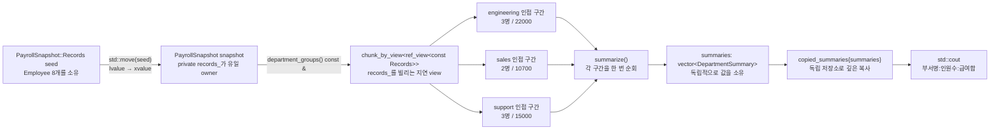

# 2026-09-30 — `std::views::chunk_by`의 인접 그룹과 Salary Queries

오늘의 Modern C++ 주제는 C++23 `std::views::chunk_by`로 **서로 이웃하며 같은 상태인 원소의 최대 구간**을 지연 계산하는 방법이다. `PayrollSnapshot`과 `HealthTimeline`이 `std::vector`를 소유하고, `chunk_by_view`는 그 저장소를 복사하지 않고 빌린다. 따라서 owner와 view의 수명, vector 구조 변경에 따른 iterator 무효화, 임시 owner에서 view를 꺼내지 않는 API 설계가 핵심이다.

오늘의 대회 문제는 [CSES 1144 — Salary Queries](https://cses.fi/problemset/task/1144/)다. 모든 최초 급여와 갱신될 급여를 오프라인으로 좌표 압축하고, Fenwick tree에 각 급여의 빈도를 저장한다. 갱신은 이전 급여 빈도를 `-1`, 새 급여 빈도를 `+1`만큼 바꾸며, 구간 질의 `[a,b]`는 `count(<=b) - count(<a)`로 계산한다.

## 오늘의 목표와 생성 파일

- [`main.cpp`](main.cpp): 부서별로 정렬된 급여 원장을 인접 부서 구간으로 묶어 인원수와 급여 합을 소유 결과로 만든다.
- [`problem.cpp`](problem.cpp): 시간순 건강 표본을 인접한 같은 상태의 장애/정상 구간으로 압축하는 직접 연습이다.
- [`icpc_problem.cpp`](icpc_problem.cpp): CSES 1144에 제출 가능한 좌표 압축 + Fenwick tree 풀이이다.
- [`CMakeLists.txt`](CMakeLists.txt), [`run_icpc_test.cmake`](run_icpc_test.cmake): 세 C++23 실행 파일과 stdout 전체 비교 CTest를 정의한다.
- [`CHECKPOINT.md`](CHECKPOINT.md): 문법, 값 범주와 수명, STL 호출 계약, Fenwick 불변식을 실제 식으로 검증한다.
- [`../algorithm/fenwick-tree.md`](../algorithm/fenwick-tree.md): Fenwick tree의 정의, 불변식, 정확성, 복잡도와 오늘 문제의 연결을 담은 대표 문서다.

## `main.cpp` 구조도



`department_groups()`의 반환 view와 각 `group`은 `records_`를 소유하지 않는다. 반면 `summarize()`가 반환하는 `std::vector<DepartmentSummary>`는 계산된 값을 새로 소유하므로 `snapshot`이 사라진 뒤에도 안전하다. “빌린 관찰 결과”와 “독립 소유 결과”를 API에서 구분하는 것이 오늘 예제의 실무 패턴이다.

## 초보자를 위한 코드 읽기

- `#include <vector>`는 연속 저장소를 소유하는 `std::vector`, `<ranges>`는 `std::views::chunk_by`, `<string_view>`는 문자를 소유하지 않는 `std::string_view`, `<utility>`는 `std::move`, `<iostream>`은 표준 스트림을 선언한다. ICPC 소스의 `<algorithm>`은 정렬·중복 제거·이진 탐색 알고리즘을 선언한다.
- `int salary{};`의 `int`는 기본 정수 타입이고 빈 중괄호는 0으로 값 초기화한다. `std::size_t employee_count{}`도 0이지만 컨테이너 크기에 맞는 부호 없는 타입이다. 여러 급여나 빈도를 합칠 가능성이 있는 값은 `long long`으로 넓혀 32비트 signed overflow를 피한다.
- `enum class Department`는 정수와 암시적으로 섞이지 않는 강한 열거형이다. `Department::sales`처럼 범위를 붙여 쓴다.
- `struct Employee`의 멤버는 기본 `public`이라 단순 데이터 전달 객체에 어울린다. `class PayrollSnapshot`의 멤버는 기본 `private`이라 실제 owner인 `records_`를 외부 구조 변경으로부터 감춘다. `public:`과 `private:`는 접근 지정자다.
- `department_name`의 반환형은 `std::string_view`, 매개변수는 `Department` 값 하나다. `[[nodiscard]]`는 반환값을 실수로 버리는 코드를 진단하도록 요청하고, `constexpr`는 조건을 만족하면 상수 평가가 가능함을, `noexcept`는 함수 밖으로 예외를 내보내지 않겠다는 계약을 뜻한다.
- `explicit PayrollSnapshot(Records records)`에서 생성자에는 반환형이 없다. `explicit`은 `Records` 하나가 뜻밖에 `PayrollSnapshot`으로 암시 변환되는 일을 막는다. 값을 받는 매개변수는 lvalue 인수에서는 복사되고 xvalue 인수에서는 이동될 수 있어 명확한 소유권 경계를 만든다.
- `: records_{std::move(records)}`는 생성자 본문 대입이 아니라 **멤버 초기화 목록**이다. 멤버는 목록에 적힌 순서가 아니라 class 안의 선언 순서대로 태어난다.
- `using Records = std::vector<Employee>;`는 새 타입을 만드는 것이 아니라 긴 template 특수화의 별칭을 만든다. `Employee`는 `std::vector<T>`의 template 타입 인자다.
- `department_groups() const &`에서 앞의 `auto`는 반환형 추론, 빈 괄호는 명시 매개변수가 없다는 뜻이다. 뒤의 `const`는 숨은 `this`를 통해 owner를 수정하지 않는다는 약속이고, `&`는 lvalue `PayrollSnapshot`에서만 호출하게 하는 참조 한정자다. `const && = delete`는 임시 owner에서 비소유 view를 꺼내는 호출을 컴파일 단계에서 막는다.
- `const Employee&`는 기존 원소를 복사 없이 읽기만 하는 참조다. 참조는 기존 객체의 별명이며 일반 참조 자체로 null 상태를 표현하지 못한다. 포인터는 주소 값이라 null과 재지정을 표현할 수 있지만, 참조와 포인터 모두 별도 소유권 계약 없이는 대상 수명을 늘리지 않는다.
- `switch`와 `if`는 값을 비교해 실행 경로를 고르는 제어문이다. range-`for`는 개념적으로 `begin`, `end`, 끝 비교, 역참조, 증가를 반복한다.

직접 해보기: `seed`의 마지막에 `{401, Department::engineering, 9000}`을 추가하기 전에 결과를 예측한다. 이 원소는 앞의 engineering 세 명과 떨어져 있으므로 새로운 engineering 구간이 된다. 그다음 이 원소를 첫 sales 원소 바로 앞으로 옮겼을 때 어느 구간과 합쳐지는지 확인한다.

## `chunk_by`의 정확한 인접 의미

`std::views::chunk_by(range, pred)`는 범위 전체에서 같은 키를 찾아 한곳으로 모으거나 정렬하지 않는다. 왼쪽에서 오른쪽으로 **인접한 쌍** `(current, next)`에 `pred(current, next)`를 적용하고, 결과가 `false`인 지점에서 경계를 만든다. 따라서 결과는 술어가 연속해서 `true`인 최대 비어 있지 않은 subrange들이다.

오늘의 술어는 `left.department == right.department`다. 입력이 `engineering, sales, engineering`이면 engineering 하나짜리 구간, sales 하나짜리 구간, engineering 하나짜리 구간으로 총 세 구간이다. 같은 부서 전체를 하나로 모으려면 먼저 부서 기준으로 정렬하거나 별도 associative container로 집계해야 한다. `PayrollSnapshot` 예제는 입력이 이미 부서별로 정렬되어 있다는 도메인 전제를 사용한다.

view 구성은 보통 기반 range의 참조와 술어 사본을 보관하는 `O(1)` 작업이며 원소를 즉시 순회하지 않는다. 실제 경계는 `begin` 또는 iterator 증가 과정에서 지연 탐색된다. 전체 원소를 모든 chunk에서 한 번씩 읽으면 합계 `O(n)`이고, 결과 `g`개를 `push_back`하는 저장은 `O(g)`다.

### owner, view, subrange의 수명선

```text
PayrollSnapshot snapshot
└── records_: vector<Employee> owner  ───────────────┐
    └── Employee 원소들의 실제 수명                │ 빌림
                                                     ▼
groups: chunk_by_view<ref_view<const Records>> ──> group: subrange
                                                     └── const Employee&

summaries: vector<DepartmentSummary> owner  (records_와 독립)
```

다음 계약을 지켜야 한다.

1. `snapshot`과 `records_`는 `groups`, 현재 `group`, iterator, `const Employee&`보다 오래 살아야 한다.
2. view를 순회하는 동안 기반 vector를 파괴하거나 재할당·구조 변경하지 않는다. 그런 변경은 iterator와 참조를 무효화할 수 있다.
3. 끝 iterator는 경계 표지일 뿐 역참조하면 안 된다. 서로 다른 범위에서 얻은 iterator를 임의로 비교하지 않는다.
4. view는 snapshot, mutex, 원자성 또는 수명 연장을 제공하지 않는다. 같은 저장소에 동시 쓰기가 있으면 외부 동기화가 필요하다.
5. `auto&& group`이 chunk subrange prvalue에 바인딩되어 현재 반복의 임시 수명을 지켜 주더라도, 기반 `records_`의 수명까지 연장하지는 않는다.

## 값 범주, 참조 바인딩, 복사·이동과 객체 수명

이름이 있는 `seed`, `snapshot`, `groups`, `summaries`, `records` 식은 lvalue다. `PayrollSnapshot::Records{...}` 같은 임시 vector, `department_groups()`가 반환한 view, `summarize()`가 반환한 결과 객체는 prvalue다. `std::move(seed)`는 같은 `seed` 객체를 가리키는 xvalue 식이다.

`std::move` 자체는 원소를 옮기지 않는다. lvalue를 xvalue로 바꾸는 cast일 뿐이며, 이어 선택된 `std::vector` 이동 생성자가 저장소 소유권을 넘긴다. 이동 뒤 원본 vector는 파괴하거나 새 값을 대입할 수 있는 유효한 객체지만 값은 미지정이므로 기존 크기나 원소가 남았다고 가정하면 안 된다. 값 매개변수 `records`는 이름이 있으므로 함수 본문에서는 다시 lvalue이고, 멤버로 이동하려면 `std::move(records)`가 필요하다.

`const PayrollSnapshot::Summaries copied_summaries{summaries};`에서는 이름 있는 `summaries`가 const lvalue로 빌려지고 vector 복사 생성자가 새 저장소와 원소를 만든다. 두 vector는 같은 값을 가지지만 소유권은 공유하지 않는다. 이 복사는 이동과 차이를 관찰하기 위한 학습 단계이며, 불필요한 독립 사본이 필요 없는 실무 경로라면 원본을 `const&`로 관찰하는 편이 낫다.

술어의 `const Employee& left`와 `right`, 안쪽 반복의 `const Employee& employee`는 살아 있는 vector 원소 lvalue에 바인딩되어 복사를 만들지 않는다. 바깥 반복의 `auto&& group`은 역참조가 돌려준 subrange 값에 바인딩되지만, 그 subrange는 여전히 원소를 소유하지 않는다. 참조 바인딩으로 wrapper의 수명이 늘 수 있어도 실제 owner 수명이 자동으로 늘지는 않는다.

`return summaries;`의 이름 있는 지역 객체는 NRVO 후보이다. NRVO가 적용되면 호출자의 반환 객체 저장소에 처음부터 직접 만들고, 적용되지 않아도 반환 문맥의 암시적 이동이 가능하다. 이어 `const Summaries summaries = snapshot.summarize();`처럼 같은 타입 prvalue로 목적 객체를 초기화하는 마지막 단계에는 C++17의 보장된 복사 생략 규칙이 적용된다. 이름 있는 모든 반환에 “무조건 복사 0회”라고 단정해서는 안 된다.

`department_name`이 반환하는 `std::string_view`도 비소유지만 문자열 리터럴의 문자는 정적 저장 기간이라 프로그램 종료까지 산다. 같은 view 타입이라도 무엇을 빌리는지에 따라 안전한 사용 기간이 다르다.

## 실무에서 가져갈 패턴

- owner class의 저장소를 `private`으로 두고, 비소유 view는 `const &` 수신에서만 반환한다.
- `const && = delete`로 임시 owner에서 view를 꺼내는 위험한 식을 금지한다.
- 계산 중에는 zero-copy view를 쓰되 API 경계를 넘어 보존할 결과는 소유 `std::vector<DepartmentSummary>`로 materialize한다.
- 값 매개변수 + `std::move`로 “복사해서 줄 수도 있고 소유권을 넘길 수도 있는” sink 생성자를 간결하게 표현한다.
- `std::string_view`는 복사 비용이 작지만 비소유라는 사실을 숨기지 않고 원본 수명을 검토한다.

## 기계 실행 관점

vector 순회는 연속 메모리의 `Employee` 필드를 load하고, 부서 값을 compare한 뒤 chunk 경계에서 조건 분기하는 형태로 낮아질 수 있다. 급여 합은 load와 정수 변환·add, 카운트는 add, 결과 기록은 store와 필요할 때 vector 재할당·원소 이동을 포함할 수 있다. 출력은 버퍼 기록과 상태 검사를 수행하며 표준 stream 내부의 locale 또는 stream buffer 구현에서 간접 호출이 생길 수도 있다. 오늘 도메인 class 자체에는 virtual 함수가 없으므로 그 class를 위한 virtual dispatch는 요구되지 않는다.

ICPC 풀이의 Fenwick 갱신·누적합은 인덱스 load, `i & -i`에 해당하는 lowbit 계산, 배열 load/store, 루프 비교와 조건 분기를 반복할 수 있다. 좌표 탐색은 정렬된 연속 메모리에서 비교와 분기를 반복한다. 그러나 실제 명령, 분기 제거·조건 이동, 인라이닝, 벡터화, 캐시 효과, 할당 횟수와 간접 호출 여부는 CPU·ABI·표준 라이브러리 구현·컴파일러·최적화 옵션에 따라 달라진다. 소스 코드만 보고 특정 어셈블리로 단정하지 않는다.

## ICPC 문제: CSES 1144 — Salary Queries

- 문제 ID/제목: **CSES 1144 — Salary Queries**
- 공식 출처: <https://cses.fi/problemset/task/1144/>
- 입력: 직원 수 `n`, 질의 수 `q`, 현재 급여 `n`개, 이어서 `q`개 연산이 주어진다.
- 갱신 `! k x`: 1-based 직원 번호 `k`의 급여를 `x`로 바꾼다.
- 질의 `? a b`: 현재 급여가 닫힌 구간 `[a,b]`에 속하는 직원 수를 출력한다.
- 공식 제약: `1 <= n,q <= 200000`, 최초·새 급여는 `1..10^9`, 갱신 인덱스는
  `1 <= k <= n`, 질의 경계는 `1 <= a <= b <= 10^9`다.
- 공식 예제의 급여가 `3 7 2 2 5`일 때 `? 2 3`의 답은 3이고, 세 번째 급여를 6으로 바꾼 뒤 같은 질의의 답은 2다.

### 왜 좌표 압축이 필요한가

급여 값은 최대 `10^9`라 값 하나마다 빈도 칸을 직접 만들 수 없다. 그러나 실행 중 나타날 수 있는 급여는 최초 `n`개와 `!` 연산의 새 급여뿐이다. 이를 `coordinates`에 모아 정렬하고 중복을 제거하면 서로 다른 값 `M <= n + 갱신 수`개만 남는다. 정렬 순서가 보존되므로 실제 값 `x<y`이면 압축 위치도 `rank(x)<rank(y)`다.

질의 경계 `a`, `b`가 실제 급여 좌표에 없더라도 추가할 필요가 없다.

- `lower_bound(coordinates, a)`는 처음으로 `a` 이상인 위치이므로 그 앞 원소 수가 `count(<a)`를 위한 압축 길이다.
- `upper_bound(coordinates, b)`는 처음으로 `b`보다 큰 위치이므로 그 앞 원소 수가 `count(<=b)`를 위한 압축 길이다.
- 따라서 답은 `prefix(upper_bound 위치) - prefix(lower_bound 위치)`다.

### Fenwick tree 불변식과 연산

Fenwick 배열을 1-based로 두고 `lowbit(i) = i & -i`라 하자. `tree[i]`는 빈도 배열의 반열린 표기로 `(i-lowbit(i), i]`, 즉 1-based 닫힌 구간 `[i-lowbit(i)+1, i]`의 합을 저장한다.

- `add(position, delta)`: 현재 `position`을 포함하는 모든 상위 책임 구간에 `delta`를 더한다. `i += lowbit(i)`로 이동한다.
- `prefix(count)`: 앞의 `count`개 압축 좌표, 즉 1-based `[1,count]`의 합을 구한다. `tree[i]`의 서로 겹치지 않는 책임 구간을 더하고 `i -= lowbit(i)`로 이동한다.
- 갱신 `! k x`: `salary[k]`의 압축 위치에 `-1`, `x`의 위치에 `+1`을 적용한 뒤 현재 급여 배열도 `x`로 바꾼다.
- 질의 `? a b`: `prefix(count(<=b)) - prefix(count(<a))`다. 각 직원은 정확히 한 급여 위치에 빈도 1을 가지므로 이 차이가 구간 직원 수다.

### 정확성 근거

1. 좌표 압축은 값의 순서와 동등성을 보존한다.
2. 초기화 뒤 각 직원의 현재 급여 좌표에 정확히 빈도 1이 있다.
3. 갱신은 이전 위치에서 1을 빼고 새 위치에 1을 더하므로 “각 직원이 현재 급여 위치에 정확히 한 번 포함된다”는 빈도 불변식을 보존한다.
4. Fenwick의 각 `tree[i]` 책임 구간은 `add`가 영향을 주는 모든 구간에만 반영되므로 책임 구간 합 불변식이 유지된다.
5. `prefix(r)`가 선택하는 책임 구간들은 겹치지 않고 `[1,r]`을 정확히 분할한다. 따라서 두 prefix의 차이는 `[a,b]`에 대응하는 좌표들의 빈도 합이며 문제의 답이다.

### 복잡도와 대회 실수 방지

- 서로 다른 압축 좌표 수를 `M`이라 하면 수집 `O(n+q)`, 정렬 `O(M log M)`, 중복 제거 `O(M)`이다.
- 초기 빈도 구성은 `O(n log M)`, 갱신과 질의는 각각 `O(log M)`, 전체는 `O((n+q) log(n+q))`이다.
- 급여, 연산, 압축 좌표, Fenwick 배열을 보관하므로 추가 공간은 `O(n+q)`이다.
- Fenwick 내부 인덱스는 1-based이고 vector/압축 위치는 0-based일 수 있다. 경계 변환을 한 함수에 모으지 않으면 off-by-one이 자주 난다.
- 갱신에서 현재 급여 배열을 바꾸기 전에 이전 급여 빈도를 빼야 한다.
- `[a,b]`는 양끝 포함이다. `lower_bound(a)`와 `upper_bound(b)`의 비대칭을 바꾸면 경계 급여를 잃는다.
- 압축 목록에 질의 경계까지 넣어도 정답은 낼 수 있지만 필요하지 않다. 반대로 모든 갱신 목표 급여는 실제 빈도 갱신 위치가 되므로 오프라인 압축 목록에 반드시 포함해야 한다.
- 공식 입력은 `a<=b`를 보장한다. 이 풀이를 일반 API로 확장해 `a>b`도 받는다면 빈 구간을 0으로
  돌려줄지, 인자를 정규화할지, 오류로 거부할지 정책을 명시한다.

자세한 Fenwick tree 의사코드, 정확성 증명, 0-based 변형과 segment tree 비교는 [`../algorithm/fenwick-tree.md`](../algorithm/fenwick-tree.md)에 정리한다.

## 오늘 사용한 표준 라이브러리

| 핵심 심볼 | 선언 헤더 | 항목 종류 | 실제 호출 멤버/함수 | 현재 코드에서의 역할 | 대표 문서 |
| --- | --- | --- | --- | --- | --- |
| `std::views::chunk_by`, `std::ranges::chunk_by_view`, `std::ranges::subrange` | `<ranges>` | C++23 range adaptor 객체·view class template·비소유 view | `std::views::chunk_by(records_, same_department)`, `std::views::chunk_by(samples_, same_health)`, 숨은 `begin/end`, iterator 비교·역참조·증가 | 인접한 같은 부서/상태의 최대 구간을 원소 복사 없이 지연 노출 | [`algorithms-and-ranges.md`](../standard-library/algorithms-and-ranges.md) |
| `std::vector<T>`, `std::allocator<T>`, `std::initializer_list<T>` | `<vector>`, `<memory>`, `<initializer_list>` | 연속 소유 컨테이너·할당자·목록 proxy class template | 기본/목록/복사/이동 및 `count 생성자`, `vector::push_back`, `vector::reserve`, `vector::size`, `vector::operator[]`, `begin/end`, `erase(first,last)` | 직원·건강 표본·요약·연산·압축 좌표·Fenwick 빈도를 소유 | [`containers-and-views.md`](../standard-library/containers-and-views.md) |
| `std::string_view`, `std::char_traits<char>` | `<string_view>`, `<string>` | 비소유 문자 view·문자 정책 class template | 문자열 리터럴에서 생성, `operator<<(ostream&, string_view)` | 정적 수명의 부서명 문자를 할당 없이 반환하고 출력 | [`containers-and-views.md`](../standard-library/containers-and-views.md) |
| `std::move`, `std::remove_reference_t` | `<utility>`, `<type_traits>` | cast 함수 템플릿·alias template | `std::move(seed)`, `std::move(records)`, `std::move(samples)` | 이름 있는 vector lvalue를 xvalue로 표현해 이동 생성자 선택을 허용 | [`io-parsing-and-utilities.md`](../standard-library/io-parsing-and-utilities.md) |
| `std::sort`, `std::unique`, `std::lower_bound`, `std::upper_bound` | `<algorithm>` | 함수 템플릿 | `std::sort(first,last)`, `std::unique(first,last)`, `std::lower_bound(first,last,value)`, `std::upper_bound(first,last,value)` | 압축 후보 정렬·인접 중복 제거와 실제 급여/질의 경계의 압축 위치 탐색 | [`algorithms-and-ranges.md`](../standard-library/algorithms-and-ranges.md) |
| `std::size_t` | `<cstddef>` | 부호 없는 정수 타입 별칭 | vector 크기·직원 수·Fenwick 인덱스와 반복 변수 | 컨테이너 크기 및 유효 인덱스 범위를 표현 | [`bit-and-byte-utilities.md`](../standard-library/bit-and-byte-utilities.md) |
| `std::ios_base::sync_with_stdio`, `std::basic_ios::tie`, `std::cin`, `std::cout`, stream `operator>>`/`operator<<` | `<ios>`, `<istream>`, `<ostream>`, `<iostream>` | 정적 함수·멤버 함수·전역 stream 객체·연산자 overload | `sync_with_stdio(false)`, `std::cin.tie(nullptr)`, `std::cin >> value`, `std::cout << value`, `operator<<(std::ostream&, char)` | 입력 버퍼에서 연산을 읽고 결과를 순서대로 출력 | [`io-parsing-and-utilities.md`](../standard-library/io-parsing-and-utilities.md) |

## 검증 결과

- 저장소의 w64devkit GCC 16.1.0으로 세 소스를 C++23 Release 빌드하고, 별도로 `-Wall -Wextra -Wpedantic -Wconversion -Wshadow -Werror -D_GLIBCXX_ASSERTIONS` 엄격 검사를 통과했다.
- CTest **6/6**이 통과했다. 두 학습 예제의 stdout 전체, 공식 예제, 중복 급여, 압축 좌표에 없는 양끝 경계, 같은 값·반복 갱신을 비교했다.
- seed `20260930`의 작은 무작위 입력 **1,000건**을 매 질의마다 현재 배열을 선형으로 세는 독립 oracle과 대조해 모두 일치했다. 별도 독립 검토의 `n=200`, 명령 5,000개 oracle도 통과했다.
- 최대 제약 `n=200,000`, `q=200,000`에서 한 직원을 100,000개 서로 다른 급여로 갱신하고 매번 `[x,x]`를 묻는 stress를 실행했다. 답 100,000개가 모두 `1`이었고 이 로컬 Release 실행은 약 `0.058`초였다. 시간은 CPU·운영체제·빌드에 따라 달라지는 참고값이다.
- 공용 C++ 예제 11개를 같은 엄격 경고 조건으로 컴파일했고, Mermaid CLI 12.0.0으로 구조도를 실제 파싱했다. 변경 15개 파일의 strict UTF-8·마지막 LF·후행 공백과 로컬 링크 319개도 확인했다. 감사 스크립트의 기존 BOM은 보존했다.
- 표준 라이브러리 `latest`와 요구된 `-Scope all` 감사 모두 통과했다. 전체 기준은 날짜 68개, C++ 파일 185개, 고유 심볼 185개, 헤더 57개, 멤버 58개, 생성자/연산 계열 5개다.

## 빌드와 실행

저장소 루트의 PowerShell에서 다음 순서로 검증한다. 산출물은 날짜 소스 폴더 밖의 `build/`에 두고 커밋하지 않는다.

```powershell
$kit = (Resolve-Path tools/w64devkit/bin).Path
$env:Path = "$kit;$env:Path"
cmake -S dailystudy/exercise/2026-09-30 -B build/daily-2026-09-30 -G "MinGW Makefiles" "-DCMAKE_CXX_COMPILER=$kit/g++.exe" -DCMAKE_BUILD_TYPE=Release
cmake --build build/daily-2026-09-30 --parallel
ctest --test-dir build/daily-2026-09-30 --output-on-failure
powershell -ExecutionPolicy Bypass -File dailystudy/exercise/tools/audit-standard-library-docs.ps1 -Scope all
```
