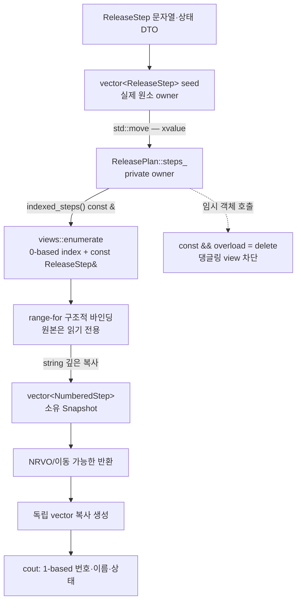

# 2026-10-01 — `std::views::enumerate`의 안전한 위치 투영과 Counting Paths

오늘은 C++23 `std::views::enumerate`로 **소유 컨테이너를 복사하지 않고 0-based 위치와 원소 참조를 함께 순회**한다. 실무 예제는 owner의 lvalue에서만 view를 빌릴 수 있게 참조 한정자를 두고, 외부 경계에는 문자열까지 깊게 복사한 소유 스냅숏을 반환한다.

오늘의 대회 문제는 [CSES 1136 — Counting Paths](https://cses.fi/problemset/task/1136/)다. 반복 DFS로 부모·깊이·부모-선행 순서를 만들고, Binary Lifting LCA와 노드 경로 차분을 결합해 각 정점의 경로 포함 횟수를 구한다.

## 오늘의 목표와 생성 파일

- [`main.cpp`](main.cpp): `ReleasePlan` owner, `enumerate` 비소유 위치 view, 안전한 소유 스냅숏 경계를 보여 준다.
- [`problem.cpp`](problem.cpp): 승인되지 않은 검토 항목을 원래 1-based 위치와 함께 추출하는 직접 연습이다.
- [`icpc_problem.cpp`](icpc_problem.cpp): CSES 1136 제출 가능한 반복 DFS + Binary Lifting + 노드 차분 풀이이다.
- [`CMakeLists.txt`](CMakeLists.txt): C++23 세 실행 파일과 정확 출력 CTest를 정의한다.
- [`run_icpc_test.cmake`](run_icpc_test.cmake): 종료 코드와 stdout 전체를 플랫폼 독립적으로 비교한다.
- [`CHECKPOINT.md`](CHECKPOINT.md): 기초 문법, 값 범주·수명, 호출 계약, 트리 차분을 실제 식으로 확인한다.
- [`../algorithm/tree-difference-path-counting.md`](../algorithm/tree-difference-path-counting.md): 오늘 알고리즘의 정의, 불변식, 증명, 복잡도와 변형을 담은 대표 문서다.
- [`../algorithm/binary-lifting-lca.md`](../algorithm/binary-lifting-lca.md): LCA 조상 표와 점프 불변식을 더 자세히 설명한다.

## `main.cpp` 구조도



`ReleasePlan`이 원소와 문자열을 소유한다. `enumerate` 결과는 작은 view 값이지만 기반 `steps_`를 소유하지 않는다. 그래서 임시 owner에서는 view API를 삭제하고, 외부 계층에는 `NumberedStep`을 담은 독립 vector를 반환한다.

## 초보자를 위한 코드 읽기

### 타입, 초기화, 함수

- `int`, `bool`, `std::size_t`, `long long`은 각각 일반 정수, 논리값, 컨테이너 크기용 부호 없는 정수, 넓은 부호 있는 정수다.
- `T value{};`는 중괄호 값 초기화다. 기본 수치 타입은 0, `bool`은 `false`, 열거형은 첫 열거값, class 타입은 기본 생성자를 사용한다.
- `enum class StepState`는 `ready`를 정수와 암시적으로 더하거나 비교하지 못하게 하는 강한 열거형이다.
- `<cstddef>`, `<iostream>`, `<ranges>`, `<string>`, `<tuple>`, `<utility>`, `<vector>`를 직접 include해 사용하는 선언의 의존성을 드러낸다. 특히 `<tuple>`은 구조적 바인딩의 숨은 `std::get`을 선언한다.
- `struct` 멤버는 기본 `public`, `class` 멤버는 기본 `private`다. DTO에는 struct, 불변식을 숨기는 owner에는 class를 사용했다.
- `[[nodiscard]] Snapshot make_snapshot() const &`에서 `Snapshot`은 반환형, 빈 `()`는 데이터 매개변수가 없음을 뜻한다. 함수 뒤 `const`는 숨은 `this`가 가리키는 객체를 바꾸지 않으며 `&`는 lvalue 객체에서만 호출 가능하다는 뜻이다.
- 생성자는 반환형이 없고 `: steps_{...}` 멤버 초기화 목록으로 본문 전에 멤버를 직접 만든다. 실제 초기화 순서는 목록 표기 순서가 아니라 class의 멤버 선언 순서다.
- `explicit ReleasePlan(Steps)`는 `Steps`가 뜻밖에 `ReleasePlan`으로 암시 변환되는 것을 막는다.
- `using Steps = std::vector<ReleaseStep>;`는 새 타입을 만드는 것이 아니라 class-template 특수화의 별칭이다. `std::vector<T>`의 template 인자 `T`가 저장 원소 타입을 결정한다.

### 포인터, 참조, const

- `const ReleaseStep& step`은 살아 있는 원소의 별명이며 null이 될 수 없고 재바인딩되지 않는다. 원소를 복사하지도 소유하지도 않는다.
- `const char*`는 문자의 주소를 값으로 저장하는 비소유 포인터다. null일 수 있고 다른 주소로 재바인딩할 수 있다. `state_name`은 정적 수명의 문자열 리터럴 주소만 반환한다.
- `const`는 그 경로로 관찰한 객체를 수정하지 않겠다는 타입 계약이지, 다른 별칭을 통한 동시 변경을 막는 잠금이 아니다.
- `auto&& [zero_based, step]`의 바깥 `auto&&`는 enumerate 역참조의 tuple-like 임시 결과를 현재 반복 동안 붙잡는다. `step`은 내부적으로 원본 원소를 가리키는 const 참조 성격이며 새 `ReleaseStep`을 소유하지 않는다.

### 제어문

- `switch`는 열거값을 비교해 한 `case`로 분기한다.
- `if (item.approved)`는 bool 값을 읽고 승인된 항목을 `continue`로 건너뛴다.
- range-`for`는 개념적으로 `begin`, `end`, 비교, 역참조, 증가를 반복한다. 구조적 바인딩은 역참조 결과의 index와 element를 이름 두 개로 나눈다.
- ICPC의 `for`/`while`은 부모·깊이 전처리, 조상 표 작성, 질의 반영, 역순 누적을 명시적으로 분리한다.

## `std::views::enumerate`의 정확한 의미

`std::views::enumerate(range)`는 C++23 range adaptor 객체 호출이다. lvalue `vector`를 넘긴 오늘 코드에서는 기반을 보통 `ref_view<const vector<T>>`로 감싸므로 원소 저장소를 복사하지 않는다. 각 역참조 결과는 다음 두 성분을 tuple-like하게 제공한다.

1. 현재 위치의 **0-based signed 차이 타입 값**
2. 기반 iterator 역참조 결과, 오늘은 `const T&`

중요한 경계는 다음과 같다.

- index는 `std::size_t`라고 일반화하면 안 된다. 오늘은 비음수임을 알고 명시 변환한 뒤 1을 더한다.
- `filter | enumerate`이면 index는 원본 위치가 아니라 필터 결과의 위치다. 원래 위치가 필요하면 먼저 enumerate하고 뒤에서 filter한다.
- view와 tuple-like 결과는 원소를 소유하지 않는다. owner 파괴, vector 재할당·삽입·삭제로 iterator가 무효화된 뒤 접근하면 안 된다.
- `const auto view`만으로 기반 원소가 자동 const가 되는 것은 아니다. 오늘은 **const owner 멤버 lvalue**를 넘겨 읽기 전용 원소 참조를 얻는다.
- view 구성은 O(1)이고 원소 순회는 O(n)이다. `enumerate` 자체는 결과 컨테이너를 할당하지 않는다.

상세한 타입·수명·무효화·오류 계약은 [`../standard-library/algorithms-and-ranges.md`](../standard-library/algorithms-and-ranges.md)의 `enumerate` 절을 참고한다.

## 값 범주, 참조 바인딩, 복사·이동과 객체 수명

- `seed`, `plan`, `steps_`, `snapshot`, `copied`처럼 이름 있는 객체 식은 lvalue다.
- `ReleasePlan::Steps{...}`, `NumberedStep{...}`, `make_snapshot()`의 값 반환 결과는 prvalue다.
- `std::move(seed)`는 seed 객체를 옮기지 않고 같은 객체를 가리키는 xvalue로 바꾼다. 실제 저장소 이전은 선택된 vector 이동 생성자가 수행한다.
- 이동 뒤 `seed`는 유효하지만 값이 미지정이다. 파괴하거나 새 값을 대입할 수 있지만 이전 원소가 남았다고 가정하면 안 된다.
- 값 매개변수 `steps`의 선언 타입과 무관하게 이름 있는 `steps` 식은 lvalue다. 그래서 멤버로 한 번 더 넘길 때 `std::move(steps)`가 필요하다.
- `enumerated` view와 그 iterator/reference 수명은 `plan.steps_`에 종속된다. 반면 `make_snapshot()` 결과는 문자열을 깊게 복사해 plan 파괴 뒤에도 유효하다.
- `return rows;`는 NRVO 후보다. 컴파일러가 NRVO를 적용하지 않아도 반환 문맥의 암시적 이동이 가능하다. 이름 있는 지역 반환이므로 “언제나 복사·이동 0회”라고 단정하지 않는다.
- `const Snapshot snapshot = plan.make_snapshot();`에서 같은 타입 prvalue가 결과 객체를 초기화하는 마지막 단계는 C++17 보장 복사 생략 대상이다.
- `Snapshot copied{snapshot};`은 const lvalue를 받는 진짜 복사 생성이다. vector 저장소와 각 string 문자를 독립적으로 복사한다.

## 실무에서 가져갈 패턴

**owner-backed view + ref-qualified accessor + owned boundary DTO** 패턴을 기억한다.

1. private 컨테이너가 실제 원소 수명을 소유한다.
2. 내부 조합에는 `views::enumerate` 같은 지연 비소유 view를 사용한다.
3. `const &` overload만 제공하고 `const && = delete`로 임시 owner에서의 관찰을 막는다.
4. 호출 경계를 넘어갈 결과는 별도 vector/string에 materialize한다.

이 패턴은 행 번호가 필요한 감사 로그, 원래 위치가 필요한 validation error, UI 표시 순번 생성에 자주 쓰인다. 비동기 작업에 view를 넘길 때는 owner 수명과 동기화를 별도로 설계해야 한다.

## 기계 실행 관점

`enumerate` 순회는 개념적으로 index 증가, 끝 비교, vector 원소 주소 계산, 상태 load, 결과 string 복사와 vector store로 나타날 수 있다. `if`와 반복 종료는 조건 분기나 조건 이동으로 구현될 수 있다. ICPC LCA는 깊이 load, 비트 검사, 조상 표의 간접 인덱스 load를 반복하고 차분 누적은 연속 배열 load/add/store를 수행한다.

오늘 도메인 class에는 virtual 함수가 없다. `enumerate` adaptor와 lambda도 구체 타입이라 소스 수준의 가상 디스패치를 요구하지 않는다. 반면 표준 stream 내부 구현은 streambuf를 통한 간접 호출을 사용할 수 있다. 실제 인라인, 분기 제거, cache miss, 할당 횟수와 명령 형태는 CPU·ABI·표준 라이브러리·컴파일러·최적화 옵션에 따라 달라지므로 특정 어셈블리로 단정하지 않는다.

## ICPC 문제: CSES 1136 — Counting Paths

- 문제 ID/제목: **CSES 1136 — Counting Paths**
- 출처: [공식 CSES 문제 페이지](https://cses.fi/problemset/task/1136/)
- 제약: `1 ≤ n,m ≤ 200000`, `1 ≤ a,b ≤ n`, 시간 1초, 메모리 512MB
- 핵심 알고리즘: 반복 DFS 전처리 + Binary Lifting LCA + 노드 경로 차분
- 시간 복잡도: `O((n+m) log n)`
- 공간 복잡도: `O(n log n)`

### 왜 직접 경로를 걸으면 안 되는가

길이 n인 일자 트리에서 모든 질의가 양 끝을 잇는다면 경로 하나가 Θ(n)개 정점을 지난다. 이를 m번 반복하면 Θ(nm), 최대 약 `4×10^10` 정점 방문이라 시간 제한에 맞지 않는다. 차분은 경로당 배열 네 칸만 바꾸고 LCA만 `O(log n)`에 구한다.

### 노드 차분 공식

경로 끝점을 `u,v`, `w=LCA(u,v)`라 하면 다음을 적용한다.

```text
delta[u]++
delta[v]++
delta[w]--
if w != root: delta[parent[w]]--
```

그 뒤 모든 자식 값을 부모에 더한다. `w`에서는 두 끝점의 `+2`와 자기 `-1`만 포함되어 1이 남고, `w`보다 위에서는 부모 항까지 포함되어 0이 된다. 이것이 LCA에 `-2`를 두는 **간선 사용 횟수 공식**과의 핵심 차이다.

### 반복 순회와 LCA 불변식

- 입력이 트리이므로 현재 부모 간선만 제외한 이웃은 새 자식이다.
- `order`에는 부모가 항상 자식보다 먼저 들어간다. 역순은 postorder 누적 순서를 제공한다.
- `up[k][v]`는 `v`의 `2^k`번째 조상이다.
- 깊이를 같게 만든 뒤 큰 점프부터 두 조상이 다를 때만 함께 올리면 LCA 바로 아래에서 멈춘다.
- root는 `parent[root]=root`로 두되, LCA가 root일 때 부모 감산은 생략하고 역누적에서도 root 자신을 다시 더하지 않는다.

### 정확성 근거

한 경로의 네 표식을 임의 정점 x의 서브트리에서 합하면 경로 위에서는 정확히 1, 경로 밖에서는 0이다. 부모-선행 order를 뒤집으면 각 정점을 처리할 때 모든 자식 서브트리 합이 이미 완성되어 있으므로 부모에 더한 값도 정확하다. 여러 경로는 덧셈의 선형성으로 한 배열에 합쳐도 결과가 같다. 상세 증명은 [`../algorithm/tree-difference-path-counting.md`](../algorithm/tree-difference-path-counting.md)에 있다.

### 대회 실수 방지

- 노드 공식 `-1 at LCA, -1 at parent(LCA)`와 간선 공식 `-2 at LCA`를 구분한다.
- `LCA==root`일 때 부모 감산을 생략한다.
- 역순 누적에서 root를 제외해 `delta[root] += delta[root]`를 막는다.
- 일자 트리의 재귀 깊이를 피하려고 명시적 vector 스택을 쓴다.
- 최종 답은 int 범위지만 차분/누적은 `long long`으로 두어 부호 있는 감산과 합산 여유를 확보한다.

## 오늘 사용한 표준 라이브러리

| 핵심 심볼·실제 호출 | 선언 헤더 | 항목 종류 | 현재 코드에서의 역할과 호출 계약 요약 | 대표 문서 |
|---|---|---|---|---|
| `std::views::enumerate(range)` | `<ranges>` | C++23 range adaptor 객체 호출 | `std::views::enumerate(`는 살아 있는 const vector lvalue를 빌려 0-based index 값과 const 원소 참조를 지연 제공한다. O(1) 구성, 원소 무복사이며 owner 수명·iterator 무효화에 종속된다. | [알고리즘·ranges](../standard-library/algorithms-and-ranges.md) |
| enumerate range-`for`의 `begin/end`, 비교, 역참조, 증가, `std::get<0/1>` | `<ranges>`·`<tuple>` | 숨은 반복 연산·함수 템플릿 | view lvalue를 O(n)에 순회한다. 구조적 바인딩은 tuple xvalue에 `std::get<0/1>`을 적용해 index와 원소 참조를 얻는다. 결과는 원소를 소유하지 않으며 end 역참조나 무효화 뒤 사용은 UB다. | [알고리즘·ranges](../standard-library/algorithms-and-ranges.md), [소유권·vocabulary 타입](../standard-library/ownership-and-vocabulary-types.md) |
| `std::vector` 기본 생성자 | `<vector>` | class-template 생성자 | `기본 생성자`는 빈 결과·명시적 stack을 만든다. 일반 allocator에서 O(1), 보통 무할당이다. | [컨테이너·뷰](../standard-library/containers-and-views.md) |
| `std::vector` `count 생성자` / `fill 생성자` / `initializer-list 생성자` | `<vector>` | 생성자 overload | 인접 목록 크기, 0 상태 배열, 예제 seed를 소유한다. count/fill은 O(n), 목록 생성은 원소 수에 선형이고 할당 실패가 가능하다. | [컨테이너·뷰](../standard-library/containers-and-views.md) |
| `std::vector` 복사/이동 생성자, `std::move(object)` | `<vector>`·`<utility>` | 생성자·함수 템플릿 | `std::move(`는 lvalue를 xvalue로만 바꾸고 vector 이동이 저장소를 넘긴다. 복사는 vector와 string을 깊게 복제한다. | [컨테이너·뷰](../standard-library/containers-and-views.md), [입출력·유틸리티](../standard-library/io-parsing-and-utilities.md) |
| `vector::size()` / `vector::reserve(count)` | `<vector>` | const 멤버 / 멤버 함수 | `vector::size`는 O(1) 원소 수를 반환해 사용한다. `vector::reserve`는 용량만 확보하고 size는 유지하며 재할당 시 모든 관찰자를 무효화한다. | [컨테이너·뷰](../standard-library/containers-and-views.md) |
| `vector::push_back(value)` | `<vector>` | 멤버 함수 overload | `vector::push_back`은 간선, DFS 정점, 소유 결과를 마지막에 추가한다. amortized O(1), 재할당·할당 실패·관찰자 무효화를 점검한다. | [컨테이너·뷰](../standard-library/containers-and-views.md) |
| `vector::operator[](index)` | `<vector>` | 원소 접근 연산자 | 범위 검사를 하지 않고 O(1)에 참조를 반환한다. `index < size()`가 전제이며 위반은 UB다. | [컨테이너·뷰](../standard-library/containers-and-views.md) |
| `vector::empty()` / `vector::back()` / `vector::pop_back()` | `<vector>` | 관찰·접근·수정 멤버 | `vector::empty`로 전제조건을 확인하고, `vector::back` 참조 값을 복사한 뒤 `vector::pop_back`으로 마지막 원소 수명을 끝낸다. 모두 O(1); 빈 back/pop은 UB다. | [컨테이너·뷰](../standard-library/containers-and-views.md) |
| `std::string` `기본/리터럴/복사` 생성자 | `<string>` | class 생성자 overload | 빈 DTO 기본값, 문자열 리터럴의 소유 복사, boundary DTO의 깊은 복사를 구분한다. 문자 수에 선형이고 할당 실패가 가능하다. | [컨테이너·뷰](../standard-library/containers-and-views.md) |
| `std::ios_base::sync_with_stdio(false)` | `<iostream>` | 정적 멤버 함수 | `sync_with_stdio(`는 이전 설정 bool을 반환하지만 버린다. 첫 I/O 전에 호출하고 이후 C stdio와 순서를 섞지 않는다. | [입출력·유틸리티](../standard-library/io-parsing-and-utilities.md) |
| `std::cin.tie(nullptr)` | `<iostream>` | stream 멤버 함수 | `std::cin.tie(`는 이전 tied ostream 포인터를 반환하지만 버리고 자동 flush 연결을 해제한다. | [입출력·유틸리티](../standard-library/io-parsing-and-utilities.md) |
| `std::cin >> int` | `<iostream>` | 정수 추출 연산자 | `std::cin >>`는 수정 가능한 int lvalue를 채우고 같은 istream&를 연쇄 반환한다. 실패 상태와 입력 전제를 구분한다. | [입출력·유틸리티](../standard-library/io-parsing-and-utilities.md) |
| `std::cout << value`, `operator<<(std::ostream&, char)` | `<iostream>` | 삽입 연산자 overload | `std::cout <<`는 정수/string/포인터 문자열/char를 기록하고 ostream&를 연쇄 반환한다. 상태 비트·예외 mask·동시 출력 비원자성을 점검한다. | [입출력·유틸리티](../standard-library/io-parsing-and-utilities.md) |

## 검증 과정

완료 조건은 다음과 같다.

1. GCC 16.1.0 C++23에서 세 소스를 `-Wall -Wextra -Wpedantic -Wconversion -Wshadow -Werror -D_GLIBCXX_ASSERTIONS`로 검사한다.
2. CMake Release 빌드 후 CTest의 예제·단일 정점·일자·별·균형 트리를 정확 출력으로 검증한다.
3. 작은 무작위 트리를 독립 BFS 경로 복원 oracle과 대조한다.
4. `n=m=200000` 일자/별 스트레스로 시간·재귀 비사용·최대 답을 확인한다.
5. 알고리즘 문서 예제를 별도로 컴파일·실행한다.
6. 로컬 Markdown 링크, UTF-8, 마지막 LF, trailing whitespace, Mermaid 문법을 점검한다.
7. 전체 표준 라이브러리 문서 감사를 실행한다.

### 실제 통과 결과

- 저장소 w64devkit GCC 16.1.0에서 세 소스 모두 C++23 엄격 경고 오류화와 `_GLIBCXX_ASSERTIONS` 검사를 통과했다.
- CMake Release 빌드와 CTest **7/7**(학습 예제 2개, ICPC 결정 사례 5개)이 통과했다.
- seed `20261001`의 무작위 작은 트리 **1,500개 / 경로 59,169개**를 각 경로 BFS 복원 oracle과 대조해 모두 일치했다.
- `n=m=200000`인 일자 전체 경로, 일자 단일 정점 경로, 별 리프 쌍의 최대 스트레스 3개가 통과했다.
- 트리 차분 문서 예제는 `1 2 3 2 1`, enumerate 문서 예제는 세 개의 1-based 행을 출력했다.
- Mermaid 구조도를 실제 parser로 확인했고, 변경 문서 7개의 실제 로컬 링크 366개와 의도 파일 13개의 UTF-8·마지막 LF·trailing whitespace를 점검했다. 감사 스크립트의 기존 BOM은 보존했다.
- 최신/전체 표준 라이브러리 감사가 통과했다. 전체 범위는 **69개 날짜, C++ 188개, 심볼 186개, 헤더 57개, 추적 멤버 58개, 연산군 5개**다.

## 빌드와 실행

저장소 루트의 PowerShell에서 실행한다.

```powershell
$kit = (Resolve-Path tools/w64devkit/bin).Path
$env:Path = "$kit;$env:Path"
cmake -S dailystudy/exercise/2026-10-01 -B build/daily-2026-10-01 -G "MinGW Makefiles" -DCMAKE_BUILD_TYPE=Release "-DCMAKE_CXX_COMPILER=g++.exe"
cmake --build build/daily-2026-10-01
ctest --test-dir build/daily-2026-10-01 --output-on-failure
powershell -ExecutionPolicy Bypass -File dailystudy/exercise/tools/audit-standard-library-docs.ps1 -Scope all
```

빌드 산출물은 저장소의 `build/` 아래에만 만들고 커밋하지 않는다.
