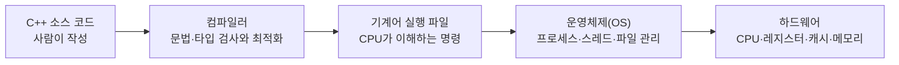

# 초보자를 위한 C++ 용어와 축약어 사전

이 문서는 `자주까먹는` 폴더의 다른 글을 읽다가 모르는 단어가 나왔을 때 돌아오는
공통 사전이다. 정의를 한 번에 외우기보다, 먼저 **비유**를 읽고 그다음 **정확한 뜻**과
**왜 중요한지**를 확인한다.

## 가장 먼저 알아야 할 실행 계층

위에서 아래로 내려갈수록 컴퓨터가 실제로 수행하는 일에 가까워진다. 이 폴더의 문서는
“C++ 문법이 왜 이런 모양인가?”를 이 실행 계층과 연결해 설명한다.

## 문서와 C++ 버전 표기

### README, Markdown, Mermaid

- README: 폴더를 처음 열었을 때 목적과 사용법을 알려 주는 안내 문서의 관례적 이름
- Markdown: `# 제목`, `- 목록`, 코드 블록처럼 간단한 기호로 문서를 작성하는 형식
- Mermaid: Markdown 안의 텍스트로 흐름도와 상태도를 그리는 다이어그램 문법

### AGENTS.md

- 이 폴더에서 자동화 도구가 자료를 만들거나 수정할 때 따라야 하는 작업 규칙 문서
- 학습 내용 자체가 아니므로 일반 학습자는 읽지 않아도 된다.

### TODO

- 전체 이름: **To Do**
- 아직 구현하거나 생각해 봐야 하는 실습 항목을 표시하는 주석

### C++17, C++20, C++23

- 숫자는 ISO C++ 표준이 발표된 연도를 줄여 표시한 버전 이름이다.
- 예: C++17은 2017년 표준, C++20은 2020년 표준을 뜻한다.
- 최신 컴파일러라도 빌드 옵션 `-std=c++17`처럼 사용할 언어 규칙을 명시할 수 있다.

### UTF-8

- 한글과 영문을 포함한 문자를 바이트로 저장하는 대표적인 문자 인코딩 방식
- Windows 도구의 코드 페이지가 다르면 한글 경로가 깨질 수 있어 `chcp 65001`을 사용한다.

## 메모리와 객체 수명

### 객체(object)

- 비유: 이름표와 사용 기간이 있는 상자
- 정확한 뜻: 타입, 저장 공간, 값, 수명을 가진 C++의 데이터 실체
- 예: `std::string name{"Kim"};`에서 `name`은 `std::string` 객체다.

### 스코프(scope)

- 비유: 중괄호 `{}`로 둘러싸인 방
- 정확한 뜻: 이름을 사용할 수 있는 코드 영역
- 중요성: 블록 안에 만든 자동 객체는 일반적인 방법으로 블록을 떠날 때 파괴된다.

### 스택(stack)

- 비유: 접시를 위에 쌓고 위에서부터 치우는 선반
- 정확한 뜻: 함수 호출 정보와 많은 지역 변수를 저장하는 메모리 영역
- 주의: C++ 표준은 “지역 객체는 반드시 물리적 스택에 둔다”고 표현하지 않는다.
  컴파일러가 레지스터에 두거나 객체를 없앨 수도 있다.

### 힙(heap)

- 비유: 필요한 크기의 창고 칸을 빌리고 직접 반납하는 공간
- 정확한 뜻: 실행 중 동적으로 할당하는 저장 공간
- C++에서는 `new/delete`를 직접 쓰기보다 표준 컨테이너와 스마트 포인터로 관리한다.

### 수명(lifetime)

- 비유: 객체의 출생부터 사망까지
- 정확한 뜻: 객체를 적법하게 사용할 수 있는 기간
- 수명이 끝난 객체를 포인터나 참조로 접근하면 dangling 접근이 되어 위험하다.

### 소유권(ownership)

- 비유: 도서관 책을 최종적으로 반납할 책임
- 정확한 뜻: 자원을 언제, 어떤 함수로 반환할지 책임지는 관계
- 접근할 수 있다는 사실과 소유한다는 사실은 다르다.

### 댕글링(dangling)

- 비유: 철거된 집의 옛 주소를 계속 들고 있는 상태
- 정확한 뜻: 이미 수명이 끝난 객체를 가리키는 포인터, 참조 또는 뷰
- 역참조하면 정의되지 않은 동작으로 이어질 수 있다.

## 자원 관리

### RAII

- 전체 이름: **Resource Acquisition Is Initialization**
- 한국어 뜻: 자원 획득을 객체 초기화와 묶는 기법
- 읽는 법: 보통 “알에이아이아이”
- 비유: 호텔 카드키 객체를 받으면 전등 사용 책임도 얻고, 카드키가 회수되면 전등이 꺼진다.
- 핵심: 생성이 성공한 객체가 자원을 소유하고 소멸자가 반환한다.

### 스마트 포인터(smart pointer)

- 비유: 반납 규칙이 내장된 주소 쪽지
- 정확한 뜻: 포인터처럼 자원을 가리키면서 소유권과 해제를 객체로 표현하는 도구
- `unique_ptr`: 소유자 한 명
- `shared_ptr`: 소유자 여러 명
- `weak_ptr`: 소유하지 않고 관찰만 함

### 제어 블록(control block)

- 비유: 공유 물건 옆에 붙은 소유자 수 기록표
- 정확한 뜻: `shared_ptr`가 strong/weak 참조 횟수와 삭제 정책 등을 보관하는 별도 상태
- 마지막 strong owner가 사라지면 관리 대상 객체가 파괴된다.

### GC

- 전체 이름: **Garbage Collection**
- 한국어 뜻: 가비지 컬렉션, 더 이상 도달할 수 없는 메모리를 런타임이 회수하는 방식
- C#과 Python의 메모리 관리에 관련되지만 파일·락의 즉시 반환을 대신하지는 않는다.

## 값 전달과 이동

### lvalue와 rvalue

- lvalue: 이름이나 지속적인 위치가 있어 다시 가리킬 수 있는 표현식
- rvalue: 임시 값처럼 자원을 이전해도 되는 후보가 되는 표현식
- `std::move`는 실제 이동 명령이 아니라 표현식을 rvalue 취급하도록 바꾸는 캐스트다.

### SSO

- 전체 이름: **Small String Optimization**
- 한국어 뜻: 작은 문자열 최적화
- 비유: 작은 짐은 외부 창고를 빌리지 않고 가방 안쪽 주머니에 넣는 것
- 작은 `std::string`은 힙 할당 없이 객체 내부 배열에 문자를 저장할 수 있다.

### NRVO

- 전체 이름: **Named Return Value Optimization**
- 한국어 뜻: 이름 있는 반환값 최적화
- 함수의 지역 객체를 호출자의 결과 저장 공간에 바로 만들어 복사·이동을 생략할 수 있다.

## 컴파일과 실행

### API

- 전체 이름: **Application Programming Interface**
- 한국어 뜻: 프로그램이 다른 코드나 시스템을 사용하는 공개 약속
- 비유: 식당 메뉴판처럼 “무엇을 요청할 수 있는지”를 정한다.

### ABI

- 전체 이름: **Application Binary Interface**
- 한국어 뜻: 컴파일된 기계어끼리 지켜야 할 이진 수준 약속
- 포함 내용: 인자를 어느 레지스터에 넣는지, 객체를 어떻게 배치하는지, 심볼 이름을 어떻게
  만드는지, 함수가 결과를 어떻게 반환하는지
- API가 메뉴판이라면 ABI는 주방과 홀 사이의 정확한 전달 규격이다.

### CPU

- 전체 이름: **Central Processing Unit**
- 한국어 뜻: 중앙 처리 장치
- 기계어 명령을 실행하고 레지스터와 캐시를 사용해 계산한다.

### OS

- 전체 이름: **Operating System**
- 한국어 뜻: 운영체제
- 프로세스, 스레드, 파일, 소켓, 가상 메모리 같은 자원을 중재한다.

### 레지스터(register)

- 비유: CPU 손 바로 옆의 아주 작은 작업대
- CPU가 즉시 계산에 사용하는 매우 작고 빠른 저장 공간이다.

### 캐시(cache)

- 비유: 창고까지 가지 않도록 책상 가까이에 둔 자주 쓰는 물건
- CPU와 주 메모리 사이의 속도 차이를 줄이는 작은 고속 메모리다.

### TLB

- 전체 이름: **Translation Lookaside Buffer**
- 한국어 뜻: 가상 주소를 물리 주소로 바꾸는 최근 결과를 저장하는 캐시
- 스레드나 큰 메모리 작업으로 주소 변환 지역성이 깨지면 성능에 영향을 줄 수 있다.

### 어셈블리(assembly)

- 사람이 읽을 수 있게 기계어 명령에 이름을 붙인 저수준 표현
- `load`, `store`, `call`, `jump` 같은 명령을 통해 컴파일 결과를 관찰한다.

### x86-64와 ARM

- CPU가 이해하는 명령어 집합 구조(architecture)의 서로 다른 계열
- x86-64는 데스크톱·서버에서 널리 쓰이고, ARM은 모바일·임베디드와 서버에서도 널리 쓰인다.
- 메모리 순서와 생성되는 어셈블리 명령이 서로 다를 수 있다.

### O0와 O2

- `-O0`: 최적화를 거의 하지 않아 소스 구조를 비교적 쉽게 관찰하는 컴파일 옵션
- `-O2`: 실행 성능을 높이기 위해 인라인·코드 제거·재배치 등을 수행하는 옵션
- 문자 `O`는 Optimization의 첫 글자이며 숫자 `0`과 혼동하지 않는다.

### LTO

- 전체 이름: **Link-Time Optimization**
- 한국어 뜻: 링크 시점 최적화
- 여러 목적 파일의 정보를 함께 보며 함수 인라인이나 사용하지 않는 코드 제거를 수행한다.

### GCC, CMake, Ninja

- GCC: **GNU Compiler Collection**, 이 저장소에서 C++ 소스를 기계어로 번역하는 컴파일러 모음
- CMake: 어떤 소스와 옵션으로 프로그램을 빌드할지 빌드 파일을 생성하는 도구
- Ninja: CMake가 만든 작업 목록을 읽고 실제 컴파일 명령을 빠르게 실행하는 빌드 도구

### PATH

- 운영체제가 `g++`, `cmake` 같은 실행 파일을 어느 폴더에서 찾을지 나열한 환경 변수
- `PATH`에 도구 폴더를 추가하면 전체 경로를 쓰지 않고 명령 이름만으로 실행할 수 있다.

### 컴파일러, 링커, 런타임

- 컴파일러(compiler): 소스의 문법과 타입을 검사하고 목적 파일의 기계어를 만든다.
- 링커(linker): 여러 목적 파일과 라이브러리를 연결해 실행 파일을 만든다.
- 런타임(runtime): 프로그램 실행 중 필요한 라이브러리와 실행 환경을 뜻한다.

### 인라인(inline)

- 함수 호출 위치에 함수 본문의 동작을 합쳐 호출 비용과 추가 최적화 기회를 얻는 최적화
- `inline` 키워드를 썼다고 실제 인라인 최적화가 보장되는 것은 아니다.

### 예외와 스택 해제

- 예외(exception): 정상 결과를 만들 수 없는 상황을 `throw`로 전달하는 C++ 오류 경로
- 스택 해제(stack unwinding): `throw` 지점에서 `catch`까지 이동하며 완성된 지역 객체를
  역순으로 파괴하는 과정
- 소멸자가 정리 중 또 예외를 내보내면 프로그램 종료로 이어질 수 있어 보통 `noexcept`로 둔다.

### JIT와 AOT

- JIT: **Just-In-Time compilation**, 실행 도중 필요한 코드를 기계어로 컴파일
- AOT: **Ahead-Of-Time compilation**, 실행하기 전에 미리 기계어로 컴파일
- C# 런타임 설명에서 자주 등장한다.

### CLR와 IL

- CLR: **Common Language Runtime**, .NET 프로그램을 실행·관리하는 런타임
- IL: **Intermediate Language**, C# 소스가 먼저 변환되는 중간 명령 표현
- CLR이 IL을 JIT 또는 AOT 방식으로 기계어화할 수 있다.

## 동시성

### 스레드(thread)

- 비유: 한 프로그램 안에서 동시에 일할 수 있는 작업자
- 각 스레드는 실행 위치와 호출 스택을 가지며 같은 프로세스 메모리를 공유한다.

### 데이터 레이스(data race)

- 두 스레드가 동기화 없이 같은 메모리에 접근하고 그중 하나 이상이 쓰는 상황
- C++에서는 단순히 값이 틀리는 것을 넘어 정의되지 않은 동작이다.

### 원자 연산(atomic operation)

- 비유: 다른 사람이 중간 과정을 볼 수 없는 한 번의 안전한 창구 처리
- C++ 메모리 모델에서 다른 스레드가 찢어진 중간 상태를 관찰하지 않게 하는 연산
- 원자적이라고 항상 빠르거나 lock-free라는 뜻은 아니다.

### CAS

- 전체 이름: **Compare-And-Swap** 또는 **Compare-And-Exchange**
- 한국어 뜻: 현재 값이 예상값과 같을 때만 새 값으로 교환하는 원자 연산
- lock-free 알고리즘의 기본 재료지만 실패하면 반복 재시도가 필요할 수 있다.

### lock-free

- 시스템 전체에서 적어도 하나의 작업은 계속 진행한다는 동시성 진행 보장
- “잠금 객체를 코드에 쓰지 않았다”, “항상 빠르다”, “기다리지 않는다”와 같은 뜻이 아니다.

### CMPXCHG

- 전체 이름: **Compare and Exchange**
- x86 CPU의 비교 후 교환 명령 이름
- C++ CAS가 반드시 이 명령 하나로 번역된다고 단정할 수는 없다.

### x86의 LOCK 접두사

- 특정 x86 메모리 명령 앞에 붙어 여러 코어가 관련된 원자적 갱신을 수행하게 하는 표시
- C++ 원자 연산이 `LOCK ADD`, `LOCK XADD`, `LOCK CMPXCHG` 등으로 내려갈 수 있지만
  연산·컴파일러·CPU에 따라 달라진다.

### 메모리 순서(memory order)

- 컴파일러와 CPU가 여러 메모리 연산을 다른 스레드에 어떤 순서로 보이게 할지 정하는 규칙
- `relaxed`, `acquire`, `release`, `seq_cst` 등이 있다.

### GIL

- 전체 이름: **Global Interpreter Lock**
- 한국어 뜻: 전역 인터프리터 잠금
- CPython에서 한 시점에 Python 바이트코드를 실행하는 스레드를 제한하는 구현 장치
- 애플리케이션 데이터의 모든 복합 불변식을 자동 보호하는 mutex는 아니다.

## 다형성과 템플릿

### 다형성(polymorphism)

- 같은 호출 모양으로 서로 다른 구현을 실행하는 성질
- 동적 다형성은 실행 중 선택하고, 정적 다형성은 컴파일 중 선택한다.

### vptr와 vtable

- vptr: virtual pointer, 객체가 가상 함수 표를 찾기 위해 보통 가지는 숨은 포인터
- vtable: virtual function table, 실제 가상 함수 주소를 모은 표
- C++ 표준이 이 구현을 강제하지는 않지만 주요 컴파일러 ABI가 널리 사용한다.

### CRTP

- 전체 이름: **Curiously Recurring Template Pattern**
- 한국어 뜻: 파생 클래스가 자기 타입을 기반 템플릿 인자로 넘기는 패턴
- 예: `class Child : public Base<Child>`
- 컴파일 시 실제 타입을 알아 가상 함수 표 없이 정적 다형성을 구현할 수 있다.

### 템플릿(template)

- 타입이나 값을 컴파일 타임 매개변수로 받아 코드를 생성하는 C++ 기능
- 예: `std::vector<int>`는 `int`를 담도록 템플릿을 구체화한 타입이다.

## 네트워크와 비동기

### I/O

- 전체 이름: **Input/Output**
- 한국어 뜻: 입출력
- 파일, 키보드, 네트워크처럼 프로그램 바깥과 데이터를 주고받는 작업이다.

### epoll

- Linux에서 많은 파일 디스크립터의 읽기·쓰기 준비 상태(readiness)를 감시하는 API
- “읽을 준비가 됐다”는 통지 뒤 실제 `read`를 수행해야 한다.

### IOCP

- 전체 이름: **Input/Output Completion Port**
- 한국어 뜻: 입출력 완료 포트
- Windows에서 비동기 I/O 완료 결과를 큐로 전달하는 방식이다.

### EAGAIN

- 전체 이름: **Error: try Again**
- non-blocking I/O에서 지금 당장 읽거나 쓸 수 없으니 나중에 다시 시도하라는 오류 상태다.

### C10K

- 뜻: **10,000 Concurrent Connections**, 동시에 1만 연결을 처리하는 문제
- 연결마다 스레드 하나를 두는 방식의 확장성 한계를 설명할 때 등장한다.

### 코루틴(coroutine)

- 중간에 실행을 멈추고 상태를 보관했다가 나중에 이어서 실행할 수 있는 함수 형태
- C++20 코루틴 문법은 스케줄러나 네트워크 I/O를 자동 제공하지 않는다.

### 코루틴 프레임, awaiter, executor

- 코루틴 프레임: 중단 위치, 매개변수, 살아남아야 하는 지역 변수 등을 보관하는 상태 객체
- awaiter: `co_await`가 지금 준비됐는지, 어디에 중단 핸들을 등록할지, 재개 후 무엇을
  돌려줄지 정하는 객체
- executor: 재개할 작업을 어느 스레드나 실행 문맥에서 수행할지 정하는 실행기
- 스케줄러(scheduler): 여러 실행 후보의 순서와 시점을 정하는 구성 요소

## 언어 경계

### FFI

- 전체 이름: **Foreign Function Interface**
- 한국어 뜻: 서로 다른 언어나 런타임이 함수를 호출하는 연결 규칙
- C++와 C#, Python, Rust 사이에서 자원 소유자와 해제 API를 명확히 해야 한다.

### DB와 FILE

- DB: **Database**, 구조화된 데이터를 저장하고 조회하는 데이터베이스
- `FILE`: C 표준 라이브러리가 열린 파일 스트림을 표현하는 타입
- `FILE*`의 별표는 그 객체를 가리키는 포인터이며 `fopen`/`tmpfile`과 `fclose`를 짝지어야 한다.

### UB

- 전체 이름: **Undefined Behavior**
- 한국어 뜻: 정의되지 않은 동작
- C++ 표준이 결과를 규정하지 않는 상황이다. 프로그램이 즉시 죽는 것만 의미하지 않으며,
  컴파일러는 그런 상황이 없다고 가정하고 최적화할 수 있다.

## 용어를 읽는 습관

새 용어를 만나면 다음 세 질문을 순서대로 답한다.

1. 이 용어는 소스 코드, 컴파일러, 운영체제, 하드웨어 중 어느 계층의 말인가?
2. 누가 자원을 소유하고 언제까지 살아 있어야 하는가?
3. C++ 표준의 보장인가, 특정 컴파일러·운영체제의 구현 방식인가?
