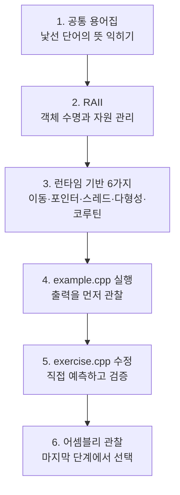
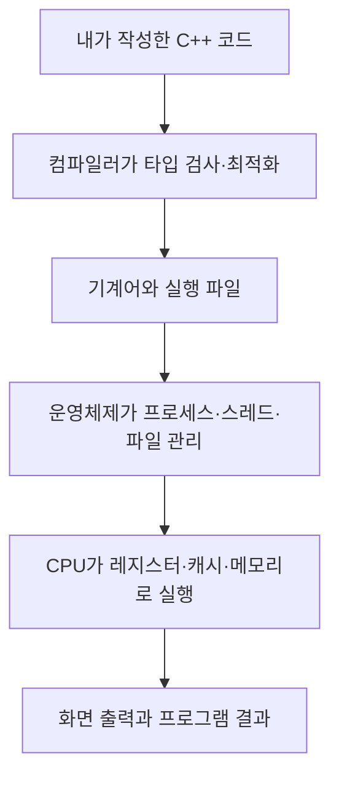

# 자주 까먹는 C++ 문법과 기술

자주 잊는 C++ 문법, 동작 원리, 실무 패턴을 다시 찾아보기 쉽게 모아 두는
학습 자료의 최상위 목차입니다. 새 자료를 추가할 때는 주제별 하위 폴더를 만들고,
아래 목차에도 해당 폴더의 `README.md` 링크와 핵심 학습 내용을 함께 추가합니다.

## 처음 방문했다면

처음부터 하드웨어 용어를 모두 이해할 필요는 없습니다. 다음 순서로 읽습니다.

- 먼저 [초보자 공통 용어집](./GLOSSARY.md)을 열어 둡니다.
- 글에서 굵게 표시된 핵심 문장과 다이어그램만 먼저 봅니다.
- 코드는 한 번에 이해하려 하지 말고 출력 결과를 예상한 뒤 실행합니다.
- 어셈블리와 ABI 설명은 앞부분을 이해한 다음 읽어도 됩니다.

## 이 폴더가 연결하는 컴퓨터 계층

`API`, `ABI`, `CPU`, `OS` 같은 축약어는
[공통 용어집](./GLOSSARY.md)에서 전체 이름, 한국어 뜻, 비유를 함께 확인할 수 있습니다.

## 자료 목차

### [RAII: 스코프와 객체 수명으로 자원 관리](./raii-resource-lifetime/README.md)

- 생성자·소멸자, 예외 스택 해제, 역순 파괴, 커스텀 deleter와 범위 잠금을 하드웨어·ABI 관점까지 설명합니다.
- 핵심 표준: C++17
- [C#/Python/Rust 비교](./raii-resource-lifetime/compare.md)
- 예제 및 실습 코드
  - [`example.cpp`](./raii-resource-lifetime/example.cpp): FILE 핸들, 예외 경로, lock_guard 통합 예제
  - [`exercise.cpp`](./raii-resource-lifetime/exercise.cpp): 이동 가능한 Lease guard와 조기 반환 실습
- 빌드 구성
  - [`CMakeLists.txt`](./raii-resource-lifetime/CMakeLists.txt): C++17 대상과 경고 옵션

### [모던 C++ 런타임 기반 6가지](./modern-cpp-runtime-foundations/README.md)

- 방어적 클래스 설계부터 이동, RAII, 원자 연산, 다형성, OS 이벤트 I/O와 코루틴까지
  컴파일러·메모리·하드웨어 관점으로 연결합니다.
- 핵심 표준: 통합 예제와 실습은 C++17, 코루틴 수명 예제는 C++20
- [C#/Python 비교](./modern-cpp-runtime-foundations/compare.md)
- 예제 및 실습 코드
  - [`example.cpp`](./modern-cpp-runtime-foundations/example.cpp): 여섯 개념을 요청 처리 서비스로 통합한 C++17 예제
  - [`coroutine_example.cpp`](./modern-cpp-runtime-foundations/coroutine_example.cpp): 안전한 프레임 수명을 갖는 C++20 수동 코루틴 예제
  - [`exercise.cpp`](./modern-cpp-runtime-foundations/exercise.cpp): 이동 상태, 메모리 순서, 다형성 선택 실습
- 빌드 구성
  - [`CMakeLists.txt`](./modern-cpp-runtime-foundations/CMakeLists.txt): C++17/C++20 대상과 경고 옵션

### [공통 용어와 축약어 사전](./GLOSSARY.md)

- RAII, ABI, CRTP, CAS, SSO, IOCP, GIL, FFI 등 문서에 등장하는 축약어를 풀이합니다.
- 스택, 힙, 객체 수명, 소유권, 레지스터, 캐시처럼 자주 쓰는 기초 용어를 비유와 함께 설명합니다.

<!--
새 자료는 다음 형식으로 이 주석 바로 위에 추가합니다.

### [주제 이름](./주제-폴더/README.md)

- 한 문장으로 설명한 학습 목표
- 핵심 C++ 표준 또는 문법: C++17 이상
- [C#/Python 비교](./주제-폴더/compare.md)
- 예제 코드
  - [`example.cpp`](./주제-폴더/example.cpp): 예제가 보여 주는 핵심 내용
- 실습 코드
  - [`exercise.cpp`](./주제-폴더/exercise.cpp): 직접 확인할 동작과 과제
-->

## 자료 추가 규칙

이 폴더에서 사이트 주소나 학습할 내용을 제공하면 [AGENTS.md](./AGENTS.md)의
지침에 따라 주제 폴더와 학습 자료를 생성합니다. 각 주제의 진입점은 해당 폴더의
`README.md`이며, 언어별 차이는 `compare.md`에서 확인할 수 있어야 합니다.
