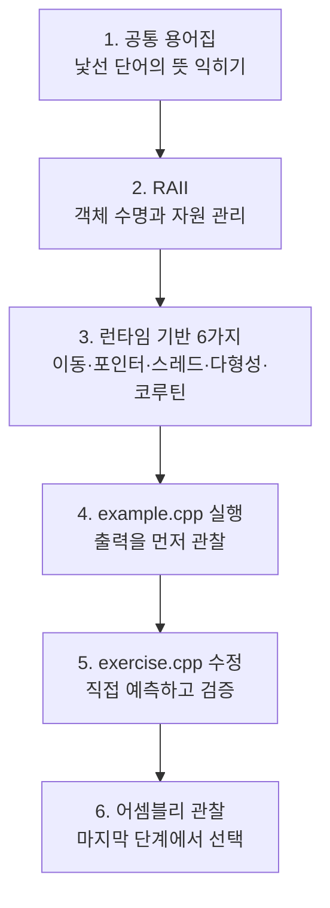
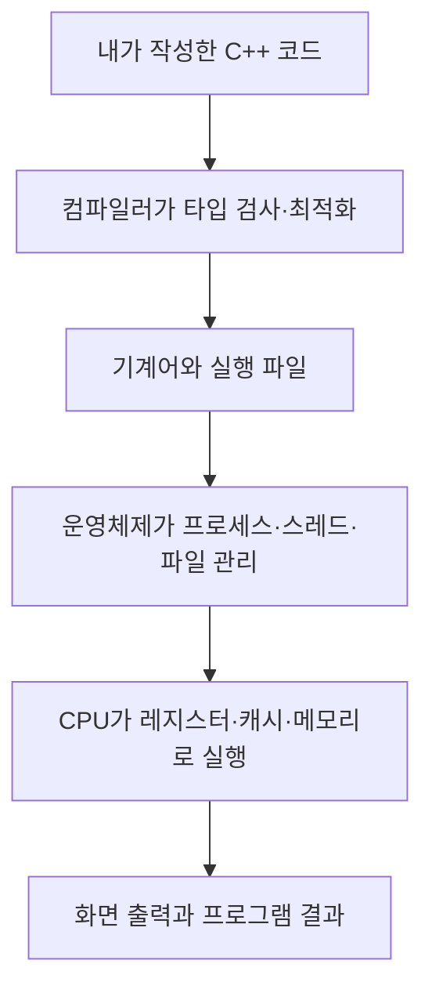

# 자주 까먹는 C++와 Rust 문법과 기술

## 설명

이 폴더의 자료는 처음부터 읽는 **커리큘럼**과, 기억나지 않는 주제를 바로 찾는
**주제별 메뉴**로 나누어 볼 수 있습니다. 처음이라면 아래 추천 순서를 따르고, 이미
아는 내용이 있다면 주제별 메뉴에서 필요한 문서로 바로 이동합니다.

### 파일 메뉴

- [Priority Queue](./cpp20/priority_queue.cpp). 
- [LTO, Link time optimization](./LTO.md). 
- [inline and constexpr](./basic/inline_constexpr.md). - inline 및 constexpr에서의 최적화.  
- [공통 용어와 축약어 사전](./GLOSSARY.md) — 기본 용어와 약어를 먼저 정리합니다.
- [Endian 쉽게 이해하기](./endian.md) — 메모리, 네트워크, 패킷 수신 시 엔디언을 설명합니다.
- [SIMD(Single Instruction, Multiple Data)](./simd.md) — 벡터 연산과 병렬 데이터 처리를 소개합니다.
- [std::span과 비소유 메모리 뷰](./std::span.md) — 소유하지 않는 메모리 참조를 설명합니다.
- [CTAD(Class Template Argument Deduction)](./CTAD.md) — 템플릿 인수 추론을 정리합니다.
- [디버깅·역어셈블 도구 설치](./Environment.md) — 실행 결과와 레지스터를 확인하는 도구를 다룹니다.
- [ABI(Application Binary Interface)](./ABI_Architecture.md) — 바이너리 호환성과 호출 규약을 설명합니다.
- [오브젝트 파일·정적/동적 라이브러리 구조](./ExecuteLibraryArchitecture.md) — 빌드 산출물의 관계를 보여 줍니다.
- [RAII 상세 교재](./raii-resource-lifetime/README.md) — 객체 수명과 자원 관리를 다룹니다.
- [Modern C++23 실무 프로젝트 템플릿](./template/README.md) — 계층형 프로젝트 구조와 CMake를 연결합니다.
- [모던 C++ 런타임 기반 6가지](./modern-cpp-runtime-foundations/README.md) — 이동, 원자 연산, 다형성, 코루틴을 설명합니다.
- [C++ 역사와 타입 변화 예제](./history/README.md) — 문법과 타입 변화의 흐름을 정리합니다.
- [실무 서버 프로그래밍 23일 과정](./실무/README.md) — TCP, 동시성, 성능, 게임 서버를 실습합니다.

### 오늘 추가된 문서

- [Endian 쉽게 이해하기](./endian.md) — 메모리 바이트 순서, 네트워크 전송, 수신 파싱을 그림으로 설명합니다.
- [SIMD(Single Instruction, Multiple Data)](./simd.md) — 한 명령으로 여러 데이터를 처리하는 벡터 연산 개념을 소개합니다.

### basic

- [const, constexpr, inline](./basic/constexpr_inline_const.cpp). 
- [explicit의 존재 유무에 대한 차이](./basic/wrong_explicit.cpp)  
  - [correct version](./basic/correct_explicit.cpp)  
- [이동 생성을 통한 메모리 효율성]
  - [pimpl(Pointer to implementation)](../dailystudy/exercise/2026-08-18/main.cpp)  
- [Endian Example](./endian.md). 

### 처음부터 따라가는 추천 커리큘럼

1. [초보자 공통 용어집](./GLOSSARY.md) — 스택, 힙, 객체 수명, ABI 같은 낯선 용어를 먼저 확인합니다.
2. [초보자 막힘 해결표](./실무/06-beginner-review.md) — `T*`, `T&`, `auto`, `const`처럼 코드를 읽을 때 자주 막히는 표기를 익힙니다.
3. [컴퓨터와 C++ 실행 모델](./실무/00-foundations.md) — 소스 코드가 실행 파일이 되고 CPU에서 실행되는 전체 흐름을 배웁니다.
4. [RAII와 객체 수명](./raii-resource-lifetime/README.md) — 스코프, 소유권, 스마트 포인터와 안전한 자원 관리를 익힙니다.
5. [Modern C++23 실무 프로젝트 템플릿](./template/README.md) — 클래스 구조, 컨테이너, 알고리즘, 포인터와 CMake를 하나의 프로젝트로 연결합니다.
6. [템플릿 타입 추론 가이드](./template/template-type-deduction.md) — `T`, `auto`, `decltype`, 전달 참조와 추론 가이드를 기초부터 읽습니다.
7. [타입 시스템과 템플릿 예제](./type/README.md) — 이동, 전달, CRTP, concepts, SFINAE와 `variant`를 예제로 확인합니다.
8. [모던 C++ 런타임 기반 6가지](./modern-cpp-runtime-foundations/README.md) — 이동·원자 연산·다형성·코루틴을 메모리와 운영체제 관점까지 확장합니다.
9. [실무 서버 프로그래밍 23일 과정](./실무/README.md) — TCP, 이벤트 I/O, 동시성, 외부 시스템과 게임 서버 구조를 순서대로 실습합니다.

### 주제별 설명 메뉴

#### C++ 기초, 메모리와 객체 수명

- [공통 용어와 축약어 사전](./GLOSSARY.md)
- [컴퓨터와 C++ 실행 모델](./실무/00-foundations.md)
- [메모리·스택·힙·객체 수명](./실무/wiki/memory.md)
- [값 범주·참조·이동](./실무/wiki/value-categories.md)
- [RAII와 스마트 포인터 요약](./실무/wiki/raii.md)
- [RAII 상세 교재](./raii-resource-lifetime/README.md) · [C#/Python/Rust 비교](./raii-resource-lifetime/compare.md) · [예제](./raii-resource-lifetime/example.cpp) · [실습](./raii-resource-lifetime/exercise.cpp)
- [`std::span`과 비소유 메모리 뷰](./std::span.md)

#### 타입, 템플릿과 모던 C++ 문법

- [CTAD(Class Template Argument Deduction, 클래스 템플릿 인수 추론)](./CTAD.md)
- [템플릿 타입 추론 입문](./template/template-type-deduction.md)
- [타입·이동·전달·concepts·SFINAE 예제 모음](./type/README.md)
- [템플릿 메타프로그래밍과 `overloaded` 패턴](./history/template_meta_programming.md)
- [C++17: `variant`, TMP, CTAD](./cpp17/REAMDE.md)
- [C++23: `expected`와 monadic 연산](./cpp23/README.md)
- [C++23 계층형 프로젝트 전체 교재](./template/README.md) · [C#/Python 비교](./template/compare.md)

#### 표준의 발전과 컴파일러 내부 동작

- [C++ 역사와 타입 변화 예제](./history/README.md)
- [어셈블리와 CPU 레지스터](./history/Assembly.md)
- [소스에서 실행 파일까지의 빌드 파이프라인](./실무/wiki/build-pipeline.md)
- [오브젝트 파일·정적/동적 라이브러리 구조](./ExecuteLibraryArchitecture.md)
- [ABI(Application Binary Interface, 응용 프로그램 이진 인터페이스)](./ABI_Architecture.md)
- [크로스 컴파일](./history/cross-compile.md)
- [디버깅·역어셈블 도구 설치](./Environment.md)

#### 런타임, 운영체제와 동시성

- [모던 C++ 런타임 기반 6가지](./modern-cpp-runtime-foundations/README.md) · [C#/Python 비교](./modern-cpp-runtime-foundations/compare.md) · [예제](./modern-cpp-runtime-foundations/example.cpp) · [실습](./modern-cpp-runtime-foundations/exercise.cpp)
- [프로세스와 스레드](./실무/wiki/process-thread.md)
- [동시성·mutex·atomic](./실무/wiki/concurrency.md)
- [CPU 캐시와 false sharing](./실무/wiki/cpu-cache.md)
- [lock-free, CAS와 ABA 문제](./실무/wiki/lock-free.md)
- [시스템 호출과 파일 디스크립터](./실무/wiki/system-call.md)

#### 실무 서버와 게임 프로그래밍 커리큘럼

- [전체 과정 안내와 23일 완주 순서](./실무/README.md)
- [1장: 모던 C++ 언어와 자원 관리](./실무/01-modern-cpp.md)
- [2장: TCP 소켓과 이벤트 기반 I/O](./실무/02-networking.md)
- [3장: 동시성과 비동기 실행](./실무/03-concurrency.md)
- [4장: 외부 시스템과 계층화](./실무/04-production.md)
- [5장: 성능과 게임 서버](./실무/05-performance-game.md)
- [초보자 관점 복습과 오류 해결표](./실무/06-beginner-review.md)
- [실무 서버 개념의 C#/Python 비교](./실무/compare.md)
- [실무 용어 위키 전체 메뉴](./실무/wiki/README.md)
  - [TCP 바이트 스트림과 패킷 프레이밍](./실무/wiki/tcp-stream.md)
  - [이벤트 루프와 Reactor/Proactor](./실무/wiki/event-loop.md)
  - [직렬화·엔디언·정렬](./실무/wiki/serialization.md)
  - [캐시·데이터베이스·커넥션 풀](./실무/wiki/storage.md)
  - [게임 루프·AOI·보간](./실무/wiki/game-networking.md)
  - [zero-copy의 여러 의미](./실무/wiki/zero-copy.md)

#### 빌드, 실행과 프로젝트 구성

- [C++ 단일 파일 실행 방법](./README.md#type-cpp23-history-예제-빌드-및-실행)
- [C++23 프로젝트의 CMake와 Make 사용법](./template/README.md#1-실행부터-확인하기)
- [CMakeLists.txt 단계별 설명](./template/README.md#8-cmakeliststxt-단계별-설명)
- [Boost와 외부 라이브러리 설정](./template/README.md#9-boost와-외부-라이브러리-환경-설정)
- [C++ 실행 스크립트](./run.sh) · [Rust 실행 스크립트](./run_for_rust.sh)

#### Rust 입문

- [OS별 Rust 설치와 환경 변수 설정](./README.md#rust-설치와-단일-파일-실행)
- [Rust `enum` 예제](./rust/enum.rs)
- [Rust 단일 파일 실행 스크립트](./run_for_rust.sh)

## 실행

- [C++ 실행 스크립트](./run.sh)
- [Rust 실행 스크립트](./run_for_rust.sh)

```sh
./run.sh type/xxx.cpp 
./run_for_rust.sh rust/xxx.rs
```

## Rust 설치와 단일 파일 실행

### 무엇을 설치하는가

Rust 프로젝트는 공식 toolchain 관리자인 `rustup`으로 설치하는 방법을 권장합니다.
`rustup`은 안정 버전 Rust 컴파일러 `rustc`, 패키지·빌드 도구 `cargo`와 표준 도구를
함께 관리합니다. 설치 후 먼저 다음 명령으로 상태를 확인합니다.

```bash
rustup show
rustc --version
cargo --version
```

### macOS

Rust가 최종 실행 파일을 링크할 수 있도록 Apple Command Line Tools를 먼저 준비합니다.

```bash
xcode-select --install
```

터미널에서 공식 rustup 설치 스크립트를 실행하고 화면의 기본 설치 항목을 선택합니다.

```bash
curl --proto '=https' --tlsv1.2 https://sh.rustup.rs -sSf | sh
```

설치가 끝나면 새 터미널을 열거나 현재 셸에 환경을 반영합니다.

```bash
source "$HOME/.cargo/env"
```

### Linux

Rust 링커와 C 코드를 포함한 crate를 빌드하려면 GCC 또는 Clang 계열 개발 도구가
필요합니다. Ubuntu/Debian 계열에서는 다음과 같이 준비할 수 있습니다.

```bash
sudo apt update
sudo apt install curl build-essential
```

그다음 공식 rustup 설치 스크립트를 실행합니다.

```bash
curl --proto '=https' --tlsv1.2 https://sh.rustup.rs -sSf | sh
source "$HOME/.cargo/env"
```

Fedora, Arch 등은 배포판 패키지 관리자로 GCC 또는 Clang과 linker를 설치한 뒤 같은
rustup 명령을 사용합니다.

### Windows

1. [공식 Rust 설치 페이지](https://www.rust-lang.org/tools/install)에서 CPU에 맞는
   `rustup-init.exe`를 내려받아 실행합니다.
2. 일반 Windows 개발에는 기본값인 MSVC ABI toolchain을 권장합니다.
3. 설치 프로그램이 Visual Studio 필수 구성 요소 설치를 제안하면 진행합니다. 직접
   설치할 때는 Visual Studio 2022 Community 또는 Build Tools에서
   **Desktop development with C++**, 최신 MSVC C++ x64/x86 build tools와 Windows SDK를
   선택합니다.
4. 설치가 끝난 뒤 PowerShell, 명령 프롬프트 또는 Git Bash를 새로 엽니다.

`run_for_rust.sh`는 Bash 스크립트이므로 Windows에서는 Git Bash/MSYS2 또는 WSL에서
실행합니다. PowerShell이나 명령 프롬프트에서는 `rustc`를 직접 사용하거나 Cargo
명령을 사용합니다.

### PATH 환경 변수

rustup의 기본 도구 위치는 다음과 같습니다.

| 운영체제 | 기본 도구 폴더 |
|---|---|
| macOS/Linux | `$HOME/.cargo/bin` |
| Windows | `%USERPROFILE%\.cargo\bin` |

rustup 설치 프로그램은 일반적으로 이 폴더를 `PATH`에 추가합니다. `rustc --version`이
실패하면 터미널을 완전히 닫고 다시 엽니다. 그래도 실패하면 다음 설정을 확인합니다.

macOS/Linux의 현재 터미널에만 적용:

```bash
export PATH="$HOME/.cargo/bin:$PATH"
```

계속 적용하려면 사용하는 셸의 설정 파일에 같은 줄을 넣습니다.

```bash
# zsh: ~/.zshrc
# bash: ~/.bashrc 또는 ~/.bash_profile
export PATH="$HOME/.cargo/bin:$PATH"
```

Windows에서는 “시스템 속성 → 환경 변수 → 사용자 변수의 Path”에
`%USERPROFILE%\.cargo\bin`이 있는지 확인하고, 없다면 새 항목으로 추가합니다.

`CARGO_HOME`이나 `RUSTUP_HOME`을 직접 변경해 설치했다면 기본 경로 대신
`$CARGO_HOME/bin`이 `PATH`에 있어야 합니다.

### 안정 버전 설치·업데이트

```bash
rustup default stable
rustup update stable
```

### `run_for_rust.sh` 사용법

`자주까먹는` 폴더를 기준으로 `.rs` 파일 경로를 전달합니다.

```bash
cd 자주까먹는

./run_for_rust.sh rust/hello.rs
./run_for_rust.sh rust hello.rs
```

Rust 프로그램에 명령행 인수를 전달하려면 `--` 뒤에 적습니다.

```bash
./run_for_rust.sh rust/hello.rs -- Alice 3
```

기본적으로 Rust 2024 Edition, 최적화 수준 2로 컴파일합니다. 필요하면 환경 변수로
바꿀 수 있습니다.

```bash
RUST_EDITION=2021 RUST_OPT_LEVEL=0 ./run_for_rust.sh rust/hello.rs
```

실행 파일은 원본 폴더 구조를 보존해 다음 위치에 생성됩니다.

```text
rust/hello.rs → build/rust/rust/hello
```

이 스크립트는 Rust 표준 라이브러리와 로컬 `mod`만 사용하는 단일 파일 학습 예제를
`rustc`로 빠르게 실행하기 위한 도구입니다. 외부 crate 의존성이나 `Cargo.toml`이 있는
프로젝트는 해당 프로젝트 폴더에서 다음 명령을 사용합니다.

```bash
cargo run
```

공식 참고 자료:

- [The Rust Programming Language: Installation](https://doc.rust-lang.org/book/ch01-01-installation.html)
- [rustup 설치와 기본 PATH](https://rust-lang.github.io/rustup/installation/)
- [Windows MSVC 필수 구성 요소](https://rust-lang.github.io/rustup/installation/windows-msvc.html)

## 추가자료

- [실무 C++ 서버 프로그래밍 23일 실습 가이드](./실무/README.md): 모던 C++ 문법, TCP/epoll, 동시성, 외부 시스템, 게임 서버 최적화를 라인 주석 코드와 용어 위키로 학습합니다.
- [디버깅 raw level](./Environment.md). 
- [CPP 확장자 규칙](./ExecuteLibraryArchitecture.md). 
- [ABI 규칙](./ABI_Architecture.md). 
- [type관련](./type/README.md). 
- [project sample template](./template/README.md). 

자주 잊는 C++ 문법, 동작 원리, 실무 패턴을 다시 찾아보기 쉽게 모아 두는
학습 자료의 최상위 목차입니다. 새 자료를 추가할 때는 주제별 하위 폴더를 만들고,
아래 목차에도 해당 폴더의 `README.md` 링크와 핵심 학습 내용을 함께 추가합니다.

## 처음 방문했다면

처음부터 하드웨어 용어를 모두 이해할 필요는 없습니다. 다음 순서로 읽습니다.



- 먼저 [초보자 공통 용어집](./GLOSSARY.md)을 열어 둡니다.
- 글에서 굵게 표시된 핵심 문장과 다이어그램만 먼저 봅니다.
- 코드는 한 번에 이해하려 하지 말고 출력 결과를 예상한 뒤 실행합니다.
- 어셈블리와 ABI 설명은 앞부분을 이해한 다음 읽어도 됩니다.

## 이 폴더가 연결하는 컴퓨터 계층



`API`, `ABI`, `CPU`, `OS` 같은 축약어는
[공통 용어집](./GLOSSARY.md)에서 전체 이름, 한국어 뜻, 비유를 함께 확인할 수 있습니다.

## `type`, `cpp23`, `history` 예제 빌드 및 실행

[`run.sh`](./run.sh)는 [`type`](./type/), [`cpp23`](./cpp23/),
[`history`](./history/) 폴더의 `.cpp` 파일 하나를 선택하여 C++23으로 빌드하고
곧바로 실행합니다. 먼저 이 README가 있는 폴더로 이동합니다.

```bash
cd 자주까먹는
```

디렉터리와 파일 이름을 두 인수로 전달할 수 있습니다.

```bash
./run.sh type dynamic_cast.cpp
```

또는 소스 경로를 하나의 인수로 전달해도 됩니다.

```bash
./run.sh type/dynamic_cast.cpp
./run.sh cpp23/main.cpp
./run.sh cpp23/expected.cpp
./run.sh history/decay.cpp
```

예를 들어 `dynamic_cast.cpp`를 실행하면 다음 결과가 출력됩니다.

```text
멍멍
야옹
```

각 `.cpp` 파일은 독립 실행 파일로 빌드되므로 자체 `main()` 함수가 있어야 합니다.
실행 파일은 `build/<폴더>/`에 생성되고 CMake 중간 파일은
`build/.cmake/<폴더>/`에 분리됩니다. 새 `.cpp` 파일을 해당 폴더에 추가하면 각
폴더의 `CMakeLists.txt`가 파일 이름과 같은 실행 타깃을 자동으로 만듭니다.

## 자료 목차

### [RAII: 스코프와 객체 수명으로 자원 관리](./raii-resource-lifetime/README.md)

- 생성자·소멸자, 예외 스택 해제, 역순 파괴, 커스텀 deleter와 범위 잠금을 하드웨어·ABI 관점까지 설명합니다.
- 핵심 표준: C++17
- [C#/Python/Rust 비교](./raii-resource-lifetime/compare.md)
- 예제 및 실습 코드
  - [`example.cpp`](./raii-resource-lifetime/example.cpp): FILE 핸들, 예외 경로, lock_guard 통합 예제
  - [`exercise.cpp`](./raii-resource-lifetime/exercise.cpp): 이동 가능한 Lease guard와 조기 반환 실습
- 빌드 구성
  - [`CMakeLists.txt`](./raii-resource-lifetime/CMakeLists.txt): C++17 대상과 경고 옵션

### [모던 C++ 런타임 기반 6가지](./modern-cpp-runtime-foundations/README.md)

- 방어적 클래스 설계부터 이동, RAII, 원자 연산, 다형성, OS 이벤트 I/O와 코루틴까지
  컴파일러·메모리·하드웨어 관점으로 연결합니다.
- 핵심 표준: 통합 예제와 실습은 C++17, 코루틴 수명 예제는 C++20
- [C#/Python 비교](./modern-cpp-runtime-foundations/compare.md)
- 예제 및 실습 코드
  - [`example.cpp`](./modern-cpp-runtime-foundations/example.cpp): 여섯 개념을 요청 처리 서비스로 통합한 C++17 예제
  - [`coroutine_example.cpp`](./modern-cpp-runtime-foundations/coroutine_example.cpp): 안전한 프레임 수명을 갖는 C++20 수동 코루틴 예제
  - [`exercise.cpp`](./modern-cpp-runtime-foundations/exercise.cpp): 이동 상태, 메모리 순서, 다형성 선택 실습
- 빌드 구성
  - [`CMakeLists.txt`](./modern-cpp-runtime-foundations/CMakeLists.txt): C++17/C++20 대상과 경고 옵션

### [Modern C++23 실무 프로젝트 템플릿](./template/README.md)

- 계층형 클래스 구조, 의존성 주입, `vector`/`list`/`map`, ranges 정렬,
  `unique_ptr`/`shared_ptr`, `const`/`constexpr`, `expected`를 하나의 실행 프로젝트로 연결합니다.
- 핵심 표준: C++23
- [C#/Python 비교](./template/compare.md)
- [템플릿 타입 추론 가이드](./template/template-type-deduction.md):
  `T`, `auto`, `decltype`, 전달 참조, CTAD와 concept를 기초부터 단계별로 설명
- 예제 및 실습 코드
  - [`src/main.cpp`](./template/src/main.cpp): 전체 계층과 소유권을 조립하는 실행 예제
  - [`src/exercise.cpp`](./template/src/exercise.cpp): ranges 정렬과 view를 직접 작성하는 실습
  - [`src/boost_example.cpp`](./template/src/boost_example.cpp): 선택적으로 빌드하는 Boost.Container 예제
- 공개 헤더와 빌드 구성
  - [`include/modern_cpp`](./template/include/modern_cpp/): domain/application/infrastructure 공개 계약
  - [`CMakeLists.txt`](./template/CMakeLists.txt): C++23 정적 라이브러리, 실행 파일, 선택적 Boost target
  - [`Makefile`](./template/Makefile): `make build`, `make run`, `make exercise`, `make boost-run` 단축 명령

### [공통 용어와 축약어 사전](./GLOSSARY.md)

- RAII, ABI, CRTP, CAS, SSO, IOCP, GIL, FFI 등 문서에 등장하는 축약어를 풀이합니다.
- 스택, 힙, 객체 수명, 소유권, 레지스터, 캐시처럼 자주 쓰는 기초 용어를 비유와 함께 설명합니다.

<!--
새 자료는 다음 형식으로 이 주석 바로 위에 추가합니다.

### [주제 이름](./주제-폴더/README.md)

- 한 문장으로 설명한 학습 목표
- 핵심 C++ 표준 또는 문법: C++17 이상
- [C#/Python 비교](./주제-폴더/compare.md)
- 예제 코드
  - [`example.cpp`](./주제-폴더/example.cpp): 예제가 보여 주는 핵심 내용
- 실습 코드
  - [`exercise.cpp`](./주제-폴더/exercise.cpp): 직접 확인할 동작과 과제
-->

## 자료 추가 규칙

이 폴더에서 사이트 주소나 학습할 내용을 제공하면 [AGENTS.md](./AGENTS.md)의
지침에 따라 주제 폴더와 학습 자료를 생성합니다. 각 주제의 진입점은 해당 폴더의
`README.md`이며, 언어별 차이는 `compare.md`에서 확인할 수 있어야 합니다.
