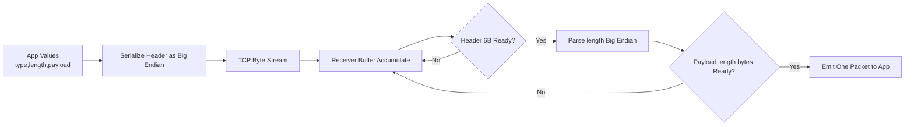
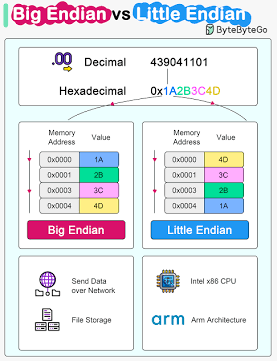

# Endian 쉽게 이해하기

한 줄 요약: 엔디언(Endian)은 여러 바이트로 이루어진 값(예: 32비트 정수)을 메모리에 어떤 순서로 배치하는지에 대한 약속이다.

초직관 비유: 숫자책을 "왼쪽부터 읽는 국가"와 "오른쪽부터 읽는 국가"가 있다고 생각하면 된다.
중요한 것은 책 내용(값)은 같고, "페이지를 넘기는 방향(바이트 순서)"만 다르다는 점이다.

---

## 0) 10초 감각 잡기: 값 vs 바이트

- 값(value): 사람이 이해하는 숫자 의미 (예: 1025)
- 바이트(bytes): 메모리나 네트워크에 실제 저장되는 조각

`1025`를 16진수로 쓰면 `0x00000401`이고, 이를 바이트로 나누면 `00 00 04 01`이다.

- Big Endian 표기 관점: `00 00 04 01`
- Little Endian 메모리 배치 관점: `01 04 00 00`

핵심 한 문장:

"값은 그대로, 바이트 순서만 바뀐다."

## 1) 메모리 관점에서 직관적으로 보기

예제로 32비트 값 `0x12 34 56 78`을 사용한다.

- 값의 바이트(큰 자리 -> 작은 자리): `12 34 56 78`
- 메모리 주소는 왼쪽에서 오른쪽으로 증가한다고 가정

### Big Endian (빅 엔디언)

가장 큰 자리 바이트(MSB, Most Significant Byte)가 낮은 주소에 저장된다.

```text
값: 0x12345678

주소 증가 방향 ->
+---------+---------+---------+---------+
| 0x1000  | 0x1001  | 0x1002  | 0x1003  |
+---------+---------+---------+---------+
|  0x12   |  0x34   |  0x56   |  0x78   |
+---------+---------+---------+---------+
```

### Little Endian (리틀 엔디언)

가장 작은 자리 바이트(LSB, Least Significant Byte)가 낮은 주소에 저장된다.

```text
값: 0x12345678

주소 증가 방향 ->
+---------+---------+---------+---------+
| 0x1000  | 0x1001  | 0x1002  | 0x1003  |
+---------+---------+---------+---------+
|  0x78   |  0x56   |  0x34   |  0x12   |
+---------+---------+---------+---------+
```

핵심 포인트:

- 숫자 값 자체는 동일하다.
- 메모리의 바이트 배치만 다르다.
- 1바이트 값(`uint8_t`, `byte`)은 엔디언 영향이 없다.

## 2) 어디에서 주로 차이가 드러나는가

일반 애플리케이션 코드에서 int를 읽고 쓰는 동안에는 CPU가 알아서 처리하므로 체감이 적다.
차이는 "바이트 단위 경계"에서 드러난다.

1. 네트워크 프로토콜
- 네트워크 바이트 순서는 보통 Big Endian이다.
- 호스트가 Little Endian이면 송신 시 swap, 수신 시 swap이 필요하다.

2. 바이너리 파일 포맷
- 포맷이 Little 또는 Big으로 고정되어 있을 수 있다.
- 파일 I/O 시 명시적으로 변환해야 한다.

3. 메모리 덤프/직렬화/FFI
- 바이트 그대로 저장/전송하면 플랫폼 차이로 깨질 수 있다.
- "값"이 아니라 "바이트 배열"을 다룰 때 문제 발생 확률이 높다.

4. 하드웨어 레지스터/임베디드
- 주변장치 문서가 바이트 순서를 명시하는 경우가 많다.

### 바로 떠올리기 좋은 판단법

- "정수 연산만 한다" -> 보통 신경 안 써도 됨
- "바이트를 외부로 보내거나 받는다" -> 엔디언 규칙 반드시 확인
- "문자열/압축/암호문 같은 raw bytes" -> 보통 엔디언 변환 대상 아님

## 3) CPU에 따라 native가 바뀌는가

바뀔 수 있다.

- C++의 `std::endian::native`는 "현재 타깃 플랫폼의 네이티브 엔디언"을 나타낸다.
- x86-64, Apple Silicon(arm64) 환경은 보통 Little Endian이다.
- 중요한 점은 "enum 내부 숫자값"이 아니라 "비교 결과"를 사용해야 한다는 점이다.

권장 패턴:

```cpp
if constexpr (std::endian::native == std::endian::little) {
	// little host 전용 처리
}
```

## 4) 실무에서 코드를 간결하게 쓰는 방법 (C++)

목표는 "경계에서만 변환"이다.

- 내부 도메인 모델은 host endian 그대로 사용
- 네트워크/파일/FFI 경계에서만 변환
- 변환 함수를 한 곳에 모아 중복 제거

### C++ 예시 (C++20+, std::byteswap 사용)

```cpp
#include <bit>
#include <cstdint>

constexpr std::uint32_t host_to_be32(std::uint32_t v) noexcept {
	if constexpr (std::endian::native == std::endian::little) {
		return std::byteswap(v);
	} else {
		return v;
	}
}

constexpr std::uint32_t be32_to_host(std::uint32_t v) noexcept {
	// 역변환은 동일 연산
	return host_to_be32(v);
}
```

실무 팁:

- 함수 이름에 방향을 넣는다: `host_to_be32`, `be32_to_host`
- 정수 폭을 명확히 한다: `uint16_t`, `uint32_t`, `uint64_t`
- 포인터 캐스팅보다 `std::bit_cast`/`memcpy` 기반 직렬화를 선호한다

## 5) 실무에서 코드를 간결하게 쓰는 방법 (C#)

`System.Buffers.Binary.BinaryPrimitives`를 쓰면 의도가 분명하고 안전하다.

### C# 예시

```csharp
using System;
using System.Buffers.Binary;

public static class EndianCodec
{
	public static byte[] ToBigEndianBytes(uint value)
	{
		Span<byte> buffer = stackalloc byte[4];
		BinaryPrimitives.WriteUInt32BigEndian(buffer, value);
		return buffer.ToArray();
	}

	public static uint FromBigEndianBytes(ReadOnlySpan<byte> bytes)
	{
		if (bytes.Length < 4) throw new ArgumentException("Need at least 4 bytes");
		return BinaryPrimitives.ReadUInt32BigEndian(bytes);
	}
}
```

실무 팁:

- `BitConverter`를 그대로 쓰면 플랫폼 엔디언에 의존하기 쉽다
- 프로토콜이 고정 엔디언이면 `Read/Write...BigEndian` 또는 `LittleEndian`을 명시한다
- 검증 로직(길이 체크)을 변환 함수 내부에 넣어 호출부를 단순화한다

## 6) C++ vs C# 비교 요약

| 관점 | C++ | C# |
|---|---|---|
| 네이티브 엔디언 확인 | `std::endian::native` | `BitConverter.IsLittleEndian` |
| 바이트 스왑 | `std::byteswap` (C++23), 또는 플랫폼 함수 | `BinaryPrimitives.ReverseEndianness` |
| 권장 직렬화 경계 | `bit_cast/memcpy + 명시적 변환` | `BinaryPrimitives Read/Write` |
| 주의점 | UB 유발 캐스팅, 정렬/별칭 이슈 | `BitConverter` 의존 사용 시 플랫폼 차이 |

## 7) 자주 하는 실수

1. 값을 바꾸는 것과 바이트 순서를 바꾸는 것을 혼동
2. 모든 코드 경로에서 매번 엔디언 체크를 수행
3. 경계가 아닌 도메인 내부까지 swap을 퍼뜨려 복잡도 증가
4. enum의 내부 숫자값에 의존

## 8) 추천 실무 체크리스트

1. 프로토콜/파일 포맷의 엔디언을 문서 첫 줄에 명시
2. 변환은 입출력 경계에서만 수행
3. 변환 함수를 중앙화하고 테스트로 고정
4. 16/32/64비트별 함수명을 분리해 실수 방지
5. 라운드 트립 테스트(encode -> decode == original)를 자동화

## 9) 빠른 결론

- CPU가 일반 메모리 저장은 알아서 처리한다.
- 문제는 "다른 시스템과 바이트를 교환할 때" 시작된다.
- 따라서 실무에서는 "경계 한 곳에서만 명시적으로 변환"하는 패턴이 가장 단순하고 안전하다.

### 자주 헷갈리는 질문 3개

1. 수신하면 내부에서도 Big Endian으로 유지해야 하나?
- 아니다. 수신 직후 Host 값으로 복원한 뒤 내부에서는 일반 정수로 사용한다.

2. 그럼 언제 다시 Big Endian으로 바꾸나?
- 다시 네트워크로 보낼 "직전"에만 바꾼다.

3. payload도 변환하나?
- payload가 정수 필드 묶음이 아니라 raw bytes면 변환하지 않는다.

## 10) 32비트를 넘는 패킷은 어떻게 다루나 (실전 시각화)

실무 패킷은 보통 헤더 + 가변 길이 payload 구조다.
예시 프로토콜을 다음처럼 가정한다.

- `type` (2바이트, unsigned)
- `length` (4바이트, payload 길이)
- `payload` (length 바이트)

네트워크 전송 규칙은 Big Endian(네트워크 바이트 순서)로 고정한다.

### 10-1) 송신 측에서 만들어지는 바이트 스트림

가정 값:

- `type = 0x0102`
- `length = 0x00000005`
- `payload = "HELLO"` (ASCII: `48 45 4C 4C 4F`)

```text
[Header(type 2B)] [Header(length 4B)] [Payload 5B]

01 02  00 00 00 05  48 45 4C 4C 4F
^type  ^---- length ----^  ^-- payload --^
```

포인트:

- payload가 5바이트이므로 이미 32비트를 초과한다.
- 엔디언이 영향을 주는 구간은 "다바이트 정수 필드(type, length)"다.
- payload 자체(바이트 배열)는 엔디언 변환 대상이 아니다.

### 10-2) TCP에서는 한 번에 안 들어올 수 있다 (분할 수신)

TCP는 메시지 경계가 없고 바이트 스트림이다.
아래처럼 여러 번에 나뉘어 들어올 수 있다.

```text
recv #1: 01 02 00
recv #2: 00 00 05 48 45
recv #3: 4C 4C 4F
```

따라서 수신 로직은 반드시 상태 기반으로 작성한다.

1. 먼저 헤더 고정 길이(6바이트)를 모두 모은다.
2. 헤더에서 length를 파싱한다(Big Endian -> host).
3. payload를 length만큼 더 모은다.
4. 완성된 한 패킷을 상위 로직에 전달한다.

### 10-3) Little Endian CPU에서의 파싱을 메모리 관점으로 보기

수신 버퍼의 앞 6바이트가 아래라고 하자.

```text
Byte stream in memory order (주소 증가 방향 ->)

+------+------+------+------+------+------+
| 01   | 02   | 00   | 00   | 00   | 05   |
+------+------+------+------+------+------+
  type(2B)        length(4B, network big endian)
```

Little Endian CPU라도 이 바이트 배열 자체는 그대로 저장된다.
중요한 것은 "정수로 해석하는 순간"이다.

- `type`: `01 02`를 Big Endian 규칙으로 읽어 `0x0102`
- `length`: `00 00 00 05`를 Big Endian 규칙으로 읽어 `5`

즉, CPU가 little인 것과 별개로, 네트워크 필드는 네트워크 규칙으로 읽어야 한다.

### 10-4) C++ 간결 수신 예시 (상태 기반)

```cpp
#include <array>
#include <cstddef>
#include <cstdint>
#include <vector>
#include <span>

struct Packet {
	std::uint16_t type{};
	std::vector<std::byte> payload{};
};

constexpr std::uint16_t be16_to_host(std::uint16_t v) noexcept {
	if constexpr (std::endian::native == std::endian::little) {
		return static_cast<std::uint16_t>((v >> 8) | (v << 8));
	} else {
		return v;
	}
}

constexpr std::uint32_t be32_to_host(std::uint32_t v) noexcept {
	if constexpr (std::endian::native == std::endian::little) {
		return std::byteswap(v);
	} else {
		return v;
	}
}

// stream 버퍼에 수신 바이트를 계속 append한다고 가정
// 한 패킷이 완성되면 true 반환, 아니면 false
bool try_parse_one(std::vector<std::byte>& stream, Packet& out) {
	constexpr std::size_t header_size = 6;
	if (stream.size() < header_size) return false;

	const auto* p = reinterpret_cast<const std::uint8_t*>(stream.data());

	// 네트워크 바이트 배열을 값으로 조립 (항상 Big Endian 기준)
	const std::uint16_t type_be = static_cast<std::uint16_t>(p[0] << 8 | p[1]);
	const std::uint32_t len_be =
		(static_cast<std::uint32_t>(p[2]) << 24) |
		(static_cast<std::uint32_t>(p[3]) << 16) |
		(static_cast<std::uint32_t>(p[4]) << 8) |
		(static_cast<std::uint32_t>(p[5]));

	const std::uint16_t type = be16_to_host(type_be);
	const std::uint32_t len = be32_to_host(len_be);

	if (stream.size() < header_size + len) return false;

	out.type = type;
	out.payload.assign(stream.begin() + header_size, stream.begin() + header_size + len);

	// 사용한 바이트 제거 (다음 패킷 파싱 가능)
	stream.erase(stream.begin(), stream.begin() + header_size + len);
	return true;
}
```

주의:

- 위 코드는 아이디어 전달용이다.
- 고성능 서버는 `erase` 비용을 줄이기 위해 링버퍼나 오프셋 인덱스를 쓴다.

### 10-5) C# 간결 수신 예시 (BinaryPrimitives)

```csharp
using System;
using System.Buffers.Binary;

public readonly record struct Packet(ushort Type, byte[] Payload);

public static class PacketParser
{
	public static bool TryParseOne(ReadOnlySpan<byte> stream, out Packet packet, out int consumed)
	{
		packet = default;
		consumed = 0;
		const int headerSize = 6;

		if (stream.Length < headerSize) return false;

		ushort type = BinaryPrimitives.ReadUInt16BigEndian(stream.Slice(0, 2));
		uint len = BinaryPrimitives.ReadUInt32BigEndian(stream.Slice(2, 4));

		if (stream.Length < headerSize + len) return false;

		byte[] payload = stream.Slice(headerSize, checked((int)len)).ToArray();
		packet = new Packet(type, payload);
		consumed = headerSize + (int)len;
		return true;
	}
}
```

핵심:

- CPU가 little이든 big이든 `ReadUInt32BigEndian`이 프로토콜 규칙대로 해석해 준다.
- 호출부는 `consumed`만큼 버퍼를 전진시키면 된다.

### 10-6) 한 장으로 정리



이 흐름에서 엔디언 처리는 `Serialize Header`와 `Parse Header` 두 경계에만 존재한다.
payload 바이트는 원본 그대로 전달된다.

### 10-7) 진짜 직관: 우체국 라벨 비유

- 내부 시스템 숫자 = 집 안에서 쓰는 메모 방식
- 네트워크 포맷 = 우체국 국제 배송 라벨 규격

동작 순서:

1. 집 안에서는 내 방식(Little)으로 메모
2. 우체국에 보낼 때 라벨 규격(Big)으로 다시 작성
3. 상대방은 받은 라벨(Big)을 자기 집 방식으로 해석

즉, 변환은 "우체국 창구(입출력 경계)"에서만 발생한다.

---

## 참고 추가 자료

- C++ 표준 라이브러리 엔디언: https://en.cppreference.com/w/cpp/types/endian
- C++ 바이트 스왑: https://en.cppreference.com/w/cpp/numeric/byteswap
- .NET BinaryPrimitives: https://learn.microsoft.com/dotnet/api/system.buffers.binary.binaryprimitives
- 네트워크 바이트 순서 배경 (RFC 1700): https://www.rfc-editor.org/rfc/rfc1700
- TCP가 바이트 스트림인 이유 (RFC 9293): https://www.rfc-editor.org/rfc/rfc9293
- Wireshark로 패킷 바이트 확인 가이드: https://www.wireshark.org/docs/wsug_html_chunked/


네트워크 통신에서 데이터를 주고받을 때 엔디안(Endian) 변환은 매우 중요한 개념입니다. 쉽게 말해 "데이터를 읽고 쓰는 순서를 맞추는 통역 과정"이라고 볼 수 있습니다.

먼저 이 두 가지 방식이 어떻게 다른지, 그리고 왜 변환이 필요한지 시각적인 구조와 함께 설명해 드릴게요.

---



## 1. 기본 개념: 메모리에 숫자를 적는 두 가지 방법

예를 들어, **`0x12345678`** 이라는 4바이트 크기의 숫자가 있다고 가정해 보겠습니다. (`12`가 가장 큰 단위, `78`이 가장 작은 단위입니다.)

| 방식 | 특징 | 메모리 저장 순서 (낮은 주소 → 높은 주소) | 주로 사용하는 곳 |
| --- | --- | --- | --- |
| **Big Endian (빅 엔디안)** | 우리가 숫자를 읽는 자연스러운 순서대로 저장합니다. 앞부분(큰 단위)부터 차례대로 넣습니다. | `12` `34` `56` `78` | **네트워크 표준 (Network Byte Order)** |
| **Little Endian (리틀 엔디안)** | 뒷부분(작은 단위)부터 거꾸로 저장합니다. 컴퓨터가 계산을 빠르게 하기 좋은 구조입니다. | `78` `56` `34` `12` | 대부분의 PC (Intel, AMD 등 Host) |

문제는 여기서 발생합니다. **우리가 쓰는 대부분의 PC(Host)는 Little Endian을 사용하지만, 인터넷 세상의 공용어(Network)는 Big Endian을 표준으로 사용**합니다. 따라서 데이터를 보낼 때 순서를 뒤집어주지 않으면, 받는 쪽에서는 `12345678`을 `78563412`라는 엉뚱한 값으로 오해하게 됩니다.

---

## 2. 데이터 전송 시뮬레이션: Host ➔ Network ➔ Server

내 PC(Little Endian)에서 인터넷을 거쳐 서버로 `0x12345678` 이라는 데이터를 전송하는 과정을 순서대로 살펴보겠습니다.

1. **Host (내 PC)에서 데이터 준비:**
내 PC는 Little Endian 방식이므로, 메모리에는 **`78 56 34 12`** 순서로 데이터가 저장되어 있습니다.


2. **Host ➔ Network (보내기 전 변환):** 이 과정을 'Host to Network' 변환이라고 합니다..
데이터를 네트워크로 쏘아 보내기 직전, 네트워크 표준어(Big Endian)로 번역해야 합니다.

* 변환 결과: `78 56 34 12` ➔ **`12 34 56 78`**


3. **Network (인터넷 망 통과):**
데이터는 변환된 상태 그대로 인터넷 선로를 타고 날아갑니다.

* 전송 중인 데이터: **`12 34 56 78`**


4. **Network ➔ Server (서버 도착 후 변환):** 이 과정을 'Network to Host' 변환이라고 합니다..
서버는 **`12 34 56 78`** 이라는 데이터를 받습니다. 이제 서버 자신의 언어(아키텍처)에 맞게 다시 번역합니다.

* **만약 서버가 Little Endian PC라면:** 받은 데이터를 다시 뒤집어서 `78 56 34 12` 로 메모리에 저장합니다. (원래 내가 보낸 값 `0x12345678`로 정상 인식)
* **만약 서버가 Big Endian 장비라면:** 받은 데이터 `12 34 56 78`을 굳이 뒤집지 않고 그대로 사용합니다.


> **핵심 요약:** 보내는 쪽은 무조건 **네트워크 표준(Big Endian)**으로 데이터를 뒤집어서 보내고, 받는 쪽은 일단 네트워크 표준으로 받은 뒤 **자신의 방식**에 맞춰 다시 뒤집을지 말지 결정하는 것입니다. 이렇게 하면 서로 기종이 달라도 완벽하게 통신할 수 있습니다.

C 언어 환경에서 소켓 프로그래밍을 할 때, 앞서 설명한 엔디안 변환 함수들은 주로 **IP 주소와 포트(Port) 번호를 네트워크 장비가 이해할 수 있도록 설정**할 때 필수적으로 사용됩니다.

이해를 돕기 위해 두 가지 예시 코드를 준비했습니다. 첫 번째는 값이 실제로 어떻게 변환되는지 눈으로 확인하는 코드이고, 두 번째는 실제 서버 소켓을 열 때 사용하는 실전 코드입니다.

---

## 1. 16진수 데이터 변환 확인하기

Host의 데이터가 Network 바이트 순서로 어떻게 뒤집히는지 직접 출력해 보는 예제입니다.

```c
#include <stdio.h>
#include <arpa/inet.h> // 엔디안 변환 함수들이 포함된 헤더

int main() {
    // 4바이트(32비트) 데이터와 2바이트(16비트) 데이터 준비
    uint32_t host_long_data = 0x12345678; 
    uint16_t host_short_data = 0x1234;

    // Host -> Network 변환
    uint32_t net_long_data = htonl(host_long_data);
    uint16_t net_short_data = htons(host_short_data);

    printf("=== 4바이트 데이터 (Long) ===\n");
    printf("Host (Little Endian)   : 0x%X\n", host_long_data);
    printf("Network (Big Endian)   : 0x%X\n\n", net_long_data);

    printf("=== 2바이트 데이터 (Short) ===\n");
    printf("Host (Little Endian)   : 0x%X\n", host_short_data);
    printf("Network (Big Endian)   : 0x%X\n", net_short_data);

    return 0;
}

```

**실행 결과 (리틀 엔디안 PC 기준):**

```text
=== 4바이트 데이터 (Long) ===
Host (Little Endian)   : 0x12345678
Network (Big Endian)   : 0x78563412

=== 2바이트 데이터 (Short) ===
Host (Little Endian)   : 0x1234
Network (Big Endian)   : 0x3412

```

---

## 2. 실제 소켓 프로그래밍 적용 예시 (서버 구조체 설정)

서버를 띄우기 위해 소켓의 주소 구조체(`sockaddr_in`)에 내 IP와 포트를 설정하는 가장 전형적인 코드입니다.

```c
#include <stdio.h>
#include <string.h>
#include <arpa/inet.h>
#include <sys/socket.h>

int main() {
    struct sockaddr_in serv_addr;
    short port = 8080;

    // 구조체 메모리를 0으로 초기화
    memset(&serv_addr, 0, sizeof(serv_addr)); 

    // 주소 체계 설정 (IPv4)
    serv_addr.sin_family = AF_INET; 

    // 1. 포트 번호 변환 (2바이트이므로 htons 사용)
    // 개발자가 입력한 8080 포트를 네트워크 표준으로 변환하여 구조체에 넣음
    serv_addr.sin_port = htons(port); 

    // 2. IP 주소 변환 (4바이트이므로 htonl 사용)
    // INADDR_ANY는 서버의 현재 IP를 자동으로 할당하는 상수 (이 역시 변환 필요)
    serv_addr.sin_addr.s_addr = htonl(INADDR_ANY); 

    printf("소켓 주소 구조체 설정 완료!\n");
    printf("설정된 네트워크 포트 값(16진수): 0x%X\n", serv_addr.sin_port);

    // 이후 bind(), listen(), accept() 등의 소켓 함수 진행...

    return 0;
}

```

### 💡 실전 팁

위 코드에서 `INADDR_ANY`와 같은 숫자가 아니라, `"192.168.0.1"` 처럼 **문자열로 된 IP 주소**를 넣어야 할 때가 있습니다. 이 경우에는 `htonl()`을 직접 쓰기보다는, 문자열 IP를 받아 자동으로 빅 엔디안 숫자로 변환해 주는 `inet_addr()`이나 최신 함수인 `inet_pton()`을 사용하는 것이 일반적입니다.

아주 예리하고 합리적인 질문입니다! 만약 세상에 있는 모든 컴퓨터와 통신 장비가 리틀 엔디안을 사용한다면, 질문하신 대로 변환 없이 그냥 보내고 그대로 저장하는 것이 가장 빠르고 효율적일 것입니다.

하지만 데이터를 변환해야만 하는 **두 가지 결정적인 이유**가 있습니다.

---

## 1. 세상에는 리틀 엔디안만 있는 것이 아닙니다 (기종의 다양성)

인터넷은 전 세계의 수많은 종류의 컴퓨터와 기기들을 연결하는 거대한 망입니다.

* **리틀 엔디안을 쓰는 기기:** 우리가 흔히 쓰는 데스크탑/노트북 (Intel, AMD CPU 기반)
* **빅 엔디안을 쓰는 기기:** 과거의 Mac (PowerPC), 기업용 대형 서버 (SPARC, IBM), 그리고 수많은 **네트워크 장비(라우터, 스위치)**
* **둘 다 지원하는 기기:** 스마트폰 (ARM 기반)

만약 표준 없이 각자 자신의 방식대로 데이터를 보낸다면 어떻게 될까요?
리틀 엔디안 PC가 보낸 `0x12345678`을 빅 엔디안 서버가 그대로 받으면, 서버는 이를 완전히 엉뚱한 값인 `0x78563412`로 해석해 버리는 대참사가 일어납니다.

따라서 한국인(리틀 엔디안)과 영국인(빅 엔디안)이 대화할 때 통역을 위해 공용어(Esperanto)를 정하듯, 네트워크 상에서는 "무조건 빅 엔디안으로 통일해서 보내자!"라고 약속을 한 것입니다.

## 2. 중간 배달부(네트워크 장비)의 혼란 방지

데이터가 출발지에서 목적지까지 가려면 수많은 라우터(Router)를 거쳐야 합니다. 라우터는 배달부처럼 데이터 상자(패킷) 겉면에 적힌 **목적지 IP 주소와 포트 번호**를 읽고 길을 찾아줍니다.

만약 송신자가 자신의 맘대로 리틀 엔디안으로 IP 주소를 적어 보낸다면, 라우터는 매번 이 데이터가 리틀 엔디안으로 적혔는지, 빅 엔디안으로 적혔는지 추측해야 합니다. 이는 인터넷 속도를 엄청나게 떨어뜨립니다.

배달부가 주소를 가장 빠르고 정확하게 읽을 수 있도록, **데이터의 알맹이는 몰라도 최소한 IP 주소와 포트 번호 같은 '봉투의 겉면'은 무조건 네트워크 표준(빅 엔디안)으로 적어서 보내야만** 라우터가 길을 잃지 않고 배달할 수 있습니다.

---

> **💡 참고: 왜 하필 빅 엔디안이 표준이 되었을까?**
> TCP/IP 네트워크 표준이 만들어지던 1970~80년대에는 인터넷을 주도하던 대형 컴퓨터와 네트워크 장비들이 주로 빅 엔디안을 사용했습니다. 또한, 빅 엔디안은 큰 단위의 숫자가 먼저 오기 때문에, 네트워크 라우터가 IP 주소의 앞부분(국가/지역 번호 같은 역할)을 먼저 읽고 빠르게 경로를 결정하는 데 유리했기 때문입니다.

아주 중요한 포인트를 짚으셨습니다! 이 부분이 많은 개발자들이 처음 소켓 통신을 할 때 가장 헷갈려 하는 부분 중 하나입니다.

결론부터 말씀드리면, **네트워크를 통해 보낸 데이터(Payload)는 수신 측에서 자동으로 변환되지 않습니다. 개발자가 직접 원래의 형태로 복원(ntohs)해 주어야 합니다.**

질문하신 상황을 단계별로 추적해 보면서 왜 그런지 명확히 설명해 드릴게요.

---

## 1. 송신 측 (Host A)에서의 상황

1. **메모리에 값 저장 (리틀 엔디안):**
* 보낼 데이터: `unsigned short` 10 (`0x000A`)
* 메모리 저장 상태: `[ 0A | 00 ]` (리틀 엔디안이므로 작은 값인 `0A`가 앞에 옵니다.)


2. **전송을 위해 네트워크 바이트 순서(빅 엔디안)로 변환:**
* `htons(10)` 실행
* 변환된 값: `0x0A00`
* 메모리 저장 상태: `[ 00 | 0A ]`


3. **네트워크로 전송 (`send` 함수 호출):**
* 데이터는 바이트 단위로 `00` ➡️ `0A` 순서로 케이블을 타고 날아갑니다.


## 2. 수신 측 (Host B)에서의 상황

1. **네트워크에서 데이터 수신 (`recv` 함수 호출):**
* `recv` 함수는 네트워크에서 날아온 바이트 스트림을 **수신 버퍼에 도착한 순서대로 그대로 기록**합니다.
* 도착한 순서가 `00` ➡️ `0A` 이므로, 메모리에 `[ 00 | 0A ]` 상태로 저장됩니다.


2. **문제 발생: 그대로 쓸 경우 어떻게 해석될까?**
* 수신 측 컴퓨터(리틀 엔디안)는 메모리에 `[ 00 | 0A ]`로 적혀 있는 데이터를 읽을 때, 리틀 엔디안 방식에 따라 뒤에서부터 읽습니다.
* 즉, `0x0A00`으로 해석합니다. `0x0A00`은 십진수로 **2560**입니다.
* 분명히 '10'을 보냈는데, 수신 측에서 그대로 쓰면 '2560'이 되어버립니다!


3. **해결: 수신 측에서 다시 변환 (`ntohs` 사용)**
* 받은 데이터를 사용하기 전에 `ntohs()` 함수를 거쳐야 합니다.
* `ntohs(받은 데이터)` ➡️ 즉, 메모리의 `[ 00 | 0A ]`를 다시 `[ 0A | 00 ]`으로 뒤집어 줍니다.
* 이제 컴퓨터가 이 값을 읽으면 정상적으로 `0x000A` (십진수 10)으로 인식합니다.


---

> **💡 한 줄 요약**
> `recv()` 함수는 택배 상자 안에 있는 물건의 위아래를 자동으로 맞춰주지 않습니다. 도착한 순서대로 쏟아놓기 때문에, 꺼내 쓰는 사람(수신 측 코드)이 물건의 방향(엔디안)을 올바르게 돌려놓고(`ntohs()`, `ntohl()`) 사용해야 합니다.

소켓 통신에서 구조체를 통째로 보낼 때 겪는 가장 흔하면서도 치명적인 함정이 바로 메모리 패딩(Memory Padding)입니다.

데이터를 구조체에 예쁘게 포장해서 보냈다고 생각했는데, 수신 측에서 열어보면 데이터가 완전히 밀려 있어서 쓰레기 값이 나오는 현상이 발생하죠. 왜 이런 일이 생기는지, 그리고 이를 어떻게 해결하는지 시각적으로 설명해 드릴게요.

---

## 1. 메모리 패딩(Padding)이란?

CPU는 메모리에서 데이터를 읽어올 때, 1바이트씩 찔끔찔끔 읽는 것보다 **4바이트나 8바이트 단위로 뭉텅이로 읽는 것**을 훨씬 빠르고 효율적으로 처리합니다.
그래서 C/C++ 컴파일러는 CPU가 일하기 편하도록, 구조체 변수들 사이에 임의의 빈 공간(더미 데이터)을 끼워 넣어 줄을 맞춰줍니다. 이를 '패딩'이라고 합니다.

아래와 같은 구조체가 있다고 가정해 보겠습니다.

```c
struct Packet {
    char type;   // 1바이트
    int data;    // 4바이트
};

```

이 구조체의 크기는 눈으로 보면 `1 + 4 = 5바이트`여야 할 것 같습니다. 하지만 `sizeof(struct Packet)`을 출력해 보면 **8바이트**가 나옵니다.

**기본 메모리 배치 (8바이트):**

| 1바이트 | 1바이트 | 1바이트 | 1바이트 |
| --- | --- | --- | --- |
| `type` | **빈 공간** | **빈 공간** | **빈 공간** |
| `data` | `data` | `data` | `data` |

컴파일러가 다음 변수인 `data`(4바이트)의 시작 위치를 4의 배수로 맞추기 위해, 중간에 **3바이트의 패딩**을 몰래 집어넣은 것입니다.

---

## 2. 왜 소켓 통신에서 재앙이 될까?

송신자가 이 구조체를 메모리 통째로(`send(sock, &packet, sizeof(packet), 0)`) 보내버리면, **저 쓸데없는 빈 공간 3바이트까지 네트워크를 타고 같이 날아갑니다.**

문제는 수신 측 컴퓨터의 CPU 아키텍처나 컴파일러가 다르면, **패딩을 넣는 규칙도 달라질 수 있다는 점**입니다.

1. **송신자:** 3바이트 패딩을 추가해서 총 8바이트를 보냄.
2. **수신자:** 만약 수신 측 환경이 패딩을 넣지 않는 환경이거나 크기를 다르게 계산한다면, 첫 1바이트(`type`)만 제대로 읽고, 이어지는 `data` 값을 읽을 때 **송신자가 보낸 3바이트의 빈 공간을 `data`의 일부로 읽어버립니다.**

결과적으로 바이트의 기준점이 어긋나면서 `data` 값이 완전히 쓰레기 값이 되어버립니다.

---

## 3. 해결책: `#pragma pack`

이 문제를 해결하려면 컴파일러에게 "CPU 속도가 조금 느려져도 좋으니까, 빈 공간 절대 넣지 말고 데이터 크기 딱 맞춰서 포장해!"라고 강제로 명령해야 합니다.

이때 사용하는 전처리기 지시어가 `#pragma pack`입니다.

```c
#pragma pack(push, 1)  // 지금부터 구조체를 1바이트 단위로 정렬해라! (패딩 제거)

struct Packet {
    char type;   // 1바이트
    int data;    // 4바이트
};

#pragma pack(pop)      // 아까 설정한 정렬 규칙을 끝내고 원래 설정으로 돌아가라!

```

이렇게 감싸주면 패딩이 완전히 사라지고 구조체 크기가 정확히 **5바이트**로 압축됩니다.

**패킹된 메모리 배치 (5바이트):**

| 1바이트 | 1바이트 | 1바이트 | 1바이트 |
| --- | --- | --- | --- |
| `type` | `data` | `data` | `data` |
| `data` | (없음) | (없음) | (없음) |

---

## 4. 실무 요약

* **장점:** 네트워크로 보낼 때 쓸데없는 쓰레기 데이터가 전송되지 않고, 송신자와 수신자 간의 데이터 크기와 구조가 **1바이트의 오차도 없이 정확히 일치**하게 됩니다.
* **단점:** 정렬되지 않은 메모리를 읽어야 하므로, 해당 구조체의 데이터를 읽고 쓸 때 CPU의 처리 속도가 아주 미세하게 느려집니다.
* **실무 규칙:** 하지만 네트워크 전송에서 생기는 치명적인 오류를 막는 것이 훨씬 중요하므로, 네트워크로 전송되는 모든 패킷 구조체의 위아래에는 무조건 `#pragma pack(push, 1)`과 `pop`을 씌우는 것이 국룰(표준)입니다.

> *참고: GCC 컴파일러 환경(Linux 등)에서는 `#pragma pack` 대신 `__attribute__((packed))`라는 문법을 사용하기도 합니다.*

채팅 메시지처럼 길이가 "안녕?"(6바이트)일 수도 있고, 장문의 편지(2,000바이트)일 수도 있는 데이터를 보낼 때, 초보자들이 가장 많이 하는 실수 두 가지가 있습니다.

**❌ 1. 포인터 사용하기 (주소만 날아감)**

```c
struct Packet {
    int length;
    char* message; // 절대 금지! 
};

```

내 컴퓨터 메모리에 있는 문자열의 '메모리 주소값'만 전송됩니다. 수신 측에서 이 주소를 열어봤자 남의 컴퓨터 주소이므로 프로그램이 즉시 뻗어버립니다. (Segmentation Fault)

**❌ 2. 무식하게 큰 고정 배열 잡기 (대역폭 낭비)**

```c
struct Packet {
    char message[4096]; 
};

```

"ㅇㅇ" 두 글자만 보내도 4096바이트가 통째로 네트워크를 타고 날아갑니다. 서버에 1,000명이 동시 접속해 있다면 엄청난 렉(Lag)이 발생합니다.

---

이 문제를 해결하기 위해 실무에서는 '헤더(Header)'와 '페이로드(Payload)'를 분리하는 방식을 사용합니다.

크게 두 가지 설계 방법이 있습니다.

## 설계 1. 가변 배열 멤버 (Flexible Array Member) 사용하기

C99 표준부터 지원하는 기능으로, 구조체 맨 마지막에 크기가 없는 배열을 선언하는 아주 우아한 방법입니다. 패킷을 한 번의 `send()`로 보낼 수 있어 성능이 좋습니다.

**1. 구조체 설계**

```c
#pragma pack(push, 1)
struct ChatPacket {
    short type;      // 메시지 종류 (예: 1=일반채팅, 2=귓속말)
    short length;    // 뒤따라올 문자열의 실제 길이
    char message[];  // 가변 배열 (반드시 구조체의 가장 마지막에 위치해야 함!)
};
#pragma pack(pop)

```

**2. 송신 측 (보낼 때)**
데이터 크기만큼 메모리를 동적으로 할당(malloc)해서 덩어리로 만듭니다.

```c
const char* my_text = "안녕하세요!";
short text_len = strlen(my_text) + 1; // 널 문자(\0) 포함

// 구조체 크기(4바이트) + 실제 문자열 크기만큼 한 번에 메모리 할당
struct ChatPacket* packet = (struct ChatPacket*)malloc(sizeof(struct ChatPacket) + text_len);

packet->type = htons(1);
packet->length = htons(text_len);
strcpy(packet->message, my_text);

// 통째로 한 번에 전송!
send(sock, packet, sizeof(struct ChatPacket) + text_len, 0);

free(packet);

```

---

## 설계 2. 헤더 먼저, 데이터는 나중에 (Two-step 전송)

구조체에는 '길이 정보'만 담아 헤더로 먼저 보내고, 실제 문자열은 뒤따라서 보내는 방식입니다. 가변 배열을 지원하지 않는 구형 언어나 시스템과 통신할 때 가장 안전하고 보편적으로 쓰이는 방식입니다.

**1. 구조체 설계 (헤더만 존재)**

```c
#pragma pack(push, 1)
struct Header {
    short type;
    short length;    // 곧이어 날아올 문자열의 길이
};
#pragma pack(pop)

```

**2. 수신 측 (받을 때)**
데이터가 올 때 **`recv()`를 두 번** 호출하여 길이를 먼저 파악합니다.

```c
struct Header hdr;

// 1단계: 헤더(4바이트)만 먼저 읽어서 길이를 알아낸다.
recv(sock, &hdr, sizeof(hdr), 0);
short actual_length = ntohs(hdr.length);

// 2단계: 알아낸 길이만큼 버퍼를 준비하고 문자열을 읽는다.
char* msg_buffer = (char*)malloc(actual_length);
recv(sock, msg_buffer, actual_length, 0);

printf("받은 메시지: %s\n", msg_buffer);
free(msg_buffer);

```

---

> **💡 어떤 방식을 선택할까?**
> C/C++ 끼리만 통신하는 고성능 게임 서버 등에서는 한 번의 시스템 콜로 끝나는 **[설계 1: 가변 배열]** 방식을 선호합니다. 반면, Java나 C# 등 다른 언어로 만들어진 기기들과 통신해야 한다면 구조가 직관적인 **[설계 2: Two-step]** 방식이 안전합니다.

