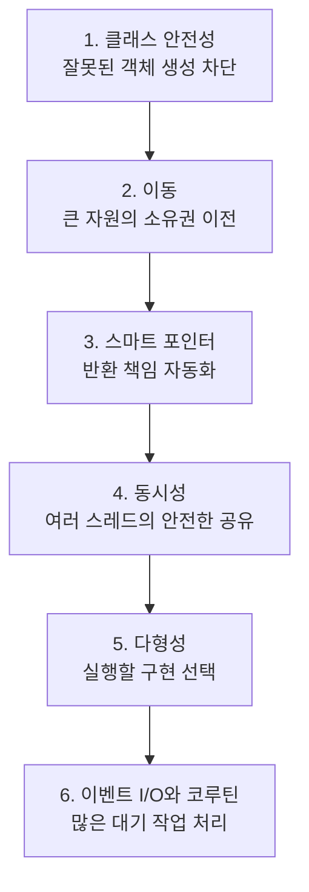
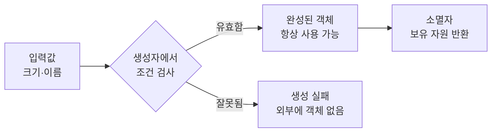
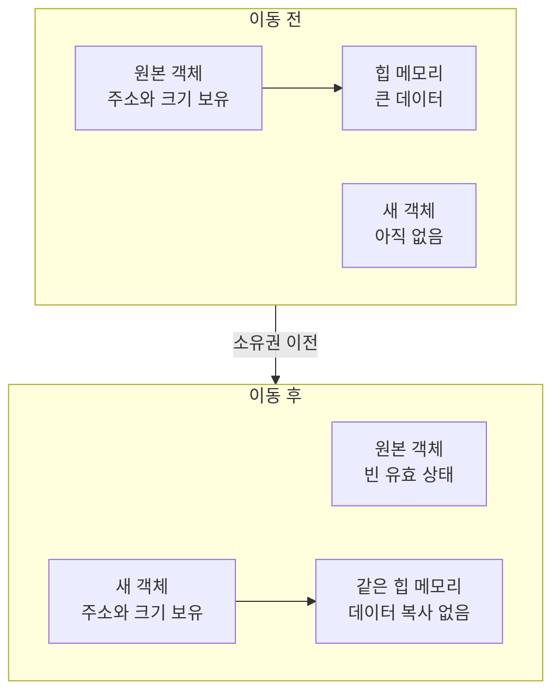
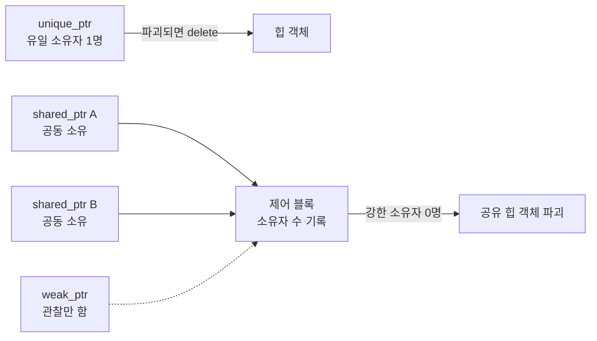
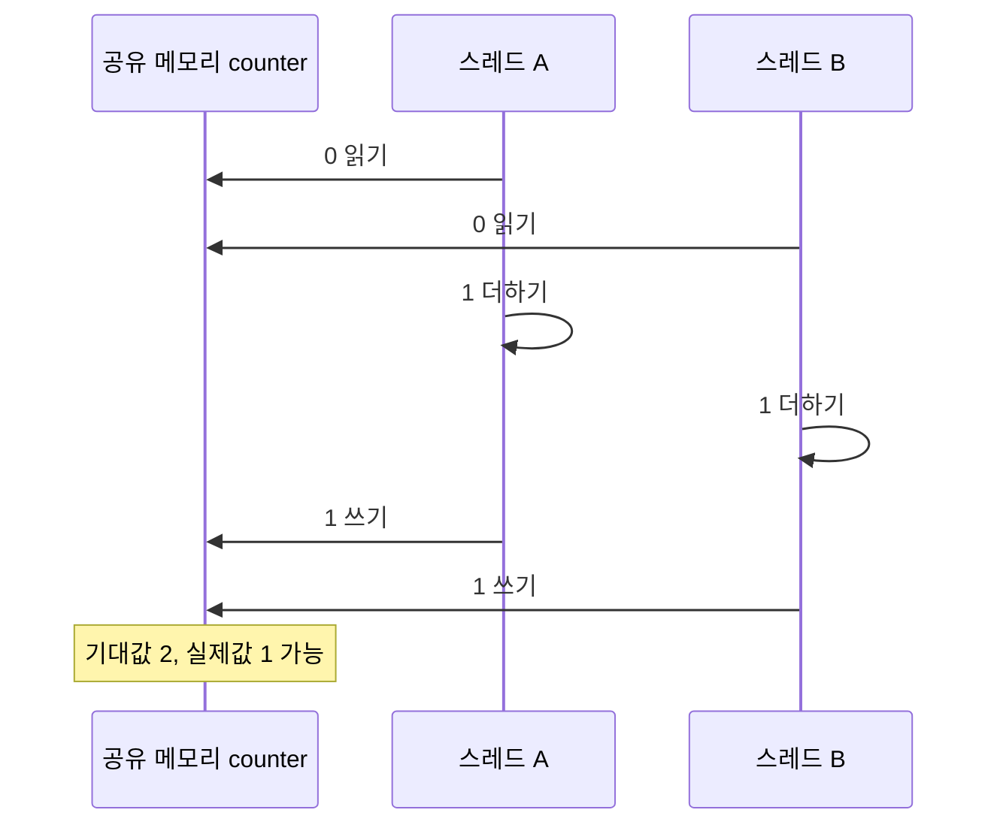
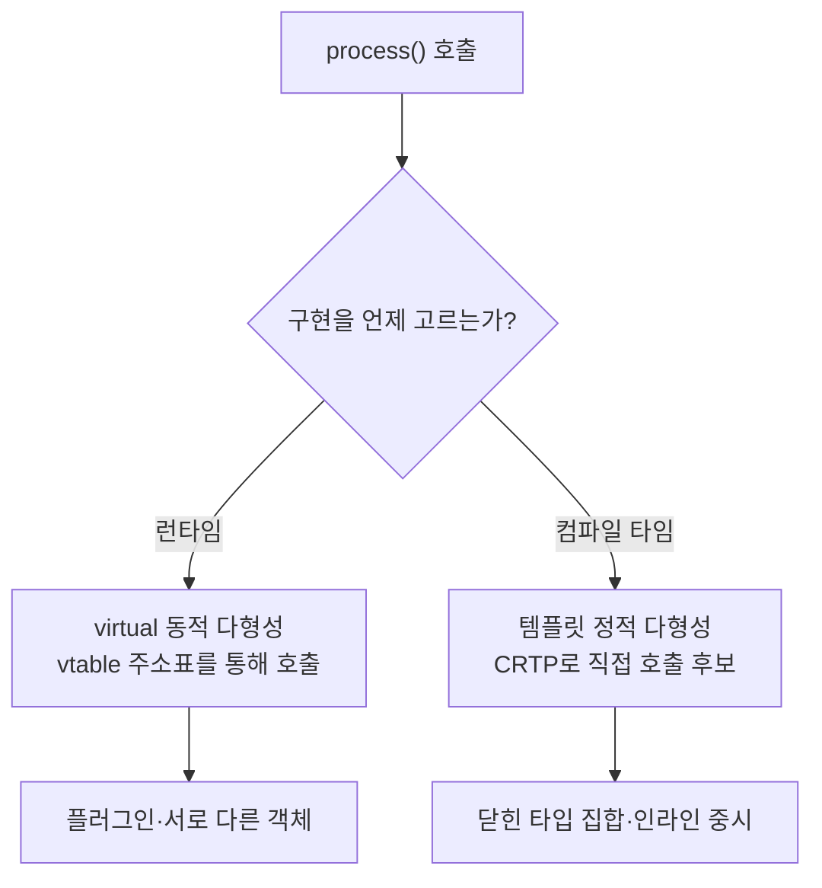
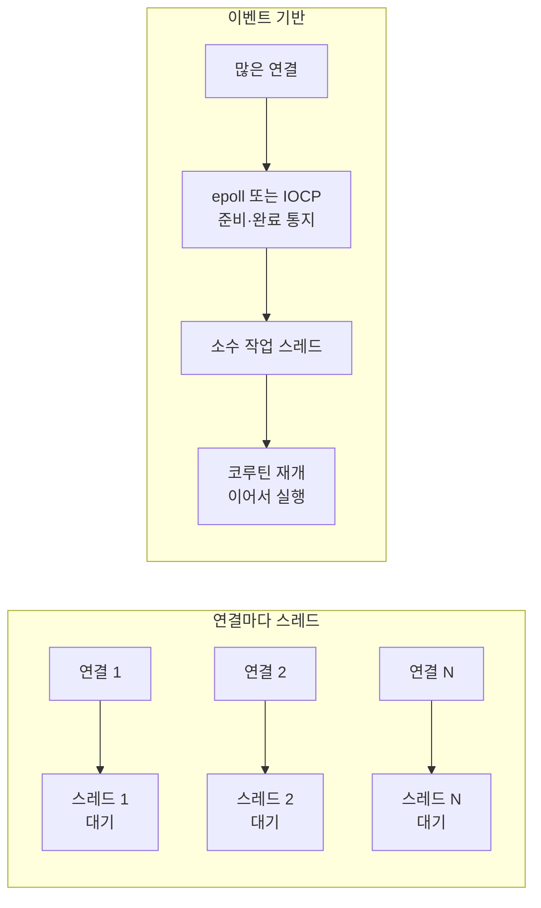
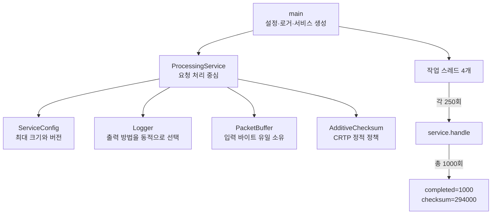
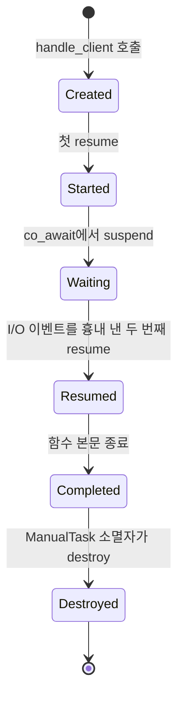

# 모던 C++ 런타임 기반 6가지: 언어 문법에서 하드웨어까지

이 자료는 사용자가 제공한 여섯 범주를 하나의 요청 처리 서비스로 다시 구성한 학습
가이드다. 단순히 “빠르다”라고 외우지 않고, 컴파일러가 어떤 선택을 할 수 있는지,
객체와 자원이 메모리에서 언제 살아 있고, CPU와 운영체제가 어디에 개입하는지를
구분하는 것이 목표다.

## 한 줄 요약과 읽는 순서

**이 문서는 “안전한 객체를 만들고, 자원을 복사하지 않고 넘기며, 여러 작업자가 안전하게
사용하고, 실행할 함수를 효율적으로 고르는 방법”을 설명한다.**

처음 읽는다면 다음 용어만 먼저 이해하면 된다.

| 용어 | 가장 간단한 뜻 |
|---|---|
| 객체(object) | 타입과 수명을 가진 데이터 상자 |
| 자원(resource) | 사용 후 반드시 돌려줘야 하는 메모리·파일·락 |
| 소유권(ownership) | 자원을 마지막에 돌려줄 책임 |
| 스레드(thread) | 한 프로세스 안에서 실행되는 작업자 |
| 컴파일 타임 | 프로그램을 실행하기 전, 컴파일러가 코드를 검사하는 때 |
| 런타임 | 완성된 프로그램이 실제로 실행되는 때 |

그 밖의 `RAII`, `ABI`, `CRTP`, `CAS`, `SSO`, `IOCP` 같은 축약어는
[공통 용어집](../GLOSSARY.md)에서 전체 이름과 비유를 확인한다.



각 단계는 앞 단계를 사용한다. 예를 들어 코루틴도 내부 상태를 가진 객체이므로 객체 수명과
소유권을 이해하지 못하면 중단된 코루틴 프레임을 언제 파괴해야 하는지 판단하기 어렵다.

## 먼저 바로잡을 핵심 표현

제공된 설명은 좋은 직관을 담고 있지만 다음 문장을 절대 법칙처럼 이해하면 안 된다.

- `const noexcept`는 인라인을 보장하거나 직접 유도하지 않는다. `const`는 숨은 `this`
  포인터를 통한 논리적 변경을 제한하고, `noexcept`는 예외 전파 계약과 일부 라이브러리의
  이동 선택에 영향을 준다. 인라인 여부는 최적화기와 호출 지점 정보가 결정한다.
- 이동은 일반적으로 “포인터 하나를 훔치는 것”만은 아니다. 타입마다 이동 구현이 다르고,
  작은 문자열 최적화(SSO, Small String Optimization)처럼 내부 바이트를 복사할 수도 있다. 이동된 원본은 파괴 및
  대입 가능한 유효하지만 값이 미지정된 상태(valid but unspecified state)인 것이 보통이다.
- `unique_ptr`의 기본 삭제자는 일반 구현에서 raw pointer와 같은 크기와 비용이지만 표준이
  모든 ABI에 “오버헤드 0”을 보장하는 것은 아니다. 상태 있는 deleter는 객체 크기를 늘린다.
- `std::atomic<T>`와 원자적 `shared_ptr` 연산이 항상 lock-free인 것은 아니다.
  `is_lock_free()` 또는 `is_always_lock_free`로 확인해야 한다. 높은 경합에서는 캐시 라인
  소유권 이동 때문에 원자 연산도 비싸다.
- `counter++`는 x86에서 `lock add`나 `lock xadd`가 될 수 있고
  CAS(Compare-And-Swap, 비교 후 교환) 반복문이 될 수도 있다.
  반드시 `LOCK CMPXCHG` 하나로 번역된다고 단정할 수 없다.
- `final`은 역가상화(devirtualization)에 도움을 주는 정보이지 최적화를 보장하지 않는다.
  반대로 컴파일러가 구체 타입을 이미 알면 `final` 없이도 가상 호출을 직접 호출로 바꿀 수 있다.
- C++ 코루틴은 I/O(Input/Output, 입출력), 스케줄러, 스레드 풀을 제공하지 않는다. `co_await`가 호출 스레드를
  운영체제에 “반환”하는 것도 아니다. awaiter와 epoll/IOCP 같은 런타임의 연결이 있어야 한다.

## 학습 순서와 파일 목차

1. 이 문서의 여섯 원리와 빌드/어셈블리 절을 읽는다.
2. [`example.cpp`](./example.cpp): C++17 통합 서비스에서 클래스 안전성, 이동 전용 버퍼,
   스마트 포인터, 원자적 설정 교체, 동적/정적 다형성, 스레드를 함께 확인한다.
3. [`coroutine_example.cpp`](./coroutine_example.cpp): C++20 코루틴 프레임의 생성, 두 번의
   resume, final suspend, RAII destroy 순서를 확인한다.
4. [`exercise.cpp`](./exercise.cpp): 이동된 객체 상태, 메모리 순서, 다형성 선택 TODO를 푼다.
5. [`compare.md`](./compare.md): 같은 문제를 C#과 Python에서는 어떻게 해결하는지 비교한다.
6. [`CMakeLists.txt`](./CMakeLists.txt): C++17 대상 두 개와 C++20 대상을 경고 옵션과 함께 빌드한다.

## 전체 그림: 소스에서 CPU(Central Processing Unit) 실행까지

CPU(Central Processing Unit)는 기계어 명령을 실제로 실행하는 중앙 처리 장치다.
다음 화살표는 사람이 작성한 텍스트가 실행 가능한 명령으로 변환되는 순서를 뜻한다.

```text
.cpp
  -> 전처리: #include와 매크로 처리
  -> 컴파일: 타입 검사, 템플릿 인스턴스화, 코루틴 상태 머신 변환, 최적화
  -> 어셈블: 명령어를 목적 파일(.o/.obj)의 기계어와 재배치 정보로 변환
  -> 링크: 표준 라이브러리·스레드 런타임 심볼과 목적 파일을 실행 파일로 결합
  -> 로더: 코드/데이터를 가상 주소 공간에 매핑하고 main까지 제어를 전달
  -> CPU: 레지스터, 캐시, 메모리를 사용해 명령어를 실행
```

C++ 한 줄과 어셈블리 한 줄은 일대일 대응하지 않는다. 생성자는 최적화 뒤 완전히
인라인될 수 있고, 사용하지 않는 객체는 존재 자체가 제거될 수 있다. 반대로 한 줄의
`shared_ptr` 대입은 참조 카운트, 분기, 해제 함수 호출을 포함할 수 있다.

## 1. 방어적 클래스 설계와 안전성

### 왜 필요한가

한 줄 요약: **잘못된 객체를 먼저 만든 뒤 검사하지 말고, 잘못된 객체가 아예 만들어지지
않게 타입을 설계한다.**

호텔이 “아무 종이나 객실 카드로 인정한 뒤 나중에 확인”하면 사고가 난다. `explicit`은
정식 카드 발급 절차를 거치게 하고, `= delete`는 복제하면 안 되는 마스터키의 복사기를
없애는 것과 비슷하다.



컴파일러가 생성하는 변환과 특수 멤버 함수는 단순 값 타입에는 편리하지만, 파일·락·힙
버퍼 같은 유일 자원에는 잘못된 의미를 만들 수 있다. 런타임에서 이중 해제나 불변식
위반을 발견하기보다 타입 검사 단계에서 표현 불가능하게 만드는 편이 안전하다.

- `explicit`은 생성자 기반 암시적 변환을 후보에서 제외한다. `f(1024)`가 뜻하지 않게
  버퍼 객체를 만드는 것을 막지만 `Buffer{1024}`라는 명시적 직접 초기화는 허용한다.
- `= delete`는 해당 함수가 overload resolution에서 선택됐을 때 진단을 발생시킨다.
  단순히 구현을 숨기는 것보다 오류가 호출 지점에 명확히 나타난다.
- 멤버 초기화 리스트는 생성자 본문 이전에 멤버를 직접 생성한다. 본문에서 대입하면
  이미 기본 생성된 객체에 두 번째 연산을 하는 셈이다. `const`, reference, 기본 생성이
  불가능한 멤버는 애초에 본문 대입으로 초기화할 수 없다.
- 실제 초기화 순서는 리스트에 쓴 순서가 아니라 **클래스의 멤버 선언 순서**다. 경고를
  피하고 의존 관계를 명확히 하려면 두 순서를 같게 유지한다.
- 위임 생성자는 하나의 대표 생성자로 불변식 검사를 모은다. 위임 대상 생성자가 끝난
  후에 위임한 생성자의 본문이 실행된다.

호출 규약에 따라 `this`와 작은 정수 인자는 레지스터로 전달될 가능성이 높지만 이는
ABI 세부다. `explicit`과 `= delete`는 주로 컴파일 타임 규칙이므로 성공적으로 빌드된
실행 파일에 별도의 런타임 검사 비용을 추가하지 않는다.

## 2. 이동 시맨틱과 자원 이전

### 왜 필요한가

한 줄 요약: **큰 창고의 물건을 전부 복사하지 않고, 창고 열쇠와 반납 책임을 새 객체에
넘기는 방법이다.**



그림의 핵심은 힙 데이터가 움직인 것이 아니라 **주소와 반환 책임이 옮겨졌다**는 점이다.
단, 모든 타입이 이런 구조는 아니므로 이동 비용은 타입 구현을 확인해야 한다.

복사만 가능하면 반환값이나 컨테이너 재배치 때 자원을 새로 만들고 내용을 복제해야 할 수
있다. 이동 생성자는 곧 수명이 끝나거나 사용권을 포기한 객체의 표현을 재사용할 통로다.
`std::move(x)` 자체는 대략 `static_cast<T&&>(x)`인 값 범주 변환이며 어떤 생성자나
대입 연산자가 선택된 뒤에야 실제 자원 이전이 일어난다.

통합 예제의 `PacketBuffer`는 `unique_ptr`의 주소를 이동하고 원본 크기를 0으로 만든다.
주소와 `size_t` 몇 개의 load/store로 끝날 가능성이 높지만, 그것 역시 ABI와 최적화에
따라 다르다. `noexcept` 이동 생성자는 `std::vector`가 재할당 중 강한 예외 안전성을
유지하면서 복사 대신 이동을 선택하는 데 중요하다.

주의할 점:

- 이름이 있는 `T&&` 변수는 표현식으로 쓰면 lvalue다. 다시 전달할 때 `std::move` 또는
  forwarding reference 문맥의 `std::forward`가 필요하다.
- 이동 후 원본의 구체 값은 타입 계약에 따르며, 표준 타입도 항상 “null”은 아니다.
- 반환값에는 먼저 `return local;`을 사용한다. 불필요한 `std::move(local)`는 NRVO를
  방해할 수 있다. NRVO(Named Return Value Optimization)는 이름 있는 지역 반환값을
  호출자의 결과 공간에 바로 만들어 복사·이동을 생략하는 최적화다.

## 3. 스마트 포인터와 RAII

생성자·소멸 순서, 예외 스택 해제, 커스텀 deleter와 언어별 차이는
[RAII 전용 심화 가이드](../raii-resource-lifetime/README.md)에서 이어서 다룬다.

### 왜 필요한가

한 줄 요약: **주소만 저장하는 포인터에 “누가 언제 자원을 반납하는가”라는 규칙을
추가한 것이 스마트 포인터다.**



RAII(Resource Acquisition Is Initialization)는 자원 획득을 객체 초기화와 묶고 소멸자에서
반환하는 기법이다. 제어 블록(control block)은 `shared_ptr` 소유자 수와 삭제 방법을
기록하는 별도 관리 정보다.

제어 흐름에는 정상 반환뿐 아니라 예외, 조기 반환, 여러 분기가 있다. 모든 경로에 수동
`delete`를 정확히 배치하는 대신 자동 저장 기간 객체의 소멸자에 정리를 연결하면 스코프
종료 규칙이 자원 정리를 증명한다. 이 원리는 메모리뿐 아니라 mutex, 파일, 소켓에도 같다.

- `unique_ptr<T>`는 유일 소유권을 표현하고 복사는 금지, 이동은 허용한다.
- `shared_ptr<T>`는 별도 제어 블록의 strong/weak 카운트와 삭제 정책을 공유한다.
  `make_shared`는 보통 객체와 제어 블록을 한 번에 할당해 지역성을 개선한다.
- `weak_ptr<T>`는 strong count를 올리지 않는 관찰 핸들이다. 사용 전 `lock()`으로
  일시적인 `shared_ptr`를 얻고 성공 여부를 검사해야 한다.
- 순환 참조는 그래프의 소유권 방향을 먼저 설계해서 끊는다. “자주 접근한다”는 이유만으로
  공유 소유를 선택하지 않는다.

strong count 조작은 일반적으로 스레드 안전한 원자 연산을 포함하므로 복사 비용이 0이
아니다. 서로 다른 `shared_ptr` 객체가 같은 제어 블록을 공유하는 것은 안전하지만, 같은
`shared_ptr` 변수 자체를 동시 읽기/쓰기할 때는 C++17의 `atomic_load/atomic_store` 또는
C++20의 `atomic<shared_ptr<T>>`가 필요하다.

## 4. 멀티스레딩, 원자성, 메모리 순서

### 왜 `int++`가 깨지는가

한 줄 요약: **`++` 기호 하나도 CPU에서는 읽기 → 더하기 → 쓰기의 여러 단계가 될 수 있어
두 스레드가 중간에 끼어들 수 있다.**

아래 시간은 위에서 아래로 흐른다. 두 작업자가 모두 0을 읽으면 두 번 증가했는데도 최종
메모리에는 1만 남는다.



`std::atomic`은 C++ 메모리 모델이 정한 원자 연산을 제공한다. 원자적이라는 말은 다른
스레드가 연산의 찢어진 중간 상태를 보지 않는다는 뜻이지, 항상 락이 없거나 공짜라는 뜻은 아니다.

일반적인 증가에는 이전 값 읽기, 덧셈, 결과 저장이 필요하다. 두 스레드의 연산이 겹치면
lost update가 생길 뿐 아니라, C++ 메모리 모델에서 동기화 없는 동일 메모리의 동시 쓰기는
**데이터 레이스이며 프로그램 전체가 정의되지 않은 동작**이다. 단지 결과가 가끔 작게
나오는 문제로 제한되지 않는다.

원자 연산은 언어 차원에서 수정 순서(modification order)를 만들고 하드웨어별 명령과
메모리 장벽으로 내려간다. x86-64는 비교적 강한 메모리 모델을 갖지만 ARM은 더 약하므로
소스의 memory order(메모리 순서)가 중요하다.

- `memory_order_relaxed`: 해당 원자 변수의 값이 찢어지지 않고 수정이 유실되지 않는다는
  것만 필요할 때 쓴다. 통계 카운터처럼 다른 데이터 게시와 관계없는 경우가 대표적이다.
- release store와 acquire load: store보다 앞선 초기화를 load 이후 reader에게 보이게 하는
  synchronizes-with 관계를 만든다. 통합 예제의 불변 설정 게시가 이 패턴이다.
- 기본 `seq_cst`: 이해하기 쉬운 단일 전역 순서를 추가하지만 필요한 것보다 강할 수 있다.

원자적이라는 말은 기다림이 없거나 빠르다는 뜻이 아니다. 여러 코어가 같은 캐시 라인을
수정하면 cache coherence 프로토콜이 소유권을 계속 넘겨 false sharing과 병목을 만든다.
복합 불변식, 블로킹 대기, 높은 경합에서는 mutex가 더 단순하고 빠를 수도 있다.

## 5. 동적 다형성과 정적 다형성

### 가상 호출의 실제 비용

한 줄 요약: **실행 중 주소표에서 함수를 찾을지, 컴파일 중 실제 함수를 미리 정할지의
선택이다.**



vptr(virtual pointer)는 객체에서 가상 함수 표를 찾기 위한 숨은 포인터이고,
vtable(virtual function table)은 실제 함수 주소를 모은 표다. CRTP(Curiously Recurring
Template Pattern)는 `Child : Base<Child>`처럼 자식이 자기 타입을 부모 템플릿에 넘기는 패턴이다.

C++ 표준은 vptr/vtable 구현을 강제하지 않지만 주요 ABI는 객체의 숨은 vptr이 vtable을
가리키는 방식을 사용한다. 기반 포인터를 통한 호출은 보통 vptr load, 함수 주소 load,
간접 call이 된다. 비용은 포인터 load 몇 번만이 아니다.

- 간접 분기의 목적지가 자주 바뀌면 branch target prediction이 실패할 수 있다.
- 컴파일러가 실제 함수를 확정하지 못하면 함수 본문을 호출 지점에 인라인하기 어렵다.
- 객체들이 흩어져 있으면 데이터 캐시 지역성 비용이 가상 호출 자체보다 클 수 있다.

그러나 I/O나 큰 작업 앞의 가상 호출 한 번은 대부분 중요하지 않다. 런타임 플러그인,
이질 객체 컬렉션, ABI 경계에는 동적 다형성이 자연스럽다. 기반 클래스에는 가상 소멸자를
두고 `override`로 계약을 검사한다. `final`은 상속 의도를 닫고 최적화기에 추가 정보를 준다.

CRTP는 `Derived` 타입이 컴파일 시점에 정해져 직접 호출과 인라인이 가능하고 객체에 vptr이
필요 없다. 대신 서로 다른 파생 타입을 하나의 동종 컨테이너에 자연스럽게 담기 어렵고,
구현이 헤더에 노출되며 타입별 코드 생성으로 바이너리가 커질 수 있다. “오버헤드 0”이라는
표현보다 비용을 런타임 간접 호출에서 컴파일 시간·코드 크기로 옮긴다고 이해한다.

## 6. OS 이벤트 I/O와 C++20 코루틴

### 스레드당 연결 모델의 비용

한 줄 요약: **기다리는 연결마다 작업자 한 명을 세워 두지 말고, 소수 작업자가 “준비된
연결”만 번갈아 처리하게 한다.**

OS(Operating System)는 운영체제, I/O(Input/Output)는 입출력이다.



epoll은 Linux의 준비 상태 알림 API다. IOCP(Input/Output Completion Port)는 Windows의
입출력 완료 통지 방식이다. C10K(10,000 Concurrent Connections)는 동시 연결 1만 개를
어떻게 처리할지 묻는 확장성 문제다.

OS 스레드는 스택 가상 주소 공간, 커널 스케줄링 상태, 레지스터 문맥을 가진다. runnable
스레드가 코어보다 지나치게 많으면 스케줄링,
TLB(Translation Lookaside Buffer, 가상 주소 변환 캐시)·캐시 교란, 문맥 교환 비용이 커진다.
하지만 C10K의 원인이 오직 레지스터 저장만은 아니며 메모리, 블로킹 I/O, 스케줄러,
애플리케이션 구조가 함께 작용한다. 적절한 스레드 수 역시 정확히 코어 수와 같다고
고정할 수 없다. CPU-bound인지 I/O-bound인지에 따라 달라진다.

- Linux `epoll`은 주로 파일 디스크립터의 **readiness(준비 상태)**를 알려 준다. 통지 뒤 실제
  `read`/`write`를 수행하고 `EAGAIN(Error: try Again, 지금은 불가능하니 다시 시도)`을 처리한다.
- Windows IOCP는 겹친 I/O 작업의 **completion(완료)**을 큐로 전달하는 모델이다.
- 이벤트 루프는 적은 스레드가 많은 연결 상태를 관리하게 하지만, 긴 CPU 작업을 이벤트
  스레드에서 실행하면 다른 연결도 지연된다.

C++20 컴파일러는 코루틴의 지역 변수, 재개 위치, promise 등을 담는 프레임과 resume/destroy
진입점을 만든다. 프레임은 흔히 동적 할당되지만 최적화로 호출자 저장소에 포함될 수도 있다.
`co_await`는 awaiter의 세 함수로 번역된다.

1. `await_ready()`가 즉시 완료 여부를 검사한다.
2. 준비되지 않았으면 `await_suspend(handle)`가 핸들을 이벤트 시스템에 등록할 수 있다.
3. 누군가 그 핸들을 `resume()`하면 `await_resume()` 뒤부터 **resume을 호출한 스레드에서**
   실행한다.

[`coroutine_example.cpp`](./coroutine_example.cpp)는 이벤트를 수동으로 흉내 낸다. 실제 서버는
Boost.Asio 같은 런타임 또는 직접 만든 epoll/IOCP awaiter, 취소, timeout, executor, 프레임
수명 정책이 추가로 필요하다.

## 통합 예제 코드를 읽는 지도

[`example.cpp`](./example.cpp)를 첫 줄부터 모두 이해하려 하지 않는다. `main()`에서 시작해
다음 화살표를 따라 필요한 클래스 정의로 거슬러 올라간다.



첫 번째 읽기에서는 다음 다섯 줄기만 확인한다.

1. `main()`이 `ServiceConfig`, `ConsoleLogger`, `ProcessingService`를 만든다.
2. 네 스레드가 같은 `service`를 참조하지만 각 요청의 `PacketBuffer`는 따로 만든다.
3. 설정은 불변 객체이며 `shared_ptr` 스냅샷으로 수명을 유지한다.
4. 완료 횟수와 체크섬 합계는 `atomic`으로 갱신해 증가를 잃지 않는다.
5. 모든 스레드를 `join()`한 뒤에만 최종 결과를 읽는다.

두 번째 읽기에서 이동 생성자, acquire/release 메모리 순서, virtual과 CRTP를 각각 찾는다.
세 번째 읽기에서만 주석의 레지스터·캐시·ABI 설명을 읽는다.

### 코루틴 예제의 상태 변화

`ManualTask`는 코루틴 프레임의 파괴 책임을 가진 RAII 객체다. 시간은 왼쪽에서 오른쪽으로 흐른다.



실제 I/O 예제와 다른 핵심은 `EventAwaiter::await_suspend`가 어디에도 핸들을 등록하지
않는다는 점이다. 여기서는 `main()`이 직접 두 번째 `resume()`을 호출해 이벤트 루프를 흉내 낸다.

## 빌드와 실행

저장소에 포함된 GCC와 Ninja를 사용하는 PowerShell 명령은 다음과 같다.

```powershell
chcp 65001
$env:PATH='D:\workspace\modern-cpp\tools\w64devkit\bin;' + $env:PATH
cmake -S 자주까먹는/modern-cpp-runtime-foundations -B 자주까먹는/modern-cpp-runtime-foundations/build -G Ninja "-DCMAKE_CXX_COMPILER=g++.exe"
cmake --build 자주까먹는/modern-cpp-runtime-foundations/build
./자주까먹는/modern-cpp-runtime-foundations/build/runtime_foundations.exe
./자주까먹는/modern-cpp-runtime-foundations/build/runtime_exercise.exe
./자주까먹는/modern-cpp-runtime-foundations/build/coroutine_lifecycle.exe
```

Windows에서 한글 소스 경로를 Ninja 파일에 기록할 때 현재 코드 페이지가 UTF-8이 아니면
경로가 손상될 수 있으므로 구성 전에 `chcp 65001`을 실행한다. 이미 잘못 구성된 build
디렉터리는 생성물만 지운 뒤 다시 구성한다.

통합 예제의 스레드 실행 순서는 달라도 최종 값은 다음과 같아야 한다.

```text
version=v2, completed=1000
checksum=294000
```

코루틴 예제는 `loop: first tick`, 코루틴 시작, I/O 이벤트 도착, 코루틴 재개 순서를
보여 준다. 실습 예제는 수정 전 이동된 원본 크기 16과 카운터 2000을 출력한다.

## 어셈블리 확인

최적화 전후를 비교하려면 다음처럼 컴파일한다.

```powershell
g++ -std=c++17 -O0 -S -masm=intel example.cpp -o example-O0.s
g++ -std=c++17 -O2 -S -masm=intel example.cpp -o example-O2.s
g++ -std=c++20 -O2 -S -masm=intel coroutine_example.cpp -o coroutine-O2.s
```

확인할 지점:

- `PacketBuffer` 이동에서 배열 전체 반복 복사가 아니라 주소와 크기 이전이 보이는가?
- relaxed `fetch_add`가 대상 CPU에서 어떤 locked 명령 또는 런타임 호출로 내려가는가?
- `Logger::write` 호출이 간접 호출인지, whole-program 정보로 역가상화됐는가?
- `AdditiveChecksum::process`와 `do_process`가 `-O2`에서 인라인됐는가?
- 코루틴에 resume/destroy 함수와 상태에 따른 분기가 생성됐는가?

Windows x64, GCC(GNU Compiler Collection) 버전, ABI,
LTO(Link-Time Optimization, 링크 시점 최적화) 사용 여부에 따라 심볼과 명령이 달라진다. 관찰 결과는
해당 빌드의 증거이지 C++ 표준의 보장은 아니다.

## 실습 문제

1. `exercise.cpp`의 기본 이동 생성자를 직접 구현해 이동 후 `source.size()`가 0이 되게 한다.
   `unique_ptr`를 먼저 이동한 뒤 크기를 옮기고 원본 크기를 0으로 설정한다.
2. 카운터가 다른 데이터의 게시에 사용되지 않는 이유를 설명하고 `seq_cst`를 `relaxed`로
   바꾼다. `join()`이 최종 출력 시점에 제공하는 관계도 함께 설명한다.
3. 처리 정책이 실행 중 교체되지 않는다는 조건에서 가상 인터페이스와 CRTP 중 하나를
   선택하고, 성능뿐 아니라 빌드 시간, 테스트 대역, 바이너리 크기까지 근거를 적는다.
4. `coroutine_example.cpp`의 `EventAwaiter::await_suspend`가 핸들을 저장하지 않는 이유로
   실제 비동기 I/O가 아닌지 설명한다. 핸들을 저장하는 작은 큐를 설계해 본다.

## 실무 선택 체크리스트

- 불변식은 생성자에서 세우고 잘못된 상태를 표현하기 어렵게 만들었는가?
- 소유권은 `unique_ptr`가 기본이고 정말 공동 수명일 때만 `shared_ptr`인가?
- 이동의 성능을 타입 구현과 측정 없이 단정하지 않았는가?
- 원자 연산이 보호하는 값과 memory order가 만드는 관계를 문장으로 설명할 수 있는가?
- 런타임 확장성이 필요할 때 동적 다형성, 닫힌 고성능 정책일 때 정적 다형성을 고려했는가?
- 코루틴 프레임을 누가 파괴하고, 중단된 핸들을 누가 언제 재개하는지 명확한가?
