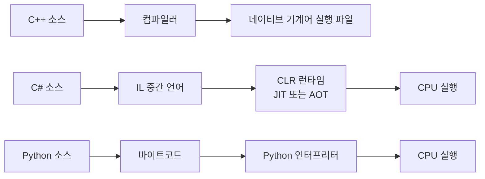
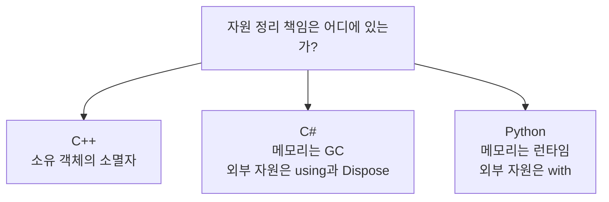

# C++·C#·Python 비교: 수명, 동시성, 다형성과 비동기

이 문서는 문법 모양보다 실행 모델과 소유권 차이를 중심으로 여섯 주제를 비교한다.
C#은 보통 CLR(Common Language Runtime)의 JIT(Just-In-Time) 또는
AOT(Ahead-Of-Time) 컴파일과 GC(Garbage Collection) 위에서 실행된다. Python은 보통
CPython 바이트코드 인터프리터와 참조 카운팅 및 순환 GC 위에서 실행된다. Python 구현은
CPython만 있는 것이 아니므로 GIL(Global Interpreter Lock)과 객체 배치 설명은 구현 의존적이다.

## 비교 문서를 읽기 전에

**같은 코드 모양이라도 언어마다 “누가 메모리를 관리하는가”와 “언제 기계어가 되는가”가
다르다.** 먼저 실행 경로를 그림으로 구분한다.



- CLR(Common Language Runtime)은 .NET 프로그램을 실행하는 공통 언어 런타임이다.
- IL(Intermediate Language)은 C#이 먼저 변환되는 중간 언어다.
- JIT(Just-In-Time)는 실행 도중 컴파일, AOT(Ahead-Of-Time)는 실행 전에 미리 컴파일한다.
- GC(Garbage Collection)는 도달할 수 없는 관리 메모리를 런타임이 회수하는 방식이다.
- 모르는 용어는 [공통 용어집](../GLOSSARY.md)에서 비유와 함께 확인한다.

## 한눈에 보는 차이

| 관점 | C++17/20 | C# | Python(CPython 기준) |
|---|---|---|---|
| 주 실행 변환 | 네이티브 기계어, 템플릿은 컴파일 시 인스턴스화 | IL 후 JIT 또는 AOT | 바이트코드 후 인터프리터 실행 |
| 자원 수명 | 스코프 기반 소멸과 RAII, 명시적 소유권 | 메모리는 GC, 외부 자원은 `IDisposable` | 메모리는 참조 카운팅+GC, 외부 자원은 context manager |
| 이동 의미론 | 값 범주와 이동 생성자/대입으로 자원 이전 | 일반 reference type 변수 대입은 참조 복사 | 이름 대입은 객체 참조 binding 변경 |
| 공유 수명 | `shared_ptr` 제어 블록을 명시적으로 사용 | GC가 도달 가능성을 추적 | 런타임이 참조 수와 순환 도달 가능성을 추적 |
| 다형성 | 가상 호출과 템플릿/CRTP를 선택 | virtual/interface 및 제네릭 | duck typing, protocol, 상속 |
| 원자·메모리 모델 | 표준 memory order를 세밀하게 선택 | `Interlocked`, `Volatile`, `lock` | `threading.Lock`; GIL은 데이터 불변식 잠금이 아님 |
| 비동기 | 코루틴 언어 기반만 제공, 런타임 별도 | `Task`, `async`/`await`, 런타임 통합 | coroutine, `asyncio` 이벤트 루프 |

표의 핵심은 우열이 아니라 **책임의 위치**다. C++는 많은 결정을 타입과 컴파일 단계에
드러내고, C#과 Python은 더 많은 관리 기능을 런타임에 맡긴다.



## 1. 방어적 클래스 설계

### C++

```cpp
class Port final {
public:
    explicit Port(int value) : value_{value} {}
    Port(const Port&) = delete;
private:
    int value_;
};
```

`explicit`은 사용자 정의 변환 경로를 닫고 `= delete`는 복사 연산 자체를 타입 계약에서
제거한다. 값 타입의 메모리 배치와 특수 멤버 함수 생성 규칙을 개발자가 직접 제어한다.

### C#

```csharp
public sealed class Port
{
    public int Value { get; }
    public Port(int value) => Value = value;
}
```

C# 생성자는 기본적으로 `int`에서 `Port`로 암시 변환되지 않는다. 원한다면 `implicit
operator`를 명시해야 한다. `sealed`는 C++의 `final`과 가깝다. class 변수 대입은 객체
복사가 아니라 참조 복사이므로 C++의 복사 생성자 삭제와 정확히 대응하지 않는다.
불변 reference type은 읽기 전용 property와 생성자 검증으로 만든다. `record struct` 같은
값 형식은 다시 값 복사 비용과 의미를 고려해야 한다.

### Python

```python
class Port:
    def __init__(self, value: int) -> None:
        self.value = value
```

Python 이름 대입은 보통 객체 복사가 아니다. 타입 힌트도 기본 실행에서는 강제되지 않으므로
`isinstance` 검사, property, dataclass의 `frozen=True` 등을 필요에 맞게 쓴다. `copy.copy`와
`copy.deepcopy`가 명시적인 복사 경로다. C#/Python 사용자는 C++에서 `a = b`가 값 타입의
복사 생성 또는 복사 대입을 실행할 수 있다는 점을 놓치기 쉽다.

## 2. 이동 시맨틱

C#과 Python에는 C++ 값 범주와 이동 생성자에 해당하는 일반 언어 프로토콜이 없다.
reference type 변수를 다른 변수에 대입하면 같은 힙 객체를 가리키는 참조가 하나 늘 뿐,
원본 변수가 빈 상태가 되지 않는다.

```csharp
var a = new byte[1024];
var b = a; // 같은 배열 참조이며 a도 계속 유효하다.
```

```python
a = bytearray(1024)
b = a  # 같은 객체에 이름 둘을 binding한다.
```

C++의 이동은 공유 별칭을 만드는 것이 아니라 새 객체 표현으로 자원을 이전할 수 있다.
C#/Python 개발자가 `std::move`를 “참조 대입”으로 오해하면 이동된 원본을 계속 사용하거나,
반대로 모든 이동이 싸다고 가정하는 실수를 한다. C#의 `Span<T>`/`Memory<T>`와 Python의
`memoryview`는 복사를 줄이는 **뷰**에 가깝지 C++ 이동 생성자와 같지 않다.

## 3. RAII와 스마트 포인터

C#의 GC는 관리 객체 메모리를 회수하지만 파일이나 소켓의 즉시 반환 시점은 보장하지 않는다.
따라서 `IDisposable`과 `using`이 C++ RAII에 가장 가깝다.

```csharp
using var stream = File.OpenRead(path);
// 스코프 종료 시 Dispose가 호출된다.
```

Python은 context manager를 사용한다.

```python
with open(path, "rb") as stream:
    data = stream.read()
```

C++의 `unique_ptr`는 메모리에도 유일 소유권을 타입으로 표현한다. C#과 Python GC 참조는
기본적으로 공유 가능한 관찰/소유 구분을 타입에 담지 않는다. 반대로 C++ 개발자가
`shared_ptr`를 GC 포인터처럼 모든 곳에 쓰면 원자 참조 카운트 비용, 순환 참조, 불명확한
파괴 시점을 만든다. 네이티브 자원을 C# P/Invoke나 Python C extension으로 넘길 때는
SafeHandle, `IDisposable`, capsule/finalizer 등 명시적인 경계 수명 정책이 필요하다.

## 4. 동시성과 메모리 모델

동시성(concurrency)은 여러 작업의 실행 시간이 겹칠 수 있는 상태다. 병렬성(parallelism)은
실제로 여러 CPU 코어에서 같은 시각에 실행되는 경우다. 두 단어는 관련 있지만 같지 않다.

C#에서는 원자 증감에 `Interlocked`를 사용한다.

```csharp
Interlocked.Increment(ref counter);
```

`volatile`은 일부 가시성과 순서 규칙을 제공하지만 복합 `counter++`를 원자적으로 만들지
않는다. 여러 값을 함께 보호할 때는 `lock`을 사용한다.

Python에서는 다음처럼 명시적인 잠금을 사용한다.

```python
with counter_lock:
    counter += 1
```

CPython의 GIL(Global Interpreter Lock, 전역 인터프리터 잠금)은 한 시점에 Python 바이트코드를 실행하는 스레드를 제한하지만, 여러
바이트코드로 된 불변식을 보호하는 애플리케이션 mutex가 아니다. C extension은 GIL을
해제할 수 있고 I/O 사이에도 스레드가 교체된다. 또한 Python 버전과 구현의 free-threading
지원 여부에 따라 전제가 달라진다.

C++은 `relaxed`, acquire/release, `seq_cst`를 직접 선택할 수 있어 가장 세밀하지만 가장
증명하기 어렵다. C#의 `Interlocked`와 lock, Python의 Lock에서 넘어온 사용자는 원자
변수 하나가 주변 일반 변수까지 자동으로 안전하게 만든다고 오해하지 않아야 한다.

## 5. 동적·정적 다형성

C#의 interface/virtual 호출은 런타임 다형성이며 JIT가 실제 타입을 관찰해 인라인하거나
역가상화할 수 있다. `sealed`는 이를 도울 수 있지만 항상 보장하지는 않는다. C# 제네릭은
값 형식에 특수화된 코드를 만들 수 있지만 C++ 템플릿과 컴파일 모델이 동일하지 않다.

Python은 이름이 제공하는 연산을 런타임에 찾는 duck typing이 기본이다.

```python
def execute(processor, packet):
    return processor.process(packet)
```

`typing.Protocol`은 정적 검사 도구에 구조적 계약을 제공하지만 런타임 호출을 C++ CRTP처럼
정적 직접 호출로 바꾸지는 않는다. C++ CRTP는 컴파일 시 구체 타입을 알아야 하므로 런타임
플러그인 교체에는 부적합하다. C#/Python의 편한 런타임 교체 습관을 그대로 템플릿화하면
컴파일 시간과 오류 메시지, 코드 크기가 커질 수 있다.

## 6. 스레드, 이벤트 I/O, 코루틴

C#의 `async` 메서드는 보통 `Task`와 런타임 continuation을 사용한다.

```csharp
async Task<byte[]> ReadAsync(Stream stream, byte[] buffer)
{
    await stream.ReadAsync(buffer);
    return buffer;
}
```

Python의 native coroutine은 실행을 위해 이벤트 루프가 필요하다.

```python
async def read(reader):
    return await reader.read(1024)
```

C++20의 `co_await` 문법은 이 두 언어보다 저수준이다. 반환 타입의 `promise_type`, awaiter,
executor와 I/O 등록을 라이브러리가 정해야 한다. 표준 `Task`나 표준 네트워크 이벤트 루프가
없으므로 서로 다른 코루틴 라이브러리 타입이 바로 호환된다고 가정할 수 없다.

세 언어 모두 `async`가 CPU 작업을 자동 병렬화하지 않는다. 중단 가능한 비동기 I/O는
대기 중 스레드를 점유하지 않을 수 있지만, resume 이후 코드는 어떤 executor/thread에서
실행되는지 확인해야 한다. CPU-bound 작업은 별도 풀, 프로세스 또는 명시적 병렬화가 필요하다.

## 오류 전달과 FFI(Foreign Function Interface) 주의점

FFI(Foreign Function Interface)는 서로 다른 언어의 코드가 함수를 호출하는 연결 경계다.
이 경계에서는 어느 언어가 자원을 마지막으로 해제할지 반드시 하나로 정해야 한다.

- C++ 예외를 C ABI(Application Binary Interface, 이진 호출 규약) 경계 밖으로 전파하지 않는다. 상태 코드나 명시적인 결과 타입으로
  변환하고 모든 RAII 정리를 경계 안에서 끝낸다.
- C# P/Invoke로 받은 native 포인터는 `SafeHandle` 같은 소유 타입에 넣고 dispose/finalizer
  정책을 명확히 한다. 관리 객체 주소는 GC 이동 가능성을 고려해 필요한 동안만 pin한다.
- Python extension이 빌린 참조(borrowed reference)와 새 참조(new reference)를 구분하고,
  C++ RAII wrapper로 참조 카운트를 관리한다. GIL 보유 조건도 API별로 확인한다.
- callback을 저장할 때 C++ 객체, C# delegate, Python callable 중 어느 쪽이 더 오래 사는지
  명시하지 않으면 use-after-free 또는 회수되지 않는 순환 참조가 생긴다.
