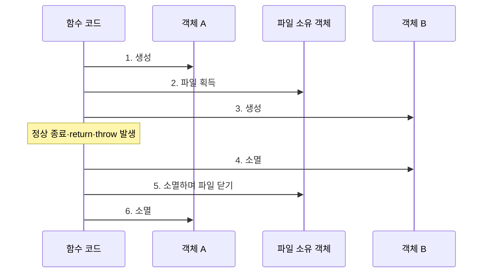
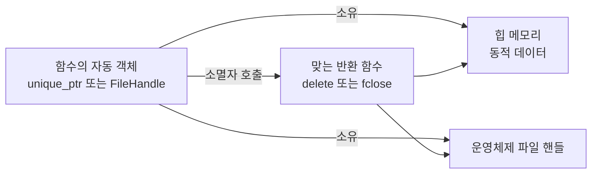
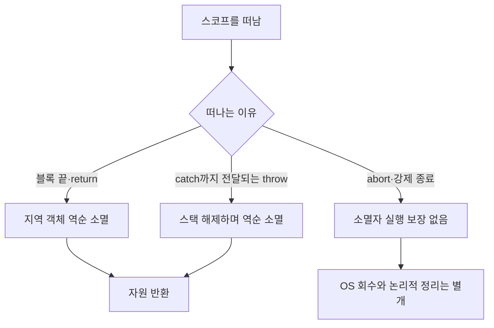
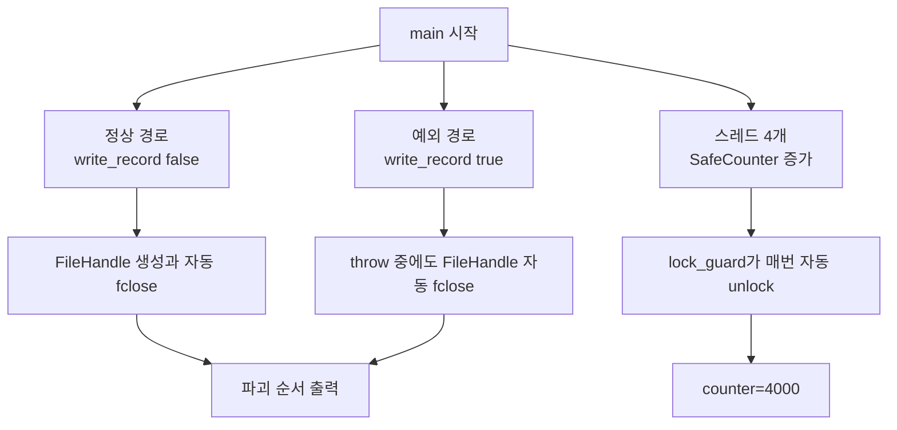
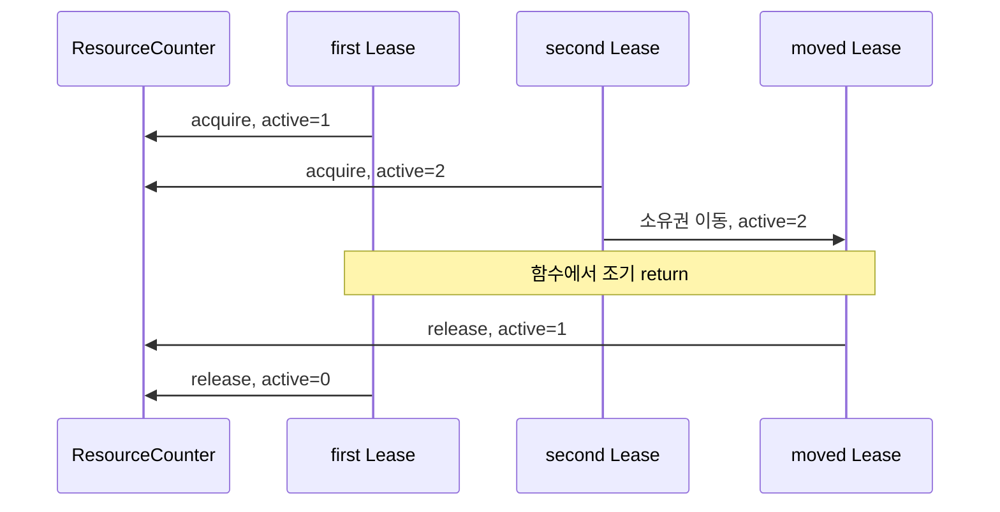

# RAII: 스코프와 객체 수명으로 자원을 관리하는 법

RAII(Resource Acquisition Is Initialization)는 “자원 획득에 성공한 객체의 초기화가
끝나면 그 객체가 자원 반환 책임까지 가진다”는 C++ 설계 기법이다. 흔히 “스코프를 나가면
자동 정리”로 요약하지만 핵심은 **자원의 수명과 객체의 수명을 하나의 불변식으로 묶는 것**이다.

## 30초 요약과 선행 용어

**RAII는 “자원을 빌린 순간 반납 담당 객체를 만들고, 그 객체가 사라질 때 자동 반납한다”는
규칙이다.**

먼저 다음 다섯 단어만 기억한다.

| 단어 | 초보자용 뜻 |
|---|---|
| 자원(resource) | 메모리, 파일, 락처럼 사용 후 돌려줘야 하는 것 |
| 객체(object) | 타입과 수명을 가진 데이터 상자 |
| 생성자(constructor) | 객체가 태어날 때 실행되는 함수 |
| 소멸자(destructor) | 객체 수명이 끝날 때 실행되는 함수 |
| 스코프(scope) | 이름과 자동 객체의 사용 범위를 정하는 `{}` 방 |

`RAII`, `ABI`, `FFI`, `GC` 등 다른 용어는
[공통 용어집](../GLOSSARY.md)에서 전체 이름과 비유를 먼저 확인할 수 있다.

## 학습 목표와 파일 목차

1. 이 문서에서 획득·소유·반환, 스택 해제, 소멸 순서와 한계를 이해한다.
2. [`example.cpp`](./example.cpp): `FILE*` 커스텀 deleter, 예외 안전성, 역순 소멸,
   `lock_guard`를 하나의 실행 예제로 확인한다.
3. [`exercise.cpp`](./exercise.cpp): 이동 가능한 `Lease` guard와 조기 반환을 실습한다.
4. [`compare.md`](./compare.md): C#, Python, Rust의 결정적 자원 반환 모델과 비교한다.
5. [`CMakeLists.txt`](./CMakeLists.txt): 두 C++17 대상을 경고 옵션과 함께 빌드한다.

기존 여섯 주제의 전체 맥락은 [모던 C++ 런타임 기반 가이드](../modern-cpp-runtime-foundations/README.md)에서
볼 수 있고, 이 문서는 그중 RAII와 수명만 더 깊게 다룬다.

## 1. 스마트 호텔 카드키 비유를 정확히 쓰기

다음 그림에서 화살표는 시간 순서다. 카드키 객체가 살아 있는 동안만 객실 자원을 사용할
권리와 반납 책임을 가진다.


- 방에 들어오며 카드키를 꽂는 순간이 **객체 생성과 자원 획득**이다.
- 카드를 가진 투숙객 한 명이 반환 책임을 가진다는 규칙이 **유일 소유권**이다.
- 문이나 정상 비상구로 나가는 것이 정상 종료, `return`, C++ 예외에 의한 스택 해제다.
- 카드를 뽑는 동작이 **소멸자에 의한 자원 반환**이다.

다만 건물 전원이 강제로 끊기거나 건물이 파괴되는 상황까지 카드키 시스템이 동작한다고
말하면 틀리다. `std::abort`, `std::_Exit`, 처리되지 않아 `std::terminate`로 끝나는 일부
경로, 프로세스 강제 종료, 전원 장애에서는 C++ 소멸자가 실행된다고 보장할 수 없다.
OS(Operating System, 운영체제)가 프로세스 핸들을 회수할 수는 있지만 애플리케이션의
flush(버퍼 내용을 실제 장치로 밀어내기), commit(변경 확정), 프로토콜상
logout 같은 논리적 정리가 수행됐다는 뜻은 아니다.

## 2. RAII의 역사와 이름

Bjarne Stroustrup은 C++ 역사 논문에서 자신이 이 기본 기법에 “resource acquisition is
initialization”이라는 이름을 붙였다고 회고한다. 생성자에서 자원을 얻고 소멸자에서 돌려주는
클래스와, 예외 전파 경로의 완성된 객체를 파괴하는 규칙이 결합해 예외 안전한 자원 관리를
가능하게 했다. 이름은 획득 시점만 강조해 어색하지만 실제 규칙은 다음과 같다.

```text
초기화 성공 -> 객체가 자원 소유 -> 모든 정상적인 스코프 이탈에서 소멸 -> 자원 반환
초기화 실패 -> 객체 수명 시작 안 됨 -> 생성 도중 이미 얻은 멤버/기반 객체만 자동 정리
```

참고 자료:

- [Stroustrup, Evolving a language in and for the real world](https://stroustrup.com/hopl-almost-final.pdf):
  RAII 명칭, 예외 처리와 자원 관리의 역사적 설계 배경
- [Rust 공식 문서: Reference Cycles Can Leak Memory](https://doc.rust-lang.org/book/ch15-06-reference-cycles.html):
  Rust도 `Rc` 순환 참조로 누수가 가능하다는 경계 조건
- [Rust `mem::forget` 공식 문서](https://doc.rust-lang.org/std/mem/fn.forget.html):
  안전한 Rust도 소멸자 실행 자체를 절대 보장하지 않는 이유

## 3. 생명주기 시각화

정상 종료, `return`, 처리 가능한 `throw`는 모두 블록을 빠져나가기 전에 완성된 지역
객체를 생성의 역순으로 파괴한다.



같은 내용을 텍스트로 읽으면 다음과 같다.

```text
블록 진입 {
  Trace A 생성
  FileHandle 생성 ── fopen/tmpfile 성공 ── FILE* 반환 책임 획득
  Trace B 생성
  작업 수행
    ├─ 정상 종료/return ─────────────┐
    └─ throw -> 상위 catch로 전파 ──┤
                                     ▼
  Trace B 소멸
  FileHandle 소멸 ── FileCloser 호출 ── fclose
  Trace A 소멸
} 블록 이탈 후 다음 코드 또는 catch 실행
```

같은 블록의 지역 객체는 일반적으로 **완성된 생성의 역순**으로 파괴된다. 아직 생성이
완료되지 않은 가장 바깥 객체의 소멸자는 호출되지 않지만, 이미 생성된 기반 클래스와 멤버는
정리된다. 배열과 상속 계층에는 더 구체적인 순서 규칙이 있으므로 “보이는 변수는 무조건
소멸자를 한 번 호출한다” 정도로 단순화하지 않는다.

## 4. 수동 관리가 제어 흐름에 취약한 이유

`FILE*`는 C 표준 라이브러리가 파일을 나타내기 위해 돌려주는 주소 형태의 핸들이다.
별표 `*`는 포인터라는 뜻이다. C API(Application Programming Interface, 프로그램 사용
약속)는 `fopen`으로 열었다면 `fclose`로 닫으라고 요구한다.

수동 코드는 자원을 얻은 뒤 가능한 모든 간선에 `close`를 배치해야 한다.

```cpp
FILE* file = std::fopen("data.txt", "r");
if (file == nullptr) { /* 오류 */ }
if (check_error()) { return; } // fclose가 빠지면 핸들 누수
std::fclose(file);
```

분기와 예외가 늘면 정리 코드가 중복되고, 새 반환 경로를 추가할 때 빠뜨리기 쉽다. RAII는
제어 흐름 그래프의 모든 간선을 고치는 대신 소유 객체의 소멸 지점 하나를 고친다.

```cpp
using FileHandle = std::unique_ptr<std::FILE, FileCloser>;
auto file = open_file();
if (check_error()) { return; } // FileCloser가 fclose 담당
```

중요한 점은 `unique_ptr<File>`이라는 철자만으로 파일이 올바르게 닫히지 않는다는 것이다.
자원이 `new`로 생성된 C++ 객체면 기본 `delete`가 맞지만, `FILE*`는 `fclose`, OS handle은
플랫폼 API, DB connection은 pool 반환 함수처럼 **획득 API와 짝이 맞는 deleter**가 필요하다.

## 5. 컴파일러와 메모리에서 일어나는 일

다음 그림에서 실선 화살표는 소유 관계다. 작은 `unique_ptr` 객체와 실제로 소유하는 큰
데이터가 서로 다른 메모리 영역에 있을 수 있다.



자동 객체 자체는 흔히 현재 스택 프레임 안에 놓이지만 RAII가 스택 자원만 뜻하지는 않는다.
`unique_ptr` 객체는 스택에 있고 그것이 가리키는 데이터는 힙에 있을 수 있다. `fstream`은
작은 C++ 객체 안에 OS 파일 핸들을 간접 보유한다. `lock_guard`는 보통 mutex 참조만 들고
실제 mutex 상태는 별도 객체와 운영체제/런타임에 있다.

컴파일러는 각 정상 스코프 출구에 소멸자 호출을 배치하고, 예외가 활성화된 구현에서는
unwind table 또는 landing pad를 생성해 어떤 객체까지 완성됐는지 추적한다. Windows x64는
예외 처리 메타데이터와 런타임 handler(처리 함수)를 이용할 수 있고,
ABI(Application Binary Interface, 컴파일된 코드 사이의 이진 규약)마다 구현은 다르다.
소멸자가 단순하고 보이면 `-O2`에서 인라인되거나 객체 자체가 제거될 수도 있다. 이는
관찰 가능한 자원 반환 효과까지 제거한다는 뜻이 아니라 as-if rule 아래 같은 효과를 더
저렴하게 만든다는 뜻이다.

## 6. 예외 안전성과 소멸자 규칙

스코프를 떠나는 이유별 차이를 먼저 그림으로 구분한다.



- 예외가 `throw`에서 일치하는 `catch`까지 전파될 때 경로의 완성된 자동 객체가 파괴된다.
- 생성자가 실패하면 그 객체의 소멸자는 호출되지 않는다. 따라서 raw 자원을 먼저 얻고
  나중에 멤버에 넣기보다 RAII 멤버가 직접 획득하거나 즉시 소유하게 한다.
- 정리 함수의 실패를 소멸자에서 던지면 이미 다른 예외가 전파 중일 때 `std::terminate`가
  발생할 수 있다. 소멸자는 보통 `noexcept`로 유지하고 오류는 기록하거나 명시적 `close()`에
  보고하는 정책을 설계한다.
- RAII는 트랜잭션을 자동 commit하라는 뜻이 아니다. 실패 시 rollback하는 guard와 성공 시
  명시적 commit을 분리하는 편이 안전하다.
- `longjmp`로 C++ 자동 객체의 스코프를 건너뛰거나 소유 객체보다 먼저 자원 관리자를
  파괴하면 RAII 계약을 우회해 정의되지 않은 동작이나 dangling 접근을 만들 수 있다.

## 7. 실무 자원별 도구

표를 외우기보다 “이 자원은 어떤 함수로 얻었고, 어떤 함수로 돌려주는가?”를 먼저 묻는다.

| 자원 | C++17 이상 권장 표현 | 핵심 주의점 |
|---|---|---|
| 힙 단일 소유 | `std::unique_ptr`, 표준 컨테이너 | 수동 `new/delete`보다 값/컨테이너 우선 |
| 공유 수명 | `std::shared_ptr` + 관찰 `weak_ptr` | 순환 소유와 참조 카운트 비용 |
| 파일 | `std::ifstream/ofstream/fstream` | C `FILE*`에는 `fclose` deleter 필요 |
| mutex | `std::lock_guard`, `std::unique_lock`, `std::scoped_lock` | 보호 데이터와 mutex를 같은 클래스에 캡슐화 |
| 스레드 | C++17 `std::thread` + join guard, C++20 `std::jthread` | joinable `thread` 소멸은 자동 join이 아니라 terminate |
| OS/DB 핸들 | move-only 전용 wrapper 또는 `unique_ptr`+deleter | 잘못된 핸들 값과 반환 API를 타입에 표현 |
| 트랜잭션 | rollback guard + 명시적 commit | 소멸자에서 실패 가능한 commit을 숨기지 않기 |

## 8. RAII가 보장하지 않는 것

RAII는 자동 청소 마법이 아니라 **올바르게 설계한 소유 객체가 일반적인 수명 종료 경로에서
정리 함수를 실행하게 하는 규칙**이다.

- 공유 소유권 그래프의 순환 참조는 C++ `shared_ptr`와 Rust `Rc/Arc` 모두 누수를 만들 수 있다.
- 비소유 raw pointer/reference/view의 대상 수명은 자동 연장되지 않는다.
- 프로세스 강제 종료와 전원 장애에서 소멸자 실행은 보장되지 않는다.
- 잘못된 deleter, 두 raw owner, `release()` 후 방치 같은 소유권 설계 오류를 자동 수정하지 않는다.
- 메모리 안전성이 곧 논리적 자원 정리나 영속 데이터 commit을 의미하지 않는다.

## 예제 코드를 읽는 지도

[`example.cpp`](./example.cpp)는 한 파일에서 세 가지를 보여 준다.



처음 읽을 때는 `main()`과 출력만 본다.

1. `[normal path]` 아래에서 파일을 열고 정상적으로 닫는 순서를 확인한다.
2. `[exception path]` 아래에서도 `caught`가 출력되기 전에 파일이 닫히는지 확인한다.
3. `counter=4000`으로 네 스레드의 증가가 하나도 사라지지 않았는지 확인한다.
4. 그다음 `FileCloser`, `FileHandle`, `write_record`, `SafeCounter` 순으로 정의를 읽는다.

[`exercise.cpp`](./exercise.cpp)는 실제 소켓 대신 `ResourceCounter`로 열린 자원 수를 센다.
`Lease`를 이동해도 활성 자원은 두 개 그대로이고, 조기 반환 뒤에는 0이 되어야 한다.



## 9. 빌드와 실행

```powershell
chcp 65001
$env:PATH='D:\workspace\modern-cpp\tools\w64devkit\bin;' + $env:PATH
cmake -S 자주까먹는/raii-resource-lifetime -B 자주까먹는/raii-resource-lifetime/build -G Ninja "-DCMAKE_CXX_COMPILER=g++.exe"
cmake --build 자주까먹는/raii-resource-lifetime/build
./자주까먹는/raii-resource-lifetime/build/raii_example.exe
./자주까먹는/raii-resource-lifetime/build/raii_exercise.exe
```

통합 예제에서는 정상·예외 경로 모두 `inner object -> FILE handle -> write_record scope` 순으로
정리되고 마지막에 `counter=4000`이 출력되어야 한다. 실습은 `inside active=2`,
`after active=0`을 출력해야 한다.

## 10. 어셈블리와 예외 처리 메타데이터 관찰

```powershell
g++ -std=c++17 -O0 -S -masm=intel example.cpp -o example-O0.s
g++ -std=c++17 -O2 -S -masm=intel example.cpp -o example-O2.s
g++ -std=c++17 -O2 -fno-exceptions -S -masm=intel example.cpp -o no-exceptions.s
```

마지막 명령은 이 예제의 `throw` 때문에 컴파일되지 않는 것이 정상이다. 예외를 쓰는 코드와
쓰지 않는 코드를 별도 최소 함수로 나눠 `.xdata/.pdata`, landing pad, cleanup 호출을 비교한다.
`-O0`에서는 `FileCloser::operator()`와 `fclose` 경로가 비교적 보이고, `-O2`에서는 deleter가
인라인될 수 있다. `lock_guard` 객체의 별도 메모리 저장이 사라져도 mutex lock/unlock의
관찰 가능한 동기화 효과는 유지된다. 정확한 심볼과 명령은 GCC 버전, Windows ABI, 최적화와
LTO에 따라 달라지므로 특정 `call` 한 줄을 표준 보장으로 이해하지 않는다.

## 실습 질문

1. `Lease` 이동 대입을 구현할 때 목적지가 이미 소유한 자원을 먼저 어떻게 반환해야 하는가?
2. `ResourceCounter`가 `Lease`보다 먼저 파괴되는 코드를 만들면 왜 dangling pointer가 되는가?
3. 실패 가능한 `fclose` 결과를 소멸자에서 예외로 던지지 않고 어떻게 관찰할 수 있는가?
4. C++17 `std::thread`를 예외 안전하게 join하는 move-only guard를 설계해 본다.
