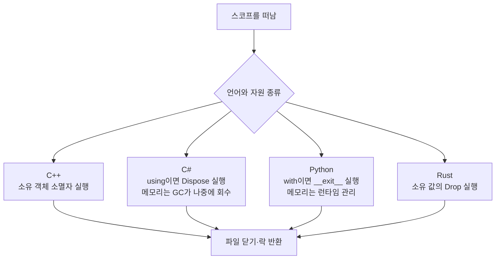

# RAII 비교: C++, C#, Python, Rust

네 언어 모두 자원을 안전하게 반환하는 관용구가 있지만, 메모리 회수와 파일·락 같은 외부
자원의 **결정적 반환(deterministic release)**을 같은 것으로 취급하면 안 된다.

## 이 비교에서 가장 중요한 질문

**“변수가 안 보이게 되는 순간, 메모리와 파일이 모두 즉시 정리되는가?”**를 언어마다
따로 묻는다. 메모리 회수와 파일·락 반환은 같은 일이 아니다.



- 결정적 반환은 “정해진 코드 지점에서 반환 함수가 실행된다”는 뜻이다.
- GC(Garbage Collection)는 더 이상 도달할 수 없는 관리 메모리를 런타임이 찾는 방식이다.
- 모르는 용어는 [공통 용어집](../GLOSSARY.md)에서 먼저 확인한다.

## 핵심 비교

| 관점 | C++ | C# | Python | Rust |
|---|---|---|---|---|
| 메모리 기본 모델 | 값 수명, RAII, 명시적 소유권 | 추적식 GC | CPython 참조 카운팅+순환 GC | ownership, borrow, `Drop` |
| 결정적 외부 자원 반환 | 소멸자 | `IDisposable.Dispose` | context manager의 `__exit__` | `Drop::drop` |
| 범위 문법 | `{}` 자동 객체 | `using` | `with` | `{}` owner |
| 유일 힙 소유 | `unique_ptr<T>` | 일반 참조에 직접 대응 없음 | 일반 참조에 직접 대응 없음 | `Box<T>` |
| 공유 소유 | `shared_ptr/weak_ptr` | GC reachability/`WeakReference` | 런타임 참조+`weakref` | `Rc/Weak`, `Arc/Weak` |
| 누수 가능성 | 가능 | 가능 | 가능 | 가능 |

초보자가 기억할 결론은 다음과 같다.

- C++와 Rust는 일반적인 스코프 종료가 소유 객체의 정리와 직접 연결된다.
- C#과 Python도 파일·락에는 각각 `using`, `with`라는 명시적인 범위 도구를 쓴다.
- 네 언어 모두 순환 참조, 강제 종료, 잘못된 소유권 설계로 자원 누수가 생길 수 있다.

## C++: 객체 수명이 자원 수명

```cpp
std::lock_guard<std::mutex> lock{mutex};
use_shared_state();
```

`lock`의 생성자가 mutex를 잠그고 소멸자가 푼다. 복사·이동 가능 여부, 소멸 순서, storage
duration을 타입 시스템과 코드 구조로 직접 제어한다. 메모리에는 `unique_ptr`보다 표준
컨테이너와 값 타입이 더 단순할 수 있다. C API 핸들은 반드시 짝이 맞는 deleter가 필요하다.

여기서 mutex(mutual exclusion)는 한 번에 한 스레드만 공유 데이터에 들어가게 하는 잠금이고,
deleter는 소유 객체가 파괴될 때 실제 반환 함수를 호출하는 삭제 정책이다.

## C#: `IDisposable`과 `using`

```csharp
using var stream = File.OpenRead(path);
Process(stream);
```

컴파일러는 `using`을 대략 `try/finally`와 `Dispose` 호출로 변환한다. 관리 메모리는 GC가
회수하지만 파일 핸들, DB connection, lock 같은 자원의 적시 반환은 `using`이 담당한다.
finalizer는 실행 시점이 비결정적이고 아예 실행되지 않을 수도 있어 정상 자원 관리 경로가
아니다. C++ 사용자는 C# 객체가 스코프를 나간다고 일반 소멸자가 즉시 실행된다고 가정하면
안 되고, C# 사용자는 C++ 자동 객체가 GC를 기다리지 않는다는 점을 기억해야 한다.

`SafeHandle`은 네이티브 핸들을 감싸는 실무적인 기반이다. P/Invoke 경계에서는 누가 핸들을
닫는지와 `ownsHandle` 정책을 명확히 해야 한다. delegate callback 수명도 native 코드가
사용하는 기간보다 길게 유지해야 한다.

## Python: context manager와 `with`

```python
with open(path, "rb") as stream:
    process(stream)
```

`with`는 `__enter__` 성공 후 블록을 나갈 때 `__exit__`를 호출한다. 정상 반환과 예외 모두
처리하며 `__exit__` 반환값으로 예외 억제 여부도 결정할 수 있다. CPython의 참조 카운팅 때문에
마지막 참조가 사라질 때 객체가 빨리 정리되는 경우가 많지만 이는 외부 자원 계약으로
의존할 대상이 아니다. 다른 Python 구현과 순환 참조에서는 시점이 달라질 수 있다.

`contextlib.closing`, `ExitStack`, 사용자 정의 context manager가 C++ RAII wrapper에 가장
가깝다. Python 사용자는 C++의 `string_view`, raw pointer, reference가 대상 수명을 늘리지
않고, 블록 밖에 저장하면 dangling이 될 수 있다는 점을 특히 주의해야 한다.

## Rust: ownership와 `Drop`

```rust
{
    let file = std::fs::File::open(path)?;
    process(&file)?;
} // file의 Drop 실행
```

Rust는 기본 값과 `Box<T>` 같은 소유 타입에 move-after-use 검사를 적용하고, 값이 drop scope를
떠날 때 `Drop`을 실행한다. `Mutex::lock`이 반환하는 `MutexGuard`가 스코프 종료 시 unlock하는
방식은 C++ `lock_guard`와 매우 가깝다. borrow checker는 소유자보다 오래 사는 일반 참조를
많이 차단하므로 C++보다 정적 수명 검사가 강하다.

그러나 “Rust는 메모리 누수를 원천 차단한다”는 설명은 틀리다. 공식 문서대로 `Rc<RefCell<T>>`
순환 참조는 strong count가 0이 되지 않아 누수되고, `mem::forget`은 안전한 함수이며,
`process::exit`도 destructor를 실행하지 않는다. Rust의 안전 보장은 누수를 곧바로 memory
unsafety로 보지 않는다. `Weak`으로 비소유 간선을 표현하는 설계가 여전히 필요하다.

## 예외·오류 경로 차이

- C++ 예외는 stack unwinding 중 완성된 자동 객체의 소멸자를 호출한다. 소멸자에서 다시
  예외를 내보내지 않도록 설계한다.
- C# 예외는 `using`이 만든 `finally`에서 `Dispose`를 호출한다. `Dispose`도 예외를 던질 수
  있지만 원래 예외를 가릴 위험이 있다.
- Python은 `__exit__(type, value, traceback)`가 예외 정보를 받고 억제할 수 있다. 정리 중
  새 예외는 원래 예외와 chaining 관계를 만든다.
- Rust의 `Result`와 `?` 조기 반환도 지역 값 drop을 수행한다. panic unwind 설정에서는
  drop하지만 `panic=abort`나 `process::abort`에서는 그렇지 않다.

## 동시성 자원

C++ `lock_guard`, C# `lock`/`Monitor`의 `try/finally`, Python `with lock:`, Rust
`MutexGuard`는 모두 임계 구역을 lexical scope에 묶는다. 차이는 Python GIL이 애플리케이션
불변식을 위한 mutex가 아니라는 점, Rust mutex poisoning 정책, C++ mutex 소유 스레드와
소멸 규칙 등 세부 계약에 있다. 어떤 언어든 guard보다 보호 데이터가 오래 살아야 한다.

## FFI(Foreign Function Interface) 경계 체크리스트

- 할당한 런타임과 해제하는 런타임/API를 일치시킨다.
- C++ 소멸자, C# `Dispose`, Python context manager, Rust `Drop` 중 최종 책임자를 하나만 둔다.
- raw handle을 넘기면 소유권 이전인지 단순 대여인지 함수 이름과 문서로 표시한다.
- C ABI(Application Binary Interface, 이진 호출 규약) 밖으로 C++ 예외나 Rust panic을 그대로 넘기지 않는다.
- 비동기 callback이 wrapper보다 오래 살 수 있으면 공유 상태·취소·join 정책을 별도로 둔다.
