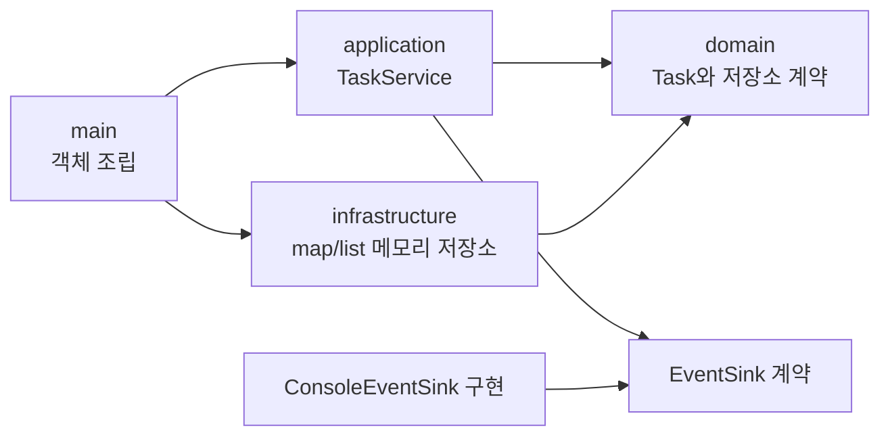
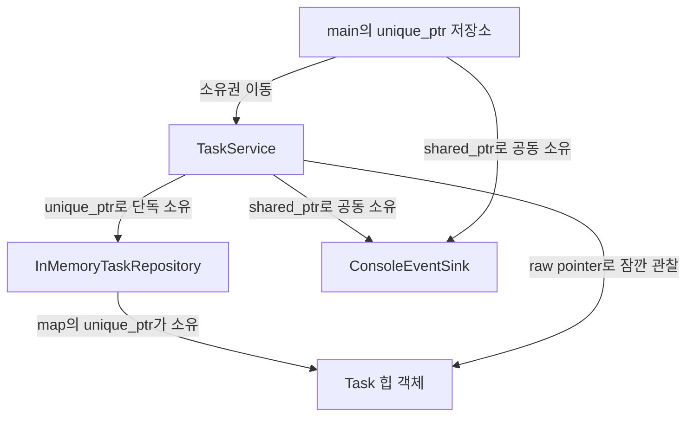

# Modern C++23 실무 프로젝트 템플릿

> **한 줄 요약:** `domain → application → infrastructure` 계층을 가진 작은 작업 관리
> 프로그램을 빌드하면서 C++23 문법, 표준 컨테이너, 소유권, 오류 처리, CMake와
> 선택적 Boost 연결을 함께 익힙니다.

- 필요한 선행 지식: 변수, 함수, 클래스, `#include`의 의미를 대략 아는 정도
- 초보자가 먼저 읽을 절: [1. 실행부터 확인하기](#1-실행부터-확인하기)
- 기준 표준: **C++23**
- C++17 사용 시: `std::expected`는 예외/사용자 `Result` 타입으로,
  `std::ranges::sort`와 concept는 반복자 기반 `std::sort`와 주석으로 표현한 요구
  사항으로 바꿔야 합니다.
- 용어가 낯설면 먼저 [공통 용어집](../GLOSSARY.md)을 열어 둡니다.

## 학습 목표

이 프로젝트를 끝까지 읽으면 다음 코드를 오픈소스에서 만났을 때 역할과 비용을
설명할 수 있습니다.

- 클래스의 공개 계약과 private 표현, 추상 인터페이스, `final`, `override`
- 계층형 아키텍처와 의존성 주입(Dependency Injection, 의존 객체 외부 주입)
- `std::vector`, `std::list`, `std::map`의 저장 방식과 선택 기준
- `std::ranges::sort`, lambda, concept, 함수 템플릿
- `std::unique_ptr`, `std::shared_ptr`, raw pointer/reference의 서로 다른 소유권 의미
- `const`, `constexpr`, `inline`, `noexcept`, `[[nodiscard]]`
- `std::expected`, `std::optional`, `std::span`, `std::string_view`
- 정적 라이브러리와 실행 파일을 target 단위로 연결하는 현대적인 CMake
- `find_package()`와 imported target으로 Boost 같은 외부 라이브러리를 연결하는 방법

## 1. 실행부터 확인하기

### 1.1 필요한 도구

- CMake 3.24 이상
- C++23을 지원하는 GCC, Clang/Apple Clang 또는 MSVC
- 선택 사항: Ninja
- Boost 예제를 빌드할 때만 Boost 1.82 이상

컴파일러가 `-std=c++23` 또는 호환되는 C++23 모드를 실제로 지원해야 합니다.
컴파일러가 C++23 모드를 받아도 표준 라이브러리의 모든 C++23 기능이 구현되었다는
뜻은 아닙니다. 이 예제는 특히 `<expected>` 지원이 필요합니다.

```bash
c++ --version
cmake --version
```

### 1.2 Make로 가장 빠르게 실행

`template/` 폴더로 이동한 뒤 짧은 명령으로 빌드하고 실행할 수 있습니다.

```bash
cd 자주까먹는/template

make build
make run
```

연습 코드와 선택적 Boost 예제는 다음 명령으로 실행합니다.

```bash
make exercise
make boost-run
```

사용 가능한 명령과 변경 가능한 설정은 `make` 또는 `make help`로 확인합니다.

```bash
make help
make run BUILD_TYPE=Release
make build WARNINGS_AS_ERRORS=OFF
make build BUILD_DIR=/tmp/modern-cpp23-build
make build CMAKE_ARGS="-DCMAKE_CXX_COMPILER=clang++"
```

[`Makefile`](./Makefile)은 CMake를 대체하는 새 빌드 시스템이 아니라, 아래의 configure,
build, run 명령을 짧게 호출하는 래퍼입니다. 실제 target과 의존 관계는 계속
[`CMakeLists.txt`](./CMakeLists.txt)가 관리합니다.

### 1.3 CMake로 직접 빌드

저장소 루트에서 다음 명령을 실행합니다.

```bash
cmake \
  -S 자주까먹는/template \
  -B 자주까먹는/template/build \
  -DCMAKE_BUILD_TYPE=Debug \
  -DMODERN_CPP_WARNINGS_AS_ERRORS=ON

cmake --build 자주까먹는/template/build --parallel
```

`-S`는 소스 디렉터리, `-B`는 생성 파일과 목적 파일을 둘 빌드 디렉터리입니다.
소스와 빌드 결과를 분리하면 생성 파일을 지워도 원본 코드가 손상되지 않습니다.

### 1.4 직접 실행

```bash
./자주까먹는/template/build/modern_cpp_demo
./자주까먹는/template/build/modern_cpp_exercise
```

핵심 예상 출력은 다음과 같습니다.

```text
modern-cpp23-template v1.0
[event] created task #1
[event] created task #2
[event] created task #3
[event] completed task #2
[expected error] task not found: #999

[sorted tasks]
#1 [high] read C++23 ownership code completed=false tags=2
#3 [high] refactor repository adapter completed=false tags=1
#2 [normal] review open-source CMake completed=true tags=1
```

### 1.5 Release 빌드

```bash
cmake \
  -S 자주까먹는/template \
  -B 자주까먹는/template/build-release \
  -DCMAKE_BUILD_TYPE=Release

cmake --build 자주까먹는/template/build-release --parallel
```

Debug 빌드는 관찰과 디버깅에 유리하고 Release 빌드는 최적화를 활성화합니다.
Release에서 함수가 인라인되거나 코드가 제거·재배치될 수 있으므로 C++ 한 줄과
어셈블리 한 줄이 항상 대응한다고 생각하면 안 됩니다.

## 2. 파일을 읽는 순서

긴 예제는 출력이 만들어지는 입구에서 시작하면 이해하기 쉽습니다.

1. [`template-type-deduction.md`](./template-type-deduction.md):
   기초부터 `T`, `auto`, `decltype`, 전달 참조와 concept까지 설명하는 타입 추론 가이드
2. [`src/main.cpp`](./src/main.cpp): 객체 조립, `unique_ptr`/`shared_ptr`, 컨테이너 출력
3. [`include/modern_cpp/application/task_service.hpp`](./include/modern_cpp/application/task_service.hpp):
   유스케이스 공개 계약
4. [`src/application/task_service.cpp`](./src/application/task_service.cpp):
   생성·완료·정렬 흐름과 `expected`, `optional`, `span`
5. [`include/modern_cpp/domain/task.hpp`](./include/modern_cpp/domain/task.hpp):
   강한 ID, enum, 클래스, `const`, `constexpr`
6. [`include/modern_cpp/domain/task_repository.hpp`](./include/modern_cpp/domain/task_repository.hpp):
   저장소 추상 인터페이스
7. [`include/modern_cpp/infrastructure/in_memory_task_repository.hpp`](./include/modern_cpp/infrastructure/in_memory_task_repository.hpp):
   `map`, `list`, `unique_ptr`를 사용하는 실제 구현
8. [`include/modern_cpp/domain/task_sorting.hpp`](./include/modern_cpp/domain/task_sorting.hpp):
   concept와 ranges 알고리즘을 쓰는 헤더 전용 템플릿
9. [`CMakeLists.txt`](./CMakeLists.txt): 위 파일들이 정적 라이브러리와 실행 파일이 되는 과정
10. [`src/exercise.cpp`](./src/exercise.cpp): TODO와 결과 예측 연습
11. [`compare.md`](./compare.md): 같은 설계를 C#과 Python 관점에서 비교

## 3. 아키텍처 구조

이 예제에서 의존 화살표는 “왼쪽 계층이 오른쪽의 공개 계약을 알고 호출한다”는
뜻입니다. 저장소의 추상 계약을 안쪽에 두기 때문에 메모리 저장소를 데이터베이스
저장소로 교체해도 서비스 코드를 바꾸지 않을 수 있습니다.



중요한 점은 `domain`이 `infrastructure`를 include하지 않는다는 것입니다.
추상 인터페이스 `TaskRepository`를 경계에 두고 실제 구현 객체를 `main()`에서
주입합니다. 이는 거대한 프레임워크 없이도 적용할 수 있는 의존성 역전의 최소 형태입니다.

### 각 계층의 책임

| 계층 | 책임 | 바꾸어도 영향을 덜 받는 부분 |
|---|---|---|
| `domain` | Task 값과 업무 개념, 저장소 계약 | 콘솔, 데이터베이스, CMake |
| `application` | 작업 생성·완료 같은 유스케이스 조합 | map/list의 구체 저장 방식 |
| `infrastructure` | map/list로 저장소 계약 구현 | 서비스 호출 방식 |
| `main` | 구체 객체 생성과 연결, 화면 출력 | 핵심 클래스 내부 구현 |

## 4. 클래스 구조와 소유권

객체 수명과 소유권 이동은 다음 순서로 이어집니다. 화살표의 “소유”는 해당 객체를
파괴할 책임까지 가진다는 뜻이고, “관찰”은 잠시 주소만 빌린다는 뜻입니다.



### `std::unique_ptr`

`TaskService`는 저장소를 정확히 하나만 소유합니다.

```cpp
std::unique_ptr<domain::TaskRepository> repository_;
```

- 복사할 수 없으므로 소유자가 둘로 늘어나는 실수를 컴파일러가 차단합니다.
- `std::move(repository)`는 객체 바이트를 복사하는 것이 아니라 포인터 소유권을
  옮기고 원본 포인터를 비웁니다.
- 서비스 소멸 시 `unique_ptr`가 가상 소멸자를 통해 실제 저장소 구현까지 파괴합니다.
- 일반적으로 제어 블록과 참조 계수가 없어 `shared_ptr`보다 구조와 비용이 단순합니다.

### `std::shared_ptr`

콘솔 이벤트 sink는 `main()`과 서비스가 실제로 공동 소유하므로 `shared_ptr`를 씁니다.

```cpp
std::shared_ptr<EventSink> event_sink_;
```

일반적인 구현은 객체 주소와 별도의 제어 블록 주소를 관리합니다. 제어 블록에는 강한
참조 계수와 약한 참조 계수가 들어가며, 계수 변경은 보통 스레드 안전한 원자 연산을
요구합니다. 따라서 “혹시 필요할 것 같아서” 쓰지 말고 실제 공유 수명이 있을 때만
사용합니다. 순환 참조가 생기면 계수가 0이 되지 않으므로 한쪽을 `std::weak_ptr`로
바꿔야 합니다.

### raw pointer와 reference

`TaskRepository::find()`가 반환하는 `Task*`는 소유자가 아닙니다. 저장소의 map이
해당 Task를 지우거나 저장소가 파괴되면 포인터는 dangling pointer(이미 수명이 끝난
객체를 가리키는 포인터)가 됩니다. 이 예제는 반환 포인터를 한 함수 안에서만 사용합니다.

`const Task&` 역시 소유하지 않지만 null일 수 없다는 계약을 표현합니다. 소유권 전달은
스마트 포인터로, 필수 관찰은 reference로, 선택적 관찰은 pointer로 표현하는 패턴을
기억하면 오픈소스 API를 읽기 쉬워집니다.

## 5. 컨테이너와 메모리 배치

### `std::vector`

`Task::tags_`와 스냅샷 목록에 사용합니다.

- 원소가 연속 메모리에 있어 순회 시 CPU 캐시 지역성이 좋습니다.
- 본체는 흔히 시작 주소, 사용 끝 주소, 할당 끝 주소에 해당하는 정보만 들고 실제
  원소는 힙 버퍼에 있습니다. 이는 흔한 구현이며 표준이 정확히 “포인터 3개”를
  강제하지는 않습니다.
- 용량을 넘겨 `push_back()`하면 더 큰 버퍼를 할당하고 원소를 이동한 뒤 이전 버퍼를
  해제하므로 기존 pointer/reference/iterator가 무효가 될 수 있습니다.
- `reserve()`는 예상 크기를 알 때 재할당 횟수를 줄입니다.

### `std::list`

저장소의 삽입 순서를 보관합니다.

- 각 원소가 별도 노드에 있고 앞·뒤 노드 주소를 가집니다.
- 노드 삽입·삭제 후 다른 원소의 반복자가 대체로 안정적이지만 노드별 할당과 포인터
  추적 때문에 메모리 사용과 캐시 효율이 불리할 수 있습니다.
- 이 예제는 학습 목적으로 사용합니다. 실제 삽입 순서만 필요하면 `vector<TaskId>`가
  더 빠른 경우가 많으므로 측정 후 선택합니다.

### `std::map`

`TaskId → unique_ptr<Task>`와 우선순위 통계에 사용합니다.

- 키 순서를 유지하는 노드 기반 연관 컨테이너이며 조회·삽입·삭제가 O(log N)입니다.
- 흔히 균형 이진 탐색 트리로 구현되지만 표준은 특정 트리 종류를 강제하지 않습니다.
- 순서가 필요 없고 해시가 가능한 키라면 `std::unordered_map`이 평균 O(1) 조회를
  제공할 수 있지만 메모리, 해시 비용, 최악 시간과 반복 순서가 다릅니다.

### `std::ranges::sort`

`std::vector<TaskSnapshot>`처럼 random-access range(임의 접근 범위)에 사용합니다.
이 예제는 우선순위를 내림차순으로, 같은 우선순위는 제목을 오름차순으로 정렬합니다.
표준이 요구하는 비교 복잡도는 O(N log N)이지만 구체 알고리즘과 기계 명령은
라이브러리 구현 및 최적화 옵션에 따라 달라집니다.

`std::list`에는 임의 접근 반복자가 없으므로 `std::ranges::sort(list)`를 호출할 수
없습니다. 이 제약이 concept 오류로 컴파일 단계에 드러납니다. `list.sort()`를
사용하거나 연속 컨테이너를 선택해야 합니다.

## 6. 자주 보는 한정자와 C++23 타입

### `const`

- `const Task&`: Task를 복사하지 않고 읽되 이 경로로 수정하지 않겠다는 계약
- `find(...) const`: `const TaskService`에서도 호출 가능하며 멤버를 바꾸지 않는 계약
- `Task* const`: 포인터 변수 자체는 다른 주소로 바꿀 수 없지만 가리키는 Task는 수정 가능
- `const Task*`: 포인터를 통해 Task를 수정할 수 없음

`const`는 메모리를 반드시 ROM에 둔다는 뜻이 아닙니다. 주로 C++ 타입 시스템의
수정 가능 경계를 표현하며 최적화에 유용한 정보를 줄 수도 있습니다.

### `constexpr`와 `inline`

`priority_name()`은 `constexpr`이므로 입력도 상수이고 문맥이 요구하면 컴파일 시간에
평가할 수 있습니다. 그러나 런타임 값으로 호출하면 런타임에 실행될 수도 있습니다.
`version.h`의 `inline constexpr` 변수는 헤더가 여러 번역 단위에 포함되어도
ODR(One Definition Rule, 단일 정의 규칙)을 위반하지 않습니다.

### `noexcept`

`id()`, `completed()`, `find()`처럼 예외를 던지지 않는 연산에 표시합니다.
`noexcept` 함수에서 예외가 빠져나가면 `std::terminate()`가 호출되므로 단지 성능을
위해 무조건 붙이면 안 됩니다. 컨테이너는 원소의 move 생성자가 `noexcept`인지에 따라
재할당 중 복사 또는 이동을 선택할 수 있습니다.

### `[[nodiscard]]`

`expected`, 조회 값처럼 무시하면 버그일 가능성이 높은 반환값에 사용합니다. 경고일
뿐 실행 의미를 바꾸지는 않지만, CI에서 경고를 오류로 다루면 검사를 강제할 수 있습니다.

### `std::expected<T, E>`

성공 값 `T` 또는 오류 `E` 중 정확히 하나를 같은 객체 안에 보관합니다.
`create_task()`는 `TaskId` 또는 오류 문자열을 반환하고, `complete_task()`는 값 없는
성공 또는 오류 문자열을 반환합니다. 예외와 달리 실패 가능성이 함수 타입에 보입니다.

C++17에서는 프로젝트 전용 `Result<T, E>`, `std::variant<T, E>` 또는 예외를 사용할 수
있습니다. `variant`로 대체하면 어느 대안이 성공인지 의미를 별도로 정의해야 합니다.

### `std::optional<T>`

“작업이 없음”처럼 실패 이유가 필요 없는 선택적 값을 표현합니다. 오류 정보가
필요한 경우에는 `expected`가 더 명확합니다.

### `std::span<T>`

배열을 소유하지 않는 pointer+length 형태의 view입니다. `complete_many()`는
`vector<TaskId>`와 `array<TaskId, N>`를 같은 함수로 받지만 원본보다 오래 span을
보관하면 안 됩니다. C++17에서는 `const vector<TaskId>&` 또는 pointer와 size 쌍이
가까운 대안입니다.

### `std::string_view`

문자를 소유하지 않는 pointer+length 형태입니다. 문자열 리터럴처럼 수명이 긴 데이터나
함수 호출 동안만 읽을 입력에 적합합니다. 임시 `std::string`의 버퍼를 가리킨 채 view를
보관하면 dangling view가 됩니다.

### concept와 함수 템플릿

`SnapshotRandomAccessRange`는 템플릿 인자가 임의 접근 범위이고 원소가
`TaskSnapshot`이어야 한다는 계약을 코드로 표현합니다. 템플릿은 호출 타입마다 필요한
기계 코드를 컴파일할 수 있어 런타임 가상 호출은 없지만, 많은 타입으로 인스턴스화하면
빌드 시간과 실행 파일 크기가 늘 수 있습니다.

## 7. 소스에서 실행 파일까지

아래 화살표는 시간 순서를 뜻합니다.


1. 전처리기는 각 `.cpp`의 `#include` 위치에 헤더 내용을 가져와 번역 단위를 만듭니다.
2. 컴파일러는 타입 검사, 템플릿 인스턴스화, 최적화 후 목적 파일을 만듭니다.
3. 아카이버는 네 구현 목적 파일을 `libmodern_cpp_core.a` 같은 정적 라이브러리로 묶습니다.
4. 링커는 `main.cpp` 목적 파일이 참조하는 심벌을 라이브러리에서 찾아 실행 파일을 만듭니다.
5. 실행 시 운영체제 로더가 실행 파일과 필요한 동적 라이브러리를 프로세스 주소 공간에 배치합니다.

헤더에 함수 구현을 무분별하게 넣으면 여러 번역 단위가 매번 파싱하고 컴파일해 빌드가
느려질 수 있습니다. 템플릿은 정의가 인스턴스화 위치에서 보여야 하므로 보통 헤더에
두고, 일반 클래스 함수는 `.cpp`로 분리합니다.

### 어셈블리 관찰

한 번역 단위만 단순 관찰하려면 다음처럼 실행할 수 있습니다.

```bash
c++ -std=c++23 -O0 -S \
  -I 자주까먹는/template/include \
  자주까먹는/template/src/domain/task.cpp \
  -o /tmp/task-O0.s

c++ -std=c++23 -O2 -S \
  -I 자주까먹는/template/include \
  자주까먹는/template/src/domain/task.cpp \
  -o /tmp/task-O2.s
```

`-O0`와 `-O2` 결과에서 함수 호출, 조건 분기, 문자열/vector move가 어떻게 달라지는지
비교합니다. 명령어 이름과 호출 규약은 CPU 아키텍처, 운영체제 ABI, 컴파일러와 버전에
따라 달라집니다.

## 8. CMakeLists.txt 단계별 설명

### 8.1 프로젝트와 옵션

```cmake
cmake_minimum_required(VERSION 3.24)
project(modern_cpp23_template VERSION 1.0.0 LANGUAGES CXX)

option(MODERN_CPP_BUILD_EXERCISES "..." ON)
option(MODERN_CPP_ENABLE_BOOST "..." OFF)
option(MODERN_CPP_WARNINGS_AS_ERRORS "..." OFF)
```

최소 CMake 버전을 명시하면 더 오래된 CMake가 모르는 동작을 조용히 잘못 처리하지
않습니다. 옵션은 사용자가 소스 수정 없이 빌드 구성을 선택하게 합니다.

### 8.2 공통 설정을 INTERFACE target으로 전달

```cmake
add_library(modern_cpp_project_options INTERFACE)
target_compile_features(modern_cpp_project_options INTERFACE cxx_std_23)
```

INTERFACE library는 목적 파일을 만들지 않고 컴파일 요구 사항만 전달합니다.
전역 `CMAKE_CXX_FLAGS`를 문자열로 수정하는 대신 target을 링크하면 필요한 표준과
경고 옵션이 의존 target에 전파됩니다. CMake는 필요한 경우 컴파일러에 적절한 표준
플래그를 자동으로 추가합니다.

### 8.3 정적 라이브러리와 공개 include 경로

```cmake
add_library(modern_cpp_core STATIC
    src/domain/task.cpp
    src/application/event_sink.cpp
    src/application/task_service.cpp
    src/infrastructure/in_memory_task_repository.cpp
)

target_include_directories(modern_cpp_core PUBLIC
    "$<BUILD_INTERFACE:${CMAKE_CURRENT_SOURCE_DIR}/include>"
)
```

소스 목록을 명시하면 어떤 파일이 target에 속하는지 코드 리뷰에서 분명합니다.
새 일반 구현 `.cpp`를 추가하면 이 목록에도 추가해야 합니다. `.hpp`/`.h`는 컴파일
단위가 아니므로 include 경로 안에 추가하는 것만으로 보통 CMake 목록 수정이 필요
없습니다. IDE에 헤더를 표시하거나 설치 규칙을 만들 때는 `target_sources()`의
`FILE_SET HEADERS`를 추가하는 방식이 좋습니다.

`PUBLIC`은 core 자체를 컴파일할 때와 core를 링크하는 실행 파일 모두에 include 경로가
필요하다는 뜻입니다. 구현에서만 필요한 경로는 `PRIVATE`, 소비자에게만 전달할 설정은
`INTERFACE`를 사용합니다.

### 8.4 실행 파일 연결

```cmake
add_executable(modern_cpp_demo src/main.cpp)
target_link_libraries(modern_cpp_demo PRIVATE modern_cpp_core)
```

`modern_cpp_core`의 `PUBLIC`/`INTERFACE` 사용 요구 사항은 실행 파일로 전달됩니다.
include 경로와 컴파일 옵션을 실행 파일마다 복사하지 않는 것이 target 기반 CMake의
핵심입니다.

### 8.5 새 라이브러리 추가

예를 들어 `src/network/http_client.cpp`와
`include/modern_cpp/network/http_client.hpp`를 별도 라이브러리로 만들려면 다음처럼
추가합니다.

```cmake
add_library(modern_cpp_network STATIC
    src/network/http_client.cpp
)

target_include_directories(modern_cpp_network PUBLIC
    "$<BUILD_INTERFACE:${CMAKE_CURRENT_SOURCE_DIR}/include>"
)

target_link_libraries(modern_cpp_network
    PUBLIC modern_cpp_project_options
)

target_link_libraries(modern_cpp_demo
    PRIVATE modern_cpp_network
)
```

라이브러리를 작게 나누면 의존 관계와 재빌드 범위가 선명해집니다. 반대로 파일마다
라이브러리를 만드는 것은 관리 비용을 늘리므로 함께 변경되고 같은 책임을 가진
소스들을 하나의 target으로 묶습니다.

### 8.6 Makefile 래퍼

[`Makefile`](./Makefile)은 사용자가 전달한 값을 CMake cache 옵션으로 변환합니다.

| Make 변수 | 기본값 | 전달되는 설정 |
|---|---|---|
| `BUILD_DIR` | `template/build` 절대 경로 | CMake `-B` 빌드 디렉터리 |
| `BUILD_TYPE` | `Debug` | `CMAKE_BUILD_TYPE` |
| `WARNINGS_AS_ERRORS` | `ON` | `MODERN_CPP_WARNINGS_AS_ERRORS` |
| `CMAKE_ARGS` | 빈 문자열 | 추가 toolchain 또는 CMake cache 인수 |

`make run`은 `build → run` 의존 순서를 사용하므로 소스가 변경되면 필요한 목적 파일만
다시 컴파일한 뒤 `modern_cpp_demo`를 실행합니다. `make boost-run`은 같은 빌드
디렉터리를 Boost 활성화 상태로 다시 configure한 뒤 Boost target만 빌드합니다.
이후 `make build`를 실행하면 Boost 옵션을 다시 `OFF`로 명시해 cache에 이전 설정이
의도치 않게 남지 않도록 합니다.

## 9. Boost와 외부 라이브러리 환경 설정

기본 예제는 Boost 없이 빌드됩니다. Boost.Container의 `flat_map` 예제를 추가하려면
먼저 Boost 개발 패키지를 설치합니다.

### macOS Homebrew

```bash
brew install boost
```

### Ubuntu/Debian

```bash
sudo apt update
sudo apt install build-essential cmake libboost-all-dev
```

배포판 패키지는 최신 Boost보다 오래될 수 있습니다. 이 프로젝트는 Boost 1.82 이상을
요구하므로 `apt-cache policy libboost-dev`로 후보 버전을 확인합니다.

### Windows vcpkg 예

```powershell
git clone https://github.com/microsoft/vcpkg.git
.\vcpkg\bootstrap-vcpkg.bat
.\vcpkg\vcpkg.exe install boost-container
```

vcpkg toolchain을 CMake에 전달합니다.

```powershell
cmake -S 자주까먹는/template -B 자주까먹는/template/build `
  -DCMAKE_TOOLCHAIN_FILE=C:/path/to/vcpkg/scripts/buildsystems/vcpkg.cmake `
  -DMODERN_CPP_ENABLE_BOOST=ON
```

### Boost 예제 빌드

```bash
cmake \
  -S 자주까먹는/template \
  -B 자주까먹는/template/build-boost \
  -DCMAKE_BUILD_TYPE=Release \
  -DMODERN_CPP_ENABLE_BOOST=ON

cmake --build 자주까먹는/template/build-boost --parallel
./자주까먹는/template/build-boost/modern_cpp_boost_demo
```

예상 출력:

```text
high=3
low=1
normal=2
```

### CMake에서 Boost를 찾는 방식

```cmake
find_package(Boost 1.82 CONFIG REQUIRED COMPONENTS headers)
target_link_libraries(modern_cpp_boost_demo PRIVATE Boost::headers)
```

- `CONFIG`: Boost가 설치한 `BoostConfig.cmake`를 우선 사용합니다.
- `REQUIRED`: 찾지 못하면 configure를 즉시 실패시킵니다.
- `COMPONENTS headers`: 이 예제에 필요한 header-only imported target을 요청합니다.
- `Boost::headers`: include 경로 같은 사용 요구 사항을 캡슐화한 imported target입니다.

외부 라이브러리의 `*_INCLUDE_DIRS`, `*_LIBRARIES` 변수를 직접 조립하기보다 제공되는
`Vendor::Component` target을 링크하는 것이 Debug/Release 경로와 전이 의존성을
안전하게 전달합니다.

### Boost를 찾지 못할 때

설치 prefix가 기본 검색 경로 밖이면 다음 중 하나를 사용합니다.

```bash
cmake \
  -S 자주까먹는/template \
  -B 자주까먹는/template/build-boost \
  -DMODERN_CPP_ENABLE_BOOST=ON \
  -DCMAKE_PREFIX_PATH=/path/to/boost/prefix
```

또는 특정 패키지 config 디렉터리를 지정합니다.

```bash
cmake \
  -S 자주까먹는/template \
  -B 자주까먹는/template/build-boost \
  -DMODERN_CPP_ENABLE_BOOST=ON \
  -DBoost_DIR=/path/containing/BoostConfig.cmake
```

이전에 실패한 검색 결과가 build 디렉터리의 CMake cache에 남았다면 새 build
디렉터리에서 다시 configure하는 것이 가장 명확합니다. 컴파일러와 ABI(Application
Binary Interface, 응용 프로그램 이진 인터페이스)가 다른 Boost 바이너리를 섞으면
링크 오류나 런타임 문제가 생길 수 있으므로 애플리케이션과 같은 toolchain으로 빌드된
패키지를 사용합니다.

컴파일된 Boost 구성 요소 예:

```cmake
find_package(Boost 1.82 CONFIG REQUIRED COMPONENTS filesystem)
target_link_libraries(modern_cpp_core PUBLIC Boost::filesystem)
```

header-only 라이브러리는 주로 include 경로만 필요하지만 `filesystem`, `program_options`
같은 구성 요소는 설치된 바이너리 라이브러리와 링크가 필요합니다. 정확한 구성 요소
이름과 링크 요구 사항은 해당 Boost 라이브러리 문서를 확인합니다.

## 10. 실무에서 피해야 할 실수

- 소유권이 불분명한 `new`/`delete`와 owning raw pointer 사용
- 실제 공유 수명이 없는데 모든 객체를 `shared_ptr`로 만드는 것
- `string_view`, `span`, raw pointer를 원본 객체보다 오래 저장하는 것
- vector 재할당 뒤 이전 원소 pointer/iterator를 사용하는 것
- 클래스 헤더에서 불필요한 구현 헤더를 모두 include해 빌드 결합도를 높이는 것
- 전역 CMake 플래그로 외부 라이브러리까지 동일한 경고 정책을 강제하는 것
- `const`를 “절대 메모리가 변하지 않음”, `constexpr`를 “항상 컴파일 시간 실행”으로 오해하는 것
- `map`, `list`, `shared_ptr`가 편리하다는 이유만으로 실제 비용을 측정하지 않는 것
- 오류를 반환한 `expected`를 확인하지 않거나 `optional`을 무조건 역참조하는 것
- 다형적 기반 클래스에 가상 소멸자를 두지 않은 채 기반 포인터로 삭제하는 것

## 11. 연습 순서

1. `src/exercise.cpp`의 정렬 호출을 직접 `std::ranges::sort`로 바꿉니다.
2. `std::views::filter`로 완료되지 않은 작업만 출력합니다.
3. `Task::add_tag()`가 대소문자 중복도 제거하도록 정책을 정하고 구현합니다.
4. `InMemoryTaskRepository`의 `list`를 `vector`로 바꾸고 코드와 메모리 차이를 설명합니다.
5. `EventSink`의 테스트용 구현을 만들어 발생 이벤트를 `vector<string>`에 저장합니다.
6. `TaskService`를 두 개 만들어 같은 sink를 공유하고 왜 `shared_ptr`가 필요한지 확인합니다.
7. 저장소에 mutex를 추가하기 전에 어떤 멤버와 복합 연산을 보호해야 하는지 적어 봅니다.
8. 별도 `modern_cpp_network` 정적 라이브러리 target을 추가해 CMake 의존 그래프를 확장합니다.

## 12. 생성 파일 목차

### 빌드와 문서

- [`CMakeLists.txt`](./CMakeLists.txt): target 기반 C++23 빌드와 선택적 Boost 구성
- [`Makefile`](./Makefile): `make build`, `make run`, `make exercise`, `make boost-run` 단축 명령
- [`README.md`](./README.md): 현재 단계별 학습 가이드
- [`template-type-deduction.md`](./template-type-deduction.md): 초보자를 위한 템플릿 타입 추론 단계별 가이드
- [`compare.md`](./compare.md): C++, C#, Python의 타입·수명·제네릭·오류 처리 비교

### 공개 헤더

- [`include/modern_cpp/version.h`](./include/modern_cpp/version.h): `inline constexpr` 버전 상수
- [`include/modern_cpp/domain/task.hpp`](./include/modern_cpp/domain/task.hpp): 도메인 클래스와 강한 타입
- [`include/modern_cpp/domain/task_repository.hpp`](./include/modern_cpp/domain/task_repository.hpp): 추상 저장소 계약
- [`include/modern_cpp/domain/task_sorting.hpp`](./include/modern_cpp/domain/task_sorting.hpp): concept 기반 헤더 전용 정렬
- [`include/modern_cpp/application/event_sink.hpp`](./include/modern_cpp/application/event_sink.hpp): 이벤트 출력 인터페이스
- [`include/modern_cpp/application/task_service.hpp`](./include/modern_cpp/application/task_service.hpp): 유스케이스 서비스
- [`include/modern_cpp/infrastructure/in_memory_task_repository.hpp`](./include/modern_cpp/infrastructure/in_memory_task_repository.hpp):
  map/list 저장소 구현

### 구현과 실행 코드

- [`src/domain/task.cpp`](./src/domain/task.cpp): Task 생성, 태그, 스냅샷 구현
- [`src/application/event_sink.cpp`](./src/application/event_sink.cpp): 콘솔 이벤트 구현
- [`src/application/task_service.cpp`](./src/application/task_service.cpp): 업무 흐름과 오류 처리
- [`src/infrastructure/in_memory_task_repository.cpp`](./src/infrastructure/in_memory_task_repository.cpp):
  컨테이너 기반 저장소 구현
- [`src/main.cpp`](./src/main.cpp): 전체 구조를 조립하는 실행 예제
- [`src/exercise.cpp`](./src/exercise.cpp): TODO와 결과 예측 실습
- [`src/boost_example.cpp`](./src/boost_example.cpp): 선택적 Boost.Container 예제

## 13. 참고 자료

다음 외부 자료는 2026-07-27에 표준 상태, 설계 원칙, CMake target 사용법과 Boost
연결 방식을 확인하기 위해 참고했습니다.

- [ISO C++: 현재 표준](https://isocpp.org/std/the-standard):
  현재 공개 표준이 C++23이며 정식 명칭이 ISO/IEC 14882:2024(E)인 이유 확인
- [WG21 P0323R12: `std::expected`](https://www.open-std.org/jtc1/sc22/wg21/docs/papers/2022/p0323r12.html):
  값 또는 오류를 담는 vocabulary type의 설계 의도 확인
- [C++ Core Guidelines](https://isocpp.github.io/CppCoreGuidelines/):
  인터페이스, RAII, `unique_ptr` 우선 사용과 실제 공유 시 `shared_ptr` 사용 원칙 확인
- [CMake `target_compile_features`](https://cmake.org/cmake/help/latest/command/target_compile_features.html):
  target에 필요한 C++ 표준을 선언하고 컴파일 플래그를 자동 적용하는 방식 확인
- [CMake Using Dependencies Guide](https://cmake.org/cmake/help/latest/guide/using-dependencies/index.html):
  외부 패키지의 imported target을 우선 사용하는 이유 확인
- [CMake `FindBoost`](https://cmake.org/cmake/help/latest/module/FindBoost.html):
  Boost 구성 요소 및 `Boost::headers`, `Boost::<component>` target 의미 확인
- [Boost Getting Started](https://www.boost.org/doc/libs/latest/more/getting_started/unix-variants.html):
  header-only 라이브러리와 별도 바이너리 링크가 필요한 라이브러리의 차이 확인

문서의 설명과 코드는 위 자료를 그대로 복사하지 않고, 학습 목적의 독립적인 작업 관리
예제로 재구성했습니다.
