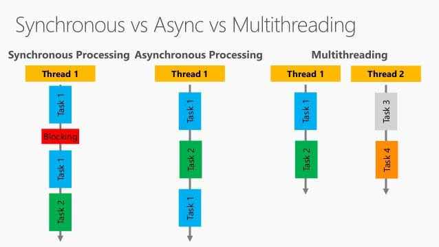
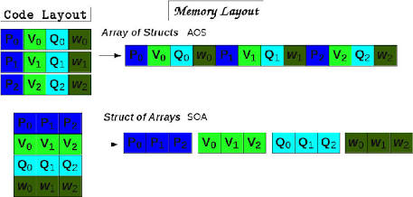

CPU 자원을 활용하여 동시성(Concurrency)과 병렬성(Parallelism)을 달성하는 방법은 언어마다 철학과 발전 방향이 다릅니다. 하지만 근본적으로 스레드(Thread)는 운영체제(OS)가 관리하는 실제 일꾼을 늘리는 방식이고, 비동기(Async/Task)는 일꾼이 대기하는 시간(I/O 작업 등)을 최소화하여 혼자서도 여러 일을 효율적으로 처리하게 만드는 방식입니다.

직관적인 이해를 돕기 위해 아래의 다이어그램을 먼저 살펴보겠습니다.



* **멀티스레딩 (CPU 바운드에 적합):** 주방에 요리사를 여러 명 고용하는 것입니다. 인건비(메모리 및 컨텍스트 스위칭 비용)가 비싸지만, 동시에 여러 개의 야채를 썰 수 있습니다.
* **비동기 (I/O 바운드에 적합):** 요리사 한 명이 오븐에 빵을 넣고(I/O 대기) 굽는 시간 동안 가만히 서서 기다리는 대신(Blocking), 바로 돌아서서 샐러드를 만드는(Non-blocking) 방식입니다.

실무에서 각 언어가 이를 어떻게 다루는지 예제와 함께 살펴보겠습니다.

---

## 1. C++ : OS 자원에 대한 직접적인 통제와 성능

C++은 하드웨어와 가장 가까운 언어인 만큼, OS의 스레드를 직접 생성하고 제어하는 `std::thread`를 주로 사용합니다. 최근에는 `std::async`와 C++20의 코루틴을 통해 비동기 프로그래밍도 지원하지만, 여전히 **고성능 연산 처리를 위한 스레드 풀(Thread Pool) 운용**이 핵심입니다.

**실무적 활용:** 게임 엔진의 렌더링/물리 연산 분리, 고주파 트레이딩 등 극단적인 성능이 필요할 때 코어 수에 맞춰 스레드를 띄워 CPU를 100% 쥐어짜는 형태로 사용합니다.

```cpp
#include <iostream>
#include <thread>
#include <future>
#include <chrono>

// CPU를 강하게 사용하는 무거운 작업 (멀티스레드 적합)
void heavy_computation(int id) {
    std::cout << "Thread " << id << " working on CPU core\n";
    std::this_thread::sleep_for(std::chrono::seconds(2)); // 연산 시뮬레이션
}

int main() {
    // 1. 직접 스레드 생성 (OS 스레드 1:1 매칭)
    std::thread t1(heavy_computation, 1);
    std::thread t2(heavy_computation, 2);

    t1.join(); // 완료 대기
    t2.join();

    // 2. std::async를 활용한 비동기 (내부적으로 스레드 풀을 사용할 수 있음)
    std::future<int> result = std::async(std::launch::async, []() {
        return 42;
    });
    
    std::cout << "Async result: " << result.get() << "\n";
    return 0;
}

```

---

## 2. C# : Task와 async/await의 교과서

C#은 비동기 프로그래밍의 현대적 표준인 `async/await` 패턴을 가장 먼저, 그리고 가장 훌륭하게 정립한 언어입니다. 개발자가 직접 스레드를 다루기보다 `Task`라는 작업 단위를 던져주면, .NET의 런타임(ThreadPool)이 알아서 남는 스레드에 작업을 배분하여 CPU를 극한으로 효율화합니다.

**실무적 활용:** 웹 서버(ASP.NET Core)에서 DB 쿼리나 외부 API 호출을 기다리는 동안 스레드가 멈추지 않고 다른 클라이언트의 요청을 처리하게 만들어, 적은 서버 리소스로 수만 명의 동시 접속자를 처리합니다.

```csharp
using System;
using System.Threading.Tasks;

class Program
{
    static async Task Main()
    {
        Console.WriteLine("메인 스레드 시작");

        // 1. I/O 바운드 비동기 작업 (스레드를 차단하지 않음!)
        Task<string> dbTask = FetchDataFromDbAsync();
        
        // 2. CPU 바운드 병렬 작업 (백그라운드 스레드 풀로 위임)
        Task cpuTask = Task.Run(() => {
            Console.WriteLine("CPU 집약적인 연산 진행 중...");
        });

        // 결과가 나올 때까지 다른 일을 하며 기다림 (await)
        await Task.WhenAll(dbTask, cpuTask);
        Console.WriteLine($"결과: {dbTask.Result}");
    }

    static async Task<string> FetchDataFromDbAsync()
    {
        // 2초 동안 DB 응답을 기다리지만, 현재 스레드는 다른 일을 하러 떠납니다.
        await Task.Delay(2000); 
        return "DB 데이터";
    }
}

```

---

## 3. Python : GIL의 한계와 asyncio의 극복

파이썬은 CPython의 GIL(Global Interpreter Lock) 때문에, 멀티스레딩을 하더라도 한 번에 하나의 스레드만 파이썬 코드를 실행할 수 있습니다. 즉, 스레드를 늘려도 CPU를 여러 개 동시에 쓰지 못합니다.

따라서 CPU를 100% 써야 할 때는 프로세스를 통째로 복제하는 `multiprocessing`을 쓰고, 네트워크 요청 등 대기 시간이 길 때는 `asyncio`를 사용하여 싱글 스레드 안에서 여러 작업을 번갈아가며 처리합니다.

**실무적 활용:** 웹 스크래핑, 챗봇 서버(FastAPI) 등 수많은 네트워크 요청을 동시에 보내고 받을 때 `asyncio`가 압도적인 성능을 발휘합니다. 데이터 분석/머신러닝 연산은 `multiprocessing`이나 C로 작성된 라이브러리(NumPy)에 맡깁니다.

```python
import asyncio
import multiprocessing
import time

# 1. asyncio (I/O 바운드 - 네트워크/DB 요청 등 대기시간이 긴 작업)
async def fetch_api(id):
    print(f"API {id} 요청 시작")
    await asyncio.sleep(2) # 응답 대기 시간 동안 다른 API 요청을 보냄
    return f"Data {id}"

async def main_async():
    # 동시에 3개의 API 요청 실행 (스레드는 단 1개만 사용)
    results = await asyncio.gather(fetch_api(1), fetch_api(2), fetch_api(3))
    print("비동기 결과:", results)

# 2. multiprocessing (CPU 바운드 - GIL 우회)
def cpu_heavy_task(name):
    # 실제 여러 CPU 코어를 사용하여 병렬 연산
    count = sum(i * i for i in range(10**7))
    print(f"{name} 연산 완료")

if __name__ == "__main__":
    # 비동기 I/O 실행
    asyncio.run(main_async())
    
    # 멀티프로세싱 CPU 실행 (각각 다른 CPU 코어 할당)
    p1 = multiprocessing.Process(target=cpu_heavy_task, args=("Process 1",))
    p2 = multiprocessing.Process(target=cpu_heavy_task, args=("Process 2",))
    p1.start(); p2.start()
    p1.join(); p2.join()

```

---

## 4. Rust : 비용 없는 추상화와 강력한 안전성

Rust는 C++ 수준의 성능을 내면서도 메모리 안전성을 보장합니다. 러스트의 비동기(`async/await`)는 특이하게도 언어 자체에 실행기(Runtime)가 포함되어 있지 않습니다. 대신 `Tokio` 같은 외부 라이브러리를 사용하여, 생성된 비동기 작업(Future)들을 OS 스레드에 가장 효율적으로 욱여넣습니다(M:N 스레딩 모델).

**실무적 활용:** 디스코드(Discord), AWS 등에서 극단적인 성능과 안정성이 동시에 요구되는 인프라 시스템이나 고성능 네트워크 서버를 구축할 때 `Tokio`와 조합하여 사용합니다.

```rust
// Cargo.toml 에 tokio = { version = "1", features = ["full"] } 추가 필요
use std::thread;
use std::time::Duration;

// 1. CPU 바운드 (전통적인 OS 멀티스레딩)
fn cpu_heavy_work() {
    thread::spawn(|| {
        println!("Background OS thread working...");
        thread::sleep(Duration::from_secs(1)); // OS가 스레드를 블로킹함
    });
}

// 2. I/O 바운드 (Tokio를 이용한 비동기)
#[tokio::main]
async fn main() {
    cpu_heavy_work();

    // tokio::spawn은 극도로 가벼운 '그린 스레드(Task)'를 생성하여 워커 스레드풀에 던짐
    let task1 = tokio::spawn(async {
        println!("Async Task 1 started");
        tokio::time::sleep(Duration::from_secs(2)).await; // 스레드는 블로킹되지 않음
        "Task 1 done"
    });

    let task2 = tokio::spawn(async {
        println!("Async Task 2 started");
        tokio::time::sleep(Duration::from_secs(1)).await;
        "Task 2 done"
    });

    // 비동기 작업들을 기다림
    let (res1, res2) = tokio::join!(task1, task2);
    println!("{}, {}", res1.unwrap(), res2.unwrap());
}

```

---

### 핵심 요약 비교

| 언어 | CPU 바운드 (연산 집약) | I/O 바운드 (대기시간 발생) | 실무 주요 특징 |
| --- | --- | --- | --- |
| **C++** | `std::thread`, Thread Pool | `std::async`, C++20 Coroutines | OS 수준의 통제권, 가장 빠르지만 직접 관리할 게 많음 |
| **C#** | `Task.Run` | `async/await` | .NET 런타임이 최적화된 스레드풀로 알아서 분배, 가장 우아한 문법 |
| **Python** | `multiprocessing` | `asyncio` | GIL 때문에 스레드 대신 멀티프로세스 사용 필수. 비동기는 단일 스레드로 동작 |
| **Rust** | `std::thread` | `async/await` + `Tokio` | 안전하고 오버헤드가 없음(Zero-cost). 실행기를 직접 선택해야 함 |

각 언어가 CPU 자원을 쥐어짜기 위해 OS(운영체제)와 어떻게 소통하고, 메모리 구조를 어떻게 다루는지 "엔진룸" 깊숙한 곳으로 들어가 보겠습니다.

스레드 최적화의 핵심은 **컨텍스트 스위칭(Context Switching) 비용을 줄이고, 캐시 히트율(Cache Hit Rate)을 높이며, 락(Lock)으로 인한 병목을 없애는 것**입니다.

---

## 1. C++ : "OS야, 내 스레드 건들지 마" (1:1 커널 스레드와 캐시 친화성)

C++의 `std::thread`는 기본적으로 OS 스레드(Linux의 pthread, Windows의 API 스레드)와 1:1로 매핑됩니다. 가장 원시적이지만 가장 통제력이 높습니다.

* **CPU 친화도(CPU Affinity) 고정:** 극단적인 최적화를 위해 C++ 개발자들은 스레드를 특정 CPU 코어에 '묶어(Pinning)' 버립니다. 스레드가 코어 A에서 코어 B로 이동하면 CPU 내부의 L1/L2 캐시 메모리가 전부 날아가기 때문입니다. 특정 코어에 고정시키면 캐시 히트율이 극대화되어 속도가 비약적으로 상승합니다.
* **락-프리(Lock-Free) 프로그래밍:** 뮤텍스(Mutex) 같은 락을 걸면, 스레드는 대기 상태로 빠지며 OS 커널로 진입(Context Switch)하게 됩니다. 이 비용은 매우 큽니다. C++은 `std::atomic`과 메모리 오더링(Memory Order)을 통해 락 없이 CPU의 하드웨어 명령어(Compare-And-Swap 등)만으로 동기화를 처리하여 커널 스위칭 비용을 아예 없애버립니다.

> **깊은 내면:** C++은 개발자가 "스레드 생성 비용(약 1~8MB의 스택 메모리 할당 및 OS 시스템 콜)이 비싸다"는 것을 알기 때문에, 앱 시작 시 미리 스레드를 만들어두는 **스레드 풀(Thread Pool)**을 직접 구현하여 재사용하는 것이 기본 소양입니다.

---

## 2. C# : .NET 런타임의 "작업 훔치기 (Work-Stealing)"

C#의 `Task`와 `.NET ThreadPool`은 개발자가 스레드를 직접 다루지 못하게 하는 대신, 런타임이 천재적인 스케줄러를 가동합니다.

* **Work-Stealing 알고리즘:** ThreadPool 안에는 여러 개의 워커 스레드가 있고, 각 스레드는 자신만의 '로컬 작업 큐(Queue)'를 가집니다. 만약 스레드 A가 자기 큐의 일을 다 끝내서 놀게 되면, 바쁘게 일하고 있는 스레드 B의 큐에서 작업을 '훔쳐(Steal)' 옵니다.
* **캐시 지역성 유지:** 스레드 A가 생성한 하위 작업은 A의 로컬 큐에 들어갑니다. 동일한 스레드가 관련 작업을 이어서 처리하므로 CPU 캐시가 유지될 확률이 높습니다.
* **Hill-Climbing 휴리스틱:** .NET ThreadPool은 현재 CPU 사용량, 작업 처리량(Throughput)을 실시간으로 모니터링하면서 스레드 개수를 스스로 늘렸다 줄였다(Hill-Climbing 알고리즘) 합니다.

> **깊은 내면:** C#의 `Task`는 실제 스레드가 아니라 힙(Heap) 메모리에 생성되는 작은 '상태 기계(State Machine) 객체'에 불과합니다. 진짜 무거운 OS 스레드는 런타임이 소수만 띄워두고, 수만 개의 Task를 이 스레드들 사이에서 곡예하듯 분배합니다.

---

## 3. Python : GIL이라는 거대한 자물쇠

파이썬의 CPython 인터프리터는 멀티스레딩 최적화에 있어서 구조적인 결함을 가지고 있습니다. 바로 **GIL(Global Interpreter Lock)** 때문입니다.

* **진짜 OS 스레드, 가짜 병렬성:** 파이썬의 `threading` 모듈이 만드는 스레드는 진짜 OS 스레드입니다. 하지만 CPython 내부의 메모리 관리(레퍼런스 카운팅)를 보호하기 위해, "한 번에 오직 하나의 스레드만 파이썬 바이트코드를 실행할 수 있다"는 규칙(GIL)이 걸려 있습니다.
* **컨텍스트 스위칭의 비효율:** 스레드가 4개 떠 있고 CPU 코어가 4개 있어도, GIL 때문에 3개는 잠들어 있고 1개만 실행됩니다. OS는 계속해서 스레드들을 번갈아 깨워보지만(Context Switch), GIL을 얻지 못한 스레드는 다시 잠듭니다. 이 과정에서 엄청난 CPU 낭비(Thrashing)가 발생합니다.

> **깊은 내면:** 그래서 파이썬은 CPU 코어를 100% 쓰기 위해 아예 독립된 메모리 공간과 GIL을 가지는 **프로세스를 통째로 복제(`multiprocessing`)** 해버립니다. 스레드보다 훨씬 무겁고 메모리도 많이 먹지만, 파이썬 인터프리터 구조상 유일하게 CPU를 쥐어짜는 방법입니다. (단, Python 3.13부터 이 GIL을 제거하는 프로젝트가 본격적으로 도입되고 있습니다.)

---

## 4. Rust : 오버헤드 0을 향한 "비용 없는 추상화" (M:N 모델)

러스트는 C++의 통제력과 C#의 우아함을 합친 뒤, 메모리 안전성을 강제하는 형태입니다. 러스트 비동기 생태계(Tokio 등)는 **M:N 스레딩 모델**을 극한으로 깎아서 사용합니다.

* **상태 기계의 컴파일 타임 생성:** 러스트에서 `async` 함수를 작성하면, 컴파일러가 이를 메모리 할당이 거의 필요 없는 아주 작은 Enum 형태의 상태 기계(State Machine)로 변환해 버립니다.
* **Green Thread (Task)와 M:N 스케줄링:** 개발자가 수백만 개의 비동기 Task(M)를 띄우면, Tokio 런타임이 이를 실제 OS 스레드(N, 보통 CPU 코어 수와 동일)에 배분합니다.
* **소유권(Ownership)을 통한 락(Lock) 제거:** C++에서는 스레드 간 데이터 공유 시 런타임 에러나 락 병목을 피하기 어렵지만, 러스트는 컴파일러가 `Send`, `Sync` 트레이트(Trait)를 통해 "안전한 데이터 이동"을 컴파일 타임에 수학적으로 증명합니다. 따라서 불필요한 방어적 락(Defensive Lock)을 걸 필요가 없어 런타임 성능이 극대화됩니다.

> **깊은 내면:** OS 스레드 하나를 만들면 스택 메모리가 메가바이트 단위로 잡히지만, 러스트의 비동기 Task는 바이트(Bytes) 단위의 크기만 가집니다. 따라서 CPU 캐시에 수많은 Task의 상태가 한 번에 쏙 들어가며(Cache locality), Context Switching은 커널 개입 없이 유저 영역(User Space)에서 단순 함수 포인터 교체만으로 10나노초 단위로 끝납니다.

컴퓨터 공학에서 말하는 '문맥(Context)'이란 결국 CPU 내부에 있는 '레지스터(Register)들의 현재 상태 값'을 의미합니다. 스레드나 프로세스가 교체된다는 것은 이 한정된 물리적 레지스터 공간의 주인이 바뀌는 하드웨어적인 이벤트입니다.

이 과정을 이해하기 위해 가장 핵심이 되는 두 가지 특수 목적 레지스터를 알아야 합니다:

* **PC (Program Counter / Instruction Pointer):** CPU가 '다음에 읽어 들여서 실행할 기계어 명령어의 메모리 주소'를 가리킵니다.
* **SP (Stack Pointer):** 현재 실행 중인 함수들의 로컬 변수와 돌아갈 주소가 저장된 메모리(스택)의 최상단을 가리킵니다.

---

## 문맥 교환의 하드웨어적 절차

이 과정은 찰나의 순간에 일어나지만, 하드웨어(CPU)와 OS 커널의 정교한 협력을 통해 아래와 같은 순서로 이루어집니다.

1. **인터럽트 발생 및 실행 중단:** 하드웨어의 강제 개입.
타이머 인터럽트(할당된 시간 소진)가 발생하거나, I/O 대기 등으로 인해 시스템 콜이 호출됩니다. CPU는 즉시 현재 처리하던 기계어 실행을 멈추고, 실행 권한(Privilege Level)을 유저 모드에서 커널 모드로 전환합니다.


2. **현재 상태 저장 (Context Save):** 레지스터 값들을 메모리로 대피.
OS 커널은 현재 물리적 CPU에 들어있는 모든 정보(PC, SP, 각종 범용 레지스터, 상태 플래그 등)를 현재 스레드의 **TCB(Thread Control Block) 또는 PCB(Process Control Block)**라는 메모리 구조체에 고스란히 복사하여 저장합니다.


3. **스케줄러 개입:** 다음 타자 선정.
OS의 스케줄러가 실행 대기열(Ready Queue)을 확인하고, 다음에 CPU를 차지할 우선순위가 가장 높은 스레드(예: Thread B)를 선택합니다.


4. **새로운 상태 복원 (Context Restore):** 메모리에서 레지스터로 장전.
선택된 Thread B의 TCB/PCB 메모리 영역으로 가서, 이전에 저장해 두었던 Thread B의 고유한 레지스터 값들을 가져옵니다. 그리고 물리적인 CPU 레지스터 공간에 이 값들을 그대로 덮어씁니다(Load).


5. **PC 업데이트 및 실행 재개:** 가장 마지막에 교체되는 PC.
복원 작업의 가장 마지막 단계는 **Program Counter(PC) 레지스터를 Thread B의 다음 실행 주소로 덮어쓰는 것**입니다. PC가 변경되는 순간, CPU는 자연스럽게 Thread B가 과거에 멈췄던 바로 그 지점의 기계어를 패치(Fetch)하여 아무 일도 없었다는 듯이 실행을 이어나갑니다.


---

## TCB (Thread Control Block)의 구조

레지스터 값들이 대피하는 '임시 숙소'인 TCB는 메모리 상에 아래와 같이 구성되어 있습니다.

> **문맥 교환이 무거운 진짜 이유 (캐시 무효화)**
> 단순히 레지스터 값을 메모리에 넣고 빼는 복사 작업 자체도 오버헤드지만, 성능을 깎아먹는 주범은 **캐시 무효화(Cache Invalidation)**입니다.
> PC가 가리키는 주소가 완전히 다른 곳으로 점프하고 SP가 다른 메모리 영역을 가리키게 되므로, 기존 스레드가 CPU L1/L2 캐시에 열심히 올려둔 데이터가 전부 쓸모없어집니다. CPU는 느린 메인 메모리에서 새로운 코드와 데이터를 다시 끌어와야 하며, 이를 '캐시가 차가워졌다(Cold Cache)'고 표현합니다.

---


실제 게임 엔진 개발자나 고주파 트레이딩(HFT) 시스템 엔지니어들이 CPU를 극한으로 쥐어짜기 위해 사용하는 최적화 기법들은 단순히 "스레드를 여러 개 만든다"는 수준을 아득히 넘어섭니다.

이들의 핵심 철학은 **"CPU가 데이터를 기다리며 놀게 하지 마라(Cache Locality)"** 그리고 **"OS에게 권한을 넘기지 마라(Lock-Free)"** 입니다. 실무에서 쓰이는 3가지 핵심 비법을 예제 코드와 함께 살펴보겠습니다.

---

## 1. 데이터 지향 설계 (Data-Oriented Design) : SoA vs AoS

CPU는 메모리에서 데이터를 가져올 때, 요청한 데이터 딱 하나만 가져오지 않고 주변 데이터(보통 64바이트 덩어리, Cache Line)를 한꺼번에 캐시로 긁어옵니다.

객체 지향 프로그래밍(OOP)에서 흔히 쓰는 **AoS(Array of Structs)** 방식은 이 캐시를 심각하게 낭비합니다. 위치(Position)만 업데이트하고 싶은데, 전혀 상관없는 색상(Color)이나 이름(Name) 데이터까지 캐시에 끌려와서 귀중한 공간을 차지하기 때문입니다.

이를 해결하기 위해 데이터를 속성별로 배열에 모아두는 **SoA(Struct of Arrays)** 방식을 사용합니다.

```cpp
// ❌ 초보자의 방식 (AoS: Array of Structs) - 객체 지향적이지만 CPU는 싫어함
struct GameObject {
    Vector3 position;
    Vector3 velocity;
    Color color; // 위치 계산할 때는 전혀 필요 없는 데이터
    string name; // 캐시 라인 낭비의 주범
};
std::vector<GameObject> objects(10000);

// 위치 업데이트 (캐시 미스 대량 발생!)
for (auto& obj : objects) {
    obj.position += obj.velocity * dt; 
}


// 🚀 극강의 최적화 (SoA: Struct of Arrays) - 데이터 지향 설계
struct GameWorld {
    std::vector<Vector3> positions;
    std::vector<Vector3> velocities;
    std::vector<Color> colors;
    std::vector<string> names;
};
GameWorld world;

// 위치 업데이트 (캐시 히트율 99%! CPU가 벡터화(SIMD) 명령어까지 자동으로 적용함)
for (size_t i = 0; i < 10000; ++i) {
    world.positions[i] += world.velocities[i] * dt;
}

```

---

## 2. 거짓 공유 (False Sharing) 회피: 캐시 라인 찢어놓기

멀티스레드 환경에서 가장 찾기 힘들고 치명적인 성능 저하 원인입니다.

스레드 1은 변수 A를 수정하고, 스레드 2는 변수 B를 수정합니다. 논리적으로는 아무런 락(Lock) 충돌이 없어야 합니다. 하지만 **변수 A와 B가 우연히 메모리 상에서 너무 가까이 붙어있어서 같은 64바이트 '캐시 라인'에 들어가 버리면**, 하드웨어 레벨에서 충돌이 일어납니다. CPU 코어들은 서로 캐시 라인을 뺏고 뺏기며 무효화(Invalidation)를 반복합니다.

이를 막기 위해 C++나 C#에서는 데이터 사이에 의미 없는 '패딩(Padding)'을 집어넣어 강제로 캐시 라인을 분리합니다.

```cpp
#include <atomic>
#include <thread>

// ❌ 나쁜 예: 두 카운터가 메모리에 딱 붙어 있음 (False Sharing 발생)
struct BadCounter {
    std::atomic<int> thread1_count; // Core 1이 접근
    std::atomic<int> thread2_count; // Core 2가 접근
};


// 🚀 최적화 예: 64바이트(일반적인 L1 캐시 라인 크기) 단위로 정렬 강제
struct GoodCounter {
    // thread1_count는 0바이트 위치에 시작
    alignas(64) std::atomic<int> thread1_count; 
    
    // 강제로 64바이트 띄워짐 -> 완전히 다른 캐시 라인에 적재됨
    alignas(64) std::atomic<int> thread2_count; 
};

GoodCounter counter;

void worker1() { for(int i=0; i<1000000; ++i) counter.thread1_count++; }
void worker2() { for(int i=0; i<1000000; ++i) counter.thread2_count++; }

```

---

## 3. 락-프리 (Lock-Free) 프로그래밍: OS를 따돌리는 하드웨어 마법

`Mutex`나 `Lock`을 쓰면 OS 커널로 진입하며 엄청난 오버헤드(Context Switch)가 발생합니다. 극단적인 최적화를 위해 개발자들은 OS의 락을 쓰지 않고, CPU가 제공하는 원자적 명령어(CAS: Compare-And-Swap)를 사용하여 직접 스레드 동기화를 구현합니다.

* **CAS의 논리:** "메모리 값이 내가 아는 예전 값(Expected)과 똑같으면, 새로운 값(Desired)으로 바꿔줘. 아니면 말고." 이 모든 과정이 단 하나의 CPU 기계어 명령어로 처리되어 중간에 다른 스레드가 끼어들 수 없습니다.

```cpp
#include <atomic>

struct Node {
    int data;
    Node* next;
};

// 락(Mutex)이 전혀 없는 초고속 스택 (Lock-Free Stack)
class LockFreeStack {
    std::atomic<Node*> head;

public:
    void push(int data) {
        Node* new_node = new Node{data, nullptr};
        
        // 1. 현재 head 값을 읽어둠
        new_node->next = head.load(std::memory_order_relaxed);
        
        // 2. CAS (Compare-And-Exchange) 무한 루프
        // "현재 head가 내 new_node->next와 같다면, head를 new_node로 바꿔라!"
        // 만약 그 찰나의 순간에 다른 스레드가 head를 바꿨다면, 실패하고 다시 루프를 돔.
        while (!head.compare_exchange_weak(
            new_node->next, // Expected (다른 스레드가 안 건드렸다면 이 값이어야 함)
            new_node,       // Desired (새로운 head)
            std::memory_order_release, 
            std::memory_order_relaxed)) 
        {
            // 실패했다면 new_node->next가 자동으로 갱신되므로 바로 다시 시도
        }
        // OS 락(Lock) 없이 순수하게 CPU 명령어만으로 동기화 성공!
    }
};

```

실무에서 순수한 Spinlock이나 순수한 OS Mutex를 극단적으로 사용하는 경우는 드뭅니다. 대부분의 현대적인 운영체제(Linux, Windows)와 언어 런타임(C++의 `std::mutex`, C#의 `Monitor`, Java의 `synchronized`)은 이 둘의 장점을 섞은 하이브리드 뮤텍스(Adaptive Mutex / Two-Phase Mutex)를 기본으로 사용합니다.

핵심 철학은 "조금만 돌려보고(Spin), 안 되면 바로 포기하고 자러 간다(Sleep)"입니다.

---

## Adaptive Mutex의 2단계 동작 원리 (Two-Phase Strategy)

하이브리드 뮤텍스는 락을 획득하기 위해 두 단계를 거칩니다.

### Phase 1: 스핀(Spin) 단계 (빠른 시도)

처음에는 Context Switching의 오버헤드를 피하기 위해 마치 Spinlock처럼 행동합니다.

1. CPU의 원자적 명령어(CAS)를 사용하여 락 획득을 시도합니다.
2. 실패하면 `while` 루프를 돌며 아주 짧은 횟수(예: 40번, 또는 수 마이크로초)만큼 다시 시도합니다.
3. 이 단계에서 락을 얻는 데 성공하면, 시스템 콜(OS 개입) 없이 즉시 작업을 시작합니다. (비용: 거의 0)

> **스마트 스핀(Smart Spinning):** 최근의 구현체들은 무작정 스핀하지 않습니다. 락을 쥐고 있는 스레드가 *현재 다른 CPU 코어에서 실행 중인지(Running)*를 OS를 통해 살짝 엿봅니다. 만약 그 스레드가 CPU를 뺏기고 잠들어 있다면 스핀을 돌 필요가 없으므로(Phase 1을 즉시 취소하고) 바로 Phase 2로 넘어갑니다.

### Phase 2: 슬립(Sleep) 단계 (깔끔한 양보)

정해진 스핀 횟수를 다 소모했는데도 락을 얻지 못했다면, "아, 이건 금방 끝날 작업이 아니구나"라고 판단합니다.

1. 더 이상 CPU 코어를 헛돌리며 낭비하지 않고 깔끔하게 포기합니다.
2. OS 커널에 "나 락 기다릴 테니까 대기열(Wait Queue)에 넣어주고 재워줘"라고 요청합니다(System Call).
3. CPU는 이제 다른 유용한 스레드의 작업을 처리할 수 있습니다. 나중에 락이 풀리면 OS가 깨워줍니다.

---

## 코드로 보는 하이브리드 뮤텍스의 논리적 구현

실제 OS나 런타임 내부의 C 코드는 훨씬 복잡하지만, 논리적인 흐름은 아래와 같습니다.

```cpp
class AdaptiveMutex {
    std::atomic<int> lock_state = 0; // 0: 풀림, 1: 잠김
    int SPIN_LIMIT = 40; // 최대 스핀 횟수 (OS/아키텍처마다 다름)

public:
    void lock() {
        // Phase 1: User-Space Spinning (짧은 시도)
        for (int i = 0; i < SPIN_LIMIT; ++i) {
            int expected = 0;
            // 락 획득 시도 (CAS)
            if (lock_state.compare_exchange_weak(expected, 1, std::memory_order_acquire)) {
                return; // 성공! OS 개입 없이 초고속 락 획득
            }
            
            // 실패했다면 CPU에게 "나 지금 스핀 돌고 있어"라고 힌트를 줌 (전력 소모 감소)
            // x86의 _mm_pause(), ARM의 YIELD 명령어
            cpu_pause(); 
        }

        // Phase 2: Kernel-Space Blocking (포기하고 수면)
        // 스핀 횟수를 다 채웠다면 락이 길어질 것으로 판단
        while (true) {
            int expected = 0;
            if (lock_state.compare_exchange_weak(expected, 1, std::memory_order_acquire)) {
                return;
            }
            // OS의 System Call을 호출하여 스레드를 대기열에 넣고 재움 (Futex, WaitOnAddress 등)
            os_sleep_and_wait(&lock_state);
        }
    }
    
    void unlock() {
        lock_state.store(0, std::memory_order_release);
        // 잠들어 있는 스레드가 있다면 OS를 통해 깨움
        os_wake_one(&lock_state);
    }
};

```

---

## 왜 이것이 최고의 효율을 낼까?

실제 상용 시스템의 통계를 보면, 락이 걸려있는 상황의 80~90%는 코어 연산 몇 번으로 끝나는 아주 짧은 시간입니다.

* **짧은 락:** 대부분의 경우 Phase 1(스핀) 안에서 락을 획득하므로, 비싼 Context Switching 비용을 지불하지 않습니다.
* **긴 락 / 병목:** 가끔 발생하는 긴 I/O 작업이나 과부하 상황에서는 Phase 2(슬립)로 넘어가 CPU를 양보하므로, Spinlock이 유발하는 'CPU 100% 낭비'와 시스템 멈춤(Livelock)을 완벽하게 방어합니다.

결국 개발자는 내부 동작을 크게 신경 쓰지 않고 `std::mutex`나 `lock` 구문을 사용하기만 해도, 런타임 환경이 알아서 **상황에 맞춰 Spinlock과 Mutex 사이를 줄타기하며 최적화**를 해주는 것입니다.


충분히 헷갈리실 수 있습니다. SoA(Struct of Arrays)와 AoS(Array of Structs)는 개념만 들으면 와닿지 않지만, 메모리 구조와 CPU 캐시의 관점에서 코드를 보면 완벽하게 이해할 수 있습니다.

더불어, 우리가 흔히 코드에서 쓰는 `mutex.lock()`이 CPU 하드웨어 단에서 어떻게 동작하는지 "엔진룸"의 바닥까지 보여드리겠습니다.

---



## 1. SoA vs AoS: CPU 캐시를 낭비하는 자와 아끼는 자

CPU는 메모리(RAM)에서 데이터를 가져올 때, 내가 달라고 한 숫자 딱 1개(예: 4바이트)만 가져오지 않습니다. 무조건 **64바이트 덩어리(Cache Line)** 단위로 주변 데이터까지 싹 다 긁어옵니다.

이때, 게임이나 시뮬레이션에서 몬스터 1,000마리의 '위치(X, Y)'만 업데이트하고 싶은 상황을 가정해 보겠습니다.

### ❌ AoS (Array of Structs) - 객체 지향의 함정

우리가 흔히 짜는 클래스/구조체 배열입니다.

```cpp
// 1개의 크기: 위치(8바이트) + 색상(4바이트) + 체력(4바이트) + 이름(16바이트) = 총 32바이트
struct Monster {
    float x, y;    // 우리가 계산에 필요한 데이터
    int color;     // 계산에 필요 없는 데이터
    int hp;        // 계산에 필요 없는 데이터
    char name[16]; // 계산에 필요 없는 데이터
};

Monster monsters[1000]; 

// 위치만 업데이트하는 루프
for (int i = 0; i < 1000; i++) {
    monsters[i].x += 1.0f;
}

```

**CPU 내부에서 벌어지는 참사:**
CPU가 `monsters[0].x`를 읽으려고 메모리에 접근하면, 64바이트 캐시 라인에 **`[X0, Y0, Color0, HP0, Name0...]`** 와 같이 몬스터 1마리, 많아야 2마리의 정보만 들어옵니다.
루프를 돌기 위해 위치(X, Y)만 필요한데, 전혀 쓸모없는 체력과 이름 데이터가 캐시 공간의 75%를 차지해 버립니다. 결국 CPU는 매번 느린 메인 메모리(RAM)로 달려가서 다음 몬스터 데이터를 가져와야 합니다(Cache Miss).

### 🚀 SoA (Struct of Arrays) - 데이터 지향의 마법

데이터를 성질별로 배열로 묶어버립니다.

```cpp
struct MonsterWorld {
    float x[1000]; // 1000마리의 X 좌표만 쫘르륵 모여있음
    float y[1000]; 
    int color[1000];
    int hp[1000];
    char name[1000][16];
};

MonsterWorld world;

// 위치만 업데이트하는 루프
for (int i = 0; i < 1000; i++) {
    world.x[i] += 1.0f;
}

```

**CPU 내부에서 벌어지는 기적:**
CPU가 `world.x[0]`을 읽으려고 하면, 64바이트 캐시 라인에 **`[X0, X1, X2, X3, X4, X5, X6, X7... X15]`** 가 한 번에 꽉 차서 들어옵니다!
CPU는 느린 RAM에 갈 필요 없이, 이미 캐시에 올라와 있는 16마리의 X 좌표를 빛의 속도로 계산해 버립니다(Cache Hit 100%). 심지어 현대 CPU는 벡터 명령어(SIMD)를 써서 이 16개의 숫자를 한 번의 CPU 사이클로 덧셈해 버립니다. 이것이 게임 엔진이 수십만 개의 파티클을 60프레임으로 돌리는 비밀입니다.

---

## 2. Mutex의 실체: 코드에서 CPU 하드웨어까지

우리가 코드에서 `mutex.lock()`을 호출할 때, 유저 공간(우리의 코드)에서 OS 커널을 거쳐 물리적인 CPU 실리콘 수준까지 어떤 일이 벌어지는지 추적해 보겠습니다.

### 1단계: CPU 하드웨어 레벨의 원자적 명령어 (User Space)

Mutex의 가장 깊은 바닥에는 소프트웨어가 아니라 **CPU가 물리적으로 제공하는 명령어**가 있습니다. x86 아키텍처에서는 `LOCK CMPXCHG` (Compare and Exchange)라는 기계어가 그 역할을 합니다.

우리가 `std::mutex.lock()`을 호출하면, 내부적으로 가장 먼저 이 CPU 명령어를 실행합니다.

```cpp
// Mutex 내부의 상태 변수 (0: 아무도 안 씀, 1: 누군가 쓰고 있음)
int lock_state = 0; 

// CPU 기계어(LOCK CMPXCHG)로 번역되는 로직
bool cpu_hardware_cas(int* memory_address, int expected, int new_value) {
    // ---- 이 구간은 CPU 하드웨어가 "메모리 버스를 물리적으로 잠그고" 실행함 ----
    if (*memory_address == expected) {
        *memory_address = new_value;
        return true;  // 락 획득 성공!
    }
    return false;     // 락 획득 실패 (누가 이미 1로 바꿨음)
    // ----------------------------------------------------------------------
}

```

* **하드웨어의 마법:** `LOCK` 접두사가 붙은 명령어가 실행되는 찰나의 순간(수 나노초), CPU는 다른 모든 코어가 해당 메모리 주소(캐시 라인)를 건드리지 못하게 하드웨어적으로 차단합니다.

### 2단계: 락을 못 얻었을 때 OS의 개입 (Kernel Space)

만약 1단계에서 락을 얻었다면 `lock()` 함수는 즉시 끝나고 다음 코드가 실행됩니다. 진짜 문제는 **다른 스레드가 이미 락을 쥐고 있을 때(1단계 실패)** 발생합니다.

```cpp
void my_mutex_lock() {
    // 1. CPU 명령어로 락 시도 (빠른 경로)
    if (cpu_hardware_cas(&lock_state, 0, 1) == true) {
        return; // 성공했으면 함수 종료, 작업 시작!
    }

    // 2. 실패했다면 OS에게 "나 좀 재워줘"라고 부탁 (System Call)
    // Linux의 경우 'futex' (Fast Userspace Mutex) 시스템 콜 호출
    syscall(SYS_futex, &lock_state, FUTEX_WAIT, 1, ...);
}

```

이 `syscall`이 호출되는 순간, 프로그램의 실행 권한은 OS 커널로 넘어갑니다.

1. **스레드 상태 변경:** Context Switch 준비.
OS 커널은 현재 스레드(Thread A)를 CPU에서 끌어내리고, 상태를 'Running(실행 중)'에서 'Waiting(대기 상태)'로 바꿉니다.


2. **대기열 등록:** Wait Queue 진입.
OS는 이 뮤텍스(`lock_state` 메모리 주소)만을 위한 특별한 대기열 큐(Wait Queue)에 Thread A를 집어넣습니다.


3. **CPU 스케줄링:** 다른 스레드에게 양보.
CPU가 비었으므로, OS는 실행할 준비가 된 다른 스레드(Thread B)를 CPU에 올려서 실행시킵니다.


### 3단계: 누군가 락을 풀었을 때의 하드웨어 연쇄 반응

나중에 락을 가지고 있던 스레드가 작업을 마치고 `unlock()`을 호출하면 어떻게 될까요?

```cpp
void my_mutex_unlock() {
    // 1. CPU 명령어로 상태를 0(풀림)으로 되돌림
    lock_state = 0; // x86에서는 단순히 XCHG 또는 STORE 명령어로 처리

    // 2. OS에게 "대기열에 자고 있는 애들 중에 한 명만 깨워줘"라고 부탁
    syscall(SYS_futex, &lock_state, FUTEX_WAKE, 1, ...);
}

```

이때 OS는 아까 대기열(Wait Queue)에 잠들어 있던 Thread A를 찾아내어 상태를 'Ready'로 바꿉니다. 곧이어 스케줄러가 Thread A를 다시 CPU에 올리면(Context Switch), Thread A는 아까 잠들었던 `syscall` 부분에서 깨어나 락을 쥐고 작업을 이어나가게 됩니다.

> **요약하자면:** Mutex는 순수한 소프트웨어 덩어리가 아니라, **[CPU의 원자적 하드웨어 명령어(빠른 경로)]** 와 **[OS 커널의 스케줄링 및 대기열 관리(느린 경로)]** 가 결합된 아주 정교한 시스템입니다. 개발자가 `lock()` 한 줄을 적을 때, 아래에서는 실리콘 회로의 차단부터 커널의 스레드 스와핑까지 방대한 일들이 일어나는 것입니다.