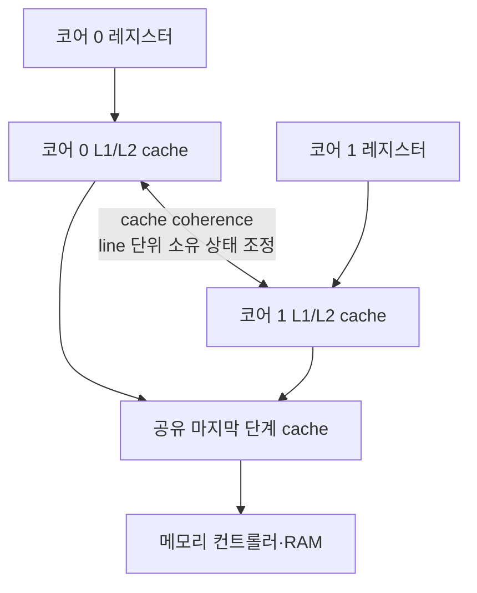
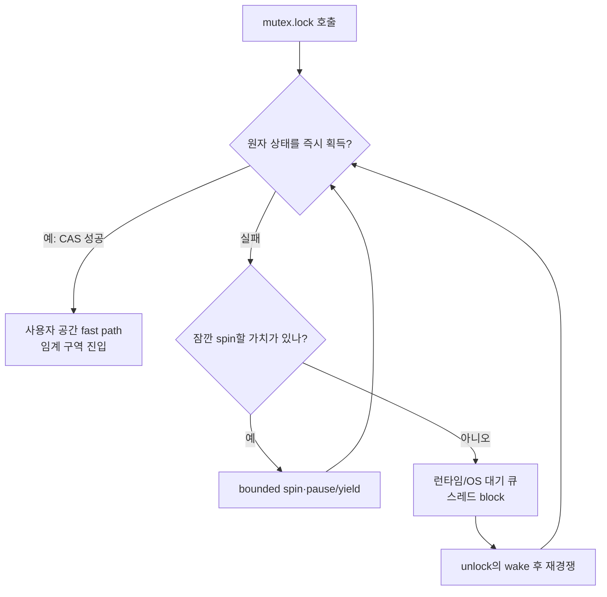

# 1단계: C++ 소스에서 메모리와 CPU까지

> **한 줄 요약:** C++ 코드는 추상 기계의 규칙으로 의미가 정해지고, 컴파일러와 CPU는 관찰 가능한 의미를 보존하는 범위에서 코드를 제거·합치기·재배치한다.

- 선행 지식: [로드맵](./00-roadmap.md)
- 초보자 우선: **한 줄이 실행되기까지**, **메모리 계층**, **표준 보장과 구현의 분리**
- 전문가 목표: 컴파일러 barrier, CPU fence, cache coherence, kernel blocking을 같은 말로 섞지 않는다.

## 한 줄이 실행되기까지

`std::lock_guard<std::mutex> guard{mutex};`는 다음 파이프라인을 지난다.


1. 전처리기는 `<mutex>`의 선언과 매크로 조건을 포함한다.
2. 프런트엔드는 `lock_guard<mutex>` 타입, 생성자 오버로드, 객체 수명을 검사한다.
3. optimizer는 생성자/소멸자를 인라인할 수 있지만 lock/unlock의 동기화 의미를 없애면 안 된다.
4. backend는 대상 Instruction Set Architecture(ISA, 명령어 집합 구조)에 맞는 명령과 런타임 호출을 고른다.
5. linker는 표준 라이브러리와 스레드 런타임 심볼을 해결한다.
6. 실행 중 경쟁이 없으면 user space fast path, 있으면 OS 대기 primitive로 내려가는 구현이 흔하다.

## 세 종류의 “순서”

| 층 | 순서의 뜻 | 누가 제한하는가 |
|---|---|---|
| C++ abstract machine | 평가와 side effect가 다른 스레드에 어떤 관계로 보이는가 | C++ 표준의 sequenced-before, synchronizes-with, happens-before |
| compiler | load/store가 생성 코드에서 어디로 이동 가능한가 | 별칭 분석, observable behavior, atomic/lock 의미 |
| CPU | 명령이 발행·완료되고 다른 코어가 관찰하는 순서 | ISA memory model, fence, cache coherence |

소스 순서가 곧 다른 코어의 관찰 순서는 아니다. 반대로 어셈블리에 fence 명령이 없다고 C++ acquire가 사라진 것도 아니다. 강한 하드웨어 순서 덕분에 평범한 load로 충분하더라도 compiler는 acquire 뒤 연산을 앞으로 올리지 못한다.

## 메모리 계층

대략적으로 레지스터 → L1/L2 cache → 공유 LLC(Last-Level Cache, 최종 단계 캐시) → RAM 순으로 멀어지고 느려진다. 정확한 크기와 지연은 CPU마다 다르므로 수치를 외우지 말고 현재 장비에서 측정한다.



### Cache coherence가 해주는 것과 안 해주는 것

- 해주는 것: 같은 물리 cache line의 값에 대해 코어들이 영원히 서로 모순된 상태로 남지 않게 하는 하드웨어 프로토콜을 제공한다.
- 안 해주는 것: C++ 데이터 레이스를 합법으로 만들기, 여러 필드의 불변식 묶기, 원하는 소스 순서 보장하기.
- 결과: `int ready; int data;`를 아무 동기화 없이 공유하면 coherence가 있어도 C++에서는 data race로 UB다.

### False sharing(거짓 공유)

서로 다른 원자 카운터라도 같은 cache line에 있으면 코어들이 그 line의 쓰기 소유권을 계속 주고받는다. 논리적으로는 공유하지 않지만 하드웨어 line을 공유해 느려진다.

```cpp
struct Counters {
    std::atomic<long> left{0};  // 두 멤버가 같은 cache line에 놓일 수 있다.
    std::atomic<long> right{0}; // 서로 다른 스레드가 써도 line ping-pong이 가능하다.
};
```

C++17의 `std::hardware_destructive_interference_size`는 분리 배치의 힌트다. 구현이 값을 제공하지 않거나 실제 하드웨어/VM 특성과 다를 가능성까지 측정으로 확인한다.

## mutex의 흔한 구현 경로

아래는 보편적인 설계 예이지 C++ 표준의 강제 구현이 아니다.



- Linux 구현은 futex(Fast Userspace Mutex) 계열 시스템 호출을 활용할 수 있다.
- Windows 구현은 WaitOnAddress, SRWLOCK 같은 primitive를 활용할 수 있다.
- 표준 `std::mutex`가 특정 primitive를 사용한다고 의존해서는 안 된다.
- `unlock`은 대기자 중 하나를 깨워도 곧바로 그 스레드가 lock을 소유한다고 보장하지 않을 수 있다.

## 컴파일러가 잠금 주변에서 할 수 있는 일

컴파일러는 as-if rule(관찰 가능한 동작이 같으면 어떤 변환도 허용)에 따라 다음을 수행할 수 있다.

- guard 생성자/소멸자와 mutex wrapper를 인라인한다.
- 임계 구역 내부의 순수 계산을 상수 접기 또는 제거한다.
- 별칭이 없음을 증명한 값은 레지스터에 둔다.
- 다른 스레드가 동기화 없이 값을 바꿀 가능성은 “정상 프로그램에 없다”고 가정한다. 데이터 레이스가 UB이기 때문이다.

그러나 올바른 프로그램의 다른 스레드 관찰을 바꾸는 방식으로 atomic/lock 경계를 넘겨 공유 side effect를 이동할 수는 없다. 정확한 제약은 호출 함수 선언, inline 여부, 메모리 순서, alias 정보에 따라 다르다.

## 레지스터, 스택, 힙에 대한 정확한 표현

- 지역 변수라고 반드시 물리 스택에 있지 않다. 최적화 후 레지스터에만 있거나 완전히 제거될 수 있다.
- `std::mutex` 객체 자체는 그것을 포함한 객체의 저장 위치에 있다. mutex 내부 구현은 별도 OS 상태를 참조할 수 있다.
- `std::thread` 객체는 실행 스레드 자체가 아니라 native thread를 관리하는 작은 handle/object다.
- 새 OS 스레드에는 보통 별도 호출 스택이 예약되지만 예약 크기 전체가 즉시 물리 RAM을 소비한다는 뜻은 아니다.
- `std::lock_guard`는 소유하지 않는 mutex 참조와 수명 규약을 표현하며, 최적화 후 별도 메모리 객체가 남지 않을 수 있다.

## `volatile`은 왜 동기화가 아닌가

표준 C++에서 `volatile`은 해당 객체 접근을 구현이 정의한 observable access로 취급하도록 하는 도구다. 메모리 매핑 I/O 등 구현 문맥에 쓰일 수 있지만 다음을 제공하지 않는다.

- 원자성
- 스레드 간 happens-before
- 복합 연산 `++`의 안전성
- mutex 같은 상호 배제

스레드 공유에는 `std::atomic`, mutex, condition variable 등 표준 동기화 도구를 사용한다.

## 관찰 실습

```bash
# 최적화 전후 어셈블리 생성
g++ -std=c++20 -O0 -S -masm=intel cxx20_example.cpp -o cxx20-O0.s
g++ -std=c++20 -O2 -S -masm=intel cxx20_example.cpp -o cxx20-O2.s

# 컴파일 단계만 수행해 목적 파일 생성
g++ -std=c++20 -O2 -c cxx20_example.cpp -o cxx20.o

# Linux에서 심볼과 역어셈블리 관찰
nm -C cxx20.o
objdump -drwC -Mintel cxx20.o
```

관찰 질문:

1. `lock_guard`라는 이름이 최적화된 심볼에 남아 있는가?
2. mutex lock/unlock은 inline인가, 외부 호출인가?
3. `-O0`의 stack load/store 중 `-O2`에서 사라진 것은 무엇인가?
4. x86-64 결과를 ARM64 결과의 근거로 일반화하고 있지 않은가?

## 완료 기준

- [ ] C++ 추상 기계, compiler ordering, CPU ordering을 구별한다.
- [ ] cache coherence와 C++ data-race freedom을 구별한다.
- [ ] mutex fast/slow path가 표준 보장이 아니라 구현 전략임을 설명한다.
- [ ] 다음 문서인 [메모리 모델과 atomic](./02-memory-model-atomics.md)으로 이동한다.
