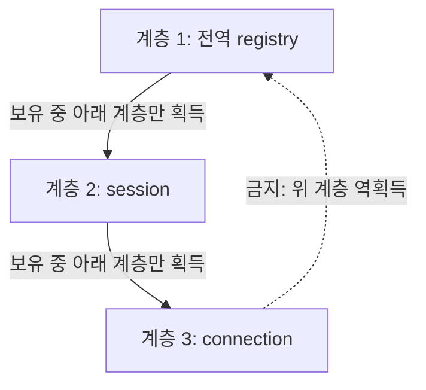

# 3단계: mutex, lock, guard와 RAII

> **한 줄 요약:** mutex가 공유 불변식을 보호하고 guard가 lock ownership의 수명을 스코프에 묶어 조기 반환·예외에서도 unlock을 보장한다.

- 선행 지식: [메모리 모델과 atomic](./02-memory-model-atomics.md)
- 초보자 우선: **보호 대상 먼저**, **guard 선택표**, **교착 회피**
- 전문가 목표: lock hierarchy, exception boundary, callback/reentrancy, contention budget을 설계한다.

## mutex보다 먼저 불변식을 적는다

```cpp
struct Account {
    std::mutex mutex;  // 아래 balance의 동시 접근 규약을 소유한다.
    int balance;       // 불변식: balance >= 0. 모든 접근은 mutex 보유 중 수행한다.
};
```

“이 mutex는 무엇을 보호하는가?”에 한 문장으로 답할 수 있어야 한다. 같은 데이터가 어떤 경로에서는 mutex, 다른 경로에서는 atomic/무잠금으로 접근되면 규약이 깨진다. mutex는 데이터 가까이에 두고 객체보다 mutex가 먼저 파괴되지 않게 한다.

## `std::mutex`의 핵심 계약

- `lock()`: 현재 스레드가 소유권을 얻을 때까지 block할 수 있다. 성공 반환 뒤 mutex를 소유한다. 같은 non-recursive mutex를 다시 lock하면 UB 또는 deadlock 문제가 된다.
- `try_lock()`: 즉시 시도해 성공하면 `true`, 아니면 `false`를 반환한다. 드물게 허위 실패가 허용되는 mutex 타입의 정확한 계약은 해당 타입 문서를 확인한다.
- `unlock()`: 소유한 스레드가 해제한다. 소유하지 않은 스레드의 unlock은 잘못이다.
- 성공한 unlock은 이후 성공한 lock과 synchronizes-with 관계를 만들어 이전 임계 구역 쓰기를 다음 소유자가 볼 수 있게 한다.

Mutex는 “코드 줄”이 아니라 **공유 상태의 논리적 invariant**를 보호한다.

## RAII guard 선택표

| 타입 | 표준 | movable | 수동 unlock | 여러 mutex | 대표 용도 |
|---|---:|---:|---:|---:|---|
| `std::lock_guard<M>` | C++11 | 아니오 | 아니오 | C++17부터 CTAD로도 하나 | 단일 범위의 가장 단순한 잠금 |
| `std::unique_lock<M>` | C++11 | 예 | 예 | 하나 | condition variable, 지연/조건부 잠금, ownership 전달 |
| `std::scoped_lock<M...>` | C++17 | 아니오 | 아니오 | 0개 이상 | 여러 mutex 교착 회피 획득 |
| `std::shared_lock<M>` | C++14 | 예 | 예 | 하나 | shared mutex의 reader ownership |

### `lock_guard`: 기본값

```cpp
void deposit(Account& account, int amount) {
    std::lock_guard<std::mutex> guard{account.mutex}; // 생성자가 lock, 스코프 종료 소멸자가 unlock한다.
    account.balance += amount;                       // mutex 소유 기간의 임계 구역이다.
}                                                    // 예외/return 경로 모두 guard 소멸로 unlock한다.
```

guard 변수 자체가 mutex를 소유하는 논리적 token이다. 복사/이동을 막아 소유 범위를 단순하게 유지한다. `guard`가 최적화 후 메모리에 남지 않아도 생성/파괴의 lock 계약은 남는다.

### `unique_lock`: 소유 상태가 필요한 경우

```cpp
std::unique_lock<std::mutex> lock{account.mutex, std::defer_lock}; // 아직 소유하지 않는다.
prepare_without_lock();                                           // 공유 상태를 건드리지 않는 작업이다.
lock.lock();                                                      // 이 시점부터 mutex를 소유한다.
update(account);                                                  // 보호된 공유 상태를 바꾼다.
lock.unlock();                                                    // 긴 후처리 전에 명시적으로 해제한다.
finish_without_lock();                                            // lock 밖에서 수행한다.
```

`owns_lock()`과 `operator bool()`로 현재 ownership을 확인할 수 있다. mutex 포인터를 보관하고 ownership을 move할 수 있어 condition variable API에 맞지만, 단순 범위라면 `lock_guard`가 읽기 쉽다.

### Tag 타입 세 가지

| 태그 | 생성 시 동작 | 전제/용도 |
|---|---|---|
| `std::defer_lock` | lock하지 않음 | 나중에 `lock()` 또는 `std::lock`으로 묶어 획득 |
| `std::try_to_lock` | `try_lock()` 한 번 | 실패 가능성을 `owns_lock()`으로 처리 |
| `std::adopt_lock` | 이미 소유한 mutex를 인수 | 현재 스레드가 이미 올바르게 lock했다는 강한 전제 |

`adopt_lock`을 잠기지 않은 mutex에 사용하면 소멸 시 잘못된 unlock으로 이어진다. 가장 주의가 필요한 태그다.

## 여러 mutex와 교착

나쁜 패턴:

```cpp
// thread A: lock(left);  lock(right);
// thread B: lock(right); lock(left);  // 서로 하나씩 소유하고 기다리면 deadlock이다.
```

C++17:

```cpp
std::scoped_lock lock{left.mutex, right.mutex}; // std::lock 계열 알고리즘으로 교착을 회피하며 둘 다 획득한다.
```

C++11/14:

```cpp
std::unique_lock<std::mutex> a{left.mutex, std::defer_lock};
std::unique_lock<std::mutex> b{right.mutex, std::defer_lock};
std::lock(a, b); // deadlock avoidance 알고리즘으로 두 lock wrapper를 획득한다.
```

`std::lock`은 deadlock 회피를 제공하지만 starvation-free까지 보장한다는 뜻은 아니다. 시스템 전체에는 일관된 lock hierarchy를 두는 편이 검토와 관측에 유리하다.



## `shared_mutex`와 reader/writer lock

- C++14: `std::shared_timed_mutex`
- C++17: `std::shared_mutex`
- writer: `unique_lock<shared_mutex>` 또는 `lock_guard<shared_mutex>`
- reader: `shared_lock<shared_mutex>`

읽기가 많다고 항상 `shared_mutex`가 빠르지 않다. 내부 상태가 더 복잡하고 cache line 경쟁, writer starvation, reader bookkeeping 비용이 있다. 작은 임계 구역에서는 일반 mutex가 더 빠를 수 있으므로 실제 read/write 비율과 tail latency를 측정한다.

## 범위를 최소화하되 불변식은 깨지지 않게

```cpp
Result process(State& state, Input input) {
    Prepared prepared = prepare(input);     // 비싼 계산/할당은 공유 lock 밖에서 한다.
    Snapshot snapshot;                      // lock 밖 후처리에 필요한 복사본이다.
    {
        std::lock_guard lock{state.mutex};   // C++17 CTAD: mutex 타입을 추론한다.
        apply(state, prepared);              // 불변식을 한 번에 갱신한다.
        snapshot = make_snapshot(state);     // lock 안에서 일관된 snapshot을 만든다.
    }                                       // 여기서 unlock한다.
    return serialize(snapshot);              // I/O/직렬화는 lock 밖에서 한다.
}
```

임계 구역을 기계적으로 줄이다가 check-then-act를 분리하면 논리 race가 생긴다. “검사와 변경이 같은 불변식 단위인가?”를 먼저 본다.

## 예외와 callback

RAII guard는 예외 중 stack unwinding에서도 unlock한다. 하지만 다음 문제는 별도다.

- 임계 구역 중 일부 필드만 갱신한 뒤 예외가 나면 mutex는 풀려도 불변식은 깨질 수 있다. 임시 객체에 준비하고 noexcept commit 단계로 반영한다.
- lock을 보유한 채 외부 callback을 부르면 callback이 같은 lock을 재진입하거나 오래 block할 수 있다. 필요한 snapshot만 만든 뒤 unlock하고 호출한다.
- 소멸자에서 lock을 잡는 객체는 shutdown lock order와 정적 객체 파괴 순서를 특별히 검토한다.

## `recursive_mutex`는 설계 신호

재진입을 허용하지만 다음 비용이 있다.

- 현재 소유 스레드와 재귀 횟수를 관리한다.
- 불명확한 호출 그래프와 과도한 임계 구역을 숨길 수 있다.
- lock을 몇 번 풀어야 실제 해제되는지 추론 부담이 커진다.

정말 재귀 알고리즘의 동일 ownership이 필요한지 확인하고, 가능하면 public locked wrapper와 private `_unlocked` helper로 분리한다.

## 성능 비용의 구성

`lock_guard` wrapper 자체보다 mutex 공유 상태에서 비용이 생긴다.

- uncontended atomic state transition
- cache line ownership 이동
- failed CAS와 spinning
- kernel block/wakeup 및 context switch
- preemption된 lock owner를 기다리는 convoy
- 임계 구역 내부 cache miss/할당/I/O

따라서 “guard를 없애는 최적화”가 아니라 공유 구조를 partition/shard하고 임계 구역 일을 줄이는 최적화를 검토한다.

## 자주 하는 실수

- 수동 `lock()` 뒤 예외/조기 return 경로에서 `unlock()`을 빠뜨린다.
- 임시 unnamed guard를 만들어 문장 끝에서 즉시 파괴한다.
- 보호 데이터는 살아 있는데 mutex가 먼저 파괴된다.
- getter에서 참조/포인터를 반환해 lock 해제 후 내부 데이터를 노출한다.
- 두 mutex를 호출 경로마다 다른 순서로 잡는다.
- lock 보유 중 사용자 callback, logging, network I/O를 호출한다.

## 완료 기준

- [ ] `lock_guard`, `unique_lock`, `scoped_lock`, `shared_lock`을 상황별로 고른다.
- [ ] `defer_lock`, `try_to_lock`, `adopt_lock`의 전제를 설명한다.
- [ ] lock hierarchy와 `scoped_lock`의 역할을 구별한다.
- [ ] 다음 문서인 [대기와 semaphore](./04-waiting-and-semaphores.md)로 이동한다.
