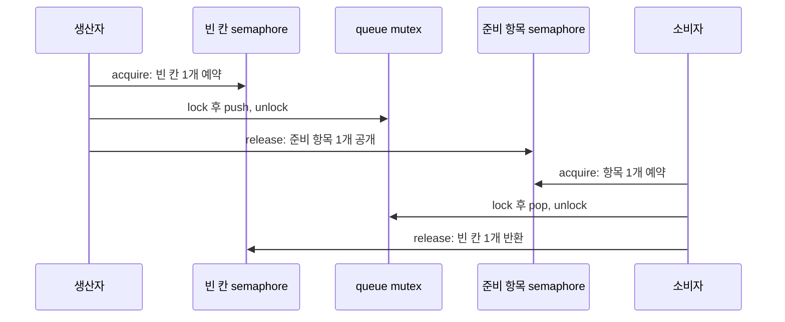

# 4단계: condition variable, semaphore와 대기 전략

> **한 줄 요약:** mutex는 불변식을 보호하고, condition variable은 predicate 변화까지 기다리며, semaphore는 통과 가능한 permit 수를 표현한다.

- 선행 지식: [mutex와 RAII](./03-locks-and-raii.md)
- 초보자 우선: **상태와 알림**, **semaphore와 mutex 비교**, **bounded queue 흐름**
- 전문가 목표: lost/spurious wakeup, permit leak, cancellation, thundering herd를 다룬다.

## 대기 방식 세 가지

| 방식 | 예 | 장점 | 위험/용도 |
|---|---|---|---|
| busy spinning | atomic을 반복 load | 매우 짧은 대기에서 낮은 wake latency 가능 | CPU를 계속 소비, cache traffic 증가 |
| yielding/backoff | `yield`, pause, 지수 backoff | 경쟁을 조금 완화 | 스케줄러 힌트일 뿐 시간 보장 없음 |
| blocking | CV, semaphore, atomic wait | 긴 대기에서 CPU 양보 | sleep/wakeup과 scheduler 비용 |

spin 횟수는 하드웨어, lock hold time, oversubscription에 의존한다. 직접 spinlock을 만들기 전에 표준/검증된 런타임 primitive를 사용하고 측정한다.

## Condition variable: 알림이 아니라 상태를 기다린다

올바른 기본형:

```cpp
std::mutex mutex;
std::condition_variable cv;
std::queue<Job> jobs;
bool stopping = false;

std::unique_lock<std::mutex> lock{mutex};
cv.wait(lock, [&] { return stopping || !jobs.empty(); });
if (stopping && jobs.empty()) {
    return;
}
Job job = std::move(jobs.front());
jobs.pop();
lock.unlock();
run(job);
```

`wait(lock, predicate)`는 개념적으로 `while (!predicate()) wait(lock);`다. wait는 원자적으로 mutex를 풀고 대기하며, 깨어나기 전에 다시 lock한다. 반환 시 `unique_lock`은 mutex를 소유한다.

### 왜 predicate가 필요한가

- **lost wakeup:** waiter가 실제 대기에 들어가기 전에 notify가 일어나도, 상태는 mutex 아래 남아 있어 predicate가 이미 true임을 발견한다.
- **spurious wakeup:** 알림/조건 변화 없이도 wait가 반환할 수 있으므로 다시 predicate를 검사한다.
- **다른 소비자의 선점:** 여러 waiter가 깨었지만 먼저 lock한 스레드가 작업을 가져갔을 수 있다.

상태는 mutex가 보호하고 notification은 “상태를 다시 확인하라”는 힌트다.

### notify를 lock 안/밖 어디서 하는가

먼저 mutex 아래에서 상태를 변경해야 한다. 그 뒤 notify는 lock을 풀기 전이나 후 모두 가능한 패턴이 있지만 성능/수명 조건이 다르다.

- unlock 후 notify: 깨어난 스레드가 곧바로 같은 mutex에서 막히는 일을 줄일 수 있다.
- lock 안 notify: 객체 수명이나 복잡한 프로토콜에서 순서를 단순화할 수 있다.
- 핵심 correctness는 상태 변경과 predicate 검사가 같은 mutex 규약을 따르는지다.

## Semaphore: permit 카운터

C++20 `std::counting_semaphore<LeastMaxValue>`는 내부 counter가 양수일 때 `acquire()`가 하나를 소비해 통과하고, `release(update)`가 permit을 추가하고 대기자를 깨울 수 있다.

| 비교 | mutex | semaphore |
|---|---|---|
| 추상화 | 한 시점의 소유자/상호 배제 | 사용 가능한 permit의 개수 |
| 해제 주체 | 일반적으로 소유한 스레드 | 다른 스레드도 release 가능 |
| 동시 통과 수 | 보통 1 | 설정한 N |
| 데이터 불변식 보호 | 주 용도 | 자동 제공하지 않음 |
| 대표 용도 | 객체 상태 갱신 | connection pool, bounded capacity, producer/consumer handoff |

`std::binary_semaphore`는 `counting_semaphore<1>`의 별칭이다. mutex와 비슷해 보여도 thread ownership 개념이 없고 이벤트/handoff에 적합하다.

## Bounded queue의 두 semaphore

용량 3인 queue라면 empty-slot permit은 3, ready-item permit은 0에서 시작한다.



Semaphore는 capacity/availability를 세고 mutex는 queue container의 내부 불변식을 보호한다. 둘은 대체재가 아니라 다른 역할이다. 전체 예제는 [`cxx20_example.cpp`](./cxx20_example.cpp)에 있다.

## `acquire`, `try_acquire`, timed acquire

- `acquire() -> void`: permit을 얻을 때까지 block한다.
- `try_acquire() -> bool`: block하지 않고 즉시 성공 여부를 반환한다.
- `try_acquire_for(duration) -> bool`: 상대 시간 동안 기다린다.
- `try_acquire_until(time_point) -> bool`: 절대 시각까지 기다린다.
- `release(std::ptrdiff_t update = 1) -> void`: permit을 `update`개 추가한다.

초기값과 release로 counter가 구현의 maximum을 넘지 않게 해야 한다. permit을 얻은 뒤 예외나 조기 return으로 반환을 빠뜨리면 permit leak이 생긴다. 필요하면 작은 RAII permit guard를 직접 만들어 release를 수명에 묶는다.

## Semaphore의 메모리 관계

한 스레드의 `release`와 그 permit을 얻는 다른 스레드의 성공한 `acquire` 사이에는 동기화 관계가 있어 release 전 쓰기를 acquire 후에서 publish하는 데 사용할 수 있다. 단, 어느 permit/프로토콜이 어느 데이터의 수명을 운반하는지 명시해야 한다. permit 개수만 맞고 queue 데이터 접근에 mutex가 없다면 container race는 그대로다.

## 종료와 취소가 어려운 이유

`counting_semaphore::acquire()`는 `stop_token`을 직접 받지 않는다. worker가 영원히 acquire에서 잠들 수 있다.

가능한 설계:

1. 종료 시 각 consumer가 깨어날 만큼 sentinel item과 permit을 publish한다.
2. `try_acquire_for`로 주기적으로 stop 상태를 확인한다. latency와 wake overhead를 측정한다.
3. condition variable + stop predicate를 사용한다.
4. C++20 `condition_variable_any`의 stop-token-aware wait overload가 구현에서 지원되면 `jthread`와 결합한다.

종료용 release를 실제 작업 permit으로 잘못 소비하지 않도록 상태 머신을 설계한다.

## C++20 latch와 barrier와의 차이

| 도구 | 재사용 | 핵심 의미 |
|---|---:|---|
| `std::latch` | 한 번 | count가 0이 될 때까지 도착을 센다 |
| `std::barrier` | 여러 phase | 모든 참가자가 도착하면 completion 후 다음 phase로 진행 |
| semaphore | 계속 | 독립적인 permit을 acquire/release |
| condition variable | 계속 | mutex로 보호된 임의 predicate 변화 대기 |

“여러 thread가 시작선에 모두 모이기”는 barrier, “N개의 DB connection만 사용”은 semaphore, “queue가 비지 않음”은 condition variable 또는 item semaphore가 자연스럽다.

## C++17에서 semaphore를 구현해야 한다면

표준 semaphore가 없으므로 mutex + condition variable로 최소 기능을 구현할 수 있다.

```cpp
class Semaphore {
public:
    explicit Semaphore(std::ptrdiff_t initial) : count_{initial} {}

    void acquire() {
        std::unique_lock<std::mutex> lock{mutex_};
        cv_.wait(lock, [this] { return count_ > 0; });
        --count_;
    }

    void release() {
        {
            std::lock_guard<std::mutex> lock{mutex_};
            ++count_;
        }
        cv_.notify_one();
    }

private:
    std::mutex mutex_;
    std::condition_variable cv_;
    std::ptrdiff_t count_;
};
```

실무에서는 overflow, timed wait, shutdown, fairness, destruction precondition을 추가로 정의해야 한다. OS/검증된 라이브러리 primitive가 있으면 직접 구현보다 그것을 감싼다.

## Thundering herd와 공정성

- `notify_all`은 많은 waiter를 깨워 하나의 mutex를 다시 경쟁하게 할 수 있다.
- `notify_one`은 한 작업당 한 waiter면 충분할 때 traffic을 줄인다.
- semaphore/condition variable이 FIFO fairness를 보장한다고 가정하지 않는다.
- 높은 우선순위 thread가 낮은 우선순위 lock owner를 기다리는 priority inversion은 OS 정책/primitive 지원까지 고려한다.

## 자주 하는 실수

- condition variable의 wait를 `if` 한 번으로 감싼다.
- 상태를 mutex 없이 바꾸고 notify만 호출한다.
- semaphore permit이 있으니 queue 접근도 원자적이라고 생각한다.
- acquire 뒤 예외 경로에서 permit을 반환하지 않는다.
- shutdown이 blocked waiter를 어떻게 깨울지 설계하지 않는다.
- timeout을 correctness 메커니즘으로 삼아 “충분히 기다렸으니 상태가 됐을 것”이라 가정한다.

## 완료 기준

- [ ] predicate가 lost/spurious wakeup을 막는 이유를 설명한다.
- [ ] mutex ownership과 semaphore permit을 구별한다.
- [ ] 종료 시 blocked waiter를 깨우는 정책을 설계한다.
- [ ] 다음 문서인 [thread 수명](./05-threads-and-lifecycle.md)으로 이동한다.
