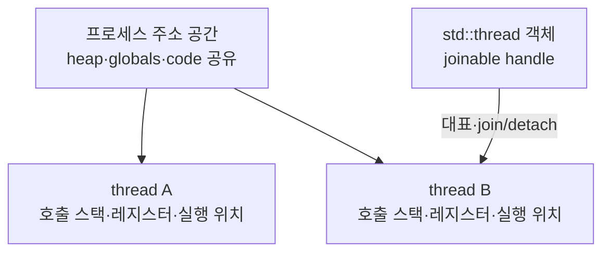
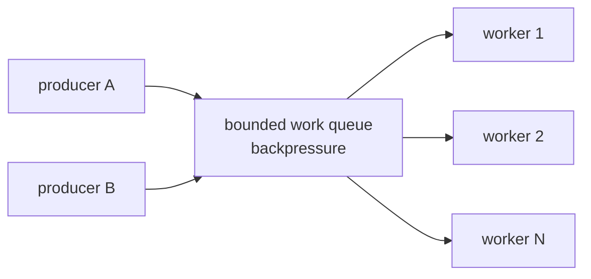

# 5단계: thread 수명과 작업 설계

> **한 줄 요약:** 스레드 함수보다 어려운 것은 인자·참조·예외·종료 요청·join의 수명이 모두 일치하도록 소유권 경계를 만드는 일이다.

- 선행 지식: [대기와 semaphore](./04-waiting-and-semaphores.md)
- 초보자 우선: **thread 객체와 실행 thread**, **join/detach**, **capture 수명**
- 전문가 목표: cooperative cancellation, structured concurrency, oversubscription과 작업 큐를 설계한다.

## `std::thread` 객체와 실행 스레드는 다르다

`std::thread worker{function, args...};`에서 `worker`는 실행 스레드를 대표하는 관리 객체다. 새 실행 흐름은 별도 호출 스택과 thread-local state를 가지지만 process의 heap, globals, open handles 같은 자원을 공유한다.



## 생성자 인자와 `std::ref`

```cpp
void add(int& target, int value);
int total = 0;
std::thread worker{add, std::ref(total), 5};
worker.join();
```

스레드 생성자는 일반적으로 callable과 인자를 내부 저장소로 decay-copy/move한 뒤 새 스레드에서 invoke한다. C++23은 표준 표현을 `auto(...)` materialization 중심으로 다듬었지만, 호출자가 local reference 수명을 자동 보장받는 것은 아니다.

- 참조로 전달하려면 `std::ref(total)` 또는 `std::cref`로 의도를 표시한다.
- 대상 `total`은 worker 접근이 끝날 때까지 살아 있어야 한다.
- 함수 매개변수가 `const std::string&`여도 임시 변환 시점과 저장 타입을 고려해 미리 `std::string`을 만드는 편이 오류 메시지와 수명을 명확히 한다.

## join, detach, move

| 연산 | 결과 | 주의 |
|---|---|---|
| `joinable()` | join/detach가 필요한 실행 thread를 대표하는지 반환 | 실행이 이미 끝났어도 join 전이면 joinable일 수 있다 |
| `join()` | 완료를 기다리고 ownership 관계를 정리 | 자기 자신 join, non-joinable join은 오류 |
| `detach()` | thread 객체와 실행 thread 연결을 끊음 | 캡처 객체/프로세스 종료/오류 관측 수명이 어려워짐 |
| move | 대표권을 다른 `std::thread`로 이전 | 원본은 non-joinable |

Joinable `std::thread` 객체의 소멸자는 자동 join하지 않고 `std::terminate()`를 호출한다. 이는 우연히 오래 block하는 소멸자를 피하지만, 모든 제어 경로에서 join 정책을 명시해야 한다.

`detach`는 “백그라운드니까 편리”가 아니라 소유자 없는 작업을 만든다. process 수명 전체의 service처럼 별도 lifetime manager가 있는 경우가 아니라면 worker pool 또는 `jthread`를 선호한다.

## Lambda capture 수명

위험:

```cpp
std::thread start_bad() {
    std::string local = "곧 파괴됨";
    return std::thread{[&] { use(local); }}; // 함수가 반환하면 local 참조가 dangling된다.
}
```

값 소유:

```cpp
std::thread start_owned() {
    std::string local = "worker가 소유";
    return std::thread{[text = std::move(local)] { use(text); }};
}
```

`this` 캡처도 객체 수명을 늘리지 않는다. `shared_ptr` 캡처는 정말 공동 소유가 필요한지, cycle이 없는지 검토한다. 가장 단순한 규칙은 owner가 worker보다 오래 살고 소멸 전에 stop + join하는 것이다.

## 예외 경계

스레드 entry 함수 밖으로 예외가 빠져나가면 `std::terminate()`가 호출된다. 예외를 호출 스레드로 자동 전달하지 않는다.

```cpp
std::exception_ptr error;
std::thread worker{[&] {
    try {
        run_task();
    } catch (...) {
        error = std::current_exception(); // 이 예제는 owner가 join 뒤 읽을 때만 접근하여 race를 피한다.
    }
}};
worker.join();
if (error) {
    std::rethrow_exception(error);
}
```

여러 worker가 같은 error slot을 쓴다면 mutex/atomic claim이 필요하다. `std::promise/std::future`는 결과 또는 예외 한 개를 전달하는 표준 채널이 될 수 있다.

## C++20 `std::jthread`와 협력적 중지

`jthread`는 다음을 제공한다.

- 소멸 시 stop request 후 join하는 RAII 정책
- callable이 받을 수 있는 `std::stop_token`
- `request_stop()`으로 중지 요청

```cpp
std::jthread worker{[](std::stop_token token) {
    while (!token.stop_requested()) {
        do_one_bounded_unit();
    }
}};
```

Stop은 강제 kill이 아니다. worker가 token을 확인하거나 stop-aware wait를 해야 한다. 한 작업이 무한 block하면 소멸자의 join도 무한히 기다릴 수 있다.

### 좋은 중지 지점

- queue에서 다음 작업을 얻기 전
- bounded I/O의 timeout/취소 반환 뒤
- 큰 loop의 chunk 경계
- 일관된 상태를 commit한 직후

불변식을 절반만 갱신한 중간에 강제로 끊지 않는다.

## `thread_local`

각 thread마다 별도 객체 instance를 제공한다. lock contention을 줄이는 per-thread buffer/counter에 유용하지만 다음이 숨은 비용이다.

- thread마다 메모리 사용
- 초기화/파괴 순서와 module unload 문제
- thread pool에서 논리 request 사이 값 누출
- 모든 thread 결과를 합치는 reduction 단계

Thread-local allocator/cache는 thread 수가 커질 때 메모리를 폭증시킬 수 있다.

## `std::async`와 future

- `std::async(std::launch::async, f)`는 별도 실행을 요구하고 future가 결과/예외를 운반한다.
- policy를 생략하면 구현이 deferred execution을 선택할 수 있다.
- 반환 future의 소멸이 특정 async 작업 완료를 기다릴 수 있어 예상치 못한 직렬화가 가능하다.

병렬 실행 정책과 lifetime을 명확히 해야 하는 서버에서는 명시적 executor/thread pool이 관측과 backpressure에 유리하다.

## 스레드 하나보다 작업 큐

요청마다 thread 생성은 stack reservation, kernel object, scheduler와 cache warm-up 비용을 만든다. CPU-bound 작업은 보통 core 수 근처의 worker pool과 작은 task를 사용한다. I/O-bound는 blocking 정도와 비동기 I/O 모델에 따라 다르다.



Bounded queue는 overload를 무한 메모리 증가로 숨기지 않고 producer를 늦추거나 거절 정책을 적용한다.

## Oversubscription과 affinity

- runnable CPU-bound thread가 hardware context보다 훨씬 많으면 context switch와 cache/TLB 손실이 늘 수 있다.
- library 내부 parallelism과 애플리케이션 pool이 겹치면 예상 밖 oversubscription이 생긴다.
- thread affinity/NUMA pinning은 측정으로 이득이 확인되고 운영 환경 topology를 관리할 수 있을 때 쓴다.
- affinity는 load balancing과 장애 격리 능력을 해칠 수 있다.

## C thread entry callback과 `extern "C"`

일부 OS/C 라이브러리는 function pointer callback을 요구한다. capture lambda는 C function pointer로 변환할 수 없다. non-capturing lambda 또는 `extern "C"` trampoline과 `void* context`를 사용한다.

```cpp
struct Context { /* lifetime은 join까지 유지한다. */ };

extern "C" void* thread_entry(void* raw) noexcept {
    auto* context = static_cast<Context*>(raw);
    try {
        run(*context);
        return nullptr;
    } catch (...) {
        record_error(*context); // C ABI 경계 밖으로 C++ 예외를 내보내지 않는다.
        return error_sentinel();
    }
}
```

정확한 callback signature와 calling convention은 해당 C API를 그대로 따라야 한다. 자세한 내용은 [`extern "C"`와 FFI](./06-extern-c-abi-ffi.md)에서 다룬다.

## Shutdown 순서

1. 새 작업 접수를 중단한다.
2. stop flag/token을 publish한다.
3. condition/semaphore/I/O wait를 깨운다.
4. worker가 현재 작업을 일관된 상태로 마치고 빠져나온다.
5. 모든 worker를 join한다.
6. worker가 참조하던 queue, mutex, logger, allocator를 파괴한다.

이 순서를 거꾸로 하면 파괴된 자원 접근이 생긴다.

## 완료 기준

- [ ] thread object, OS execution thread, task를 구별한다.
- [ ] joinable destructor가 terminate하는 이유와 모든 경로의 join 정책을 설명한다.
- [ ] reference/lambda capture의 lifetime을 worker 종료까지 증명한다.
- [ ] 다음 문서인 [`extern "C"`와 ABI](./06-extern-c-abi-ffi.md)로 이동한다.
