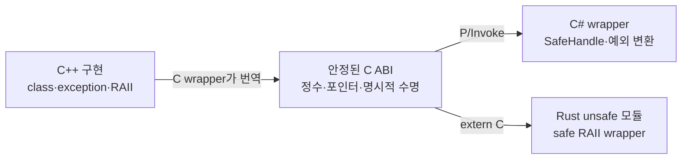

# 6단계: `extern "C"`, ABI와 실무 FFI

> **한 줄 요약:** `extern "C"`는 C++ 이름/함수의 language linkage를 C 방식으로 맞추는 출발점일 뿐이며, 타입 배치·호출 규약·소유권·예외·스레드 안전성은 별도 C ABI 계약으로 설계해야 한다.

- 선행 지식: [thread 수명](./05-threads-and-lifecycle.md)
- 초보자 우선: **무엇을 해결하는가**, **안전한 header 패턴**, **opaque handle**
- 전문가 목표: symbol visibility, allocator 경계, callback lifetime, versioning을 관리한다.

## API와 ABI

- API(Application Programming Interface, 응용 프로그램 프로그래밍 인터페이스): source level에서 함수 이름, 매개변수, 동작을 약속한다.
- ABI(Application Binary Interface, 응용 프로그램 이진 인터페이스): binary level에서 symbol 이름, calling convention, 인자/반환 전달, 구조체 layout, alignment 등을 약속한다.
- FFI(Foreign Function Interface, 외부 함수 인터페이스): C#, Rust 등 다른 언어가 그 ABI를 통해 호출하는 계층이다.



## `extern "C"`가 해결하는 것

C++는 overloading 등을 지원하려고 symbol에 타입 정보를 섞는 name mangling을 흔히 사용한다. C는 그런 overload 이름 체계가 없다.

```cpp
extern "C" int dd_add(int left, int right);
```

이 선언은 `dd_add`에 C language linkage를 지정해 C caller/linker가 찾을 수 있는 symbol 계약을 만든다. 다만 다음을 자동으로 해결하지 않는다.

- 모든 플랫폼의 calling convention 통일
- `std::string`, `std::vector`, C++ class의 binary layout 안정성
- 예외가 다른 언어 runtime을 건너는 문제
- 메모리를 어느 module/allocator에서 해제할지
- thread safety, callback 수명, 문자 encoding

또한 C linkage 함수는 같은 scope에서 C++ overload set처럼 여러 signature를 노출할 수 없다. C ABI 이름은 prefix와 version suffix로 고유하게 설계한다.

## C와 C++가 함께 include하는 header 패턴

실제 예제는 [`ffi_api.h`](./ffi_api.h)에 있다.

```c
#ifndef DD_FFI_API_H
#define DD_FFI_API_H

#include <stddef.h>
#include <stdint.h>

#ifdef __cplusplus
extern "C" {
#endif

typedef struct dd_counter dd_counter;
dd_counter* dd_counter_create(int64_t initial_value);
void dd_counter_destroy(dd_counter* handle);
int dd_counter_add(dd_counter* handle, int64_t delta, int64_t* out_value);

#ifdef __cplusplus
}
#endif

#endif
```

- `__cplusplus`는 C++ compiler에서 정의된다. C compiler가 `extern "C"` 문법을 보지 않게 한다.
- `<stdint.h>`의 `int64_t`처럼 폭을 명시한다.
- `dd_counter`는 불완전 타입(opaque handle)이라 caller가 내부 layout에 의존하지 못한다.
- 생성/파괴 함수를 같은 library가 제공해 allocator/CRT 경계를 맞춘다.
- 반환 `int`는 상태 코드, 실제 결과는 `out_value`로 분리한다.

## 왜 opaque handle인가

C++ class를 header에 그대로 노출하면 compiler/standard library/빌드 옵션 변화가 layout과 ABI를 바꿀 수 있다. Opaque handle은 C 계약과 C++ 구현을 분리한다.

```cpp
struct dd_counter {
    std::mutex mutex; // caller에게 보이지 않는 구현 세부 사항이다.
    std::int64_t value;
};
```

Caller는 `dd_counter*`를 identity token으로만 보유하고 모든 연산을 library 함수에 맡긴다. 내부 mutex는 handle 한 개의 value 불변식을 보호한다.

## 오류와 예외 경계

C++ 예외가 C frame이나 다른 runtime을 넘어가게 두지 않는다.

```cpp
extern "C" int dd_operation(dd_counter* handle) noexcept {
    try {
        return do_operation(*handle);
    } catch (const std::bad_alloc&) {
        return DD_OUT_OF_MEMORY;
    } catch (...) {
        return DD_INTERNAL_ERROR;
    }
}
```

실무 계약:

- 모든 exported function을 사실상 no-throw boundary로 둔다.
- null/범위/encoding 오류를 구체적 error code로 반환한다.
- thread-local last-error string을 쓰면 “다음 호출 전까지만 유효” 같은 수명을 명시한다.
- caller가 제공한 buffer + 필요한 길이 반환 패턴은 ownership이 명확하다.
- C#에서는 error code를 managed exception으로, Rust에서는 `Result`로 변환하는 safe wrapper를 만든다.

## 타입 선택 규칙

| 피하는 타입 | 이유 | C ABI 대안 |
|---|---|---|
| `bool` | 언어/ABI별 크기·표현 차이 | `uint8_t` 또는 `int32_t`, 허용 값 명시 |
| `long` | Windows/Linux 64-bit에서 폭이 다를 수 있음 | `int32_t`, `int64_t` |
| `size_t`를 wire/storage에 저장 | process bitness 의존 | wire에는 `uint64_t`, 메모리 길이는 `size_t` |
| `std::string`/`std::vector` | standard library ABI와 allocator 노출 | `(const char*, size_t)`, caller buffer |
| C++ reference | C에 없음, null 의미 불명 | pointer + null 허용 여부 명시 |
| class/virtual type | layout/vtable/exception ABI 노출 | opaque handle |
| enum의 기본 underlying type | 폭 불명확 | 정수 typedef + 상수 또는 명시 layout |

문자열은 encoding(보통 UTF-8), embedded NUL 허용 여부, byte length인지 code point count인지 명시한다.

## 구조체를 꼭 공유할 때

- fixed-width 정수만 사용하고 field order/offset/size를 versioned contract로 만든다.
- compiler packing pragma를 남용하지 않는다. unaligned access와 platform 차이가 생긴다.
- C++에서 `static_assert(sizeof(...))`, `offsetof`로 검증한다.
- C# `[StructLayout(LayoutKind.Sequential)]`, Rust `#[repr(C)]`를 사용한다.
- pointer가 든 구조체를 장기 보관하지 말고 pinning/lifetime 규칙을 명시한다.

구조체 앞에 `struct_size`와 `abi_version`을 두면 뒤에 필드를 추가하는 확장 전략을 만들 수 있다.

## C# P/Invoke 경계

개념 예제:

```csharp
internal static partial class Native
{
    [System.Runtime.InteropServices.LibraryImport("deep_dive")]
    internal static partial nint dd_counter_create(long initialValue);

    [System.Runtime.InteropServices.LibraryImport("deep_dive")]
    internal static partial void dd_counter_destroy(nint handle);
}
```

실무에서는 raw `nint`를 애플리케이션 전체로 퍼뜨리지 않고 `SafeHandle` 파생 타입으로 감싸 finalization/dispose 경로에서 destroy를 정확히 한 번 호출한다. Managed object를 native callback context로 전달하면 `GCHandle`과 unregister/join 순서를 명시한다. GC가 callback 대상 delegate를 먼저 수거하지 않게 lifetime을 보유한다.

## Rust FFI 경계

```rust
#[repr(C)]
pub struct dd_counter {
    _private: [u8; 0],
}

unsafe extern "C" {
    fn dd_counter_create(initial_value: i64) -> *mut dd_counter;
    fn dd_counter_destroy(handle: *mut dd_counter);
}
```

Raw pointer 호출은 `unsafe` 모듈에 격리하고, safe wrapper가 `NonNull`, `Drop`, `Send/Sync` 정책, error code를 `Result`로 변환한다. Native 객체가 thread-safe라는 근거 없이 wrapper에 `unsafe impl Send/Sync`를 추가하지 않는다.

## Callback과 thread

Callback 계약에는 다음을 모두 쓴다.

- callback이 호출되는 thread/동시 호출 가능 여부
- callback 함수와 context pointer가 언제까지 살아 있어야 하는지
- unregister가 진행 중 callback 완료를 기다리는지
- callback에서 library로 재진입 가능한지
- callback이 block해도 되는지
- 오류/패닉/예외 처리

C++는 callback entry에서 예외를 잡는다. Rust callback은 panic이 FFI boundary를 넘지 않게 `catch_unwind` 정책과 ABI 지원을 확인한다. C# callback은 delegate lifetime과 native thread의 managed runtime attachment 비용을 고려한다.

## Symbol visibility와 배포

`extern "C"`만으로 shared library export가 보장되지는 않는다.

- Windows: `__declspec(dllexport/dllimport)` 또는 `.def`
- GCC/Clang: `__attribute__((visibility("default")))`와 기본 hidden visibility
- ABI 함수 이름에는 library prefix를 붙여 충돌을 피한다.
- ABI compatibility가 깨지는 변경은 새 함수/major ABI version으로 낸다.
- C++ runtime을 양쪽 module이 다르게 링크할 때 allocation/exception/RTTI 객체를 경계로 넘기지 않는다.

## 실무 점검표

- [ ] export header를 실제 C compiler로 컴파일했다.
- [ ] symbol table에서 unmangled C 이름과 visibility를 확인했다.
- [ ] 모든 allocated resource에 같은 library의 destroy 함수가 있다.
- [ ] 예외/패닉이 ABI를 넘지 않는다.
- [ ] 정수 폭, endian, packing, encoding, ownership을 문서화했다.
- [ ] callback unregister와 object destroy 전에 in-flight callback이 끝난다.
- [ ] 32/64-bit와 지원 compiler 조합의 ABI test를 자동화했다.

## 완료 기준

- [ ] language linkage와 완전한 ABI 안정성을 구별한다.
- [ ] opaque handle의 생성/파괴/error API를 설계한다.
- [ ] C# SafeHandle과 Rust Drop wrapper로 수명 계약을 번역한다.
- [ ] 다음 문서인 [버전별 진화](./07-version-evolution.md)로 이동한다.
