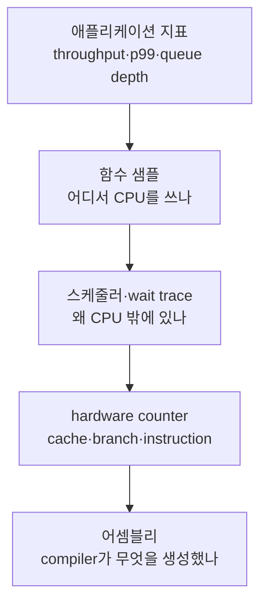

# 9단계: 어셈블리·Sanitizer·프로파일러 관찰법

> **한 줄 요약:** 소스, compiler output, runtime trace, hardware counter는 서로 다른 증거이므로 최소 두 층을 교차 검증한다.

- 선행 지식: [성능 실습](./08-performance-labs.md)
- 초보자 우선: **빌드 행렬**, **무엇을 찾아야 하나**, **도구별 역할**
- 전문가 목표: contention을 on-CPU/off-CPU와 cache/OS 원인으로 분해한다.

## 빌드 행렬

| 빌드 | 목적 | 성능 결론에 사용? |
|---|---|---:|
| Debug `-O0 -g` | 소스 흐름과 변수 관찰 | 아니오 |
| Release `-O2/-O3 -DNDEBUG` | 실제 성능과 어셈블리 | 예 |
| ASan/UBSan | 수명·경계·UB 검사 | 숫자 비교는 별도 |
| TSan | data race 탐지 | 숫자 비교는 별도 |
| LTO/PGO | 배포 최적화 후보 | 동일 조건 baseline과 비교 |

## GCC/Clang 명령

```bash
# 어셈블리: C++ 이름 demangle은 후속 objdump에서 확인한다.
g++ -std=c++20 -O2 -g -S -masm=intel cxx20_example.cpp -o cxx20.s

# ThreadSanitizer: 지원 플랫폼/런타임에서 별도 build로 실행한다.
clang++ -std=c++20 -O1 -g -fsanitize=thread -fno-omit-frame-pointer \
  -pthread cxx20_example.cpp -o cxx20-tsan

# Address/UndefinedBehavior sanitizer
clang++ -std=c++20 -O1 -g -fsanitize=address,undefined \
  -fno-omit-frame-pointer -pthread cxx20_example.cpp -o cxx20-asan-ubsan

# Linux symbol/역어셈블리
nm -C cxx20.o
objdump -drwC -Mintel cxx20.o
```

TSan이 보고하지 않았다는 것은 실행된 경로에서 race를 관찰하지 못했다는 뜻이다. 모든 입력/스케줄의 correctness proof를 대신하지 않는다. Intentional low-level synchronization은 suppression 전에 메모리 모델 증명과 wrapper test가 있어야 한다.

## MSVC 명령

Developer Command Prompt/PowerShell에서:

```powershell
cl /std:c++20 /O2 /W4 /EHsc /c /FAs cxx20_example.cpp
dumpbin /symbols cxx20_example.obj
dumpbin /disasm cxx20_example.obj
```

지원되는 compiler/architecture에서는 `/fsanitize=address`를 별도 정확성 build에 사용할 수 있다. Windows 동시성 분석은 Visual Studio Performance Profiler, Windows Performance Recorder/Analyzer 같은 도구로 CPU sampling, context switch, wait를 본다.

## 어셈블리에서 찾을 것

| 소스 개념 | 가능한 관찰 | 단정하면 안 되는 것 |
|---|---|---|
| mutex lock | 외부 runtime call, inline atomic fast path | 항상 syscall 하나 |
| atomic relaxed load | 일반 load | “아무 순서 제약도 없다” |
| atomic RMW | x86 `lock` 계열, ARM exclusive/LSE 계열 | 모든 atomic이 같은 instruction |
| fence | `mfence`, ARM barrier 또는 compiler-only 제약 | fence가 안 보이면 ordering 없음 |
| guard | 생성자/소멸자 call 또는 완전 inline | guard 객체가 runtime allocation |
| semaphore wait | runtime call, spin + OS wait | 항상 sleeping 또는 항상 spinning |

한 C++ 표현이 여러 instruction이 되거나, 여러 표현이 한 instruction/상수로 합쳐지거나, dead-code elimination로 사라질 수 있다.

## Compiler Explorer를 쓸 때

1. 최소 함수만 남기되 atomic/lock 결과가 관찰되게 한다.
2. compiler, version, target ISA, standard, options를 링크/기록한다.
3. `-O0`과 `-O2`, GCC/Clang/MSVC, x86-64/ARM64를 비교한다.
4. library 구현을 포함해야 하는 primitive는 실행 환경의 실제 binary도 확인한다.
5. micro snippet의 어셈블리를 전체 서비스 성능의 증거로 과장하지 않는다.

## Linux runtime 관찰

```bash
# 전체 CPU hotspot과 call graph(권한/환경 설정 필요)
perf record -g -- ./example
perf report

# scheduling/context switch trace
perf sched record -- ./example
perf sched timehist

# 대표 hardware/software counter; 정확한 event 지원은 CPU마다 다르다.
perf stat -r 5 -e cycles,instructions,cache-misses,context-switches ./example
```

해석:

- 높은 CPU time + atomic retry: on-CPU contention 가능
- 낮은 CPU 사용 + 긴 wall time + wait stack: blocking/off-CPU 병목 가능
- context switch 증가: 과도한 blocking/wakeup/oversubscription 후보
- cache miss만으로 false sharing을 확정하지 말고 cache-to-cache 도구와 layout 실험을 보탠다.

## 프로파일링 층



위에서 병목 현상을 잡고 아래로 원인을 좁힌다. 어셈블리부터 보면 중요하지 않은 작은 함수에 시간을 쓰기 쉽다.

## Deadlock 진단

- watchdog이 일정 시간 progress counter가 변하지 않으면 모든 thread stack을 수집한다.
- 각 stack이 기다리는 mutex/condition과 현재 owner를 매핑한다.
- lock 주소만 기록하지 말고 논리 이름, acquisition site, hold duration을 sampling한다.
- production logging 자체가 global lock 병목/재진입을 만들지 않게 한다.
- C++23 `std::stacktrace`는 지원 환경에서 진단 재료가 될 수 있지만 signal-safe/무할당이라고 가정하지 않는다.

## 회귀 자동화

- correctness: unit, invariant, stress, sanitizer job
- ABI: C compiler client, symbol list, size/offset assertion
- performance: 고정 runner에서 통계 기준과 noise budget
- feature: C++17/C++20/C++23 compiler matrix
- shutdown: blocked waiter가 제한 시간 안에 깨고 join되는 test

성능 test의 단일 run threshold는 flaky하기 쉽다. 여러 sample과 effect size, historical baseline을 사용한다.

## 완료 기준

- [ ] Release 어셈블리와 Debug 흐름을 구별한다.
- [ ] TSan/프로파일러/hardware counter가 답하는 질문을 구별한다.
- [ ] source → runtime metric → assembly의 증거 사슬을 만든다.
- [ ] [API 사전](./10-api-reference.md)으로 이동한다.
