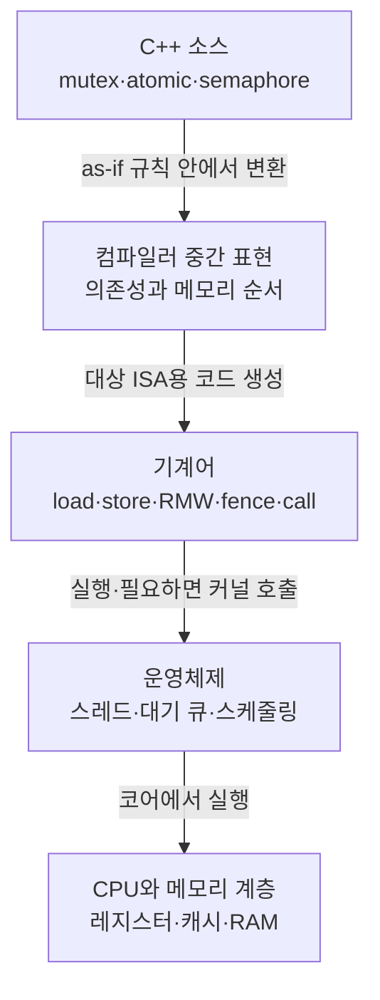

# C++ 동시성·메모리·CPU·컴파일러 딥다이브

> **한 줄 요약:** `std::thread`, mutex, lock/guard, semaphore와 atomic을 “문법”에서 끝내지 않고 C++ 추상 기계, 컴파일러, 운영체제, CPU 캐시까지 내려가며 측정하는 실전 과정이다.

- 필요한 선행 지식: 함수, 클래스, 참조, RAII의 아주 기초. 모르는 용어는 [공통 용어집](../GLOSSARY.md)에서 바로 찾는다.
- 초보자가 먼저 읽을 절: 이 문서의 **전체 지도 → 10초 선택표 → 학습 순서**만 보고 `00-roadmap.md`부터 시작한다.
- 기준: 설명은 C++11을 출발점으로 C++14/17/20/23을 모두 구분한다. 실행 예제는 C++17과 C++20 타깃으로 나눈다.
- 중요한 전제: 표준이 보장하는 의미와 x86-64/ARM64, GCC/Clang/MSVC, Linux/Windows의 흔한 구현을 구분한다.

## 전체 지도

동기화 코드는 다음 다섯 계층을 모두 통과한다. 위 계층의 규칙을 아래 계층의 특정 명령 하나와 동일시하면 안 된다.



`lock()` 한 줄이 항상 커널 호출 한 번 또는 어셈블리 한 줄은 아니다. 경쟁이 없으면 사용자 공간의 원자 연산 몇 개로 끝날 수 있고, 경쟁하면 런타임과 운영체제가 현재 스레드를 재울 수 있다. 인라인과 최적화 때문에 호출이 사라지거나 합쳐질 수도 있다.

## 10초 선택표

| 상황 | 첫 선택 | 이유 | 피할 오해 |
|---|---|---|---|
| 여러 필드의 불변식을 함께 보호 | `std::mutex` + `std::lock_guard` | 가장 단순한 RAII 범위 잠금 | atomic 여러 개가 복합 불변식을 자동 보장하지 않는다 |
| 중간에 unlock/relock 또는 조건 대기 | `std::unique_lock` | 소유 상태를 옮기고 잠금을 지연할 수 있다 | 유연성에는 상태와 약간의 관리 비용이 따른다 |
| mutex 여러 개를 동시에 획득 | `std::scoped_lock`(C++17) | 교착 회피 알고리즘으로 묶는다 | 임의 순서의 개별 `lock_guard`는 교착 가능 |
| 상태가 바뀔 때까지 잠자기 | `std::condition_variable` | predicate와 함께 임의 조건을 기다린다 | 알림을 상태 그 자체로 생각하면 lost wakeup이 생긴다 |
| 동시에 N개까지만 통과 | `std::counting_semaphore`(C++20) | permit 수를 직접 표현한다 | semaphore는 데이터 불변식을 대신 보호하지 않는다 |
| 한 번뿐인 플래그·카운터 | `std::atomic` | 작은 독립 상태를 mutex 없이 공유한다 | lock-free/빠름/복합 원자성을 자동 의미하지 않는다 |
| 스레드 종료 요청과 자동 join | `std::jthread`(C++20) | RAII join과 stop token을 제공한다 | 강제 종료가 아니라 협력적 취소다 |

## 권장 학습 순서와 문서 목차

| 단계 | 문서 | 도달 목표 |
|---:|---|---|
| 0 | [학습 로드맵과 진단](./00-roadmap.md) | 데이터 레이스, 측정 단위를 먼저 구별한다 |
| 1 | [소스에서 CPU까지](./01-machine-compiler-memory.md) | 전처리·컴파일·링크·실행과 캐시 일관성을 연결한다 |
| 2 | [C++ 메모리 모델과 atomic](./02-memory-model-atomics.md) | happens-before와 acquire/release를 증명한다 |
| 3 | [mutex, lock, guard와 RAII](./03-locks-and-raii.md) | 잠금 수명·교착·예외 안전성을 설계한다 |
| 4 | [condition variable과 semaphore](./04-waiting-and-semaphores.md) | spinning, blocking, permit, predicate를 구분한다 |
| 5 | [thread 수명과 작업 설계](./05-threads-and-lifecycle.md) | join/detach, 종료, 예외, thread pool 경계를 설계한다 |
| 6 | [`extern "C"`, ABI와 FFI](./06-extern-c-abi-ffi.md) | C ABI로 C#·Rust에 안전한 소유권 API를 노출한다 |
| 7 | [C++11/14/17/20/23 진화표](./07-version-evolution.md) | 표준 버전별 도구와 이식 가능한 대안을 선택한다 |
| 8 | [성능 최적화 실습](./08-performance-labs.md) | 경합·거짓 공유·배치·샤딩을 가설과 측정으로 개선한다 |
| 9 | [어셈블리·프로파일러 관찰법](./09-tooling-and-assembly.md) | 최적화 결과를 소스·어셈블리·프로파일로 교차 검증한다 |
| 10 | [API·문법·비용 사전](./10-api-reference.md) | 매개변수, 반환값, 예외, 자주 쓰는 조합을 빠르게 찾는다 |
| 비교 | [C#·Rust·Python 발전과 비교](./compare.md) | 런타임/소유권/동기화/FFI 차이를 실무적으로 번역한다 |

## 코드 읽기 순서

긴 예제는 `main()`에서 먼저 호출 흐름을 본 뒤 구현으로 올라간다.

1. [`example.cpp`](./example.cpp): C++17의 `thread`, `mutex`, `lock_guard`, `unique_lock`, `scoped_lock`을 한 실행에서 관찰한다.
2. [`cxx20_example.cpp`](./cxx20_example.cpp): C++20 `counting_semaphore`, `jthread`, `stop_token`, `atomic::wait/notify`를 관찰한다.
3. [`ffi_api.h`](./ffi_api.h) → [`ffi_api.cpp`](./ffi_api.cpp) → [`c_client.c`](./c_client.c): C 호환 공개 계약과 구현, 실제 C 호출 순서다.
4. [`exercise.cpp`](./exercise.cpp): 결과 예측과 TODO를 수행한다.
5. [`solution.cpp`](./solution.cpp): 실습 후에만 비교한다.
6. [`CMakeLists.txt`](./CMakeLists.txt): 표준별 타깃과 스레드/FFI 링크 구성을 확인한다.

모든 설명용 코드에는 줄 단위 한국어 주석을 달았다. 표준 함수의 정확한 시그니처·매개변수·반환값·예외·비용은 [API 사전](./10-api-reference.md)에 다시 모았다.

## 빌드와 실행

### Linux/macOS: GCC 또는 Clang

```bash
cmake -S . -B build -DCMAKE_BUILD_TYPE=Release
cmake --build build --parallel
ctest --test-dir build --output-on-failure
```

직접 빌드할 때 표준 버전을 명시한다.

```bash
g++ -std=c++17 -O2 -Wall -Wextra -Wpedantic -pthread example.cpp -o example
g++ -std=c++20 -O2 -Wall -Wextra -Wpedantic -pthread cxx20_example.cpp -o cxx20_example
```

### Windows: Visual Studio Developer PowerShell

```powershell
cmake -S . -B build -A x64
cmake --build build --config Release --parallel
ctest --test-dir build -C Release --output-on-failure
```

이 저장소의 일반 PowerShell에서 `cl.exe`가 보이지 않으면 **Developer PowerShell for VS 2022**를 열어 실행한다. C++20 semaphore 지원이 부족한 오래된 표준 라이브러리에서는 C++17 타깃만 빌드하고 [C++17 대안](./04-waiting-and-semaphores.md#c17에서-semaphore를-구현해야-한다면)을 사용한다.

### 예상 출력의 성격

스레드 실행 순서는 매번 달라질 수 있다. 예제는 순서가 아니라 다음 불변식을 검증한다.

- 계좌 합계가 보존된다.
- `try_lock` 실패는 정상적인 결과다.
- semaphore 구간의 동시 실행 수는 permit 상한을 넘지 않는다.
- `atomic::wait`로 기다린 소비자는 publish된 값을 본다.

### 검증 기록

2026-09-02에 WSL2 Linux에서 GCC C++ 13.1.0, GCC C 11.4.0, Release 빌드와
`-Wall -Wextra -Wpedantic`으로 구성했다. `deep_dive_cpp17`, `deep_dive_cxx20`,
`deep_dive_exercise`, `deep_dive_solution`, `deep_dive_c_client` 5개 타깃이 경고 없이
빌드됐고 CTest 5개가 모두 통과했다. C client는 header를 C compiler로 처리하고 최종
링크만 C++ linker로 수행해 `extern "C"` 계약과 opaque handle의 생성·조회·overflow
거절·파괴 경로를 함께 검증했다.

```bash
cmake -S /mnt/d/workspace/modern-cpp/자주까먹는/딥다이브 \
      -B /mnt/d/workspace/modern-cpp/build/deep-dive-wsl \
      -DCMAKE_BUILD_TYPE=Release
cmake --build /mnt/d/workspace/modern-cpp/build/deep-dive-wsl --parallel
ctest --test-dir /mnt/d/workspace/modern-cpp/build/deep-dive-wsl --output-on-failure
```

Windows/MSVC는 이 작업 환경에 compiler가 설치되어 있지 않아 실행 검증하지 못했다.
위의 Visual Studio Developer PowerShell 명령과 CI compiler matrix로 별도 확인한다.

## 실무 체크리스트

- [ ] 공유 데이터와 그 데이터를 보호하는 mutex가 같은 객체 수명 안에 있는가?
- [ ] 모든 공유 접근이 같은 규약(mutex 또는 atomic 프로토콜)을 따르는가?
- [ ] 둘 이상의 lock 획득 순서가 전역적으로 일정하거나 `scoped_lock`을 쓰는가?
- [ ] `condition_variable::wait`에 predicate가 있는가?
- [ ] 스레드 객체의 모든 경로가 join되거나 명시적으로 소유권을 이전하는가?
- [ ] 종료 요청 중 semaphore/condition wait를 깨울 방법이 있는가?
- [ ] 성능 결론 전에 Release 빌드, 워밍업, 반복, 분산을 측정했는가?
- [ ] `extern "C"` 경계에서 예외, STL 타입, C++ 객체 소유권이 새지 않는가?
- [ ] C# P/Invoke와 Rust FFI가 동일한 calling convention, 정수 폭, 구조체 배치를 쓰는가?

## 공식·원문 참고 자료

아래 자료는 버전별 표준 보장과 제안 배경을 교차 확인하기 위한 원문이다.

- [WG21 N3337: C++11 이후 작업 초안](https://wg21.link/N3337)
- [WG21 N4140: C++14 작업 초안](https://wg21.link/N4140)
- [WG21 N4659: C++17 작업 초안](https://wg21.link/N4659)
- [WG21 N4861: C++20 작업 초안](https://wg21.link/N4861)
- [WG21 N4950: C++23 작업 초안](https://wg21.link/N4950)
- [WG21 P1135R6: atomic waiting/notification](https://wg21.link/P1135R6)
- [WG21 P0660R10: `std::jthread`와 stop token](https://wg21.link/P0660R10)
- [.NET ECMA-335 CLI 표준](https://ecma-international.org/publications-and-standards/standards/ecma-335/)
- [Rust Reference: behavior considered undefined](https://doc.rust-lang.org/reference/behavior-considered-undefined.html)
- [Rust Nomicon: FFI](https://doc.rust-lang.org/nomicon/ffi.html)

표준 초안의 조항 번호는 판본마다 이동할 수 있다. 문서에서는 조항 번호보다 `[intro.races]`, `[thread.mutex]`, `[atomics.order]` 같은 안정적인 조항 이름을 우선한다.
